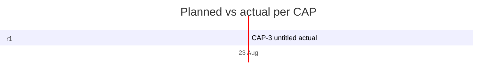

# Timeline

> Generated by `.constitution/method/scripts/timeline.py --generate`. MUST NOT be hand-edited.

As of: **2026-08-23**

## Per CAP

| CAP | Title | Release | Size | Priority | Owner | Planned | Actual | Δ days | State |
|---|---|---|---|---|---|---|---|---|---|
| CAP-1 | — | r1 | — | — | — | — → — | — → — | — | not-started |
| CAP-2 | — | r1 | — | — | — | — → — | 2026-08-23 → — | — | in-progress |
| CAP-3 | — | r1 | — | — | — | — → — | 2026-08-23 → 2026-08-23 | — | done |
| CAP-4 | — | r1 | — | — | — | — → — | — → — | — | not-started |
| CAP-5 | — | r1 | — | — | — | — → — | — → — | — | not-started |
| CAP-6 | — | r1 | — | — | — | — → — | 2026-08-23 → — | — | in-progress |
| CAP-7 | — | r2 | — | — | — | — → — | — → — | — | not-started |
| CAP-8 | — | r2 | — | — | — | — → — | — → — | — | not-started |
| CAP-9 | — | r3 | — | — | — | — → — | 2026-08-23 → — | — | in-progress |
