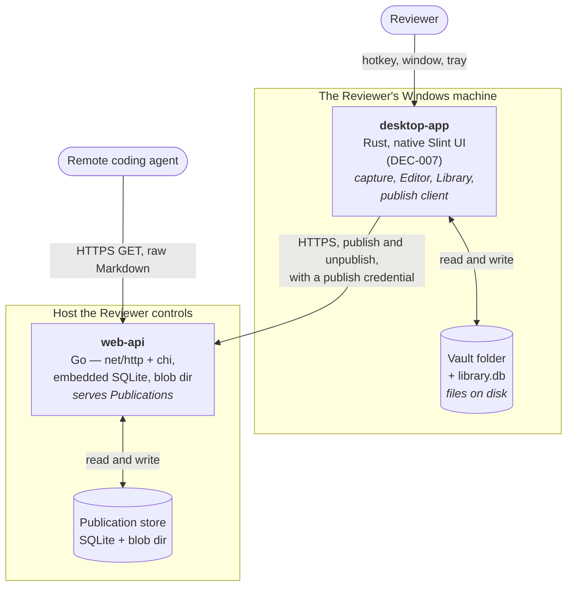

# blueprint

> Generated by `.constitution/method/scripts/validate.py --generate`. MUST NOT be hand-edited.


This is what the owner reads at **G3 Blueprint** — one page, every one of the gate's seven questions answerable from it. Its content is affected by neither `mode` nor `risk_accepted`.


## Use case catalogue

**28 use cases**, 5 marked `critical`. Rendered from `usecases.yaml`.

| id | Use case | Component | Satisfies | critical |
| --- | --- | --- | --- | --- |
| `UC-1` | I press a key, use precision crosshair/loupe or 1-click window/panel auto-detect, and say what is wrong with it | `finding` | `FR-1`, `FR-2` | no |
| `UC-2` | I take five of these in a row without stopping | `finding` | `FR-3` | no |
| `UC-3` | I look at everything I have captured so far | `finding` | `FR-6` | no |
| `UC-4` | I reword a note now that I have read it back | `finding` | `FR-7` | no |
| `UC-5` | I point at three separate spots inside one screenshot | `finding` | `FR-8` | no |
| `UC-6` | I pick out several findings at once | `finding` | `FR-9` | no |
| `UC-7` | I throw away the findings I am done with | `finding` | `FR-13` | yes |
| `UC-8` | I find out what has gone missing or been left behind | `finding` | `FR-15` | no |
| `UC-9` | I turn the findings I picked into one review document | `bundle` | `FR-10` | no |
| `UC-10` | I look back at the reviews I have already put together | `bundle` | `FR-11` | no |
| `UC-11` | I drop a whole review straight into the conversation I am having with my agent | `bundle` | `FR-12` | no |
| `UC-12` | I get rid of a review and everything in it | `bundle` | `FR-14`, `FR-44` | yes |
| `UC-13` | I decide how much picture quality a screenshot is worth | `settings` | `FR-5` | no |
| `UC-14` | I decide where my screenshots are kept | `settings` | `FR-16` | no |
| `UC-15` | I change the keys that set Snapdown off, because one of them clashes | `settings` | `FR-17` | no |
| `UC-16` | I have Snapdown ready the moment I sign in | `settings` | `FR-18` | no |
| `UC-20` | I put a review somewhere the agent on my server can reach it | `sharing` | `FR-23` | yes |
| `UC-21` | I read a review that was put up for me, from a machine that has nothing else on it | `sharing` | `FR-24` | no |
| `UC-22` | I take a published review back off the internet | `sharing` | `FR-25` | no |
| `UC-23` | I check whether a review of mine is still readable from outside | `sharing` | `FR-26` | no |
| `UC-24` | I can tell what I have opened and which part of it I am in | `settings` | `FR-27` | no |
| `UC-25` | I can get to any part of Snapdown from wherever I happen to be | `settings` | `FR-28` | no |
| `UC-26` | I can see everything a screen offers me without hunting for it | `settings` | `FR-29` | no |
| `UC-27` | I annotate a screenshot with visual shapes, arrows, callouts, text, or blur redaction | `finding` | `FR-30`, `FR-31`, `FR-32`, `FR-33` | no |
| `UC-28` | I turn a review into something I can send to a person who does not have Snapdown | `bundle` | `FR-39` | no |
| `UC-29` | I fix a typo in a review I have already put together | `bundle` | `FR-40` | no |
| `UC-30` | I get rid of the screenshots behind a review I am finished with, but keep the review | `finding` | `FR-41` | yes |
| `UC-31` | I find out which reviews are still holding my screenshots, and get that disk back | `finding` | `FR-42` | yes |


## Actor list


### bundle

| Actor | Who they are | What they may do |
| --- | --- | --- |
| Reviewer | The person operating Snapdown. The only human actor and the only writer | Compose a Bundle from a selection, name it, list Bundles, open one, copy its Markdown, correct its title and its notes, export it as a PDF, and delete it with its files |

An agent reads Bundles, but never through this component: the Reviewer copies a Bundle's Markdown and
pastes it, or `sharing` serves it over a Publication, and both are read-only per AD-5. (`agent-access`
was a third such surface until `DEC-016` withdrew it on 2026-09-04.)

**Amended 2026-08-31.** The Reviewer's rights used to end *"delete it with its files, and choose in the
same act whether its source Findings go too"*. That last clause is gone: `FR-14` no longer offers a
combined destroy, and destroying a Bundle's source Findings is now `FR-41`, whose use case belongs to
`finding` rather than here — the Reviewer reaches it from a Bundle, but what it destroys is a capture.
Correcting a title and exporting a PDF are the two rights added.

### finding

| Actor | Who they are | What they may do |
| --- | --- | --- |
| Reviewer | The person operating Snapdown. The only human actor and the only writer in the product | Press the Capture hotkey, drag a region, cancel a Capture, type and reword a Note, place, move and remove Markers, select Findings, delete Findings, discard the Findings behind a finished Bundle, act on an orphan report |

No second actor. An agent never reaches this component: Copy Markdown and `sharing` read Bundles, and
BR-14 keeps an unbundled Finding invisible to both. (`agent-access` was a third such reader until
`DEC-016` withdrew it on 2026-09-04.)

### settings

| Actor | Who they are | What they may do |
| --- | --- | --- |
| Reviewer | The person operating Snapdown. The only human actor and the only writer | Choose the Vault folder and move existing files, bind and clear hotkeys, turn run-at-sign-in on and off, set the Quality Budget, choose whether the Editor opens after a Capture, and set the web service address |

### sharing

| Actor | Who they are | What they may do |
| --- | --- | --- |
| Reviewer | The person operating Snapdown. The only writer | Publish a named Bundle after confirming, see whether a Bundle is published and where, copy its URL, and unpublish it |
| Remote coding agent | An AI coding agent on another host, holding a Publication URL | Fetch the Publication's Markdown and the images it references. Nothing else, and nothing that writes |

The Reviewer is also the second reader — they open a Publication URL in a browser to check what was
published. That is not a third actor; it is the same person using the same read.

## Domain model


### bundle

### Model — bundle

Conceptual. No column types, no storage shape.

#### Entities

| Entity | What it is | Identified by |
| --- | --- | --- |
| Bundle | A named group of Findings, frozen once into one review document that can be handed to an agent. Not a view over the Findings — a snapshot of them | Its own opaque identifier |
| BundleItem | The membership of one Finding in one Bundle: where it sits in the reading order, and the image copy written for it with its Markers drawn in | Its Bundle and its Finding together |

#### Relationships

- One Bundle is made of **one or more** BundleItems. A Bundle with none is not a Bundle and is never
  created.
- One BundleItem belongs to **exactly one** Bundle and refers to **exactly one** Finding.
- One Finding may appear in **zero, one, or several** Bundles, each with its own BundleItem and its
  own image copy (BR-12).
- One Bundle has **exactly one** composed Markdown document, and that document is the Bundle's
  content rather than a rendering of it (AD-9).
- One Bundle has **zero or one** Publication, owned by `sharing`. This component knows only that
  deleting a published Bundle must end one (BR-23).
- A BundleItem refers to a Finding but does not depend on it surviving. Deleting the Finding leaves the
  Bundle readable, because the image copy is the Bundle's own.

#### State Lifecycle

A Bundle has no **stored** status of its own. It is composed, and after that it is either present or
gone. There is no draft and no revision: a correction to its title or its notes rewrites the one
document in place (FR-40), and no earlier version is kept.

**Amended 2026-08-31.** This paragraph used to end *"there is no draft, no editing state, and no
revision, because BR-11 forbids editing and BR-10 makes it a snapshot"*. `BR-11` no longer forbids
editing; it was narrowed to say that only the composer changes a Bundle's document, never a surface.
`BR-10` is unchanged and still makes a Bundle a snapshot — of the Findings, which is the drift that
mattered. Editing a Bundle's own text does not reintroduce it.

One state **is** observable, and it is derived rather than stored: whether a Bundle can still give its
source Findings back. It can while those Findings exist, and cannot once they are gone (FR-41). The
answer is read from whether the Findings exist, never from a flag on the Bundle — which is why
migration v6 dropping `bundle_item`'s foreign key to `finding` is what makes the second condition
legal rather than a broken row. → BR-122

The one thing that looks like a state and is not: whether a Bundle is published. That belongs to its
Publication, owned by `sharing`, and asking the Bundle would be asking the wrong entity.

#### Invariants

1. A Bundle holds at least one BundleItem. → FR-10
2. A Finding appears at most once in one Bundle. → BR-12
3. BundleItem positions within one Bundle are a contiguous reading order with no gaps and no ties.
   → FR-10
4. A Bundle's composed document is written only by the composer, over the Bundle's own copy. No
   surface writes it directly, and writing it never reads or writes a Finding. → BR-10, BR-11, AD-9
5. Every image a Bundle's document references exists as that Bundle's own copy, at the same dimensions
   as the Finding's image it was copied from. → BR-13, AD-3, AD-4
6. Composition refuses, naming the Finding, if any selected Finding's image is missing. A Bundle with
   a broken image reference is never written. → BR-13
7. A Bundle is created together with its document and its image copies, and removed together with all
   of them. If any file cannot be removed, nothing is removed. → BR-5, AD-2
8. Editing a Finding, its Note, or its Markers changes nothing in a Bundle that already holds it.
   → BR-10
9. Deleting a Bundle that has a live Publication ends that Publication in the same act. If it cannot,
   the deletion does not happen. → BR-23, BR-20
10. A Bundle can give its source Findings back for exactly as long as those Findings exist. Once they
   are gone the Bundle stays readable on its own copies and that offer is withdrawn. → BR-122, FR-41

### finding

### Model — finding

Conceptual. No column types, no storage shape. `.how/finding/` owns those.

#### Entities

| Entity | What it is | Identified by |
| --- | --- | --- |
| Finding | One observation the Reviewer made: a captured region of the screen, together with what they said about it and where on it they pointed. The atomic unit of the product | Its own opaque identifier |
| Note | The Reviewer's prose about one Finding: a body, plus one numbered line for each Marker | The Finding it belongs to |
| Marker | A numbered badge the Reviewer placed on a Finding's image, and the numbered line in the Note that is the same thing as it | Its Finding and its number within that Finding |

#### Relationships

- One Finding has **exactly one** Note. The Note may be empty; it is never absent.
- One Finding has **zero or more** Markers.
- One Marker belongs to **exactly one** Finding, and no Marker exists without one.
- One Marker **is** one numbered line of its Finding's Note. This is an identity, not an association:
  there is no Marker without a line and no numbered line without a Marker (AD-1, BR-1).
- One Finding has **exactly one** image, held in the Vault. The Finding exists only while its image
  does (AD-2).
- A Finding may be referenced by Bundles owned by `bundle`. This component does not know about that,
  and a Bundle's existence never changes a Finding.

#### State Lifecycle

A Finding has no status. It exists or it does not, and there is no intermediate state the Reviewer can
observe — which is what makes AD-2 stateable as an invariant rather than a lifecycle.

The one transient condition worth naming is not a state of the Finding: during a Capture, the record
is committed a moment before its reduced image has finished being written, so that the save can return
focus inside NFR-2's 500 ms while NFR-3's encoding continues. A Finding in that condition is complete
as far as the domain is concerned; the Editor renders it as still arriving.

Cut for Note and Marker: neither changes status.

#### Invariants

1. A Finding has exactly one Note, and exactly one image in the Vault. → BR-4, AD-2
2. A Marker's number is the number of its line in the Note. There is no Marker without a line and no
   numbered line without a Marker. → BR-1, AD-1
3. Marker numbers within one Finding run from 1 upward with no gaps. Removing one renumbers those
   after it, and their lines with them, as one operation. → BR-2
4. A Marker's position is a fraction of its image's width and height, in the closed range 0 to 1.
   → BR-2, AD-3
5. A Marker's comment may be empty. Its numbered line still exists. → BR-3
6. A Note's body may be empty. → BR-4
7. A Finding is created together with its image file, and removed together with it. If the file
   cannot be removed, nothing is removed. → BR-5, AD-2
8. A Finding's image is the reduced image. No unreduced version of it exists anywhere. → BR-8, AD-4
9. A Finding's image is never re-encoded or re-scaled after it is stored, including when the Quality
   Budget changes. → BR-9

### settings

### Model — settings

Conceptual. No column types, no storage shape.

#### Entities

| Entity | What it is | Identified by |
| --- | --- | --- |
| Setting | One persisted choice of this installation, held under a name the rest of the product asks for by | Its name |

There is one entity and it is deliberately generic. The alternative — an entity per choice — would put
the list of choices in the domain model, where adding one becomes a schema change rather than a
setting.

The named choices that exist, and who reads each:

| Setting | What it decides | Read by |
| --- | --- | --- |
| Vault location | Where Finding and Bundle files are kept | `finding`, `bundle` |
| Quality Budget | Which named intent governs reduction: `Auto`, `Sharp`, `Balanced`, `Small`, `Custom` | `finding` |
| Quality Budget — maximum long edge | The resolved downscale limit. Under `Auto` it is derived per Capture and is not a stored choice | `finding` |
| Quality Budget — encoder quality | The resolved compression. Under `Auto` it is derived per Capture and is not a stored choice | `finding` |
| Capture hotkey | Which combination starts a Capture | `finding` |
| Open Editor hotkey | Which combination opens the Editor | `finding` |
| Open Editor after a Capture | Whether a Capture opens the Editor. Off by default | `finding` |
| Run at Windows startup | Whether Snapdown is running after sign-in | `settings` itself |
| Web service address | Where a publish goes | `sharing` |

The publish credential is **not** a Setting. It is a secret, it lives in the Windows credential store,
and it belongs to `sharing`. The Access Key was a second such secret, belonging to `agent-access`,
until `DEC-016` withdrew both on 2026-09-04.

#### Relationships

- One Library has **exactly one** set of Settings. There is no per-project, per-Vault, or per-Bundle
  override.
- A Setting is read by other components and written only by this one. Nothing outside this component
  may change one.
- Run at Windows startup is the only Setting whose value is a claim about something outside the
  Library. Its truth lives in the operating system, and this component reads it back rather than
  remembering what it asked for.
- The Quality Budget is **one choice with two derived companions**, not three independent Settings.
  The named intent is what the Reviewer sets; the long edge and the encoder quality are what it
  resolves to. Under `Auto` they are not stored at all — they are computed per Capture, which is why
  NFR-18 requires the resolved pair to be written onto the Finding rather than read back from here.
  Under `Custom` the Reviewer sets the two directly and the named intent follows them. Source:
  `DEC-004`.

#### State Lifecycle

A Setting has no status. It has a value, which is either the shipped default or one the Reviewer chose.

Two conditions that look like states and are not:

- **Unset.** A Setting with no chosen value reads as its default. There is no third answer, which is
  what makes BR-28 hold — capture works before anything is configured.
- **A hotkey that failed to register.** That is a fact about the operating system at this moment, not a
  value of the Setting. It is reported (BR-26) and it does not change what the Reviewer chose.

#### Invariants

1. Every Setting has a value at all times: the Reviewer's choice, or the shipped default. → BR-28
2. No two hotkey Settings hold the same combination. → BR-27
3. A hotkey Setting may be empty, which disables that action rather than leaving a broken binding.
   → FR-17
4. The Vault location is a folder that can be written to. A location that cannot be is refused at the
   moment of choosing, not at the next Capture. → FR-16
5. Changing the Vault location moves every existing file or moves none. → BR-29, AD-2
6. A Quality Budget change applies only to Captures taken after it. No stored image is re-encoded.
   → BR-9
9. The Quality Budget always holds exactly one of five named states, and `Custom` holds if and only if
   the Reviewer has set a resolved value directly. There is no unnamed state. → BR-103, BR-116, DEC-004
10. Under `Auto`, the resolved long edge and encoder quality are a function of the captured region and
    are never read back from a Setting. → BR-104, DEC-004, NFR-18
7. Run at Windows startup reflects the actual operating-system registration, not a remembered
   intention. → FR-18
8. No Setting holds a secret. → cross-cutting.md § Secrets

### sharing

### Model — sharing

Conceptual. No column types, no storage shape.

#### Entities

| Entity | What it is | Identified by |
| --- | --- | --- |
| Publication | The record that one Bundle was put somewhere readable from outside this machine: where it is served, when that happened, and whether it is still live | Its own opaque identifier |

One entity. What the web service holds is a **copy** of a Bundle's document and images, not a second
domain: it has a slug, some Markdown, and some image files, and it knows nothing about Findings,
Bundles, or the Library that produced them (AD-8).

#### Relationships

- One Bundle has **zero or one** Publication. Publishing an already published Bundle replaces its
  content at the same slug rather than creating a second Publication (BR-21).
- One Publication belongs to **exactly one** Bundle, for its whole life.
- A Publication's slug is related to **nothing** — not the Bundle's identifier, not a Finding's, not
  any other slug. It is drawn independently from a cryptographically secure source (AD-8, NFR-10).
- A Publication refers to the Bundle's composed document and images, and serves copies of them. It
  never reaches back into `finding`: what the remote agent reads is the Bundle's snapshot, so deleting
  the source Findings changes nothing about a Publication.
- Deleting a Bundle ends its Publication in the same act (BR-23).

#### State Lifecycle

| From | To | Trigger | Who may |
| --- | --- | --- | --- |
| — | live | The Reviewer confirms a publish on a named Bundle, and the upload completes | Reviewer |
| live | live | The Reviewer publishes the same Bundle again. Content is replaced at the same slug | Reviewer |
| live | ended | The Reviewer unpublishes, and the service confirms removal | Reviewer |
| live | live, with a recorded failure | The Reviewer unpublishes and the service cannot be reached or does not confirm | Reviewer |
| ended | — | Nothing. A slug is never re-served, for this Bundle or any other | — |

The fourth row is the one that matters most and is easiest to design away. An unpublish that did not
demonstrably succeed leaves the Publication **live**, carrying the failure, because the alternative is
telling the Reviewer something is private when it may still be served (BR-20). It is left by retrying
the unpublish, or by reconciling against the service — never by assuming.

A publish that fails never enters `live` at all: nothing readable is left on the service and the
Bundle stays unpublished (BR-19). There is no partial state.

`ended` is terminal. It does not mean the content was never read — an unpublish cannot recall a fetch,
and that is why publishing is `critical` in the use case catalogue.

#### Invariants

1. A Bundle has at most one Publication, ever. → BR-21
2. A slug is unique across every Publication that has ever existed and is never reused, including
   after an unpublish. → BR-22, AD-8
3. A slug carries at least 128 bits of entropy from a cryptographically secure source, and is derived
   from no Library identifier. → NFR-10, AD-8
4. No Library identifier appears in a Publication's URL, in what the service serves, or in anything
   the service stores. → AD-8
5. A Publication comes into existence only through an act the Reviewer confirmed on a named Bundle.
   → BR-18, AD-6, NFR-11
6. A publish either makes the whole Bundle readable or leaves nothing readable. → BR-19
7. An unpublish that is not confirmed by the service leaves the Publication live with its failure
   recorded. → BR-20
8. What is served is the Bundle's exact composed bytes and its reduced images. Nothing is re-rendered
   or re-encoded on the way out. → AD-9, AD-4, NFR-12
9. An unknown slug, an ended one, and one that never existed are refused identically. → BR-24, NFR-15
10. Nothing the service exposes lists, searches, or enumerates Publications. → NFR-15
11. Nothing the service exposes writes to the Library. → BR-15, AD-5

## Business rules binding more than one component


| id | Rule | Binds | Source | Status |
| --- | --- | --- | --- | --- |
| BR-1 | A Marker's number is the number of its line in the Note. There is never a Marker without a line, or a numbered line without a Marker. | `finding`, `bundle`, `sharing` | AD-1 · FR-8 | active |
| BR-2 | Marker numbers run from 1 upward with no gaps. Removing one renumbers every Marker after it, and its line with it. | `finding`, `bundle` | FR-8 · UC-5 | active |
| BR-3 | A Marker's comment may be empty. Its numbered line still exists. | `finding`, `bundle` | FR-8 | active |
| BR-4 | A Note may be empty. A Finding with no words is still a Finding. | `finding`, `bundle` | FR-2 · FR-7 | active |
| BR-5 | A change to what is on disk lands completely or not at all. Deleting a Finding, a Bundle, or a BundleItem deletes its files; saving a change to a Bundle writes both its stored document and its file. Either way, if any part fails then nothing changes, the Reviewer is told which file refused, and an unsaved edit survives so it can be tried again. | `finding`, `bundle` | AD-2 · FR-13 · FR-14 · FR-40 | active |
| BR-6 | Every destructive action is confirmed exactly once, and the confirmation states what will go and how many of them. | `finding`, `bundle`, `sharing` | FR-13 · FR-14 · FR-23 · FR-41 · FR-42 · UC-7 · UC-12 · UC-30 · UC-31 | active |
| BR-7 | Nothing is soft-deleted. There is no bin, no archive, and no state in which a deleted thing is still readable. | `finding`, `bundle`, `sharing` | BG-5 · AD-2 | active |
| BR-8 | An image is reduced once, when it is captured. No later step re-encodes or re-scales it. | `finding`, `bundle`, `sharing` | AD-4 · FR-4 | active |
| BR-9 | A change to the Quality Budget applies only to Captures taken after it. No stored image is ever re-encoded. | `finding`, `settings` | FR-5 · UC-13 | active |
| BR-10 | A Bundle is a snapshot. Editing a Finding, its Note, or its Markers after composition changes nothing in a Bundle that already holds it. | `bundle`, `finding`, `sharing` | AD-9 · FR-10 | active |
| BR-11 | A Bundle's stored document is changed only by the composer writing it again over the Bundle's own copy. No surface edits a Bundle's document directly, and no change to a Bundle ever reads or writes a Finding. | `bundle`, `sharing` | AD-9 · FR-40 | active |
| BR-12 | The store permits one Finding to belong to several Bundles, and each such Bundle keeps its own image copy. No surface offers it: a Finding that a Bundle already holds leaves the filmstrip, and the filmstrip is the only place assembly selects from. | `bundle`, `finding` | FR-10 · FR-13 | active |
| BR-13 | Composition refuses, naming the Finding, if any selected Finding's image file is missing. It never writes a Bundle with a broken image reference. | `bundle`, `finding` | AD-2 · FR-10 · UC-9 | active |
| BR-14 | Only a Bundle is ever readable by an agent. An unbundled Finding is invisible on every agent-facing surface. | `sharing`, `bundle` | FR-24 | active |
| BR-15 | Every agent-facing surface is read-only. None of them creates, changes, or deletes anything. | `sharing` | AD-5 | active |
| BR-16 | Exactly one Access Key is valid at a time. Issuing a new one revokes the previous one immediately. | `agent-access` | FR-19 · FR-22 | retired — `DEC-016` withdrew `agent-access` and the `AccessKey` it governed on 2026-09-04. Not reused |
| BR-17 | A refusal is always distinguishable from an empty result. "No Bundles" and a refusal are never the same answer. | `sharing` | AD-7 | active |
| BR-18 | Nothing leaves the machine unless the Reviewer confirmed a publish on a named Bundle. | all | AD-6 · NFR-11 | active |
| BR-19 | A publish that fails leaves nothing readable on the service, and leaves the Bundle unpublished locally. | `sharing` | FR-23 | active |
| BR-20 | An unpublish that fails leaves the Bundle marked published. The Reviewer is never told something is private when it may not be. | `sharing` | FR-25 · FR-26 | active |
| BR-21 | Publishing a Bundle that is already published replaces its content at the same URL. A second URL is never created for one Bundle. | `sharing` | FR-23 · AD-8 | active |
| BR-22 | A Publication slug is never reused for a different Bundle, including after an unpublish. | `sharing` | AD-8 · FR-25 | active |
| BR-23 | Deleting a published Bundle unpublishes it as part of the same action. | `bundle`, `sharing` | FR-14 · FR-25 | active |
| BR-24 | An unknown slug, a revoked slug, and a slug that never existed are refused identically. | `sharing` | NFR-15 | active |
| BR-25 | Only reduced images are ever transmitted. An unreduced capture never leaves the machine, because none is kept. | `sharing`, `finding` | AD-4 · NFR-12 | active |
| BR-26 | A Snapdown action bound to a hotkey that is unavailable is reported at the moment of binding, and again at startup if registration fails. It is never left silently broken. | `settings`, `finding` | FR-17 · NFR-7 · UC-15 | active |
| BR-27 | No two Snapdown actions share one hotkey combination. | `settings` | FR-17 | active |
| BR-28 | Capture works before anything is configured. A default Vault location is used until the Reviewer chooses one. | `settings`, `finding` | FR-16 · UC-14 | active |
| BR-29 | Changing the Vault location either moves every existing file or moves none. | `settings`, `finding`, `bundle` | AD-2 · FR-16 | active |
| BR-30 | Timestamps are UTC everywhere they are stored or transmitted. Local time exists only in what a person is shown. | all | cross-cutting.md § Timestamps | active |
| BR-103 | The Quality Budget always holds exactly one of five named states — `Auto`, `Sharp`, `Balanced`, `Small`, `Custom` — and `Custom` holds if and only if the Reviewer set a resolved value directly. There is no unnamed state, and the transition into `Custom` is visible in the interaction that causes it. | `settings`, `finding` | DEC-004 · FR-5 | active |
| BR-104 | Under `Auto`, the long edge and encoder quality applied to a Capture are a function of that Capture's region. They are never read back from a Setting, and two Captures of different sizes are never reduced by the same resolved pair. | `finding`, `settings` | DEC-004 · FR-5 · NFR-18 | active |
| BR-105 | Every stored Finding carries the long edge and encoder quality that were actually applied to it. A change to how a budget resolves never rewrites what an existing Finding says about itself. | `finding` | NFR-18 · BR-9 | active |
| BR-106 | Snapdown is one installed executable with two personas. The tray, the executable, and the window title never disagree about the product's name, and no second desktop executable is produced by a build. | `settings`, all | DEC-003 · FR-27 | active |
| BR-107 | No colour is defined for only one Windows theme, and no literal colour exists outside the token stylesheet. Every text element meets WCAG AA contrast against its own background in both themes. | all | NFR-16 · NFR-17 | active |
| BR-108 | A control that reports state owned by the operating system shows that it does not yet know, rather than showing an assumed value, until that state has been read. | `settings` | FR-18 · NFR-16 | active |
| BR-109 | Every primary surface of the Editor is reachable from every other primary surface, including a surface whose component is frozen and gaining no new behaviour. | `settings`, `finding`, `bundle`, `sharing` | FR-28 · DEC-005 | active |
| BR-122 | A Bundle whose source Findings still exist can give them back; one whose source Findings are gone cannot. Which of the two holds is read from whether those Findings exist, never from a stored flag on the Bundle. | `bundle`, `finding` | FR-14 · FR-41 · BR-12 | active |


## Invariants — the spine


Rendered from `.how/_platform/ARCHITECTURE-SPINE.md`. G3 asks of every row: does it name the concrete failure it prevents, and would breaking it in one component break another?

| id | Invariant | Binds | Prevents | Rule |
| --- | --- | --- | --- | --- |
| `AD-1` | Markers and Note lines are one sequence, not two | `finding`, `bundle`, `sharing` — all three read or render the pairing. | a Marker deleted from an image while its numbered line stays in the Note, so line 3 | A Finding's Markers and its Note's numbered lines MUST be stored as one ordered |
| `AD-2` | A record and its files live or die together | all. | a Vault holding image files nothing points at, and a Bundle whose Markdown references | Any operation that creates or removes a Finding, a Bundle, or a BundleItem MUST create or |
| `AD-3` | Marker coordinates are normalised to the image, never in pixels | `finding`, `bundle`, `sharing`. | every Marker on every Finding sliding off its target the first time the Quality | A Marker's position MUST be stored as a fraction of the image's width and height, in the |
| `AD-4` | An image is reduced exactly once, at capture, and no original is kept | `finding`, `bundle`, `sharing`. | two failures at once — lossy re-encoding compounding as an image passes from Vault to | The capture adapter MUST apply the Quality Budget before the image reaches the Vault, and |
| `AD-5` | Every surface outside the desktop process is read-only | `sharing`, and the `web-api` container. | anyone holding a Publication URL changing or deleting a review — on a machine where | `web-api` MUST expose no operation that creates, changes, or deletes anything in the |
| `AD-6` | Nothing leaves the machine except a confirmed publish of a named Bundle | all. | a Capture containing personal data reaching the network because a background task, | No component may open an outbound network connection carrying Finding, Note, Marker, or |
| `AD-7` | One error envelope across every process boundary | `sharing`, and the `web-api` container. | a remote agent or a browser receiving an empty result from `web-api` when the real | Every failure crossing a process boundary MUST be returned in the envelope defined in |
| `AD-8` | A Publication slug is unrelated to every Library id | `bundle`, `sharing`, and the `web-api` container. | one leaked Publication URL becoming a way to guess the next one, and a published | A Publication's slug MUST be generated independently of the Bundle's id and of every |
| `AD-9` | One Bundle, one authored document, on every path | `bundle`, `sharing`. | the clipboard and web paths drifting into two renderings of one Bundle, so that two | A Bundle's Markdown MUST be composed once, by the core, and stored. Every handoff path |
| `AD-10` | Colour has exactly one authority, and every colour exists in both themes | `finding`, `bundle`, `settings`, `sharing` — every component that draws. | the failure this product already shipped. `finding` and `bundle` paint panels from | Every colour MUST be defined once, in the token stylesheet, and MUST be defined for both |
| `AD-11` | One process owns the Library, and the Editor is a persona of it | `finding`, `bundle`, `settings` — the three that write. | two writers to one SQLite file and one Vault directory. `finding-store`, | Exactly one desktop process MUST own the Library. The tray, the global hotkeys, the |


## Containers, and which components live in each


Rendered from `components.yaml` — the table C4 L2 used to carry by hand.

| Container | What | Product Components living in it |
| --- | --- | --- |
| `desktop-app` |  | `bundle`, `finding`, `settings`, `sharing` |
| `web-api` |  | `sharing` |


### C4 L2 — `c4-l2-containers.md`

### C4 L2 — Containers

This file owns the container list. `components.yaml` → `containers:` is its registry form, and
`product_components[].containers` is the SSOT for the matrix at the bottom; V25 fails when the two
disagree.

#### Diagram



A **Local coding agent** node and a **`mcp-bridge`** container stood here until 2026-09-04, joined by
an MCP-over-stdio edge into the bridge and an HTTP-with-Access-Key edge from the bridge into
`desktop-app`'s Local API. `DEC-016` withdrew all of it: there is no running channel left for a local
agent to reach. (The diagram also carried two dangling edges into an undrawn `WU` node, left over from
`web-ui`'s removal under `DEC-015` — those are removed in the same pass, since nothing here still
argues for keeping them.)

#### Elements

| Element | What it is | Notes |
| --- | --- | --- |
| `desktop-app` | A single Rust process (`snapdown-desktop`) owning the domain core, the SQLite and Vault adapters, the capture adapter, and the publish client, with a native Slint UI (`apps/desktop/ui`) for the Editor and Settings — `DEC-007` moved this off the original Tauri v2 + React + Vite + TypeScript webview, archived for reference at `archive/desktop-tauri` | `built: true`. The only writer in the whole system. Holds four of the four remaining Product Components, so it is the one container with an L3. **One process, two personas** — the tray (**Snapdown**) and the workspace window (**Snapdown Editor**) — and exactly one executable, `Snapdown.exe`, per AD-11 and `DEC-003` |
| `web-api` | Go service, `net/http` with `chi`, embedded SQLite and a blob directory, deployed as one binary with one configuration file | `built: true`. Serves Publications and nothing else. Never reads the Library |
| Vault folder + `library.db` | The Reviewer's chosen folder of image and Markdown files, plus the SQLite file holding metadata | **Not a container.** Embedded SQLite and a filesystem are storage inside `desktop-app`'s own process, with no runtime anyone deploys. Their invariants are AD-2 and AD-4 |
| Publication store | `web-api`'s SQLite file and blob directory | **Not a container**, for the same reason. NFR-14 keeps the whole of it inside one directory |

Windows 11 is the platform, not a container, and appears at L1.

#### Relationships

| From | To | Purpose | Over |
| --- | --- | --- | --- |
| Reviewer | `desktop-app` | Every write in the system: capture, edit, mark, compose, delete, publish, configure | Global hotkey, desktop window, system tray |
| `desktop-app` | Vault + `library.db` | Read and write Findings, Notes, Markers, Bundles, Publications, Settings, and their files | Filesystem and embedded SQLite, in the same process |
| `desktop-app` | `web-api` | Publish a confirmed Bundle, and remove it on unpublish | HTTPS with a publish credential |
| Remote coding agent | `web-api` | Fetch a published Bundle as raw Markdown, and the images it references | HTTPS GET |
| `web-api` | Publication store | Read and write published Markdown, images, and slug records | Filesystem and embedded SQLite, in the same process |

#### Product Components per container

Product Components per container — see `.control/registry/components.yaml`, each component's
`containers:`.

`desktop-app` holds more than one Product Component, so `c4-l3-desktop-app.md` exists. The other two
hold one each.

**A fourth container, `web-ui`, was drawn on this diagram, listed in the element table, given an HTTPS
arrow to `web-api`, and mapped to `sharing` — until 2026-09-01, when `DEC-015` withdrew it.** It never
existed: no such application was written, and `web-api` serves no static assets to deliver one with.
Its element row argued explicitly that it *is* a container rather than static assets, because it runs
in the reader's browser as its own process. **That argument was sound and would be correct again the
day such a client exists** — it is recorded here because deleting the row deletes the reasoning with
it. The published Bundle page is rendered by `web-api` itself, in Go, and `LC-027 bundle-reader` moved
there rather than being retired.

#### What is deliberately not shown

- **Deployment topology for `web-api`** — the host, the reverse proxy, the certificate, the process
  supervisor. It belongs to the devops repository and is referenced from here, never drawn here.
- **The build pipeline.** How the Slint-bundled desktop binary and the two web front ends are
  produced is a `structure-codebase.md` and CI concern.
- **The Windows credential store.** It holds the publish credential and is named in the spine's
  Consistency Conventions; drawing it as a box would suggest it is a container.
- **Inside any container.** Product Components inside `desktop-app` are L3.

**Amended 2026-08-23.** `DEC-003` was weighed and rejected the alternative that would have changed
this diagram: a second executable for the Editor, Snagit's shape. It would have made `desktop-app`
two containers with a second writer to one SQLite file and one Vault directory — which AD-11 now
forbids. The container count is unchanged and that is the outcome of a decision, not the absence of
one. What did change is that this container now has two named personas, and the L3 carries the
`editor-shell` that draws one of them.


## Three inventories


### List of tables — `inventory-db.md`

### Inventory — tables

Two stores, one table list. The `library.db` rows live on the Reviewer's machine inside
`desktop-app`; the `publication.db` rows live on the host beside `web-api`. Both are embedded SQLite,
neither is a container, and a row's owning component is what decides which store it is in.

`No` is stable. A new table takes the next number; a removed one keeps its number with
`status: removed` and the number is never reused.

#### Rows

| No | Table | Owning component | What it holds | Key columns | Status |
| --- | --- | --- | --- | --- | --- |
| 1 | `finding` | `finding` | One observation. The row exists only while its image file does (AD-2) | `id` UUIDv7 pk · `image_path` relative to the Vault · `image_width` · `image_height` · `captured_at` · `source_monitor` · `region` | draft |
| 2 | `note` | `finding` | The prose body of one Finding's Note. The numbered lines are not here — they belong to `marker` (AD-1) | `id` pk · `finding_id` fk unique · `body` · `updated_at` | draft |
| 3 | `marker` | `finding` | One numbered Marker and the Note line that is the same thing as it. `ordinal` is the badge number and the line number at once | `id` pk · `finding_id` fk · `ordinal` unique per finding, from 1, no gaps · `x` · `y` normalised 0–1 (AD-3) · `comment` | draft |
| 13 | `visual_annotation` | `finding` | Visual markup elements (Shape, Callout, Blur, Arrow, Text) on canvas overlay. Does not bind to Markdown note lines. | `id` pk · `finding_id` fk · `kind` (shape, callout, blur, arrow, text) · `properties_json` (coords, dimensions, style, font, text, tail) · `created_at` | draft |
| 4 | `bundle` | `bundle` | One composed Bundle, including the composed Markdown itself so that every handoff path serves the same authored document rather than each surface composing its own (AD-9, DEC-012) | `id` pk · `name` · `markdown` · `markdown_path` relative to the Vault · `composed_at` | draft |
| 5 | `bundle_item` | `bundle` | The membership of one Finding in one Bundle, and the path of the Marker-burned image copy written for it | `id` pk · `bundle_id` fk · `finding_id` fk · `position` · `image_path` · unique on (`bundle_id`, `finding_id`) | draft |
| 6 | `publication` | `sharing` | Where a Bundle is published and whether it is still live. `slug` is generated independently of every id here (AD-8) | `id` pk · `bundle_id` fk unique · `slug` unique · `base_url` · `published_at` · `unpublished_at` nullable · `last_error` nullable | draft |
| 7 | `access_key` | `agent-access` | The one Access Key that may be valid, stored as a hash. The key itself lives in the Windows credential store, never here | `id` pk · `key_hash` · `issued_at` · `revoked_at` nullable | removed |
| 8 | `setting` | `settings` | One persisted preference per key: Vault location, each hotkey binding, the Quality Budget pair, startup, open-editor-after-capture, the web service address | `key` pk · `value` · `updated_at` | draft |
| 9 | `schema_version` | `settings` | The migration level of `library.db`, so a newer binary knows what it is opening | `version` pk · `applied_at` | draft |
| 10 | `published_bundle` | `sharing` | `web-api`'s own record of one served Publication: its slug, its Markdown, and where its blobs are. Holds no Library id (AD-8) | `slug` pk · `markdown` · `blob_dir` · `created_at` · `deleted_at` nullable | draft |
| 11 | `published_blob` | `sharing` | One image belonging to one served Publication | `id` pk · `slug` fk · `filename` · `content_type` · `byte_size` | draft |
| 12 | `web_schema_version` | `sharing` | The migration level of `publication.db` | `version` pk · `applied_at` | draft |

Rows 1–9 are `library.db`. Rows 10–12 are `publication.db`. Nothing in `publication.db` references
anything in `library.db`: a Publication is a copy of a document, which is what makes FR-25's deletion
complete.

No row is owned by `_platform`. Every table above exists because one component's `FR` promises it,
which is why `platform_owns` is empty and `cross-cutting.md` has no platform data section.

#### Findings

None — `derived_from: plan`, and there is no code to derive from yet. When there is, this file is
re-derived by `.constitution/method/scripts/inventory.py` against
`.constitution/project/inventory-readers.py`, and any difference from the plan above is reported here
rather than patched into agreement.

### List of endpoints — `inventory-api.md`

### Inventory — endpoints

One surface, one list. Not one of its rows accepts a write from outside the desktop process (AD-5).

- **Web** — `web-api` on the Reviewer's host. Public routes serving one Publication, plus two
  credential-gated routes the desktop publish client uses.

A **Local API** (`desktop-app`, loopback, Access-Key-gated, prefix `/v1`) and an **MCP** surface
(`mcp-bridge`, stdio) stood here until 2026-09-04. `DEC-016` removed the running channel both of them
fronted; rows 1–8 below are what is left of them, and they stay at `status: removed` rather than
being deleted, per this file's own numbering rule.

`No` is stable. A new row takes the next number; a removed one keeps its number with
`status: removed`.

#### Rows

| No | Method | Path | Owning component | Description | Status |
| --- | --- | --- | --- | --- | --- |
| 1 | GET | `/v1/health` | `agent-access` | Local API liveness. The only route that does not require the Access Key, and it returns nothing about the Library | removed |
| 2 | GET | `/v1/bundles` | `agent-access` | List Bundles: id, name, Finding count, composed-at. Refuses with `key_required` when no valid key is presented, which is distinguishable from an empty list (AD-7) | removed |
| 3 | GET | `/v1/bundles/{id}` | `agent-access` | One Bundle's stored Markdown — the same authored document *Copy Markdown* serves, with the stored folder-relative image links rather than a rebased set (AD-9, DEC-012) — plus the list of image filenames it references | removed |
| 4 | GET | `/v1/bundles/{id}/images/{filename}` | `agent-access` | One image belonging to that Bundle. Refuses any filename that escapes the Bundle's own folder | removed |
| 5 | TOOL | `mcp:list_bundles` | `agent-access` | MCP tool over row 2 | removed |
| 6 | TOOL | `mcp:read_bundle` | `agent-access` | MCP tool over row 3. Returns the Markdown as text | removed |
| 7 | TOOL | `mcp:read_bundle_image` | `agent-access` | MCP tool over row 4. Returns the image as an MCP image content block | removed |
| 8 | TOOL | `mcp:set_access_key` | `agent-access` | Accepts the Access Key the Reviewer pasted, for the lifetime of this bridge process only. The bridge persists nothing (AD-5) | removed |
| 9 | GET | `/b/{slug}` | `sharing` | A Publication. Raw Markdown when the client asks for `text/markdown` or `text/plain`; an HTML document `web-api` renders itself when a browser asks for HTML (`DEC-015`). Same bytes of Markdown either way | draft |
| 10 | GET | `/b/{slug}/raw.md` | `sharing` | The same Markdown, unambiguously, for a client that will not negotiate content types | draft |
| 11 | GET | `/b/{slug}/images/{filename}` | `sharing` | One image of that Publication. Resolves relative to row 9's document, which is what makes the Markdown's relative paths work | draft |
| 12 | PUT | `/publish/{slug}` | `sharing` | Create or replace one Publication: its Markdown and its images, in one request that either completes or leaves nothing (FR-23). Requires the publish credential | draft |
| 13 | DELETE | `/publish/{slug}` | `sharing` | Remove a Publication's Markdown and images, after which row 9 refuses identically to an unknown slug (NFR-15). Requires the publish credential | draft |
| 14 | GET | `/publish/{slug}` | `sharing` | Whether that slug is currently served, so the desktop can reconcile a Publication whose last unpublish failed (FR-25, FR-26). Requires the publish credential | draft |

There is no route that lists, searches, or enumerates Publications, on any surface. Its absence is
what NFR-15 checks, so a row appearing here later is a violation rather than an addition.

There is no write route on rows 1–11. Rows 12–14 are the desktop's own publish client talking to its
own service with a credential the Reviewer configured, which is the one outbound path AD-6 permits.

No row is owned by `_platform`.

#### Findings

None — `derived_from: plan`, and there is no code to derive from yet.

### List of screens — `inventory-screen.md`

### Inventory — screens

Two front ends. Rows 1–13 are the desktop UI inside `desktop-app` — a React webview until `DEC-007`,
native Slint since. Rows 14–15 were `web-ui` in the reader's browser; `DEC-015` withdrew that
container on 2026-09-01 and moved the reader itself (`LC-027`) into `web-api`, where it already runs.

**Resolved 2026-09-04 by `DEC-020`, closing `BUG-2` and answering `OQ-22`.** Row 14 is corrected, not
withdrawn — `LC-027` genuinely serves `GET /b/{slug}` today, as a bare server-rendered `<pre>` dump, and
the row now describes that instead of the `PublishedBundleReader.tsx` that was never written. Row 15 is
withdrawn outright: the refused state has never rendered a page at all, only a JSON error envelope, so
there was nothing to correct it toward. Row 11's publish dialog (`LC-022`) is withdrawn with it — `BUG-23`
found publishing has no Slint caller at all, and none of the three will be built while `DEC-005` holds. A
desktop surface that is a window rather than a route has `—` for its route.

`No` is stable. A new row takes the next number; a removed one keeps its number with
`status: removed`.

#### Correction, 2026-09-04 — rows 8, 10 and 16 caught up to Slint, by `wdi-autopilot`

The Bundle Library spec (`.scratch/bundle-library/`) closed with PR #38 (2026-09-03), which is exactly
the "wayfinder map" work the note below said this table's re-plan was waiting on. Rows 8 and 10's
`Route` cells are corrected here to say what actually opens them — `SdLibrary` and `SdReviewUpdate` in
`apps/desktop/ui/components/library.slint` and `review-update.slint` — and row 16 drops its "PLAN ONLY"
line for the same reason: `SdReclaimSpace` in `apps/desktop/ui/components/reclaim-space.slint` is built
and shipped. **Only these three rows moved.** Every other row below is still the 2026-08-23 React-era
snapshot the note below describes, and re-planning the rest of this table against Slint is still owed —
this correction narrowed that debt, it did not pay it off.

#### Derivation finding, 2026-08-31 — the Route column is a fossil, and this is not hand work

`inventory.py` was run against `.constitution/project/inventory-readers.py` and reports **15
plan-versus-code gaps** on this inventory. They are one finding wearing two shapes, and neither is
patched over here, because the script's own rule is that a plan-versus-code gap is routed to the skill
that owns its side and MUST NOT be fixed by editing the other side.

**Every desktop route in the table below describes a router this product does not have.** `/findings`,
`/bundles`, `/bundles/:id`, `/settings`, `/settings/agent-access` and the rest are React Router paths.
`DEC-007` moved the desktop app off React onto Slint, and Slint has no routes. The derivation reports
each of them as *"planned but not read in code"*, which is accurate: there is nothing to read.

**Every per-screen component file the plan expects is absent.** The reader looks for
`apps/desktop/ui/screens/findings-view.slint`, `screens/bundle-view.slint`,
`screens/settings-view.slint`, `screens/orphan-report-view.slint`, `screens/agent-access-view.slint`,
`components/confirm-dialog.slint` and `components/publish-dialog.slint`. None exists. The shipped
desktop UI is one file — `apps/desktop/ui/appwindow.slint` — so the row-per-file structure this
inventory assumes was never built. Rows 14 and 15 are absent for a different reason and it is worth
keeping the two apart: the desktop screens exist and are simply not in the files the plan expects,
while `PublishedBundleReader.tsx` and `PublicationNotFound.tsx` were never written at all — and after
`DEC-015` there is no browser container for a `.tsx` to be deployed into.

**What this does NOT mean.** It is not evidence that the screens are unreachable. The Capture Overlay,
the Findings list, the Bundle list, the compose modal and Settings all exist and run; they live inside
one Slint file rather than behind a route. This is a stale **plan**, not a missing product — the
opposite of the `BUG-4`/`BUG-5` class, where a component existed and nothing mounted it.

**Re-planning this table against Slint is owed and is deliberately NOT done in this pass.** It is
entangled with work already in flight: the Bundle Library screen is being designed on the wayfinder map
at `.scratch/bundle-library/`, where ticket 01 settled the Library's shape and tickets 03 and 05 are
still open. Re-cutting rows 8 and 10 now would be guessing at the answer those tickets exist to
produce. The honest state is a table that says what it planned, beside a finding that says what runs.

`verified:` therefore stays empty. It MUST NOT be filled until the rows describe Slint.

#### Rows & UI Design Assets Mapping

| No | Screen | Route | Owning component | Actor | UC served | Permanent HTML Asset (.how Layer) |
| --- | --- | --- | --- | --- | --- | --- |
| 0 | Editor shell | — (the window frame itself) | `settings` | Reviewer | UC-24, UC-25 | [`.how/finding/01-ux/assets/01-studio-workspace.html`](../finding/01-ux/assets/01-studio-workspace.html) |
| 1 | Capture Overlay | — (one transparent window per monitor) | `finding` | Reviewer | UC-1, UC-2 | [`.how/finding/01-ux/assets/02-capture-overlay.html`](../finding/01-ux/assets/02-capture-overlay.html) |
| 2 | Capture note field | — (anchored to the selected region) | `finding` | Reviewer | UC-1 | [`.how/finding/01-ux/assets/02-capture-overlay.html`](../finding/01-ux/assets/02-capture-overlay.html) |
| 3 | Capture confirmation toast | — (transient, never takes focus) | `finding` | Reviewer | UC-2 | [`.how/finding/01-ux/assets/01-studio-workspace.html`](../finding/01-ux/assets/01-studio-workspace.html) |
| 4 | Editor — Findings | `/findings` | `finding` | Reviewer | UC-3, UC-4, UC-6 | [`.how/finding/01-ux/assets/01-studio-workspace.html`](../finding/01-ux/assets/01-studio-workspace.html) |
| 5 | Finding detail with Marker canvas | `/findings/:id` | `finding` | Reviewer | UC-4, UC-5 | [`.how/finding/01-ux/assets/01-studio-workspace.html`](../finding/01-ux/assets/01-studio-workspace.html) |
| 6 | Delete Findings confirmation | `/findings/delete` (modal) | `finding` | Reviewer | UC-7 | [`.how/bundle/01-ux/assets/05-saved-bundles-drawer.html`](../bundle/01-ux/assets/05-saved-bundles-drawer.html) |
| 7 | Orphan report | `/findings/orphans` | `finding` | Reviewer | UC-8 | [`.how/finding/01-ux/assets/01-studio-workspace.html`](../finding/01-ux/assets/01-studio-workspace.html) |
| 8 | Editor — Bundles (Library) | — (a full-window overlay in the Editor; `DEC-007` retired React Router) | `bundle` | Reviewer | UC-10, UC-11, UC-23, UC-28, UC-30 | [`.how/bundle/01-ux/assets/05-saved-bundles-drawer.html`](../bundle/01-ux/assets/05-saved-bundles-drawer.html) |
| 9 | Compose Bundle | `/bundles/compose` (modal) | `bundle` | Reviewer | UC-9 | [`.how/bundle/01-ux/assets/04-bundle-assembly-modal.html`](../bundle/01-ux/assets/04-bundle-assembly-modal.html) |
| 10 | Bundle detail (Review & Update) | — (a full-window overlay opened from row 8; `DEC-007` retired React Router) | `bundle` | Reviewer | UC-11, UC-12, UC-23, UC-28, UC-29 | [`.how/bundle/01-ux/assets/04-bundle-assembly-modal.html`](../bundle/01-ux/assets/04-bundle-assembly-modal.html) |
| 11 | Publish and unpublish a Bundle | `/bundles/:id/publish` (modal) | `sharing` | Reviewer | UC-20, UC-22 | withdrawn by `DEC-020` — status: removed |
| 12 | Settings — General & Quality | `/settings` | `settings` | Reviewer | UC-13, UC-14, UC-15, UC-16 | [`.how/settings/01-ux/assets/06a-settings-general.html`](../settings/01-ux/assets/06a-settings-general.html)<br>[`.how/settings/01-ux/assets/06b-settings-hotkeys.html`](../settings/01-ux/assets/06b-settings-hotkeys.html)<br>[`.how/settings/01-ux/assets/06d-settings-about.html`](../settings/01-ux/assets/06d-settings-about.html) |
| 13 | Settings — Agent access | `/settings/agent-access` | `agent-access` | Reviewer | UC-17, UC-19 | withdrawn by `DEC-016` — status: removed |
| 14 | Published Bundle reader | `/b/:slug` | `sharing` | Remote coding agent, Reviewer | UC-21 | corrected by `DEC-020`, 2026-09-04 — served by `LC-027` as a bare server-rendered `<pre>` page (`server.go:132-159`), not the mockup below; no design asset exists for what is actually built |
| 16 | Reclaim space | — (a full-window overlay, reached from row 8's header and from Settings' Vault area) | `finding` | Reviewer | UC-31 | _none yet_ |
| 15 | Publication not available | `/b/:slug` (the refused state) | `sharing` | Remote coding agent, Reviewer | UC-22 | withdrawn by `DEC-020` — status: removed |

Row 0 is numbered 0 rather than 16 deliberately. Numbers here are stable and a new row normally takes
the next one — but the shell is not a new surface, it is the frame every other row has always been
drawn inside, and it was missing rather than added. Numbering it 16 would place the frame after the
things it contains. This is the one exception, and it is not a precedent: rows 16 onward take the next
number as usual.

The system tray menu is not a screen. It is the desktop shell's own affordance for opening rows 4 and
12 and for quitting, and it holds no state of its own.

Row 12 carries four use cases because Settings is one screen with four sections, not four screens.
Splitting it into four rows would promise navigation the product does not have. That reasoning was
right and is now load-bearing: `FR-29` requires all five groups visible at the minimum window size,
and the alternative considered at G2 — a sub-navigation of five groups — was rejected precisely
because it would have satisfied the requirement by hiding four of them. Row 13 is separate because it
belongs to a different component and a different release.

Row 0 carries `UC-24` and `UC-25` — knowing what you have opened, and reaching every surface from
every surface. It is owned by `settings`, and § 4.7 of the PRD carries the argument: `settings`
already owns the container-level Logical Components, and the frame is machinery of the same kind.
`UC-26` (seeing everything a screen offers) is listed against **no** row, and that is a real
irregularity rather than a tidy exception. Every other use case in this product is served by a screen;
this one is a property that every screen must have. Listing it on all sixteen rows would make the
column unreadable and would still not be a claim any one row could be checked against.

It is recorded here rather than resolved: `FR-29` is checkable — at the minimum window size, nothing
is discovered only by scrolling — and the check belongs to a test over every screen, not to a row in
this table. If a later pass finds this unsatisfying, the question is whether the inventory needs a
notion of a row-crossing use case, and that is a method question rather than a product one.

The system tray menu is still not a screen, and row 0 does not change that. The tray belongs to the
**Snapdown** persona and the shell to **Snapdown Editor** (`DEC-003`); the tray holds no state and
draws no surface.

Rows 14 and 15 were the same route in two states. Row 15 is withdrawn by `DEC-020` — the refused state
has no page at all, only a JSON error envelope from `LC-023` (`writeIdentical404`) — but the invariant
it tracked is unchanged: NFR-15 still requires that body to be identical for an unknown, a revoked, and
a never-issued slug, and that guarantee belongs to `inventory-api.md`'s rows now, not to a screen row
here.

No row is owned by `_platform`.

#### Findings

**This whole section is a 2026-08-23 snapshot of the pre-`DEC-007` Tauri webview, now stale in
substance, not just in file paths.** The desktop UI has since been rebuilt in Slint, and the
"screen gaps" table below cites `.tsx` files that no longer exist — some because the surface was
rebuilt (rows 0 and 2, confirmed current: `apps/desktop/ui/appwindow.slint` and its capture-note-field),
some because nothing has replaced them yet (`BUG-59`, `BUG-61`, both filed 2026-08-27, are the current
source of truth for what is and is not built). Treat the table as history explaining how these gaps
were first found, not as today's state — that is `BUG-61`'s job now.

**Corrected 2026-08-23.** An earlier version of this section stated that
`.constitution/project/inventory-readers.py` "has not been written". **That was wrong** — the file
exists and has since W1. What was true is that its readers barely read: `derive_api` returned nothing
behind a comment reading *"web-api will be built in W5"*, four waves stale, and `derive_screen`
emitted exactly one row. The engine then reported 34 rows as *planned but not read in code*, which
looks like drift and was a reader that never looked.

The readers were rewritten on 2026-08-23. The result:

| Inventory | Planned | Read from code | Gaps |
|---|---|---|---|
| db | 12 | 13 | 0 |
| api | 14 | 14 | 0 |
| screen | 16 | 11 | **5** |

The five screen gaps are real, and each names the file that is absent:

| Row | Screen | Missing |
|---|---|---|
| 0 | Editor shell | `apps/desktop/src/components/EditorShell.tsx` — inline in `App.tsx`, owned by nothing. **W6-S2** |
| 2 | Capture note field | `apps/desktop/src/components/CaptureNoteField.tsx` — inside `CaptureOverlay.tsx`. `LC-029` |
| 11 | Publish and unpublish a Bundle | `PublishDialog.tsx` — **does not exist.** `BUG-2` |
| 14 | Published Bundle reader | `PublishedBundleReader.tsx` — **does not exist.** `BUG-2` |
| 15 | Publication not available | `PublicationNotFound.tsx` — **does not exist.** `BUG-2` |

Rows 11, 14 and 15 were the serious ones. `HANDOVER.md` recorded all three as delivered in W5 and no
file behind any of them was ever written. **Decided 2026-09-04 by `DEC-020`, closing `BUG-2`:** row 11
(the publish dialog) and row 15 (the refused-state page) are withdrawn — nothing was ever built behind
either, and `DEC-005`'s freeze forbids building them now. Row 14 is corrected rather than withdrawn:
`DEC-015` had already moved `LC-027` into `web-api`, where `GET /b/{slug}` genuinely returns a
server-rendered page — a bare `<pre>` with no stylesheet and no rendered images. That is not the
`PublishedBundleReader.tsx` promise, and the promise is what is withdrawn; the machine-facing path, and
the crude human-readable page beside it, both stand exactly as they were built.

Rows 7 and 9 — the orphan report and the Compose Bundle dialog — **do** have components
(`OrphanReportView.tsx`, `BundleComposer.tsx`) and now read cleanly. An earlier note here said they
had no build unit; what they lacked was an `LC` registration, which `wdi-ux` supplied as `LC-030` and
`LC-031`. The distinction matters: a screen with code and no `LC` is a bookkeeping gap, and a screen
with an `LC` and no code is `BUG-2`.

**This is what a working reader buys.** Three screens have been recorded as shipped since W5 and are
absent; nothing noticed for two waves, because `derived_from: plan` means nobody ever compared the
plan to the tree.

## Error envelope


```json
{
  "error": {
    "code": "not_found",
    "message": "This Publication is no longer available.",
    "detail": null,
    "request_id": "0192f3c1-8a7e-7c31-9b44-3d2f1a6c5e08"
  }
}
```

| Field | Type | Means | Always present |
| --- | --- | --- | --- |
| `error.code` | string, `snake_case`, from the catalogue below | What went wrong, in a form a caller can branch on | yes |
| `error.message` | string, English, one sentence | What a person reading the agent's output should understand. Never carries Finding, Note, or Bundle content | yes |
| `error.detail` | object or null | Structured extra facts for exactly one code — the field that failed validation, the filename that was refused. Never free-form prose | no |
| `error.request_id` | string, UUIDv7 | Correlates the response with the one log line the producing side wrote | yes |

One rule follows from AD-7 and is worth stating where the shape is:

- A **refusal** always carries a code. It is never an empty success. A refusal and an empty result
  are different answers, and a caller that cannot tell them apart reports to the Reviewer that a
  Publication is empty when it was actually refused.

`key_required` and `key_invalid` were two more such codes, and a note on the MCP Bridge mapping a
Local API envelope onto an MCP tool error stood here, until 2026-09-04: both were specific to the
Local API and MCP surfaces `DEC-016` withdrew, and neither code is reused.


### Error catalogue

| Code | HTTP | Means | Caller should |
| --- | --- | --- | --- |
| `not_found` | 404 | The Bundle, image, or slug does not exist — or once did and no longer does. The two are deliberately indistinguishable (NFR-15) | Stop. Do not probe for a nearby id |
| `not_allowed` | 403 | The operation exists but is not permitted on this surface. Every write on a read-only surface lands here (AD-5) | Stop. This is a defect in the caller, not a permission to acquire |
| `bad_request` | 400 | The request is malformed — a filename that escapes its folder, a missing field. `detail` names it | Fix the request. Do not retry unchanged |
| `unavailable` | 503 | Snapdown is not running, or `web-api` cannot reach its store | Tell the Reviewer what is not running. Retry is reasonable |
| `publish_failed` | 502 | The publish or unpublish did not complete. Nothing partial was left behind | Surface the reason. The Bundle's local state is unchanged, and an unpublish failure keeps it marked published (FR-25) |
| `conflict` | 409 | The slug is already served by a different Bundle | Stop. Slugs are never reused (AD-8) |
| `internal` | 500 | Something the producer did not anticipate | Surface `request_id` and stop |

`web-api` returns `not_found` for an unknown slug, a revoked slug, and a slug that was never issued —
the same status, the same code, the same body. That equality is NFR-15's second half.


## Glossary


<!-- Alphabetical. Format: **Term** — definition. Relationship. Cardinality where relevant. -->

- **Access Key** — stood here, naming the secret string a Reviewer copied out of Snapdown and pasted
  into an agent conversation to grant that agent read access to the Library over the **Local API**,
  until `DEC-016` withdrew it on 2026-09-04. Not reused.
- **Advanced** — the disclosure in Settings holding the Quality Budget's resolved numbers, the maximum
  long edge and the encoder quality, for direct entry. Editing either moves the Quality Budget to
  `Custom`. Source: `DEC-004`.
- **Auto** — the shipped Quality Budget. It derives a maximum long edge and an encoder quality from
  each captured region, so a small region and a full screen are not reduced by the same rule. Source:
  `DEC-004`.
- **Balanced** — the fixed Quality Budget that does not vary with the capture. One of three named
  alongside **Sharp** and **Small**. Source: `DEC-004`.
- **Bundle** — a named group of Findings, composed once into one Markdown document with its own copy
  of the images it references. A Bundle has zero or one Publication. A Finding may belong to zero,
  one, or several Bundles. Its title and its notes can be corrected afterwards; the set of Findings
  in it cannot change, so a different selection means a new Bundle. Source: `FR-40`, `BR-11`.
  Until 2026-08-31 this entry ended *"A Bundle is recomposed rather than edited"*.
- **BundleItem** — the membership of one Finding in one Bundle, holding the Finding's position in
  that Bundle and the copy of the image that was written for it. Exactly one BundleItem per Finding
  per Bundle; deleting the Bundle deletes all of them.
- **Capture** — the act of selecting a screen region and storing the resulting image. One Capture
  produces exactly one Finding.
- **Capture Overlay** — the full-screen, semi-transparent surface, one per monitor, on which the
  Reviewer drags out the region to capture. It exists only between the hotkey press and the moment
  the Finding is saved or the Capture is cancelled.
- **Custom** — the Quality Budget state a Reviewer reaches by editing an **Advanced** value. It is a
  named state rather than a silent condition so that Settings can always answer *which budget am I on*
  in one word. Source: `DEC-004`.
- **Editor** — the Snapdown Editor: the desktop window that lists the Library, shows each Finding
  with its Note and Markers, and is where Bundles are composed. There is exactly one Editor window,
  and it is one of Snapdown's two **personas** rather than a second application. Source: `DEC-003`.
- **Export** — rendering a Bundle as a **PDF**, and nothing else. Snapdown has no Markdown export:
  the Markdown is the product's output format rather than one of several, so the path that hands it
  over is **Copy** (`FR-12`) and the path that opens its folder is **Open file location** (`FR-43`).
  Source: `FR-39`, `CAP-12`, and the Product Brief, which already put it this way at G1 — *"the output
  format is the point rather than an export option"*. Settled as vocabulary on 2026-08-31.
- **Finding** — one observation: a captured image, the Note that describes it, and the Markers drawn
  on it. The atomic unit of the product; nothing smaller is handed to an agent. A Finding has exactly
  one image file in the Vault.
- **Handoff** — the act of giving a Bundle to an agent. Two shapes carry the same content: the
  Reviewer copying the Markdown and pasting it themselves, or fetching a Publication over HTTPS. A
  third shape — reading it over MCP with an **Access Key** — stood here until `DEC-016` withdrew it
  on 2026-09-04.
- **Library** — the whole set of Findings and Bundles held on this machine, together with their
  metadata. One Library per installation.
- **Local API** — stood here, naming the loopback-only HTTP interface over the Library that the
  **MCP Bridge** called, until `DEC-016` withdrew it on 2026-09-04. Not reused.
- **Marker** — a numbered badge placed by the Reviewer on a Finding's image. Marker `n` is bound to
  line `n` of that Finding's Note; the two share one sequence and are never kept in sync as two
  things. A Finding has zero or more Markers, numbered from 1 with no gaps.
- **MCP Bridge** — stood here, naming the separate executable that spoke the Model Context Protocol
  to an agent and the Local API to Snapdown, until `DEC-016` withdrew it on 2026-09-04. Not reused.
- **Note** — the Reviewer's prose about one Finding: a free-text body, plus one numbered line per
  Marker. Exactly one Note per Finding; it may be empty.
- **Orphan report** — the Editor surface listing image files present in the Vault that no Finding or
  Bundle points at, with the option to delete them. Source:
  `.what/_prd/capture-to-markdown/prd.md` § FR-15; `.how/_platform/inventory-screen.md` row 7.
- **Persona** — one of the two faces of the single `Snapdown.exe` process. **Snapdown** is the tray
  icon that owns the global hotkeys and the Capture Overlay and has no window; **Snapdown Editor** is
  the workspace window. They are personas and not processes: there is one executable, one Library
  writer, and one lifecycle. Source: `DEC-003`. Two personas, one process, always.
- **Publication** — the record of a Bundle having been published: the unlisted URL it was served at,
  when it happened, and whether it is still live. Unpublishing ends a Publication without deleting
  the Bundle.
- **Quality Budget** — the named intent that governs image reduction, chosen by the Reviewer from
  five states: `Auto` (the shipped default), `Sharp`, `Balanced`, `Small`, and `Custom`. It resolves
  to a maximum long edge in pixels and an encoder quality, which `Auto` derives from each captured
  region rather than holding as constants. Applied to every Capture on the way into the Vault, never
  afterwards; the resolved values are stored with the Finding they produced. One Quality Budget per
  Library. Source: `DEC-004`; `.what/_prd/capture-to-markdown/prd.md` § FR-5.
  This entry previously named the setting *pair* — a long edge and an encoder quality — which was the
  shape before `DEC-004`. The pair still exists, one level down, and is reachable through **Advanced**.
- **Reviewer** — the person operating Snapdown: the one who captures, writes Notes, composes Bundles,
  and decides what is handed off. The only human actor.
- **Setting** — one persisted preference of the installation: the Vault location, a hotkey binding,
  the Quality Budget pair, whether Snapdown starts with Windows, whether the Editor opens after a
  Capture, and where the web service lives. One value per key, one set per Library.
- **Sealed** — the condition of a Bundle whose source Findings have been discarded. A sealed Bundle
  stays readable on its own copies of the images and can still be corrected, exported and deleted; it
  can no longer give its Findings back to the Library. It is read from whether those Findings exist,
  never from a stored flag. Source: `FR-41`, `BR-122`; the word is ticket 02's on the Bundle
  Library map — *"Findings go, Bundle stays and seals"* — not a coinage of this pass.
- **Sharp** — the fixed Quality Budget that keeps small text crisp, at a larger file size. Source:
  `DEC-004`.
- **Small** — the fixed Quality Budget producing the smallest file that stays readable. Source:
  `DEC-004`.
- **Vault** — the folder on disk holding Finding and Bundle image files. Its location is a setting.
  One Vault per Library.

