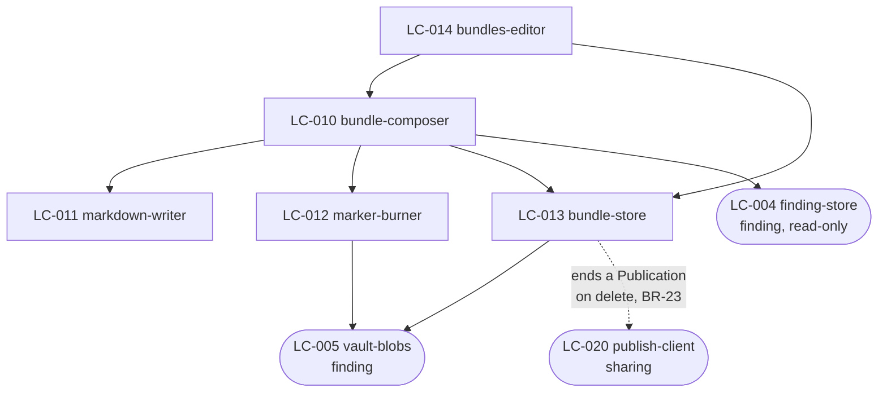
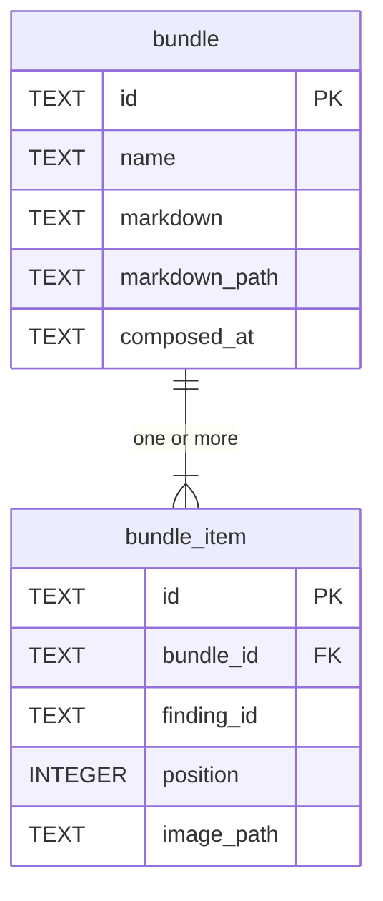

# SDD — bundle

> Generated by `.constitution/method/scripts/validate.py --generate`. MUST NOT be hand-edited.


This is what the owner reads at **G4 Component** for this component.


## What is staked

`mode: guarded` · `risk_accepted: medium` · `g4_passed: True`

**risk_note:** Deleting a Bundle is an irreversible action that removes files from disk, and a Bundle carries copies of images that may hold personal data. No money, no third party. Since 2026-08-31 it also carries FR-41's companion act - discarding a Bundle's source Findings is owned by `finding`, but the Bundle is where the Reviewer stands when they do it.

**owns:** `Bundle`, `BundleItem` · **containers:** `desktop-app`


## Decision Summary

This component is a composer and a store, and almost nothing else. Composition takes an ordered list
of Finding ids and a name, and produces three things in one unit of work: a `bundle` row holding the
composed Markdown, one `bundle_item` row per Finding, and one image file per Finding with that
Finding's Markers drawn into it.

Two choices cost the most to reverse.

**The composed Markdown is a column, not a rendering.** `bundle.markdown` holds the finished bytes,
and every handoff path reads that column. Of the two paths `AD-9` now governs, **one exists**: the
published page. The clipboard-Markdown path has no implementation, so this choice is currently serving
one reader and is stated in the present tense because it binds the paths as they arrive, not because
both of them are there. This document named all three of the paths that existed at the time as present
until 2026-08-31; a third, the Local API `BUG-59` tracked as never built, was withdrawn outright by
`DEC-016` on 2026-09-04 rather than ever being finished. The alternative, rendering
on demand from the Findings, is cheaper to write and makes AD-9 unenforceable: the moment a Note is
edited, the same Bundle produces different bytes on different days, and two agents reading "the same
review" disagree. Storing it is what makes a Bundle citable.

**This argument survives `DEC-012` unchanged, and `FR-40` strengthens it.** Checked rather than assumed,
because the neighbouring `AD-9` claims did not survive. Now that a Bundle's own notes can be corrected
(`FR-40`), "the same Bundle produces different bytes on different days" is exactly what regeneration
from the Findings would cause — so the reason to store the document is stronger than when it was
written. Rebasing an image link is not regeneration: the composer runs once per change, and what it
wrote is what every path serves.

**`bundle.updated_at` holds the last-edited time `FR-40`'s promise needs, kept apart from
`bundle.composed_at`.** Migration 9 adds the column and backfills every existing row from its own
`composed_at`, in the same transaction the migration runs in — a pre-migration Bundle therefore reads
as never edited, which is true of it. A freshly composed Bundle sets both fields equal at construction
for the same reason. Only a Save whose blocks or title actually change moves `updated_at`; a no-op Save
leaves it, which is what lets Save stay always-clickable without the Library claiming an edit that did
not happen.

**Markers are burned at compose time, into a copy.** The Finding's own image stays clean, and each
`bundle_item` gets its own file with the badges drawn in at that image's stored dimensions. This is
what makes FR-8's repositioning possible at all — a badge already burned into the Finding's image
could never be moved — and it is why deleting a Bundle has several files to remove rather than one,
and why one Finding in three Bundles costs three image copies. That storage cost is accepted: it is
what lets a Bundle outlive the Finding it came from.

A Markdown file is also written next to the images, at `bundle.markdown_path`, holding the same bytes
as the column. The column is the source of truth; the file exists so that a Bundle is readable by
anything that opens a folder, which is the plainest form of FR-12.


## Structure — Logical Components

Rendered from `components.yaml`.

| id | Name | Type | Container |
| --- | --- | --- | --- |
| `LC-010` | bundle-composer | `service` | `desktop-app` |
| `LC-011` | markdown-writer | `service` | `desktop-app` |
| `LC-012` | marker-burner | `service` | `desktop-app` |
| `LC-013` | bundle-store | `store` | `desktop-app` |
| `LC-014` | library | `ui-screen` | `desktop-app` |
| `LC-031` | compose-bundle-dialog | `ui-composite` | `desktop-app` |
| `LC-033` | review-update | `ui-screen` | `desktop-app` |


### Dependency direction and responsibilities

Five Logical Components, all in `desktop-app`. Registered in `.control/registry/components.yaml`.

| LC | type | Responsibility |
| --- | --- | --- |
| LC-010 `bundle-composer` | service | The whole composition, as one transaction: read the Findings, burn the images, render the Markdown, write the rows and files. Refuses if any selected Finding's image is missing |
| LC-011 `markdown-writer` | service | Turns Findings plus their Notes and Markers into the document shape `cross-cutting.md` § Bundle Markdown shape defines. Pure, and the only place that shape exists |
| LC-012 `marker-burner` | service | Draws numbered badges and burns visual annotations (outlined Shapes, Callout bubbles with tails and text, Gaussian Blur redaction areas, directional Arrows, floating Text) into a copy of a Finding's image, at that image's own dimensions. Converts normalised coordinates to pixels here and nowhere else |
| LC-013 `bundle-store` | store | `bundle` and `bundle_item` rows, and the Bundle's own files through `vault-blobs`. Owns the delete-with-files transaction |
| LC-014 `bundles-editor` | ui-screen | The Bundle list, the Bundle detail view, compose, copy Markdown, delete |



`LC-011` is pure: no I/O, no clock, no filesystem — verified, `serialize_bundle` is a function of its
arguments only (`crates/snapdown-core/src/domain/markdown.rs:25`). It is the one structural property in
this component worth defending, and under `DEC-012` it buys more than it did: a second rendering of one
document is testable precisely because producing it needs no environment, only a different argument.

**Corrected 2026-08-31.** This paragraph used to say purity *"is what makes AD-9's golden-file test
possible across all three handoff paths"*. Three things in that were wrong, and the third is the one
that matters:

- There is **one** golden-file test — `crates/snapdown-store/tests/test_golden_markdown.rs:137` — not a
  set of three.
- It pins the composer's output against a stored reference, not three surfaces against each other.
- **One of the two remaining handoff paths has no code.** The clipboard-Markdown path is unimplemented:
  every clipboard call in the tree is a bitmap write serving `FR-36`, and
  `apps/desktop/ui/appwindow.slint` has no copy-markdown callback, only a `bundle-preview-markdown`
  display property at `:1342`. Only the published page runs. A third path, the Local API an MCP Bridge
  read from, stood here too — `BUG-59` tracked it never having been built — until `DEC-016` withdrew
  the channel itself on 2026-09-04, closing the gap by removing what it was a gap in.

So the sentence described a guard that was never in place. `[MISSING]` — a rendering-parity test across
paths has never existed, and it cannot be written until a second path does. It is owed with `FR-12`'s
implementation, and it MUST decode or compare whole documents rather than asserting that a link starts
with a drive letter; this repository has already spent five waves passing a fabricated image on exactly
that kind of assertion.

Crossings out of this component: reads of `LC-004 finding-store` and `LC-005 vault-blobs`, both
read-only, and one call into `LC-020 publish-client` when a published Bundle is deleted. Nothing in
`finding` depends on anything here.


## Inherited Constraints — the spine's invariants

Rendered from `ARCHITECTURE-SPINE.md`. A row marked **yes** binds this component by `Binds:`; the rest are shown so a miss in `Binds:` is visible, not hidden.

| id | Invariant | Binds this component | Prevents | Rule |
| --- | --- | --- | --- | --- |
| `AD-1` | Markers and Note lines are one sequence, not two | **yes** | a Marker deleted from an image while its numbered line stays in the Note, so line 3 | A Finding's Markers and its Note's numbered lines MUST be stored as one ordered |
| `AD-2` | A record and its files live or die together | **yes** | a Vault holding image files nothing points at, and a Bundle whose Markdown references | Any operation that creates or removes a Finding, a Bundle, or a BundleItem MUST create or |
| `AD-3` | Marker coordinates are normalised to the image, never in pixels | **yes** | every Marker on every Finding sliding off its target the first time the Quality | A Marker's position MUST be stored as a fraction of the image's width and height, in the |
| `AD-4` | An image is reduced exactly once, at capture, and no original is kept | **yes** | two failures at once — lossy re-encoding compounding as an image passes from Vault to | The capture adapter MUST apply the Quality Budget before the image reaches the Vault, and |
| `AD-5` | Every surface outside the desktop process is read-only | no | anyone holding a Publication URL changing or deleting a review — on a machine where | `web-api` MUST expose no operation that creates, changes, or deletes anything in the |
| `AD-6` | Nothing leaves the machine except a confirmed publish of a named Bundle | **yes** | a Capture containing personal data reaching the network because a background task, | No component may open an outbound network connection carrying Finding, Note, Marker, or |
| `AD-7` | One error envelope across every process boundary | no | a remote agent or a browser receiving an empty result from `web-api` when the real | Every failure crossing a process boundary MUST be returned in the envelope defined in |
| `AD-8` | A Publication slug is unrelated to every Library id | **yes** | one leaked Publication URL becoming a way to guess the next one, and a published | A Publication's slug MUST be generated independently of the Bundle's id and of every |
| `AD-9` | One Bundle, one authored document, on every path | **yes** | the clipboard and web paths drifting into two renderings of one Bundle, so that two | A Bundle's Markdown MUST be composed once, by the core, and stored. Every handoff path |
| `AD-10` | Colour has exactly one authority, and every colour exists in both themes | **yes** | the failure this product already shipped. `finding` and `bundle` paint panels from | Every colour MUST be defined once, in the token stylesheet, and MUST be defined for both |
| `AD-11` | One process owns the Library, and the Editor is a persona of it | **yes** | two writers to one SQLite file and one Vault directory. `finding-store`, | Exactly one desktop process MUST own the Library. The tray, the global hotkeys, the |


## Failure Behaviour

Never written before. The boundary list is this component's rows in `inventory-screen.md` — 8, 9, 10 —
plus the two stores. `bundle` owns no endpoint in `inventory-api.md`; `sharing` serves Bundles over
`web-api` and owns those rows. (`agent-access` served Bundles over a Local API and owned rows 1-8
there too, until `DEC-016` withdrew both on 2026-09-04.)

| Boundary | Other side is slow | Other side is absent | Other side is lying |
|---|---|---|---|
| **`LC-013` → `library.db`** | The surface renders its three regions and holds their shape. No assumed values | Reported with the file path; nothing is created over it | A row whose `markdown_path` names a file that is gone: the item is flagged, the Bundle still opens, Delete still works |
| **`LC-010` → `LC-005 vault-blobs`** | Composition shows progress and cannot be dismissed | Composition **refuses**, naming the Finding whose image is missing (`BR-13`). It never writes a Bundle with a broken reference | A write that reports success and produced no file is caught by the same all-or-nothing check that rolls composition back |
| **`LC-014` → the clipboard** | Not applicable; the write is synchronous | The failure is **reported**. A silent clipboard failure loses the primary handoff and the Reviewer would not know (`FR-12`) | A clipboard that accepts the write and holds something else is undetectable, and the product does not claim to detect it |
| **`LC-010` → `finding`** | Not applicable; in-process | A Finding deleted mid-composition fails the composition, all-or-nothing | **`BUG-1`.** A Finding deleted *after* composition cascades away the `bundle_item` row. The Bundle reports nothing and its item list is silently short |
| **`LC-022` → `sharing`** | The publish dialog shows its own progress | Frozen by `DEC-005`; the surface shows current state and gains no behaviour | Out of scope this release |
| **Saving an edited Bundle → `library.db` + `bundle.md`** | The window stays open and Save cannot be pressed twice | Either write failing means **neither lands** (`BR-5`, widened 2026-08-31). The Reviewer is told which file refused and the edit stays in the buffer, so Save can be pressed again | A write reporting success over a file that did not change is not detected. The same limit as `LC-014`'s clipboard row, and stated for the same reason |
| **Export PDF → a folder the Reviewer chooses** | The export shows progress and the window cannot be dismissed under it | Reported with the path. **The only boundary in this component that writes outside the Vault**, so the ordinary Vault guarantees do not reach it: the folder may be read-only, gone, or on a disk that filled between the dialog and the write | A partial PDF is a corrupt PDF. Nothing is left at the destination unless the whole document was written |

**Two rows added 2026-08-31**, both raised as gaps by `wdi-review`, and they do not stand on the same
footing.

The **save** row constrains a boundary that exists: `update_bundle_markdown` is a named function in
`LC-013`, and `BR-5` governs what happens when half of it lands.

The **Export PDF** row does not. § Structure lists five `LC` and not one of them writes outside the
Vault, so this row describes a boundary the design has not created yet — it is a **requirement on
whoever draws the exporter**, not a description of this component as built. It deliberately names no
`LC`: ticket 07 established `typst` as the engine but defers the exporter's *packaging* — in-process or
its own crate — to the Export PDF effort, and inventing an `LC` here would decide by accident what that
effort exists to decide. `wdi-review` flagged the row as unanchored on 2026-08-31 and it is kept with
its status said out loud rather than removed, because a boundary that writes outside the Vault is the
one thing about the exporter that is already certain.


## Design Notes

- **`bundle.markdown` and the file at `markdown_path` are written from the same bytes in the same
  transaction.** If they can ever differ, the column wins and the file is a stale copy — but nothing
  is designed to let them differ, and a check that they match belongs in the deletion path rather
  than on every read. **Since `BR-5`'s widening on 2026-08-31 this is a rule rather than a design
  preference**: a save in which either write fails changes neither, so the two cannot diverge through
  a partial save. That closes the only route by which they realistically could.
- **`bundle_item.position` is dense and contiguous.** It is the selection order, and there is no
  reorder operation, so it is written once and never rewritten. Anything that makes it sparse has
  invented the second ordering mechanism the SRS rules out.
- **A Bundle of one Finding is an ordinary Bundle.** It is also how a single screenshot gets published
  (OQ-16). Nothing special-cases it.
- **Deleting a published Bundle calls `sharing` before removing anything.** If the unpublish is not
  confirmed, the deletion does not happen — BR-20 and BR-23 together, and the least comfortable
  consequence in this component, since it makes a local deletion depend on a network call.
- **The composer does not delete the Findings it consumed.** PRD open question 4 asks whether it
  should offer to; it does not in r1, and adding it later touches only `LC-014`.

---


## Evidence

| Label | Claim | Disposition |
|---|---|---|
| `[MISSING]` | `bundle_item.finding_id` cascades on Finding deletion, contradicting `FR-13` | **`BUG-1`** — a defect, not planned work. The requirement predates the schema |
| ~~`[MISSING]`~~ **resolved** | `BundleView.tsx` carried four light-theme literals on a surface rendered under either theme | **Done — `W6-S1` at `420ecce`.** Line 93 now reads `backgroundColor: 'var(--color-bg)'` |
| `[MISSING]` | The Markdown preview is not distinguishable from a disabled input to a screen reader | Planned work — `NFR-16` |
| `[PARTIAL]` | Composition is all-or-nothing in code; whether a failure partway leaves image copies in the Vault was not verified | `wdi-question`, before G4 opens |


## UX — screens — `01-ux/`


### `DESIGN.md`

### DESIGN — Bundle

Tokens, elements, and both themes are in [`.how/_platform/design-system.md`](../../_platform/design-system.md) and demonstrated live in [`.how/_platform/assets/design-system.html`](../../_platform/assets/design-system.html).

##### Living Design Assets (.how Layer)
- **3-Column Bundle Review & Assembly Modal**: [`.how/bundle/01-ux/assets/04-bundle-assembly-modal.html`](assets/04-bundle-assembly-modal.html)
- **Saved Review Bundles Drawer**: [`.how/bundle/01-ux/assets/05-saved-bundles-drawer.html`](assets/05-saved-bundles-drawer.html)

#### Tokens

| Token | For |
|---|---|
| `--preview-line-height` | `1.55` — the Markdown preview, tuned for `--font-mono` at `--text-sm` |
| `--bundle-list-width` | `240px` |
| `--item-list-width` | `280px` |

Nothing else. This surface is deliberately the plainest in the product: its content is the Reviewer's
deliverable, and product styling on top of it competes with the thing being handed over.

#### Screens

| Screen | LC | Purpose |
|---|---|---|
| Bundles | `LC-014` `bundles-editor` | List, preview, item list. Serves `FR-11`, `FR-12`, `FR-14` |
| Compose Bundle | `LC-031` `compose-bundle-dialog` | Naming and confirming. Serves `FR-10` |
| Publish a Bundle | `LC-022` `publish-dialog` | Existing. Frozen by `DEC-005` |

`LC-031` is new and registered as part of landing this document. Inventory row 9 named the screen; no
build unit carried it.

#### Layout and states

##### Bundles (`LC-014`)

```
┌ list 240px ──┐┌─ preview (flex) ───────────┐┌ items 280px ─┐
│ checkout-p-1 ││ # checkout-pass-1          ││ 1  the CTA…  │
│  5 · 12 Aug  ││                            ││ 2  spacing…  │
│ nav-review   ││         ││ 3  contrast… │
│  3 · 04 Aug  ││                            ││ 4  the modal…│
│              ││ 1. the CTA drops below…    ││ 5  focus…    │
│              ││                            ││              │
├──────────────┤└────────────────────────────┘├──────────────┤
│              │                              │[Copy Markdown]│
│              │                              │[Publish][Del] │
└──────────────┘                              └──────────────┘
```

- The **preview is the centre and it grows**, because it is the artifact.
- Actions sit at the **item list's foot**, not floating over the preview. Copy Markdown is the one
  `primary` Button on the surface; Publish is `secondary`; Delete is `danger`.
- All three panels draw from `--color-surface` on `--color-bg` and take the height available. The
  shipped build painted `#f8fafc`, `#ffffff`, and `#e0f2fe` literals at a fixed height, which produced
  both the dark-theme contrast failure and roughly a third of the window left empty beneath. The
  literals are gone as of `W6-S1` (`420ecce`); **the fixed height is not** — that is this surface's own
  work, in `W6-S8`.

| State | Rendering |
|---|---|
| Empty | One centred `EmptyState`: "No bundles yet", one sentence — "Select findings on the Findings tab and choose Compose." No button, because the action lives on another surface and a button that navigates away pretends otherwise |
| Loading | Skeleton rows in the list; preview and item list hold their shape |
| Nothing selected | List populated; preview shows muted "Select a bundle". Distinct from empty |
| Populated | Normal |
| Item file missing | The affected item row carries a `--color-warning-bg` badge. The preview and the actions still work |
| Error | Centred `ErrorState`, one Retry |

The preview renders in `--font-mono` at `--text-sm` on `--color-surface-sunken`. It is a read-only
region, **not** a disabled input: a disabled control is announced as unavailable, and the content is
available — it is the editing that does not exist (`FR-11`, Non-Goals).

##### Compose Bundle (`LC-031`)

A modal over Findings at `--color-surface-raised` with `--shadow-raised`, `520px` wide.

```
┌──────────────────────────────────────────┐
│ Compose bundle                           │
│                                          │
│ Name  [checkout-pass-1               ]   │
│                                          │
│ 5 findings, in capture order:            │
│  1 ▣ the CTA drops below the fold…       │
│  2 ▣ spacing on the summary row…         │
│  …                                       │
│                                          │
│            [Cancel]  [Compose]           │
└──────────────────────────────────────────┘
```

| State | Rendering |
|---|---|
| Default | Name focused. Compose disabled until the name is valid |
| Name taken | `TextInput` invalid, message naming the existing Bundle, refused while typing |
| Composing | Compose busy; the modal stays open and is not dismissable |
| Failed | Message inside the modal. Nothing was written — no half-Bundle, no orphaned images |
| Empty | Unreachable — the modal only opens from a non-empty selection |

#### Do's and don'ts for this surface

**Do** let the preview be the largest thing on the screen.
**Do** say in the delete confirmation that the source Findings stay.
**Do** confirm a clipboard write visibly.

**Don't** give the preview a cursor. A Bundle is recomposed, never patched.
**Don't** offer a button in the empty state that only navigates elsewhere.
**Don't** write a literal colour in a component.
**Don't** style the Markdown into something prettier than what `FR-12` actually copies. What is shown
must be the bytes that are handed over.


## Contracts — `02-contracts/`


### `contract-inventory.md`

### Contract inventory — bundle

Derived by reading `apps/desktop/src-tauri/src/commands/bundle.rs` on 2026-08-23.

| id | Command | Reads / writes | Realizes | State |
|---|---|---|---|---|
| CB-1 | `create_bundle` | writes | UC-9 | built |
| CB-2 | `list_bundles` | reads | UC-10 | built |
| CB-3 | `get_bundle_detail` | reads | UC-10, UC-11 | built |
| CB-4 | `delete_bundle` | writes | UC-12 | built |
| CB-5 | `copy_bundle_to_clipboard` | reads | UC-11 | built |

#### The five lanes

##### CB-1 `create_bundle`

| Lane | Answer |
|---|---|
| **Shape** | A name and an ordered selection of Finding ids, returning the Bundle |
| **Refusal** | A taken name is refused while typing, naming the existing Bundle. A selection containing a Finding whose image is missing is refused, naming it (`BR-13`). A selection of zero is refused (`BR-60`); a selection of one is not special-cased (`BR-61`) |
| **Idempotence** | **No.** Two calls with the same selection make two Bundles, and the second name would be refused first anyway |
| **Ordering** | Image copies, then the Markdown file, then the rows. Nothing is committed before its files exist (`AD-2`). Position is fixed here and never changes (`BR-58`) |
| **Failure** | Nothing written — no half-Bundle, no orphaned image copies. `[PARTIAL]` — the rollback's coverage of the image copies was not verified |

##### CB-4 `delete_bundle`

| Lane | Answer |
|---|---|
| **Shape** | An id, confirmed once |
| **Refusal** | `none` |
| **Idempotence** | Yes |
| **Ordering** | Unpublish first if published (`BR-23`), then rows, image copies, and the Markdown file in one unit of work. Unpublishing after deleting would leave a live URL for a Bundle that no longer exists |
| **Failure** | Nothing removed. The source Findings are never touched, and the confirmation says so beforehand |

##### CB-5 `copy_bundle_to_clipboard`

| Lane | Answer |
|---|---|
| **Shape** | An id. The bytes go to the clipboard, not to the caller |
| **Refusal** | `none` |
| **Idempotence** | Yes |
| **Ordering** | `none`. It reads `bundle.markdown` — one column, one set of bytes (`AD-9`) |
| **Failure** | **Reported, always.** A silent clipboard failure loses the primary handoff path in the whole product and the Reviewer would have no way to know |

##### CB-2 / CB-3

| Lane | Answer |
|---|---|
| **Shape** | A list DTO, and a detail DTO carrying the Markdown and the items in position order |
| **Refusal** | `none` — a store that cannot open is `LC-013`'s boundary |
| **Idempotence** | Yes |
| **Ordering** | `none` |
| **Failure** | The surface shows its error in place, with a Retry. An item whose image copy is missing is flagged; the Bundle still opens |

`CB-3`'s item list is where `BUG-1` surfaces to a Reviewer: it returns what `bundle_item` holds, and
after a source Finding is deleted that is one row short of the Markdown it sits beside.


## Components — `04-components/`


### `LC-013-bundle-store.md`

### LC-013 — bundle-store

The store over `bundle` and `bundle_item`, and the object `BUG-1` lives in.

#### Responsibility

Read and write Bundles and their memberships, in units of work that satisfy `AD-2`, and hold the one
set of Markdown bytes that `AD-9` makes authoritative.

#### The invariant this store owns, and currently breaks

> A `BundleItem` is a **membership**, not a pointer. It survives the deletion of the Finding it
> recorded.

That follows from `FR-13` and from what a Bundle is for: a record of what was handed over. The store
enforces the opposite — `bundle_item.finding_id` carries `ON DELETE CASCADE`, and
`finding_store.rs:29` sets `PRAGMA foreign_keys = ON`, so the membership is deleted with its source.

The fix is a migration dropping the constraint, most likely the whole foreign key rather than only its
cascade: this column refers to a row that may legitimately be absent, which is the exact condition a
foreign key exists to forbid. Rows already lost are not recoverable.

#### What it must not do

- **Regenerate Markdown.** `bundle.markdown` is the truth; `MarkdownWriter` produced it once.
- **Reorder items.** `position` is fixed at composition (`BR-58`).
- **Commit a row before its files exist.** `AD-2`.
- **Delete a Bundle's image copies while another Bundle references them.** Each Bundle has its own
  copies, so this cannot arise — but it is the assumption the deletion path rests on and it is worth
  writing down.

#### Boundaries

| Direction | With | Contract |
|---|---|---|
| in | `LC-010 bundle-composer` | Everything a composition writes, as one unit |
| in | `LC-014 bundles-editor` | Reads |
| in | `LC-017 local-api-server` | Reads only (`AD-5`) |
| in | `LC-020 publish-client` | Reads, plus the unpublish cascade (`BR-23`) |
| out | `library.db`, `LC-005 vault-blobs` | |

Four readers and one writer. The read-only ones matter: `AD-5` says every surface outside the desktop
process is read-only, and this store is where that is actually true or not.

#### Tests it owns

Existing: `bundle_store.rs:277` asserts that deleting a Bundle cascades to its items — correct, and it
should stay.

Missing, and this is the shape of the gap: nothing asserts that deleting a **Finding** does *not*
cascade here. A test that a cascade does **not** fire is one nobody writes unless a document says the
cascade must not exist. That document did not exist until this gate.


## Data model — `05-model/`


### `data-model.md`

### Data model — bundle

As-built, read from `crates/snapdown-store/src/sqlite/migrations.rs` (migration v3) on 2026-08-23.



#### Dictionary — `bundle`

| Column | Type | Meaning |
|---|---|---|
| `id` | `TEXT` PK | UUIDv7 |
| `name` | `TEXT` | The Reviewer's name, and the document's heading (`BR-57`) |
| `markdown` | `TEXT` | **The composed bytes, stored.** Not regenerated |
| `markdown_path` | `TEXT` | Relative to the Vault root |
| `composed_at` | `TEXT` | RFC 3339 UTC |

**`markdown` as a column is `AD-9` made structural.** "Byte-identical on every path" is true because
there is one set of bytes, written once by a pure function, and the clipboard, the Local API, and a
publish all read the same column. Three code paths that each regenerate would have to be kept in step
by discipline; this is kept in step by there being nothing to keep in step.

It also has a consequence worth naming: a Bundle **cannot** be patched. Editing the Markdown would
make the column disagree with the items and images that produced it, and that is why `FR-11` and the
Non-Goals say a Bundle is recomposed rather than edited, and why `DESIGN-bundle.md` gives the preview
no cursor.

Storing both `markdown` and `markdown_path` is duplication on purpose: the column is the truth for
every in-product path, and the file on disk is what a Reviewer or an agent opens from the Vault. They
are written in one unit of work (`AD-2`).

#### Dictionary — `bundle_item`

| Column | Type | Meaning |
|---|---|---|
| `id` | `TEXT` PK | UUIDv7 |
| `bundle_id` | `TEXT` FK, `ON DELETE CASCADE` | Correct. Deleting a Bundle deletes its items (`FR-14`) |
| `finding_id` | `TEXT` FK, `ON DELETE CASCADE` | **Wrong — `BUG-1`** |
| `position` | `INTEGER` | Order in the Bundle, fixed at composition (`BR-58`). Never reordered |
| `image_path` | `TEXT` | **The Bundle's own copy**, relative to the Vault root. Not the Finding's |

**`image_path` is the whole point of this table.** A `BundleItem` is a *membership* carrying its own
image copy, not a pointer at a Finding's image. That is what lets a Finding be deleted while the
Bundle stays readable (`FR-13`), and it is what makes a published Bundle immune to later edits.

**`finding_id`'s cascade contradicts exactly that**, and it is live: `finding_store.rs:29` sets
`PRAGMA foreign_keys = ON`, so deleting a Finding removes the membership row while its image copy and
the composed Markdown both survive. The Bundle's document and the record of the Bundle's document
then disagree, silently. Registered as `BUG-1`; `SCN-05` carries the case.

The fix is probably to drop the foreign key rather than only its cascade. A `BundleItem` legitimately
refers to a Finding **that may no longer exist**, which is the precise condition a foreign key exists
to forbid.

`UNIQUE(bundle_id, finding_id)` is correct: one membership per Finding per Bundle. It survives the fix
either way, being independent of the reference.

#### Indexes

None beyond the primary keys and the unique constraint. Bundles are counted in tens.

