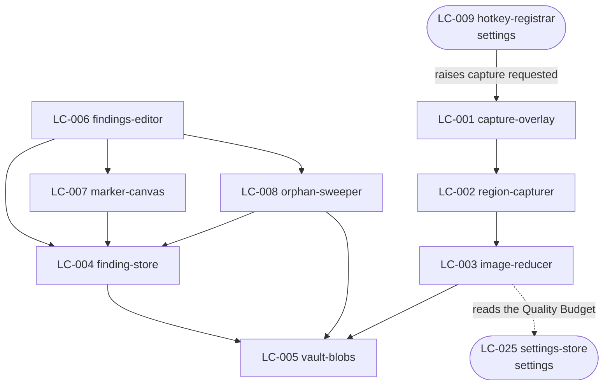
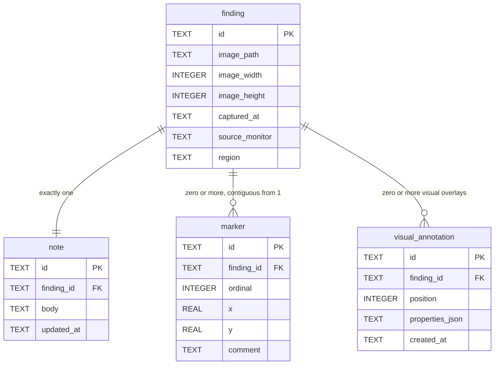

# SDD — finding

> Generated by `.constitution/method/scripts/validate.py --generate`. MUST NOT be hand-edited.


This is what the owner reads at **G4 Component** for this component.


## What is staked

`mode: guarded` · `risk_accepted: low` · `g4_passed: True`

**risk_note:** A Capture may contain personal data, and deleting a Finding is an irreversible action that removes a file from disk. Nothing here touches money and there is no contractual promise to an outside party.

**owns:** `Finding`, `Note`, `Marker`, `VisualAnnotation` · **containers:** `desktop-app`


## Decision Summary

This component is built as a Rust pipeline behind two very different surfaces. The capture path runs
entirely in the Rust process and is optimised for one thing: getting out of the Reviewer's way inside
half a second. The Editor path is a Slint view over the same store (`DEC-007`; a React webview drew
it before that), and it is allowed to be slow because nobody is waiting on it mid-review.

Three choices cost the most to reverse.

**The save is committed before the image finishes.** The record and a zero-byte reservation of its
file are written together, focus returns, and the reduction finishes immediately after. This is what
lets NFR-2's 500 ms and NFR-3's real encoding work both hold, and it is why the Editor has to render
a Finding whose image is still arriving. Reversing it means either a slower save or no reduction on
the way in, and both break a stated number.

**Markers and Note lines are one table, not two.** `marker` carries the badge position *and* the
numbered line's text, and its `ordinal` is both numbers at once. AD-1 could have been satisfied by two
tables and a foreign key; it would also have made every renumber a two-table transaction, which is
exactly where a partial renumber comes from. There is no `note_line` table and there never will be.

**Files are removed before the record is.** For deletion, the file goes first and the record's removal
is only committed once every file is confirmed gone. It is the ordering that makes AD-2's "leave the
prior state intact" achievable on Windows, where a file held open by another process simply refuses.
The cost is that a crash between the two leaves a record pointing at a missing file — which FR-15's
orphan report is built to find and is a state the Reviewer can act on, unlike its opposite.


## Structure — Logical Components

Rendered from `components.yaml`.

| id | Name | Type | Container |
| --- | --- | --- | --- |
| `LC-001` | capture-overlay | `ui-composite` | `desktop-app` |
| `LC-002` | region-capturer | `service` | `desktop-app` |
| `LC-003` | image-reducer | `service` | `desktop-app` |
| `LC-004` | finding-store | `store` | `desktop-app` |
| `LC-005` | vault-blobs | `store` | `desktop-app` |
| `LC-006` | findings-editor | `ui-screen` | `desktop-app` |
| `LC-007` | marker-canvas | `ui-composite` | `desktop-app` |
| `LC-008` | orphan-sweeper | `service` | `desktop-app` |
| `LC-029` | capture-note-field | `ui-composite` | `desktop-app` |
| `LC-030` | orphan-report | `ui-screen` | `desktop-app` |
| `LC-034` | reclaim-space | `ui-screen` | `desktop-app` |


### Dependency direction and responsibilities

Eight Logical Components, all in `desktop-app`. Registered in `.control/registry/components.yaml`.

| LC | type | Responsibility |
| --- | --- | --- |
| LC-001 `capture-overlay` | ui-composite | One transparent window per monitor. Owns the full-screen crosshair guides, pixel loupe magnifier, smart window/panel auto-detection, dynamic cutout preview, top-center Fullscreen button, region selection rectangle, live dimensions with aspect ratio tag, and the note field. Destroyed on save or cancel |
| LC-002 `region-capturer` | service | Turns a selected rectangle in overlay coordinates into pixels, at the monitor's own scale factor. Owns the DPI conversion and nothing else |
| LC-003 `image-reducer` | service | Applies the Quality Budget: downscale to the long edge, re-encode lossily, write to the Vault. The only place either happens (AD-4) |
| LC-004 `finding-store` | store | `finding`, `note`, and `marker` rows. Owns every transaction over them, including the renumber |
| LC-005 `vault-blobs` | store | The Vault folder. Create, read, and delete a blob by relative path; refuses a path that escapes the Vault root |
| LC-006 `findings-editor` | ui-screen | The Finding list and the detail view. Note editing, multi-select, delete confirmation, the orphan report |
| LC-007 `marker-canvas` | ui-composite | Placing, dragging, resizing, and removing Markers (AD-3) alongside visual annotations (Shapes, Callouts, Blur redaction boxes, Arrows, floating Text) over an image |
| LC-008 `orphan-sweeper` | service | Compares `finding_store` against `vault_blobs` in both directions. Reports; never deletes on its own |



Dependency direction is downward only. `LC-005 vault-blobs` depends on nothing and is depended on by
everything that touches a file — which is what makes AD-2 enforceable in one place. No UI component is
depended on by a service.

One crossing out of this component, and it is a read: `LC-003` reads the Quality Budget from
`LC-025 settings-store`. One crossing in: `LC-009 hotkey-registrar` belongs to `settings` — it owns the
binding it registers — and raises a capture-requested event this component listens for. That direction
is deliberate: `finding` does not know which key was pressed, and `settings` does not know what a
Capture is.


## Inherited Constraints — the spine's invariants

Rendered from `ARCHITECTURE-SPINE.md`. A row marked **yes** binds this component by `Binds:`; the rest are shown so a miss in `Binds:` is visible, not hidden.

| id | Invariant | Binds this component | Prevents | Rule |
| --- | --- | --- | --- | --- |
| `AD-1` | Markers and Note lines are one sequence, not two | **yes** | a Marker deleted from an image while its numbered line stays in the Note, so line 3 | A Finding's Markers and its Note's numbered lines MUST be stored as one ordered |
| `AD-2` | A record and its files live or die together | **yes** | a Vault holding image files nothing points at, and a Bundle whose Markdown references | Any operation that creates or removes a Finding, a Bundle, or a BundleItem MUST create or |
| `AD-3` | Marker coordinates are normalised to the image, never in pixels | **yes** | every Marker on every Finding sliding off its target the first time the Quality | A Marker's position MUST be stored as a fraction of the image's width and height, in the |
| `AD-4` | An image is reduced exactly once, at capture, and no original is kept | **yes** | two failures at once — lossy re-encoding compounding as an image passes from Vault to | The capture adapter MUST apply the Quality Budget before the image reaches the Vault, and |
| `AD-5` | Every surface outside the desktop process is read-only | no | anyone holding a Publication URL changing or deleting a review — on a machine where | `web-api` MUST expose no operation that creates, changes, or deletes anything in the |
| `AD-6` | Nothing leaves the machine except a confirmed publish of a named Bundle | **yes** | a Capture containing personal data reaching the network because a background task, | No component may open an outbound network connection carrying Finding, Note, Marker, or |
| `AD-7` | One error envelope across every process boundary | no | a remote agent or a browser receiving an empty result from `web-api` when the real | Every failure crossing a process boundary MUST be returned in the envelope defined in |
| `AD-8` | A Publication slug is unrelated to every Library id | no | one leaked Publication URL becoming a way to guess the next one, and a published | A Publication's slug MUST be generated independently of the Bundle's id and of every |
| `AD-9` | One Bundle, one authored document, on every path | no | the clipboard and web paths drifting into two renderings of one Bundle, so that two | A Bundle's Markdown MUST be composed once, by the core, and stored. Every handoff path |
| `AD-10` | Colour has exactly one authority, and every colour exists in both themes | **yes** | the failure this product already shipped. `finding` and `bundle` paint panels from | Every colour MUST be defined once, in the token stylesheet, and MUST be defined for both |
| `AD-11` | One process owns the Library, and the Editor is a persona of it | **yes** | two writers to one SQLite file and one Vault directory. `finding-store`, | Exactly one desktop process MUST own the Library. The tray, the global hotkeys, the |


## Failure Behaviour

Every boundary this component has. Derived from `.how/_platform/inventory-screen.md` rows 1–7 (this
component owns no endpoint) plus its four out-of-process boundaries. "Returns an error" is not an
answer anywhere below.

| Boundary | Slow | Absent | Lying | What the user sees | What is logged |
| --- | --- | --- | --- | --- | --- |
| Windows screen capture (LC-002) | Capture is one grab of already-composited pixels; there is no slow case short of the compositor stalling. If the grab has not returned in 2 s the overlay closes and the Capture is abandoned | The API refuses — a protected window, a session lock, a secure desktop. The Capture is abandoned and the Reviewer is told the screen could not be read, with the reason Windows gave | Returns fewer pixels than the selected region, or a black rectangle. Detected by comparing returned dimensions against the request; a mismatch abandons the Capture. An all-black result is **not** treated as a lie — a genuinely black region is legitimate | A toast: "Could not capture that region" plus the OS reason. The overlay is gone and nothing is in the Vault. The next hotkey press works | `event=capture_failed`, the reason code, the requested dimensions, the returned dimensions. Never pixels |
| Capture requested, from `LC-009` (`settings`) | Not applicable — an in-process event | The hotkey never registered, so no event ever arrives. Nothing here can detect that; `settings` owns the reporting, and its tray badge is what the Reviewer sees | The event arrives twice for one key press. Guarded by refusing a second overlay while one is open: a Capture already in progress swallows the event rather than stacking overlays | Nothing from this component. The unregistered-hotkey report belongs to `settings` | `event=capture_request_ignored`, and why. At debug level |
| Vault filesystem, write (LC-005) | A slow or network-mounted Vault. The write is off the save path already, so the Reviewer is not blocked; if it has not completed in 10 s the Finding is marked broken and the row is removed | The folder is gone or unwritable — an unplugged drive, a revoked permission. The Capture is abandoned before any row is committed, and the Reviewer is told the Vault is unreachable | Reports a successful write for a file that is not there, which happens on some network filesystems. `LC-005` re-reads the file's size after writing, and a mismatch is a failed write | A toast naming the Vault path and what went wrong, with an action that opens Settings. No half-Finding in the list | `event=blob_write_failed`, the relative path, the byte count expected and found. Never the bytes |
| Vault filesystem, delete (LC-005) | Rare; treated as absent after 5 s | The file is already gone. Treated as **success** — the goal is that it is not there, and refusing here would leave the Reviewer unable to delete a Finding whose file someone else removed | Reports a successful delete for a file still present — or refuses because another process holds it open. Re-checked after the call; if the file is still there the whole deletion is abandoned and no row is removed | A dialog: "Could not delete N of M findings", naming the files, and nothing was removed. BR-5's all-or-nothing, stated to the Reviewer | `event=blob_delete_failed`, the relative path, the OS error |
| `library.db` (LC-004) | SQLite on a local file; a slow case means the disk is failing. A statement not returning in 5 s surfaces as unavailable | The file is missing or corrupt. Snapdown starts, refuses to capture, and says the Library could not be opened, offering the Vault path so the Reviewer can look. It MUST NOT create a fresh empty Library over a corrupt one | A write reports success and is not durable. Guarded by `journal_mode=WAL` plus `synchronous=FULL` on the transaction that commits a Finding — the one place durability is worth the cost | A blocking banner in the Editor and a tray badge. Capture is disabled rather than silently losing Findings | `event=store_unavailable`, the operation, the SQLite result code |
| UI update path (LC-006, LC-007), in-process since `DEC-007` | A property update or callback taking longer than 300 ms shows a progress state in place of the affected row, never a global spinner | The whole process has crashed. Slint and the domain core share one process now, so there is no "core is gone, UI survives" case to design for — the tray, hotkeys, and every window die together, per `DEC-003` | Not reachable the way a JSON command boundary was: a Slint property and the Rust struct behind it are the same type, checked at compile time, so there is no wire shape to mismatch at runtime | The affected row shows as unavailable, or nothing at all if the process itself is gone | `event=ui_update_failed`, the property or callback name. Never the payload |
| Settings read (LC-025) | In-process; no slow case | A Setting has no value. Its shipped default applies — BR-28, and it is why capture works before anything is configured | A Setting holds a value outside its valid range, from a hand-edited store. Validated on read; an invalid value is replaced by the default for this run and the Reviewer is told which Setting was rejected | One line in Settings naming the rejected Setting and the default being used. The capture loop keeps working | `event=setting_rejected`, the key, and why. Not the value, which could be a path holding a person's name |
| Capture Overlay lifetime (LC-001) | A monitor added or removed while the overlay is open. The overlay closes and the Capture is abandoned rather than being redrawn mid-drag | A monitor reports no bounds. That monitor gets no overlay; the others still work, and the Reviewer can capture on any of them | Reports bounds that do not match the physical layout, so the overlay covers the wrong area. Not detectable from inside the process. Mitigated by RISK-1's integration test on a real mixed-scale-factor session, not by runtime code | The overlay disappears and nothing is saved. Pressing the hotkey again is the whole recovery | `event=overlay_abandoned`, the reason, the monitor count before and after |

Two entries are the ones worth arguing about, and both are deliberate:

- **A missing file on delete is success.** The Reviewer's goal is that it is gone. Treating this as a
  failure would make FR-15's orphan report unable to fix what it finds.
- **A missing file on write is failure, and the row is never committed.** The asymmetry is AD-2's
  ordering, and it is why a crash can leave a record without a file but never a file without a record.


## Design Notes

- **The AD-2 inversion on deletion is intentional and is the one place this component departs from the
  quoted rule's letter.** AD-2 says files MUST NOT be removed before the record is. On Windows a file
  held open cannot be removed, so removing the record first would guarantee the orphan the rule
  exists to prevent. Files first, record after confirmation, means the only reachable inconsistent
  state is a record with no file — which FR-15 finds and the Reviewer can resolve. The opposite state
  is invisible. This is a narrowing of AD-2 in one direction, not a contradiction of its purpose, and
  it is recorded here rather than as a `DEC-` because the invariant it serves is unchanged. If a
  reviewer reads it as a contradiction, that reading opens a `DEC-` and this note is the evidence.
- **`ordinal` is not a database sequence.** It is the badge number, and a renumber rewrites it. Using
  an autoincrement anywhere near it reintroduces the gap AD-1 forbids.
- **The reduction is not cancellable.** Once `LC-003` has the pixels it finishes, even if the Reviewer
  deletes the Finding a second later. Cancelling mid-encode is the shortest path to a half-written
  blob, and finishing costs milliseconds.
- **`LC-005` refuses any path that escapes the Vault root**, resolved rather than string-matched. Both
  agent-facing surfaces eventually serve blobs by filename, and this is the single place that check
  belongs.
- **The `finding.region` column is stored for diagnosis, not for behaviour.** Nothing re-derives an
  image from it. It exists so that a wrong-region report has something to compare against, which is
  RISK-1's only forensic trail.

---


## Evidence

| Label | Claim | Disposition |
|---|---|---|
| `[MISSING]` | `Auto` does not exist. `ImageReducer` reads `DEFAULT_MAX_LONG_EDGE_PX = 1600` and `DEFAULT_ENCODER_QUALITY = 75` | Planned work — `FR-5`, `DEC-004`, `SCN-03` |
| `[MISSING]` | No Finding stores the resolved pair applied to it | Planned work — `NFR-18`, `BR-105` |
| ~~`[MISSING]`~~ **resolved** | `FindingsView.tsx` and its panels carried light-theme literals on a surface rendered under either theme | **Done — `W6-S1` at `420ecce`, in the pre-`DEC-007` Tauri webview** (now `archive/desktop-tauri`). The Slint rebuild carries its own version of this guard — `design-system-guide.md` and `ensures_zero_color_literals_exist_in_source_trees_outside_tokens_css` over `apps/desktop/ui` |
| `[NEEDS CONFIRMATION]` | Whether a Marker with no Note line is currently surfaced anywhere, or silently tolerated | `wdi-question`, before G4 opens |
| `[PARTIAL]` | Multi-monitor DPI handling is implemented; whether a region spanning two monitors at different scales is correct at each was not exercised by the UI audit | `wdi-question` |


## UX — screens — `01-ux/`


### `DESIGN.md`

### DESIGN — Finding

Tokens, elements, iconography, and both themes are in [`.how/_platform/design-system.md`](../../_platform/design-system.md) and demonstrated live in [`.how/_platform/assets/design-system.html`](../../_platform/assets/design-system.html).

##### Living Design Assets (.how Layer)
- **Finding Studio Workspace**: [`.how/finding/01-ux/assets/01-studio-workspace.html`](assets/01-studio-workspace.html)
- **Capture Scrim & Note HUD**: [`.how/finding/01-ux/assets/02-capture-overlay.html`](assets/02-capture-overlay.html)
- **Crop Mode Overlay**: [`.how/finding/01-ux/assets/03-crop-mode.html`](assets/03-crop-mode.html)

#### Tokens

Component-specific only.

| Token | For |
|---|---|
| `--rail-thumb-width` | `176px` — a capture thumbnail in the rail |

**`--overlay-dim`, `--overlay-region-ring` and `--canvas-checker` are NOT here.** An earlier draft of
this document defined them locally and argued they should "stay here rather than being promoted",
because they are drawn over the Reviewer's screen content rather than over a Snapdown surface.

That reasoning is right about *why they do not follow the theme* and wrong about *where they live*.
`AD-10` requires every colour to be defined once in the token file, and says explicitly that a
deliberately theme-invariant token must still be defined there and must say why. All three are in
`.how/_platform/design-system.md` § Colour — theme-invariant, alongside `--color-marker*`, which was
already handled that way. Corrected 2026-08-23; the spine wins over a component document.

#### Screens

| Screen | LC | Purpose |
|---|---|---|
| Capture Overlay | `LC-001` `capture-overlay` | Region selection. Serves `FR-1` |
| Capture note field | `LC-029` `capture-note-field` | The narration step. Serves `FR-2` |
| Findings | `LC-006` `findings-editor` | Rail, canvas, note pane. Serves `FR-6`, `FR-7`, `FR-9` |
| Marker canvas | `LC-007` `marker-canvas` | Markers on one image. Serves `FR-8` |
| Orphan report | `LC-030` `orphan-report` | Serves `FR-15` |

`LC-029` and `LC-030` are new and registered as part of landing this document. Both are screens the
inventory already named (rows 2 and 7) that had no build unit behind them.

#### Layout and states

##### Capture Overlay (`LC-001`) and note field (`LC-029`)

One transparent, always-on-top window per monitor. No chrome, no title, no toolbar. Features full-screen crosshair axes, floating pixel loupe with live pixel grid/dimensions, smart container/panel auto-detection with dynamic un-dimmed cutout preview, and top-center Fullscreen shortcut.

```
                    [ 🖥️ Fullscreen ] (Top-Center)
────────────────────────────────────────────────────────────
              │ (Vertical Full-Screen Crosshair Guide)
              │
    ┌─────────┼─────────────────────────────────┐
    │ PANEL / WINDOW DETECTED                   │
    │ (Un-dimmed Sharp Preview)                 │
    │                                           │
────┼─────────● (Cursor) ───────────────────────┼───────────
    │         │ (Circular Loupe Magnifier 6x)   │ (Horizontal Guide)
    │        [417 × 1192 px]                    │
    └───────────────────────────────────────────┘
              (Rest of screen remains dimmed)

        ╔═══════════════════════════════════════╗
  dim   ║   selected region (1-click or drag)   ║   dim
        ╚═══════════════════════════════════════╝
              1408 × 620 px (16:9)  ← readout, --font-mono
        ┌───────────────────────────────────────┐
        │ What is wrong here?                   │  ← LC-029, anchored beneath
        └───────────────────────────────────────┘
              Enter to save · Esc to cancel
```

- The readout sits **outside** the region, never over the content being captured. During drag, standard aspect ratios (16:9, 4:3, 1:1, 21:9) are automatically tagged.
- Top-center button `[ 🖥️ Fullscreen ]` enables 1-click capture of the active monitor.
- Smart auto-detection highlights top-level windows and sub-panels as un-dimmed cutouts; 1-click on a highlighted container selects it immediately.
- Re-selection is supported: clicking or dragging elsewhere before saving instantly selects a new region without requiring dismiss.
- The note field anchors beneath the region, and flips above it when the region is near the screen foot. It never covers the thing being described.
- The hint line is `--text-xs`, `--color-text-muted`, and is the only instruction anywhere in the capture path.

| State | Rendering |
|---|---|
| Armed | Full-screen crosshair axes, pixel loupe magnifier near pointer, auto-detect container cutout highlights, top-center Fullscreen button |
| Dragging | Region undimmed with `--overlay-region-ring`; full-screen crosshairs track pointer; readout tracks region with aspect ratio tag |
| Narrating | Region stays lit, note field focused, crosshairs/loupe unmounted, re-selection enabled by clicking/dragging outside |
| Saving | Overlay already dismissed. Reduction runs behind it (`NFR-2`) |
| Error | Overlay gone; a `Toast` with `--color-danger` names the Vault folder and offers Settings |

##### Findings (`LC-006`)

**Three columns, and the middle one is the one that grows.** This is the Snagit reading of the
problem — a recents rail, a canvas, a properties pane — with Cobalt's note-beside-the-image in the
third column instead of a tool inspector.

```
┌ rail 200px ─┐┌─ canvas (flex) ────────────┐┌ note 320px ─┐
│ ☐ ▣ 12:04   ││                            ││ Note        │
│ ☐ ▣ 12:01   ││        ①                   ││ ┌─────────┐ │
│ ☑ ▣ 11:58   ││              ②             ││ │1. the … │ │
│ ☐ ▣ 11:52   ││                            ││ │2. this …│ │
│             ││        ③                   ││ └─────────┘ │
│             ││                            ││ Markers     │
│             ││   1408 × 620 · 184 KB      ││  ① ② ③      │
├─────────────┤└────────────────────────────┘├─────────────┤
│ 1 selected  │                              │ [Delete]    │
│ [Compose →] │                              │             │
└─────────────┘                              └─────────────┘
```

- **The rail is the capture rail, not a sidebar.** Thumbnails, newest first, timestamp beneath.
  A checkbox appears on hover or keyboard focus; it does not occupy space permanently.
- **The rail's foot is the multi-select action** (`FR-9`): a count and one button, Compose. It appears
  only when something is selected, and it is the only bridge from Finding to Bundle.
- **The canvas fits the image to the pane** and shows its real dimensions and stored size beneath —
  which is where `NFR-18`'s recorded budget surfaces to a human.
- **The note pane lists the Markers under the Note**, each row focusable, so Markers are reachable
  without the canvas. That list is what makes the keyboard path in the accessibility floor real.

The panels take the height available and the columns are independent. The shipped build renders both
list surfaces at a fixed height and leaves a third of the window dark beneath them.

| State | Rendering |
|---|---|
| Empty | The three columns collapse to one centred `EmptyState`: "No findings yet", then the bound capture combination rendered as a `HotkeyChip`, not a button |
| Loading | Rail shows four skeleton thumbs at `--rail-thumb-width`; canvas and note pane hold their shape. No layout shift |
| Nothing selected | Rail populated; canvas shows a muted "Select a finding" and the note pane is empty and inert. Visually distinct from the empty state |
| Populated | Normal |
| Image missing | Canvas shows a `--color-warning-bg` panel naming the missing file, with one action: open the orphan report |
| Error | Centred `ErrorState`: the Library could not be read, one Retry |

**Every panel here draws from `--color-surface` and `--color-text`.** `FindingsView` used to paint
`#ffffff` and `#f8fafc` panels regardless of theme, so under the Windows dark theme the shell's white
`--color-text` landed on them — the white-on-white the Reviewer reported. **Resolved by `W6-S1` at
`420ecce`**, and by the only fix that holds: no literal in the component at all (`NFR-17`).

##### Canvas Annotation & Marker Layer (`LC-007`)

The canvas supports structured numbered Markers (which bind to Markdown note lines) alongside rich visual markup elements (Shape, Callout, Blur, Arrow, Text) that render onto the image overlay without creating Markdown lines.

```
┌─────────────────────────────────────────────────────────────┐
│ [ ● Marker ] [ ▢ Shape ] [ 💬 Callout ] [ ░ Blur ] [ ↗ Arrow ] [ T Text ]  [ ↶ Undo ] [ ↷ Redo ]
└─────────────────────────────────────────────────────────────┘
┌─ canvas area ───────────────────────────────────────────────┐
│                                                             │
│       ┌─────────┐ (Shape: red outline, transparent fill)    │
│       │ ▢       │                                           │
│       └─────────┘                                           │
│                 \                                           │
│                  \ (Arrow: start handle & end arrowhead)    │
│                   ↘                                         │
│       ① (Numbered Marker: solid red circle, white num)      │
│                                                             │
│       [ ░░░░░░░░░ ] (Blur Redaction Box)                    │
│                                                             │
│       ┌──────────────────┐                                  │
│       │ Custom Text      │╲                                 │
│       └──────────────────┘ ╲ (Callout: text bubble + tail)  │
│                             ●                               │
│                                                             │
│       Floating Text [Font: Inter / 16px]                    │
│                                                             │
└─────────────────────────────────────────────────────────────┘
```

###### Canvas Interaction Model & Control Points

1. **Toolbar Controls**:
   - Primary Tools: `Marker` (1), `Shape` (2), `Callout` (3), `Blur` (4), `Arrow` (5), `Text` (6).
   - Global Actions: `Undo` (Ctrl+Z), `Redo` (Ctrl+Y), `Delete` (Del/Backspace).
2. **Marker**:
   - 28px solid red circle with bold white numeral in center (no border outline).
   - Direct click places next sequential marker (e.g. 1, 2, 3) and appends line to Markdown note.
   - Draggable central handle to reposition.
3. **Shape (Rectangle Outline)**:
   - Transparent fill with solid stroke (`--color-marker` default / red).
   - Active state displays 8 bounding control handles (4 corners + 4 edge midpoints) for free proportional or edge resizing.
   - Clicking and dragging interior moves/translates the shape.
4. **Callout**:
   - Text bubble container with custom background/border + adjustable pointer tail.
   - Double-click inside bubble enters inline text editing mode.
   - Property bar allows customizing font family and font size.
   - Tail anchor features a dedicated circular control handle that can be dragged in 360 degrees to point at any target spot.
   - 8-point handles on the bubble box for resizing the text area.
5. **Blur (Redaction Box)**:
   - Rectangular box that applies real-time Gaussian / pixelation shader over underlying screenshot pixels.
   - 8-point resize handles for boundary adjustments.
   - Burnt permanently into export PNGs to prevent leaking confidential tokens/PII.
6. **Arrow / Line**:
   - Directional vector line with distinct arrowhead at destination point.
   - 2 primary control handles: Start point handle and End (head) point handle.
   - Dragging handles repositions/rotates the arrow; dragging the line body translates the entire arrow.
7. **Floating Text**:
   - Borderless text block. Double-click enters inline typing.
   - Editable font family, font size, and text color.
   - Draggable bounding box to reposition anywhere on the screenshot.

| Element | Control Handles | Markdown Binding? | Deletion / Manipulation |
|---|---|:---:|---|
| **Marker** | 1 Center drag point | **YES** | Delete removes note line & renumbers; drag updates coordinate |
| **Shape** | 8 Box handles (Corners + Midpoints) | **NO** | Delete removes shape; handles resize; body drags |
| **Callout** | 8 Box handles + 1 Tail point | **NO** | Delete removes callout; tail points; double-click edits text |
| **Blur** | 8 Box handles | **NO** | Delete removes blur; handles resize; body drags |
| **Arrow** | 2 Endpoints (Start + End head) | **NO** | Delete removes arrow; endpoints change direction/length; shaft drags |
| **Text** | 4 Corner handles | **NO** | Delete removes text; double-click edits text; handles scale/reflow |

#### Do's and don'ts for this surface

**Do** keep the capture path to a crosshair, a readout, and one field.
**Do** let the note pane be the keyboard path to every Marker.
**Do** show dimensions and stored size where the Reviewer can see them.
**Do** keep visual canvas annotations (Shape, Arrow, Callout, Text, Blur) strictly separate from Markdown finding notes.

**Don't** mix visual annotations into the structured Markdown note lines — Markers remain the only structured finding bridges.
**Don't** put chrome on the overlay. Every pixel of it is over the thing being described.
**Don't** require the Editor for a capture.
**Don't** write a literal colour in a component — this surface is where that habit did its damage.


## Contracts — `02-contracts/`


### `contract-inventory.md`

### Contract inventory — finding

The command surface this component exposes to its UI. Derived by reading
`apps/desktop/src-tauri/src/commands/{finding,capture}.rs` on 2026-08-23 — the pre-`DEC-007` Tauri
webview, archived at `archive/desktop-tauri`.

**Not re-derived since `DEC-007`.** The desktop app moved to native Slint; the command names below
may still name the right operations, but their exact shape has not been checked against
`apps/desktop/src`'s current Rust functions. Treat this table as the last-known contract, not a
current one, until it is re-derived.

Numbers are stable. A new command takes the next `CF-`.

| id | Command | Reads / writes | Realizes | State |
|---|---|---|---|---|
| CF-1 | `capture_screen_region` | writes | UC-1 | built, **changing** |
| CF-2 | `trigger_overlay` | — | UC-1 | built |
| CF-3 | `dismiss_overlay` | — | UC-1 | built |
| CF-4 | `list_findings` | reads | UC-3, UC-6 | built |
| CF-5 | `get_finding_detail` | reads | UC-3, UC-4 | built |
| CF-6 | `save_note` | writes | UC-4 | built |
| CF-7 | `add_marker` | writes | UC-5 | built |
| CF-8 | `update_marker` | writes | UC-5 | built |
| CF-9 | `delete_marker` | writes | UC-5 | built |
| CF-10 | `delete_finding` | writes | UC-7 | built |
| CF-11 | `scan_orphans` | reads | UC-8 | built |
| CF-12 | `clean_orphans` | writes | UC-8 | built |

#### The five lanes

##### CF-1 `capture_screen_region` — the one on the clock

| Lane | Answer |
|---|---|
| **Shape** | Today: a region plus a Note, returning the stored Finding. Under `DEC-004` it must additionally return the **resolved pair and budget name** applied, because `NFR-18` stores them |
| **Refusal** | A zero-area region is refused before anything is captured; the overlay returns to `Armed` rather than ending (`state-machines.md` § 1). A Vault that refuses the write is reported by toast, because the overlay is already gone |
| **Idempotence** | **No, and deliberately not.** Two identical captures are two Findings. A Reviewer capturing the same region twice meant to |
| **Ordering** | Dismiss the overlay, **then** reduce and store. `NFR-2` gives 500 ms to dismiss and reduction must not block it. The reverse ordering is the one that fails the requirement |
| **Failure** | The Finding is not created. No partial row, no orphaned file (`AD-2`) |

##### CF-7 / CF-8 / CF-9 — the Marker sequence

| Lane | Answer |
|---|---|
| **Shape** | Add takes a normalised position (`AD-3`); update takes a position; delete takes an ordinal |
| **Refusal** | A position outside 0.0–1.0 is refused. An ordinal that does not exist is refused, not ignored |
| **Idempotence** | Update, yes. Add, no — a second add is a second Marker |
| **Ordering** | Each of the three MUST write the Marker **and** its Note line in one operation (`AD-1`). Delete renumbers the remainder contiguously in the same operation (`BR-5`). Three commands, one collection, and this is the lane the invariant actually lives in |
| **Failure** | Neither the Marker nor the line is written. A half-write is what `AD-1` forbids |

##### CF-10 `delete_finding`

| Lane | Answer |
|---|---|
| **Shape** | An id, confirmed once by the caller |
| **Refusal** | `none`. A Finding inside a Bundle is still deletable — the Bundle holds its own copy (`BR-13`) |
| **Idempotence** | Yes. Deleting a Finding that is gone succeeds silently |
| **Ordering** | Record and image file in one unit of work; prior state intact on any failure (`AD-2`) |
| **Failure** | Nothing removed. Not the row, not the file |

##### CF-11 / CF-12 — orphans

| Lane | Answer |
|---|---|
| **Shape** | Scan returns files nothing points at and records pointing at nothing. Clean takes what to remove |
| **Refusal** | Clean refuses a path that escapes the Vault root. `VaultBlobStore` already carries that guard |
| **Idempotence** | Both, yes |
| **Ordering** | `none` — scan is read-only, and clean acts on what the Reviewer confirmed from a scan they saw |
| **Failure** | A file that will not delete is **reported**, not swallowed. This is the lane `settings`' Vault move got wrong at the pre-`DEC-007` webview's `vault_migration.rs:141`, and it is worth naming the contrast |

##### CF-2 / CF-3 / CF-4 / CF-5 / CF-6

| Lane | Answer |
|---|---|
| **Shape** | Overlay control takes nothing; the reads return their DTOs; `save_note` takes an id and a body |
| **Refusal** | `trigger_overlay` while an overlay is already up is **ignored**, not refused. Two overlays never stack |
| **Idempotence** | All five |
| **Ordering** | `save_note` is debounced by the caller and last-write-wins. There is one writer — the Reviewer — so there is no conflict to resolve |
| **Failure** | The read shows its own error in place. `save_note` failing leaves the previous body and says so; it does not lose what was typed |


## Components — `04-components/`


### `LC-003-image-reducer.md`

### LC-003 — image-reducer

The Control object `DEC-004` changes. It is the only place in the product that decides how much of a
Capture survives.

#### Responsibility

Given raw pixels and the region they came from, produce exactly one stored image and the record of how
it was produced.

1. Resolve the Quality Budget for **this** region (`BR-104`).
2. Downscale to the resolved long edge, if it is under the region's.
3. Encode at the resolved quality.
4. Hand `LC-005` the bytes, and hand `LC-004` the resolved pair and budget name (`NFR-18`).

#### The resolution rule, stated as a requirement rather than an algorithm

`Auto` must satisfy three things. The specific curve is an implementation choice; these are not.

- **It varies with the region.** A `312 × 118` tooltip and a `3840 × 2160` screen must not resolve the
  same pair (`SCN-03`). This is the assertion a constant cannot pass.
- **Where no downscale applies, quality is high.** Under the cap, the encoder is the only lever and
  small text is where its artefacts show.
- **Where a hard downscale applies, quality is lower.** The downscale has already removed the detail
  quality would have preserved, and `BG-3` wants the bytes back.

`Sharp`, `Balanced`, and `Small` resolve fixed pairs. `Custom` resolves what the Reviewer typed.

#### What it must not do

- **Keep the original.** `AD-4`. The raw pixels are dropped when this object returns.
- **Re-encode an existing Finding.** `BR-9`. This object is only ever called at capture.
- **Block the overlay's dismissal.** It runs after (`06-flows/flow-capture.md`).
- **Read the budget more than once per Capture.** The named state and its resolved pair are one read;
  `BR-116` makes them one write, and a second read could straddle a change.

#### Boundaries

| Direction | With | Contract |
|---|---|---|
| in | `LC-002 region-capturer` | Raw pixels and the region |
| in | `settings` | The Quality Budget, read-only (`BR-110`) |
| out | `LC-005 vault-blobs` | The encoded bytes |
| out | `LC-004 finding-store` | The resolved pair and budget name |

#### As-built

`[MISSING]` — step 1 does not exist. Two constants are read from
`crates/snapdown-core/src/domain/setting.rs` and applied to every Capture.

`[MISSING]` — step 4's second half does not exist. Nothing carries the resolved pair to the store, and
`05-model/data-model.md` has no columns for it.

Steps 2 and 3 are built and tested. The delta is entirely the resolution and the record — which is to
say, `DEC-004` and `NFR-18`, and nothing about the encode itself.


## Data model — `05-model/`


### `data-model.md`

### Data model — finding

As-built, read from `crates/snapdown-store/src/sqlite/migrations.rs` (migration v2) on 2026-08-23.



#### Dictionary — `visual_annotation`

| Column | Type | Meaning |
|---|---|---|
| `id` | `TEXT` PK | UUIDv7 |
| `finding_id` | `TEXT` FK, `ON DELETE CASCADE` | Finding this visual markup belongs to |
| `position` | `INTEGER` | Z-order, and creation order. What was drawn later covers what was drawn earlier — the burn walks this, so it is what the Reviewer saw on the canvas |
| `properties_json` | `TEXT` | The whole `AnnotationShape`, serialised. Normalized coordinates, dimensions, font size/family/alignment, tail points, stroke, text content |
| `created_at` | `TEXT` | RFC 3339 UTC |

**As built, 2026-08-28** — this table was designed here and implemented four days later, in migration
8 (`crates/snapdown-store/src/sqlite/migrations.rs`). Two columns above differ from what was designed,
and the differences are stated rather than quietly absorbed:

- **`kind` was designed and is not built.** `AnnotationShape` is `#[serde(tag = "kind")]`, so the tag
  is already the first key inside `properties_json`. A column would be a second copy of one fact, and
  a second copy is what goes stale. Nothing queries by kind — every read is *all of this Finding's, in
  order* — so there is nothing for it to serve. Its designed values were also already wrong: the enum
  serialises `Rect` as `rect`, not `shape`.
- **`position` was not designed and is built.** The design has no z-order, and the burn cannot do
  without one. Two overlapping Callouts have to land in the file the way they landed on the canvas.

Indexed on `(finding_id, position)`, which is the only access path there is.

#### Dictionary — `finding`

| Column | Type | Meaning |
|---|---|---|
| `id` | `TEXT` PK | UUIDv7, per `cross-cutting.md` § Identifiers |
| `image_path` | `TEXT` | Relative to the Vault root, never absolute. A Vault move must not rewrite rows |
| `image_width` `image_height` | `INTEGER` | The **stored** image's dimensions, after reduction. Not the region's |
| `captured_at` | `TEXT` | RFC 3339 UTC with `Z` |
| `source_monitor` | `TEXT` | Which monitor the region came from, for the multi-monitor DPI case |
| `region` | `TEXT` | The rectangle selected on that monitor, before reduction |

`image_path` being relative is what makes `SCN-01`'s Vault move a file operation rather than a
database migration. It is the kind of decision that costs nothing when taken and is expensive to
reverse, and it is worth naming because nothing in the DDL explains it.

**`region` and the stored dimensions are both kept** — the region says what the Reviewer selected, the
dimensions say what was stored after reduction. They differ whenever a downscale applied, and the pair
is the only surviving evidence of how hard a Capture was reduced.

Which is nearly `NFR-18`, and not quite: it records the **effect** and not the **budget**. From
`3840×2160` selected and `1600×900` stored you can infer a long-edge cap of 1600; you cannot recover
the encoder quality, and you cannot tell which named budget was in force.

`[MISSING]` — three columns are needed: `resolved_long_edge`, `resolved_encoder_quality`, and
`budget_name`. Planned work under `NFR-18` and `BR-105`.

#### Dictionary — `note`

| Column | Type | Meaning |
|---|---|---|
| `id` | `TEXT` PK | UUIDv7 |
| `finding_id` | `TEXT` FK `UNIQUE`, `ON DELETE CASCADE` | One Note per Finding, enforced by the constraint |
| `body` | `TEXT` | Free text, verbatim. Blank lines preserved (`BR-34`) |
| `updated_at` | `TEXT` | RFC 3339 UTC |

The numbered lines `AD-1` binds are **inside `body`**, not rows. That is the right shape and it is the
source of `SCN-04`: the Note is free text the Reviewer owns, so the database cannot enforce the
pairing, and the pairing is therefore an application invariant carried by `MarkerSequencer`. Making
the lines rows would let the constraint enforce it and would take free-text editing away.

#### Dictionary — `marker`

| Column | Type | Meaning |
|---|---|---|
| `id` | `TEXT` PK | UUIDv7 |
| `finding_id` | `TEXT` FK, `ON DELETE CASCADE` | |
| `ordinal` | `INTEGER`, `UNIQUE(finding_id, ordinal)` | The Marker's number. Its identity to the reader |
| `x` `y` | `REAL` | **Normalised to the image, 0.0–1.0**, per `AD-3`. Never pixels |
| `comment` | `TEXT` | |

`UNIQUE(finding_id, ordinal)` is the one place the database helps enforce `AD-1`: two Markers cannot
share a number. It does **not** enforce contiguity — `1, 2, 4` satisfies the constraint — so
"contiguous from 1 with no gaps" remains `MarkerSequencer`'s job. Worth stating, because the presence
of a constraint invites the assumption that the rule is covered.

`AD-3`'s normalisation is what makes a Marker survive re-encoding at a different size. It is also why
`x` and `y` are `REAL`.

`comment` is `[NEEDS CONFIRMATION]`: the domain model describes a Marker as a numbered badge bound to
a Note line, and this column suggests per-Marker text as well. Whether it is used, and whether it
duplicates the Note line, was not established. Filed for `wdi-question`.

#### Cascades

Both `ON DELETE CASCADE`s are correct and are **not** what satisfies `AD-2`. They remove the rows; the
image file is removed by `FindingRemover` in the same unit of work. A cascade that fired while the
file removal failed would leave an orphaned file with no record — which is exactly the state `FR-15`
exists to find, and `AD-2` exists to prevent.

#### Indexes

None beyond the primary keys and `UNIQUE(finding_id, ordinal)`. `OQ-10` records the assumption that
this is enough at the sizes reached so far, and that search is the first thing that will hurt.


## Flows — `06-flows/`


### `flow-capture.md`

### Flow — hotkey to stored Finding

The most-executed path in the product, and the only one with two timing requirements across it.

```mermaid
sequenceDiagram
    participant W as Windows
    participant H as LC-009 hotkey-registrar
    participant O as LC-001 capture-overlay
    participant N as LC-029 capture-note-field
    participant C as LC-002 region-capturer
    participant I as LC-003 image-reducer
    participant V as LC-005 vault-blobs
    participant S as LC-004 finding-store

    W->>H: hotkey pressed
    H->>O: capture requested
    Note over O: NFR-1 — visible within 200 ms,<br/>across three monitors
    O->>O: dim every monitor, full-screen crosshair guides + pixel loupe magnifier
    O->>O: auto-detect windows/sub-panels with dynamic cutout preview (or top-center Fullscreen)
    O->>O: Reviewer 1-clicks detected container or drags region; live W x H + aspect ratio readout
    O->>N: region committed
    N->>N: Reviewer types (or re-selects new region), presses Enter
    N->>C: region + note
    C->>O: dismiss
    Note over O: NFR-2 — dismissed and focus returned<br/>within 500 ms. Everything below is after this.
    C->>I: raw pixels + region
    I->>I: resolve the pair for THIS region (BR-104)
    I->>V: write the reduced image
    V-->>I: relative path
    I->>S: Finding + Note + resolved pair (NFR-18)
    S-->>O: toast with the running count
```

#### The line that matters

`NFR-2`'s 500 ms budget ends at **dismiss**, not at **stored**. Everything below that line in the
diagram runs with no overlay on screen, and that ordering is the requirement rather than an
optimisation: reduction of a 4K capture is not free, and doing it before dismissal would put it
inside the budget.

Three consequences follow, and each is easy to get wrong:

- **A failure after dismissal has no surface to report into.** Hence the toast (`CF-1`, Failure).
- **The Reviewer is already typing in another window.** Nothing may steal focus back.
- **`UC-2` — five captures in a row — means five reductions may be in flight.** They must not
  serialise behind each other, and none may block the next hotkey press.

#### Where `AD-4` sits

"An image is reduced exactly once, at capture, and no original is kept." The raw pixels exist only
between `C` and `I` in the diagram. Nothing writes them to disk, which is why there is no unreduced
capture to leak (`BR-25`) and no way to re-encode later (`BR-9`).

It also means the reduction is **irreversible and unrepeatable**. `SCN-03`'s upgrade case is a direct
consequence: tune the derivation and old Findings simply differ, because the input that produced them
is gone.

#### As-built

`[MISSING]` — `I` resolves nothing. `crates/snapdown-core/src/domain/setting.rs` holds
`DEFAULT_MAX_LONG_EDGE_PX = 1600` and `DEFAULT_ENCODER_QUALITY = 75`, read as constants, so the
`resolve the pair for THIS region` step does not exist.

`[MISSING]` — the resolved pair is not passed to `S` and there are no columns to hold it
(`05-model/data-model.md`).

`[PARTIAL]` — `NFR-1` and `NFR-2` are stated with timed tests in the wave plan; whether those tests
run against three real monitors, or against a mock, was not established. Filed for `wdi-question`.

