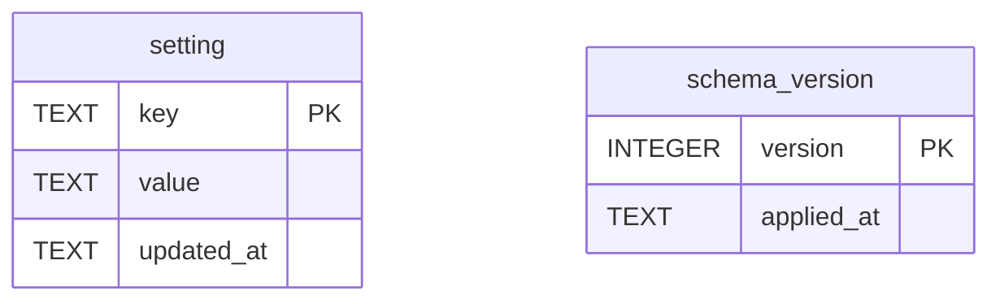
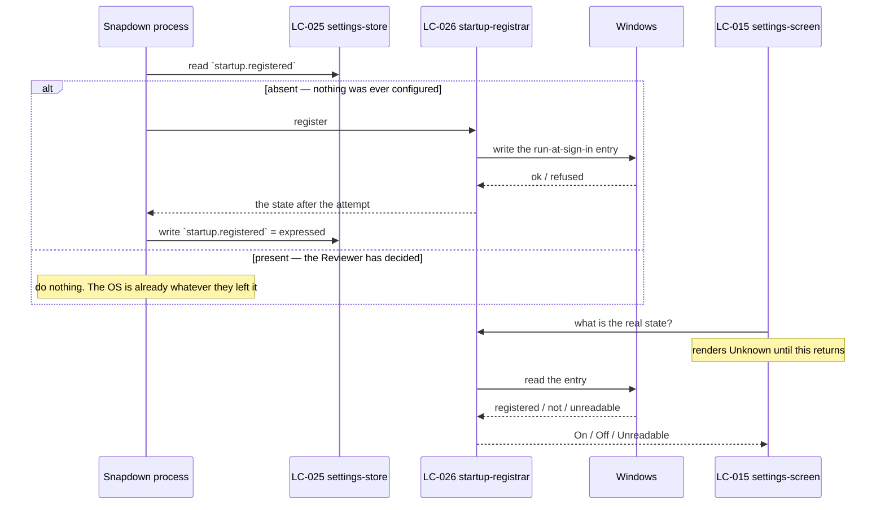

# SDD — settings

> Generated by `.constitution/method/scripts/validate.py --generate`. MUST NOT be hand-edited.


This is what the owner reads at **G4 Component** for this component.


## What is staked

`mode: outline` · `risk_accepted: high` · `g4_passed: True`

**risk_note:** No money and no personal data. One IRREVERSIBLE action - choosing a different Vault folder moves every stored file on disk (FR-16 with BR-29, "either moves every existing file or moves none"), and a move that completes is not undone by choosing the old folder back when that folder sat on a drive since removed. The everyday worst outcome is milder and is what the component is usually judged on - a hotkey that does not register, which is visible immediately.

**owns:** `Setting` · **containers:** `desktop-app`


## Decision Summary

`settings` is the component that owns everything the Reviewer sets once and everything that frames
what they see. Four persisted choices, and — since `CAP-9` — the Editor's window frame.

**Built as** four Logical Components inside `desktop-app`, plus the shell:

- a **store** over the `setting` table, the only writer of a Setting anywhere (`BR-110`)
- two **gateways** to Windows: the autostart registrar and the hotkey registrar
- a **screen**, and now a **shell** that draws the window's two personas

The two most expensive choices, and what reversing each costs:

**Setting is one generic entity, not an entity per choice.** Adding a Setting is a row, not a schema
change. Reversing it means a migration per choice and a domain model that grows with the preference
list — the cost is paid forever, which is why this is not a close call.

**The hotkey registrar lives here, not in `finding`.** `finding` owns the capture the hotkey triggers;
this component owns the binding. The registrar raises a capture-requested event that `finding`
listens for. Reversing it would put a Setting's writer inside a component that `BR-110` says may only
read — so the reversal is not a refactor, it is a rule change.

**The delta this pass adds**, and it is not small: `LC-028 editor-shell`. `FR-27` and `FR-28` are
promises about the *frame*, and at the time this SDD was raised to `deep` the frame was inline JSX at
the top of the (pre-`DEC-007`) webview's `App.tsx` — owned by no component, tested by nothing, named
in no inventory. That is how both promises came to be unmet without any document being wrong.
`LC-028` now has an owner and, since `DEC-007`, a file: the `AppWindow` component in
`apps/desktop/ui/appwindow.slint`.


## Structure — Logical Components

Rendered from `components.yaml`.

| id | Name | Type | Container |
| --- | --- | --- | --- |
| `LC-009` | hotkey-registrar | `gateway` | `desktop-app` |
| `LC-015` | settings-screen | `ui-screen` | `desktop-app` |
| `LC-025` | settings-store | `store` | `desktop-app` |
| `LC-026` | startup-registrar | `gateway` | `desktop-app` |
| `LC-028` | editor-shell | `ui-screen` | `desktop-app` |
| `LC-032` | desktop-build | `service` | `desktop-app` |


### Dependency direction and responsibilities

| LC | Type | Area | Depends on |
|---|---|---|---|
| `LC-025` `settings-store` | store | settings-store | — |
| `LC-009` `hotkey-registrar` | gateway | settings-store | `LC-025` |
| `LC-026` `startup-registrar` | gateway | settings-store | — |
| `LC-015` `settings-screen` | ui-screen | settings-store | `LC-025`, `LC-026`, `LC-009` |
| `LC-028` `editor-shell` | ui-screen | editor-ui | — |

Dependency direction is one-way into the store, and the shell depends on nothing. `LC-028` holding no
dependency is deliberate: a frame that reads state is a frame that can fail to draw, and `FR-28`
requires navigation to survive any surface's failure.

`LC-025` is the only writer. The other three read it or the operating system.


## Inherited Constraints — the spine's invariants

Rendered from `ARCHITECTURE-SPINE.md`. A row marked **yes** binds this component by `Binds:`; the rest are shown so a miss in `Binds:` is visible, not hidden.

| id | Invariant | Binds this component | Prevents | Rule |
| --- | --- | --- | --- | --- |
| `AD-1` | Markers and Note lines are one sequence, not two | **yes** | a Marker deleted from an image while its numbered line stays in the Note, so line 3 | A Finding's Markers and its Note's numbered lines MUST be stored as one ordered |
| `AD-2` | A record and its files live or die together | **yes** | a Vault holding image files nothing points at, and a Bundle whose Markdown references | Any operation that creates or removes a Finding, a Bundle, or a BundleItem MUST create or |
| `AD-3` | Marker coordinates are normalised to the image, never in pixels | no | every Marker on every Finding sliding off its target the first time the Quality | A Marker's position MUST be stored as a fraction of the image's width and height, in the |
| `AD-4` | An image is reduced exactly once, at capture, and no original is kept | no | two failures at once — lossy re-encoding compounding as an image passes from Vault to | The capture adapter MUST apply the Quality Budget before the image reaches the Vault, and |
| `AD-5` | Every surface outside the desktop process is read-only | no | anyone holding a Publication URL changing or deleting a review — on a machine where | `web-api` MUST expose no operation that creates, changes, or deletes anything in the |
| `AD-6` | Nothing leaves the machine except a confirmed publish of a named Bundle | **yes** | a Capture containing personal data reaching the network because a background task, | No component may open an outbound network connection carrying Finding, Note, Marker, or |
| `AD-7` | One error envelope across every process boundary | no | a remote agent or a browser receiving an empty result from `web-api` when the real | Every failure crossing a process boundary MUST be returned in the envelope defined in |
| `AD-8` | A Publication slug is unrelated to every Library id | no | one leaked Publication URL becoming a way to guess the next one, and a published | A Publication's slug MUST be generated independently of the Bundle's id and of every |
| `AD-9` | One Bundle, one authored document, on every path | no | the clipboard and web paths drifting into two renderings of one Bundle, so that two | A Bundle's Markdown MUST be composed once, by the core, and stored. Every handoff path |
| `AD-10` | Colour has exactly one authority, and every colour exists in both themes | **yes** | the failure this product already shipped. `finding` and `bundle` paint panels from | Every colour MUST be defined once, in the token stylesheet, and MUST be defined for both |
| `AD-11` | One process owns the Library, and the Editor is a persona of it | **yes** | two writers to one SQLite file and one Vault directory. `finding-store`, | Exactly one desktop process MUST own the Library. The tray, the global hotkeys, the |


## Failure Behaviour

The boundary list is this component's rows in the two platform inventories: `inventory-screen.md`
rows 0 and 12, and the two Windows gateways. `settings` owns no endpoint in `inventory-api.md`.

| Boundary | Other side is slow | Other side is absent | Other side is lying |
|---|---|---|---|
| **`LC-025` → `library.db`** | The screen shows every group inert and no assumed values. No timeout: a local SQLite read that is slow is a disk problem, and failing fast would hide it | Reported with the file's path, and **nothing is created over it** (`BR-118`). A store recreated beside a corrupt one is silent data loss | A store that opens and returns a schema version the code does not know is refused, named, and not migrated |
| **`LC-026` → Windows autostart** | The toggle stays in `Unknown` and stays inert. No spinner replaces it, because `Unknown` **is** the render | The toggle shows `Unreadable` with a Retry. It does not fall back to the stored value — the stored value is not the answer to this question | Registration reported as succeeding while the entry is absent surfaces at the next sign-in, not now. The product cannot detect it and does not claim to |
| **`LC-009` → Windows hotkeys** | Binding is attempted with no timeout; `RegisterHotKey` is synchronous | Refused at binding, naming the combination. The previous binding stays registered | A combination that registers and never fires is `Unregistered`'s mirror image and is **not detected**. `[MISSING]` — no health check exists, and a periodic one was rejected as a background task the product does not otherwise have |
| **`LC-015` screen → `LC-025`** | Groups render their frames; controls stay inert; layout does not shift when values land | The failing group alone shows its error and a Retry. The other four keep working — a partial failure is scoped to where it happened | Out of scope: same process, same memory |
| **`LC-028` shell → anything** | Nothing. The shell depends on nothing and always draws | Same | Same |

"Returns an error" appears nowhere above, and one row admits the product cannot detect a failure at
all. That admission is the useful part of this table.


## Evidence

| Label | Claim | Disposition |
|---|---|---|
| ~~`[MISSING]`~~ **resolved** | No lint rule or contrast assertion enforced `AD-10`; eight literals in `HotkeySection.tsx` alone | **Done — `W6-S1` at `420ecce`, in the pre-`DEC-007` webview.** The Slint rebuild carries its own lint rule and contrast assertion over `apps/desktop/ui/theme.slint`, per `design-system-guide.md` |
| ~~`[MISSING]`~~ **resolved** | No build assertion prevents a second desktop executable (`BR-121`) | **Done.** `apps/desktop/tests/test_executable_identity.rs` asserts exactly one binary named `Snapdown` |
| `[MISSING]` | `Auto` does not exist; the budget is two constants | Planned work — `FR-5`, `DEC-004` |
| `[MISSING]` | The startup control has no `Unknown` state | Still true in the Slint rebuild: `apps/desktop/ui/components/settings.slint` declares `run-at-startup` as a plain `bool`, the same shape `App.tsx`'s `useState<boolean>(true)` had. Planned work — `FR-18`, `BR-108` |
| `[MISSING]` | No registration health check; a hotkey that registers and never fires is undetected | **Not planned.** Rejected: it needs a background task this product does not otherwise have |
| `[MISSING]` | The Vault move swallows both `fs::remove_file` results (`vault_migration.rs:141`, `:180`). A source file that will not delete leaves an **unreported duplicate** of an image that may hold personal data, and the move still reports success | Planned work — the highest-value item in this table |

No `[MISSING]` above was deleted. Each sentence is the only surviving evidence that somebody once
believed the thing existed.


## UX — screens — `01-ux/`


### `DESIGN.md`

### DESIGN — Settings

Tokens, elements, and both themes are in [`.how/_platform/design-system.md`](../../_platform/design-system.md) and demonstrated live in [`.how/_platform/assets/design-system.html`](../../_platform/assets/design-system.html).

##### Living Design Assets (.how Layer)
- **General & Quality Budget Tab**: [`.how/settings/01-ux/assets/06a-settings-general.html`](assets/06a-settings-general.html)
- **Shortcuts & Hotkey Recorder Tab**: [`.how/settings/01-ux/assets/06b-settings-hotkeys.html`](assets/06b-settings-hotkeys.html)
- **Local Agent Bridge MCP Tab**: [`.how/settings/01-ux/assets/06c-settings-agent-bridge.html`](assets/06c-settings-agent-bridge.html)
- **About & System Info Tab**: [`.how/settings/01-ux/assets/06d-settings-about.html`](assets/06d-settings-about.html)

#### Tokens

Component-specific only. Everything else is inherited.

| Token | For |
|---|---|
| `--settings-group-gap` | `var(--space-4)` — between groups in a column |
| `--settings-column-min` | `380px` — below this the two columns become one |
| `--settings-row-height` | `32px` — one control row, so a group's height is countable in advance |

Anything reusable was promoted rather than defined here: `--color-surface-sunken`, the four meaning
pairs, `--space-0`, and `--radius-full` are all in the design system, because the hotkey chip and the
badges that need them appear on more than this surface.

#### Screens

| Screen | LC | Purpose |
|---|---|---|
| Editor shell | `LC-028` `editor-shell` | The window persona, the primary navigation, and the surface frame. Serves `FR-27`, `FR-28` |
| Settings | `LC-015` `settings-screen` | The four groups. Serves `FR-5`, `FR-16`, `FR-17`, `FR-18`, `FR-29` |

`LC-028` is new and is registered as part of landing this document. It exists because `FR-27` and
`FR-28` are promises about the *frame*, and a promise with no build unit behind it is a promise nobody
checks. In the shipped build the frame is inline JSX at the top of `App.tsx`, owned by nothing.

#### Layout and states

##### Editor shell (`LC-028`)

A **left navigation rail**, full window height, `200px` wide, `--color-surface` on `--color-bg`.

The shipped build uses a top tab row. The rail replaces it for one reason that is not taste: vertical
space is the scarce resource on this window, and `FR-29` requires Settings to fit at 1024×720 without
scrolling. A top tab row costs ~64px of height on every surface. A rail costs width, which Findings and
Bundles were already spending on a list column anyway.

```
┌──────────────────────────────────────────────────────────┐
│ ⬛ Snapdown            [Snapdown Editor — window title]   │
├──────────┬───────────────────────────────────────────────┤
│ Findings │                                               │
│ Bundles  │              surface content                  │
│ Settings │                                               │
│ Agent    │                                               │
│  access  │                                               │
│          │                                               │
│──────────│                                               │
│ ⏺ Capture│  ← the capture action, always reachable        │
└──────────┴───────────────────────────────────────────────┘
```

- The product mark and wordmark sit at the rail's top. The **window title bar** reads `Snapdown Editor`
  (`FR-27`) and does not change as the Reviewer moves between surfaces.
- The active item carries a filled `--color-accent` background **and** a left edge bar. Two signals,
  because `NFR-16`'s accessibility floor forbids state carried by colour alone.
- The **Capture** action pins to the rail's foot, separated by a rule. It is the only action in the
  chrome, and it belongs there because it is the one thing the Reviewer does from anywhere.

| State | Rendering |
|---|---|
| Loading | Rail fully rendered; content area shows the surface's own loading state. The rail never flickers |
| Populated | Normal |
| Error | The rail still works. A surface that failed shows its error inside the content area, never by blanking the frame |
| Empty | Not applicable — the rail always has four items |

##### Settings (`LC-015`)

**Two columns, packed by content height, never stretched.**

```
┌─ column A (flex) ─────────────┐ ┌─ column B (flex) ─────────────┐
│ Startup                       │ │ Quality Budget                │
│  [◉] Run at Windows startup   │ │  [Auto|Sharp|Balanced|Small]  │
│      Starts in the tray when  │ │  Auto sizes each capture to   │
│      you sign in.             │ │  what it is. Most captures    │
├───────────────────────────────┤ │  land near 120 KB.            │
│ Vault folder                  │ │                               │
│  C:\Users\<user>\SnapdownVault│ │  Latest: 184 KB · 1408 px     │
│  [Browse…] [Apply] [Explorer] │ │  ▸ Advanced                   │
└───────────────────────────────┘ ├───────────────────────────────┤
                                  │ Hotkeys                       │
                                  │  Capture Region   [Ctrl+⇧+S] ●│
                                  │  Open Editor      [Ctrl+⇧+E] ●│
                                  └───────────────────────────────┘
```

The rule the shipped build broke: **a group takes the height its content needs.** The shipped screen
pairs a one-checkbox group with a four-control group in equal-height grid columns and leaves roughly a
third of the window empty. Here the columns are independent stacks; a short group is short.

Group order is by how often it is touched — startup and the Vault folder are first-run concerns and
sit where the eye lands, hotkeys and Quality Budget are the ones changed later.

**Agent access is not on this surface.** An earlier draft of this document drew it as a fifth group
here while `EXPERIENCE-settings.md` and `inventory-screen.md` row 13 both had it as a primary surface
of its own. One thing cannot live in two places; the rail wins, because `FR-28` lists four primary
surfaces and the inventory has always had row 13.

Below `--settings-column-min` the two columns become one and the surface may scroll. That is allowed:
`FR-29` binds at the **minimum supported** window size, and 1024×720 holds both columns.

###### Quality Budget group

The `FR-5` / `DEC-004` control. A four-option `SegmentedControl`, then one line of prose for the
selected option, then the readout, then the disclosure.

| Option | The line under it |
|---|---|
| **Auto** (default) | "Sizes each capture to what it is. Most captures land near 120 KB." |
| **Sharp** | "Keeps small text crisp. Files are larger." |
| **Balanced** | "A middle setting that does not change with the capture." |
| **Small** | "The smallest file that is still readable." |

The readout is `Latest: 184 KB · 1408 px · Auto` — size, dimension, and **which budget produced it**.
`FR-5` requires attribution, not just size, because under Auto the number moves for a reason the
Reviewer did not cause.

`▸ Advanced` collapses two `TextInput`s, max long edge and encoder quality. Editing either moves the
segmented control to a fifth segment, **Custom**, which appears only once it is occupied and stays
visible after. The Reviewer never leaves Auto without seeing that they left it.

| State | Rendering |
|---|---|
| Loading | Segments visible and inert; readout reads "—". No segment is pre-selected |
| Populated | Normal |
| Empty | No capture taken yet: readout reads "No captures yet". The control still works |
| Error | Budget could not be read: the group shows its own message and a Retry. The other three groups are unaffected |

###### Hotkeys group

One row per action: label, `HotkeyChip`, `Badge`, and a clear affordance.

| Chip state | Rendering |
|---|---|
| bound | `--color-surface-sunken`, `--font-mono`, `--radius-full`, the combination in text |
| listening | `--color-info-bg` / `--color-info-text`, a `2px` `--color-accent` ring, reading "Press keys… Esc to cancel" |
| unbound | Dashed `--color-border-strong`, reading "Click to set" |
| conflicted | `--color-warning-bg` / `--color-warning-text`, with the conflict named on the line beneath |

The badge reads **Active** or **Disabled** in words. It previously used literal `#dcfce7` on `#166534`,
which is a light-theme pair rendered inside a dark shell; it now uses the `--color-success-*` and
`--color-neutral-*` pairs, each proven against its own background once.

###### Startup group

A `Toggle` with three states. The indeterminate state renders as a dimmed track with no thumb position
and is not interactive; it is what the control shows before the real Windows registration has been
read (`FR-18`). It MUST NOT render on or off first.

#### Do's and don'ts for this surface

**Do** let a group end where its content ends.
**Do** put a failure under the control that failed.
**Do** show which budget produced the latest capture, not just its size.

**Don't** stretch a group to match a neighbour.
**Don't** show a raw pixel or quality number outside Advanced.
**Don't** render the startup toggle in a definite state before Windows has answered.
**Don't** move Agent access into this surface. It is a primary surface of its own, and `FR-28`
requires it to stay listed in the rail while `DEC-005` freezes it.


## Contracts — `02-contracts/`


### `contract-inventory.md`

### Contract inventory — settings

The command surface this component exposes to its own UI. It is **not** in
`.how/_platform/inventory-api.md`, and that is correct: that inventory holds the Local API's HTTP
endpoints, which cross a process boundary. These are in-process calls, which `AD-5` and `AD-7` do not
reach.

Numbers are stable. A new command takes the next `CS-` and a removed one keeps its number.

Derived by reading `apps/desktop/src-tauri/src/commands/{settings,hotkey,startup}.rs` on 2026-08-23 —
the pre-`DEC-007` Tauri webview, archived at `archive/desktop-tauri`.

**Not re-derived since `DEC-007`.** The desktop app moved to native Slint; the command names below
may still name the right operations, but their exact shape has not been checked against
`apps/desktop/src`'s current Rust functions. Treat this table as the last-known contract, not a
current one, until it is re-derived.

| id | Command | Reads / writes | Realizes | State |
|---|---|---|---|---|
| CS-1 | `get_settings` | reads | UC-13, UC-14 | built |
| CS-2 | `set_vault_path` | writes | UC-14 | built |
| CS-3 | `set_quality_budget` | writes | UC-13 | built, **changing** |
| CS-4 | `get_latest_finding_size` | reads | UC-13 | built |
| CS-5 | `pick_vault_folder` | reads (native picker) | UC-14 | built |
| CS-6 | `open_vault_folder` | reads (shell) | UC-14 | built |
| CS-7 | `get_hotkeys` | reads | UC-15 | built |
| CS-8 | `set_hotkey` | writes | UC-15 | built |
| CS-9 | `clear_hotkey` | writes | UC-15 | built |
| CS-10 | `get_startup_status` | reads OS | UC-16 | built |
| CS-11 | `set_startup_status` | writes OS | UC-16 | built |
| CS-12 | `get_quality_budget_presets` | reads | UC-13 | **planned** — `DEC-004` |

#### The five lanes, per contract

Every contract answers all five. `none` with a reason is an answer.

##### CS-3 `set_quality_budget` — the one that changes

| Lane | Answer |
|---|---|
| **Shape** | Today: `(max_long_edge: u32, encoder_quality: u8) -> QualityBudget`. Under `DEC-004`: `(budget: NamedBudget, advanced: Option<ResolvedPair>) -> QualityBudgetState`, where passing `advanced` moves the state to `Custom` |
| **Refusal** | A value outside its range is refused at entry, naming the range (`FR-5`). The state does **not** move to `Custom` on a refused value (`BR-117`) |
| **Idempotence** | Yes. Setting the budget already in effect is a no-op that still returns the current state |
| **Ordering** | The named state and the resolved pair are one write (`BR-116`). They are never observable disagreeing |
| **Failure** | A store write that fails leaves the previous budget in effect and reports it in the group, not as a toast |

The shape change is why this row reads **changing** rather than **built**: the command exists, and it
is the wrong shape for the promise `FR-5` now makes.

##### CS-10 / CS-11 — the OS pair

| Lane | Answer |
|---|---|
| **Shape** | `get_startup_status() -> StartupStatusDto { enabled: bool }` |
| **Refusal** | `set_startup_status` returns the registration state **after** the attempt, not the state requested. A refused enable returns `enabled: false` |
| **Idempotence** | Yes on both, because both end by re-reading the OS |
| **Ordering** | None. There is no ordering between them worth stating: each is one synchronous call |
| **Failure** | `[MISSING]` — the DTO has no way to say *unreadable*. `bool` cannot carry the `Unknown` state that `BR-108` and `state-machines.md` § 1 require, so the caller must invent one. The pre-`DEC-007` webview invented `true`; the Slint rebuild's `run-at-startup` property (`apps/desktop/ui/components/settings.slint`) is still a plain `bool`, so the same gap holds today |

That last row is the whole defect, and it is visible in the contract before it is visible in the UI: a
`bool` where the domain has three states forces every caller to guess the third.

##### CS-2 `set_vault_path`

| Lane | Answer |
|---|---|
| **Shape** | `(new_path: String, migrate: bool) -> String`, returning the path in effect afterwards |
| **Refusal** | A folder that cannot be written to is refused before anything moves (`BR-115`), by writing to it rather than by inspecting it |
| **Idempotence** | Yes. The path already in effect is a no-op and attempts no move |
| **Ordering** | Copy every file, verify every copy, remove the sources, then write the Setting. The Setting is last (`AD-2`) |
| **Failure** | Nothing moved, sources intact, Setting unchanged (`SCN-01`). Two swallowed `fs::remove_file` results are the known gap |

##### CS-1, CS-4, CS-5, CS-6, CS-7, CS-12 — reads

| Lane | Answer |
|---|---|
| **Shape** | Each returns its DTO; none takes a mutating argument |
| **Refusal** | `none` — a read refuses only when the store cannot be opened, which is `LC-025`'s boundary, not each command's |
| **Idempotence** | Trivially, being reads. `CS-5` and `CS-6` are the exceptions worth naming: both open something in the shell and are idempotent in effect but not in *observable* result, because a second call opens a second window |
| **Ordering** | `none` |
| **Failure** | The failing group shows its own error and a Retry. The other four keep working |

##### CS-8 / CS-9 — the hotkey pair

| Lane | Answer |
|---|---|
| **Shape** | `set_hotkey(action, shortcut)`, `clear_hotkey(action)` |
| **Refusal** | Against Snapdown's own actions first (`BR-27`), then against Windows. The two refusals are worded differently on purpose — one the Reviewer can resolve, one they may not be able to |
| **Idempotence** | Yes. Re-binding the combination already bound re-registers it, which is harmless and is the recovery path from `Unregistered` |
| **Ordering** | Register the new binding, then unregister the old. Never the reverse — unregistering first leaves a window with no hotkey at all if the new one fails |
| **Failure** | The previous binding stays registered and the chip never shows a combination that is not in effect |


## Integrations — `03-integrations/`


### `windows-shell.md`

### Integration — the Windows shell

The only third party this component has. It is written down because the owner is outside the team and
can change it without telling anyone, which is the whole reason this slot exists.

| | |
|---|---|
| **Owner** | Microsoft. Not contactable, not negotiable, not versioned on our schedule |
| **Reached through** | Win32 APIs directly — the `windows` crate, `global-hotkey`, and `tray-icon` — since `DEC-007`. Reached through Tauri v2 plugins before that |
| **What we depend on** | Global hotkey registration · run-at-sign-in registration · the native folder picker · opening a folder in Explorer · the tray icon |

#### Three surfaces, and what breaks when Microsoft moves

A fourth — theme — is kept below for its history, but it is no longer one of them; see that
section.

##### Global hotkey registration

`RegisterHotKey` is synchronous and either succeeds or does not. What Microsoft controls is **who else
got there first**, and that changes with every program the Reviewer installs.

The product's posture: refuse at binding when the combination is taken, bind anyway when it is not,
and report at each startup if registration then fails (`BR-26`). Never silently swallow.

**What we cannot detect:** a combination that registers successfully and never fires, because
something intercepts it lower in the stack. Windows reports success and the Reviewer sees a dead key.
`[MISSING]` — no health check exists. A periodic one was rejected: it would be the only background
task in the product, and `NFR-6`'s 150 MB idle budget is written for a product that has none.

**`NFR-7` is load-bearing here:** every registration must succeed without administrator rights. If a
Windows update ever changed that, the capture loop would need elevation, which the brief's premise
does not survive. `OQ-5` records this as an assumption and it has held so far.

##### Run-at-sign-in registration

Reached through `WindowsRegistryAutoStartBackend` (`apps/desktop/src/startup.rs`), which writes a
registry entry under the current user directly via the `windows` crate. Reached through the Tauri
autostart plugin before `DEC-007`; the registry mechanism itself did not change.

The truth lives in Windows and is read back rather than remembered (`BR-114`). That is why anything —
a cleanup tool, a group policy, a profile reset — may remove it, and the product treats that as the
Reviewer's answer rather than as an error to correct (`SCN-02`, run 4).

**What Microsoft can break:** the registry location, the manifest-based mechanism replacing it, or a
policy that forbids the write. In each case registration fails loudly and the toggle shows `Off`. The
product degrades to *the Reviewer launches Snapdown themselves*, which is worse and is not broken.

##### The folder picker and Explorer

Both are shell invocations with no return contract beyond "a path" and "it opened". The path is never
typed (`UC-14` step 2), so a Reviewer cannot express a path the shell would not have produced.

**What we do not trust:** the picker's claim that a folder is writable. `BR-115` validates by writing,
because a network drive, a synced folder, or a policy-locked path can all report themselves writable
and refuse the write.

##### Theme

**This surface changed shape at `DEC-007`, not just implementation.** The paragraph below (`W6-S1`,
`420ecce`) describes the pre-`DEC-007` webview, where the theme followed Windows automatically:

> The Windows theme reached the webview as a CSS media query. Microsoft owned when it changed and
> whether a change was signalled to a running process. `NFR-17` required a theme change to be
> honoured without a restart, which meant the product had to not read the theme once at boot. Every
> colour was a CSS custom property inside a `prefers-color-scheme` block, and no JavaScript read a
> token value, so the repaint was the browser's.

**The Slint rebuild does not read Windows' theme setting at all.** `is-dark` (`apps/desktop/ui/theme.slint`)
is driven from a persisted `Setting` (`theme_setting_key()`), flipped by the Reviewer's own
sun/moon toggle (`on_theme_toggle_clicked` in `apps/desktop/src/main.rs`), not by Microsoft. Nothing
here still depends on Windows for theme — this whole component's Windows dependency, so this
integration file no longer has anything to say about it. Whether `NFR-17`'s wording ("honoured
without a restart") still describes the right promise once the Reviewer chooses instead of the OS is
a question for `wdi-question` or `wdi-decision`, not something this cleanup pass decides.

#### What is deliberately not here

**The tray icon**, beyond noting it exists. It is `desktop-app`'s shell affordance, holds no state,
and `inventory-screen.md` says explicitly that it is not a screen.

**The Windows credential store.** It is a Windows integration and it belongs to `sharing`, which owns
the secret in it. `BR-119` keeps it out of this component entirely. (`agent-access` owned a second
secret there too, until `DEC-016` withdrew it on 2026-09-04.)


## Components — `04-components/`


### `LC-028-editor-shell.md`

### LC-028 — editor-shell

The window frame of the **Snapdown Editor** persona. New at this gate; the thing it replaces is inline
JSX at the top of `apps/desktop/src/App.tsx`, owned by no component.

#### Responsibility

Three things, and nothing else:

1. Declare which persona is on screen — the window title reads `Snapdown Editor` and does not change
   as the Reviewer moves between surfaces (`FR-27`, `BR-121`).
2. Present navigation to every primary surface, on every primary surface (`FR-28`, `BR-120`).
3. Give the Capture action a home that is reachable from anywhere.

#### What it must not do

- **Read state.** It depends on nothing (`SDD-settings.md` § Structure). A frame that reads state is a
  frame that can fail to draw, and `FR-28` requires navigation to survive any surface's failure.
- **Own routing logic beyond which surface is active.** A surface's own loading and error states are
  the surface's.
- **Hide a surface whose component is frozen.** `BR-120` is explicit: `DEC-005` freezes `sharing`, and
  its surface stays listed. (`agent-access` was frozen and listed the same way until `DEC-016`
  withdrew the component and its surface on 2026-09-04 — there is nothing left to hide or list.)

#### Boundaries

| Direction | With | Contract |
|---|---|---|
| out | The active surface | Which surface is active. One value |
| out | `finding` | Capture requested |
| in | Nothing | It has no inbound dependency, deliberately |

#### The delta from what runs today

| Today (`App.tsx`) | Required |
|---|---|
| A top tab row, ~64 px of every surface's height | A left rail, `200px`, so `FR-29` has the vertical room it needs |
| Active tab distinguished by fill colour alone | Fill **and** a left edge bar — `NFR-16` forbids state carried by colour alone |
| The Capture action has nowhere to live | Pinned to the rail's foot, separated by a rule |
| Window title `Snapdown`, matching the tray | `Snapdown Editor`, distinct from the tray, per `DEC-003` |
| Inline in `App.tsx`, owned by nothing, no test | Its own module with its own tests |

`[MISSING]` for every row above. All are planned work, not bugs: the requirements (`FR-27`–`FR-29`)
were written on 2026-08-23, after the code.


## Data model — `05-model/`


### `data-model.md`

### Data model — settings

As-built, read from `crates/snapdown-store/src/sqlite/migrations.rs` (migration v1) on 2026-08-23.



Two tables, no relations, and that is the whole storage shape of this component.

#### Dictionary — `setting`

| Column | Type | Null | Meaning |
|---|---|---|---|
| `key` | `TEXT` `PRIMARY KEY` | no | The name the rest of the product asks for. One row per choice |
| `value` | `TEXT` `NOT NULL` | no | The chosen value, serialised. Absence of a row means *unset*, which reads as the shipped default (`BR-111`) |
| `updated_at` | `TEXT` `NOT NULL` | no | RFC 3339 UTC with an explicit `Z`, per `cross-cutting.md` § Timestamps |

**Everything is `TEXT`, including numbers and booleans.** That follows the generic-`Setting` decision
in the domain model: a typed column per choice would mean a migration per choice, which is the cost
that decision exists to avoid. The type lives in the code that reads the key, and the store does not
know or care.

#### Keys in use

| Key | Value shape | Owner of the meaning |
|---|---|---|
| `vault_path` | absolute path | `UC-14` |
| `quality_budget.max_long_edge` | integer as text | `UC-13` |
| `quality_budget.encoder_quality` | integer as text | `UC-13` |
| `quality_budget.named` | one of `Auto` `Sharp` `Balanced` `Small` `Custom` | **planned** — `DEC-004` |
| `hotkey.capture` | accelerator string, or empty for disabled (`BR-113`) | `UC-15` |
| `hotkey.open_editor` | accelerator string, or empty | `UC-15` |
| `startup.registered` | **planned** — see below | `UC-16` |
| `open_editor_after_capture` | `true` / `false` | `UC-16` |
| `web_service.address` | URL | `sharing`, read-only |

#### Two things the shape cannot currently say

**`quality_budget.named` does not exist.** The budget is two integer keys, which is the pre-`DEC-004`
shape. `BR-116` requires the named state and the resolved pair to be one write that can never be
observed disagreeing — three keys written separately cannot promise that. `[MISSING]` — the write
needs to become a single transaction over all three, and the migration adding the key is where that
is enforced.

**`startup.registered` does not exist, and its absence is the defect.** The current design reads the
Windows registration and stores nothing. That is right for the *value* — the OS is the truth
(`FR-18`, `BR-114`) — and it makes `BR-112` unimplementable, because *nothing was ever configured* and
*the Reviewer turned it off* are indistinguishable when neither is recorded.

The key needed is not a copy of the OS state. It is a record of whether the Reviewer has ever
**expressed** a preference: absent, or `expressed`. `BR-112` is the only reader, and it reads it once
at first run. `[MISSING]` — dispositioned as planned work; without it, a naive *if not registered,
register* passes a fresh install and silently overrides every Reviewer who turned it off (`SCN-02`
run 3).

#### `schema_version`

Owned by this component because this component opens the store. It is the migration level, not a
shared concern, which is why `cross-cutting.md` § Platform-owned explicitly declines to claim it.

Five migrations exist: v1 `setting` and `schema_version`, v2 `finding`/`note`/`marker`, v3
`bundle`/`bundle_item`, v4 `access_key`, v5 `publication`. Only v1 is this component's.

#### Indexes

None on `setting`. `key` is the primary key and the table holds fewer than twenty rows for the life of
an installation. An index here would be ceremony.


## Flows — `06-flows/`


### `flow-startup-reconciliation.md`

### Flow — startup reconciliation

The mechanism behind `BR-112` and `SCN-02`. It runs once per process start, before the Editor window
is ever shown.



#### The two reads, and why they are different questions

The store read answers **"has the Reviewer ever expressed a preference?"** — one bit, written once,
and the only thing the operating system cannot tell us.

The registrar read answers **"is it registered right now?"** — and that answer is always taken from
Windows, never from the store (`BR-114`).

Conflating them is the entire defect. *If not registered, register* uses the OS to answer a question
about the Reviewer's intent, and it passes a fresh install, passes the moment the Reviewer disables
it, and then silently re-enables at the next sign-in (`SCN-02`, run 3).

#### Ordering that matters

The store write happens **after** the registration attempt, not before, and it records `expressed`
whether the attempt succeeded or was refused. A refused first-run registration is still an expression
of the default having been applied — retrying it forever would make a machine that forbids autostart
fight the product at every sign-in.

The screen never renders a definite state before the registrar has answered. `Unknown` is a rendered
value, not a spinner (`state-machines.md` § 1).

#### As-built

`[MISSING]` — none of the store side exists. `apps/desktop/src-tauri/src/commands/startup.rs` reads
the registrar and returns `StartupStatusDto { enabled: bool }`; there is no `startup.registered` key
and no first-run branch. `App.tsx` supplies the missing third state by guessing `useState(true)`.

`[PARTIAL]` — the registrar port and a `MockAutoStartBackend` do exist
(`apps/desktop/src-tauri/src/startup/mod.rs`), which is what makes `SCN-02`'s four runs testable
without touching a real registry once the store side is written.

