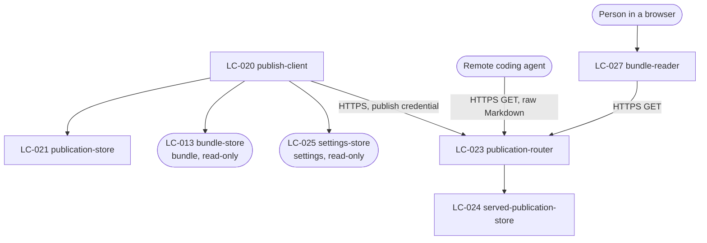

# SDD — sharing

> Generated by `.constitution/method/scripts/validate.py --generate`. MUST NOT be hand-edited.

This is what the owner reads at **G4 Component** for this component.

## What is staked

`mode: guarded` · `risk_accepted: high` · `g4_passed: True`

**risk_note:** Publishing puts images that may contain personal data on the public internet, and it is irreversible in the sense that matters — an unpublish cannot recall what was already fetched. No money moves and there is no contractual promise, but this is the component where a mistake cannot be undone.

**owns:** `Publication` · **containers:** `desktop-app`, `web-api`

## Decision Summary

This component spans three containers and two languages, which is the whole reason it is the riskiest
one. On the desktop, a publish client reads a Bundle and pushes it over HTTPS. On the host, a Go
service holds served Publications in an embedded SQLite file and a blob directory and serves them at an
unlisted slug. In the reader's browser, a React page renders one Publication for a person while an
agent takes the raw Markdown from the same URL.

Three choices cost the most to reverse.

**A publish is staged, then made reachable, in that order.** The client uploads the Markdown and every
image under a staging identity; only when all of it has landed does the service make the slug resolve.
The obvious alternative — write files under the live slug as they arrive — makes FR-23's "nothing
partial is left readable" impossible to promise, and the failure it produces is a Publication serving
Markdown whose images 404, which reads to an agent as a broken review rather than as a failed publish.

**The slug belongs to the Bundle, not to the act.** It is generated once, on first publish, stored on
the `publication` row, and reused for every republish (BR-21). A URL already handed out keeps working.
The cost is stated plainly: republishing silently changes what that URL serves, which is the one rule
in this component the SRS records as uncomfortable.

**Local Publication state is a claim, and the service is the authority.** `publication.last_error`
exists so that an unconfirmed unpublish leaves the Bundle marked published, and endpoint 14 exists so
that claim can be checked rather than believed. Everything in this component is arranged so that the
Reviewer is never told something is private when it may not be — which is why an unpublish failure is
*sticky* rather than retried into silence.

## Structure — Logical Components

Rendered from `components.yaml`.

| id | Name | Type | Container |
| --- | --- | --- | --- |
| `LC-020` | publish-client | `gateway` | `desktop-app` |
| `LC-021` | publication-store | `store` | `desktop-app` |
| `LC-023` | publication-router | `gateway` | `web-api` |
| `LC-024` | served-publication-store | `store` | `web-api` |
| `LC-027` | bundle-reader | `ui-screen` | `web-api` |

### Dependency direction and responsibilities

Six Logical Components across three containers. Registered in `.control/registry/components.yaml`.

| LC | type | Container | Responsibility |
| --- | --- | --- | --- |
| LC-020 `publish-client` | gateway | `desktop-app` | Publish, unpublish, and reconcile against the service. Owns the staging protocol and the publish credential's use |
| LC-021 `publication-store` | store | `desktop-app` | The `publication` row: slug, base URL, timestamps, and the sticky last error |
| ~~LC-022 `publish-dialog`~~ | ui-composite | `desktop-app` | **Withdrawn by `DEC-020`, 2026-09-04.** Never built — `BUG-23`'s rescoped note found publishing has no Slint caller at all — and `DEC-005` forbids building it while it holds |
| LC-023 `publication-router` | gateway | `web-api` | The six web routes: three public reads, three credential-gated writes. Owns content negotiation and the identical-refusal rule |
| LC-024 `served-publication-store` | store | `web-api` | `published_bundle` and `published_blob`, plus the blob directory. The whole state NFR-14 keeps in one directory |
| LC-027 `bundle-reader` | ui-screen | `web-api` | Renders one Publication for a person, server-side, as HTML. Serves the same Markdown an agent gets. Container corrected from `web-ui` 2026-09-01 by `DEC-015` |

`LC-022` fed `LC-020` in this diagram until `DEC-020` withdrew it, 2026-09-04 — nothing mints the
publish confirmation `LC-020` describes below, because nothing calls `LC-020` from a Slint surface at
all while `DEC-005` holds.

`LC-023` and `LC-024` are the Go half and depend on nothing in the Rust tree. The only thing crossing
the language seam is the publish request, and rows 12–14 of `inventory-api.md` are the entire
agreement. That is `DEC-001`'s stated cost, tracked as RISK-10.

Crossings out of this component on the desktop: read-only calls into `LC-013 bundle-store` and
`LC-025 settings-store`. One call *into* this component: `bundle` calls `LC-020` to unpublish when a
published Bundle is deleted (BR-23).

## Inherited Constraints — the spine's invariants

Rendered from `ARCHITECTURE-SPINE.md`. A row marked **yes** binds this component by `Binds:`; the rest are shown so a miss in `Binds:` is visible, not hidden.

| id | Invariant | Binds this component | Prevents | Rule |
| --- | --- | --- | --- | --- |
| `AD-1` | Markers and Note lines are one sequence, not two | **yes** | a Marker deleted from an image while its numbered line stays in the Note, so line 3 | A Finding's Markers and its Note's numbered lines MUST be stored as one ordered |
| `AD-2` | A record and its files live or die together | **yes** | a Vault holding image files nothing points at, and a Bundle whose Markdown references | Any operation that creates or removes a Finding, a Bundle, or a BundleItem MUST create or |
| `AD-3` | Marker coordinates are normalised to the image, never in pixels | **yes** | every Marker on every Finding sliding off its target the first time the Quality | A Marker's position MUST be stored as a fraction of the image's width and height, in the |
| `AD-4` | An image is reduced exactly once, at capture, and no original is kept | **yes** | two failures at once — lossy re-encoding compounding as an image passes from Vault to | The capture adapter MUST apply the Quality Budget before the image reaches the Vault, and |
| `AD-5` | Every surface outside the desktop process is read-only | **yes** | anyone holding a Publication URL changing or deleting a review — on a machine where | `web-api` MUST expose no operation that creates, changes, or deletes anything in the |
| `AD-6` | Nothing leaves the machine except a confirmed publish of a named Bundle | **yes** | a Capture containing personal data reaching the network because a background task, | No component may open an outbound network connection carrying Finding, Note, Marker, or |
| `AD-7` | One error envelope across every process boundary | **yes** | a remote agent or a browser receiving an empty result from `web-api` when the real | Every failure crossing a process boundary MUST be returned in the envelope defined in |
| `AD-8` | A Publication slug is unrelated to every Library id | **yes** | one leaked Publication URL becoming a way to guess the next one, and a published | A Publication's slug MUST be generated independently of the Bundle's id and of every |
| `AD-9` | One Bundle, one authored document, on every path | **yes** | the clipboard and web paths drifting into two renderings of one Bundle, so that two | A Bundle's Markdown MUST be composed once, by the core, and stored. Every handoff path |
| `AD-10` | Colour has exactly one authority, and every colour exists in both themes | **yes** | the failure this product already shipped. `finding` and `bundle` paint panels from | Every colour MUST be defined once, in the token stylesheet, and MUST be defined for both |
| `AD-11` | One process owns the Library, and the Editor is a persona of it | no | two writers to one SQLite file and one Vault directory. `finding-store`, | Exactly one desktop process MUST own the Library. The tray, the global hotkeys, the |

## Failure Behaviour

Every boundary this component has. Derived from `.how/_platform/inventory-api.md` rows 9–14 and
`inventory-screen.md` row 14 (corrected) — rows 11 and 15 withdrawn by `DEC-020`, 2026-09-04 — plus the
two store boundaries.

| Boundary | Slow | Absent | Lying | What the user sees | What is logged |
| --- | --- | --- | --- | --- | --- |
| `LC-020` → `LC-023`, publish (endpoint 12) | Progress is shown per file. No response in 60 s per request is treated as absent, and the staged upload is abandoned — the slug never resolves, so nothing partial is readable | The host is unreachable, DNS fails, or TLS fails. The publish fails, the Bundle stays unpublished locally, and nothing was staged that could resolve (BR-19) | Answers 200 for an upload it did not store. Detected by verifying the staged manifest before asking the service to make the slug live: the client sends every filename and byte count, and the service confirms what it holds. A mismatch abandons the publish | A dialog naming what failed and that nothing was published. The Bundle is exactly as it was | `event=publish_failed`, the slug, the stage reached, the reason. Never the Markdown, never image bytes |
| `LC-020` → `LC-023`, unpublish (endpoint 13) | No response in 30 s is treated as absent, and the outcome is the sticky one below | Unreachable. The Publication stays marked **published** with `last_error` set. This is the one place the product deliberately keeps the more alarming state (BR-20) | Answers 204 without removing anything. Guarded by immediately calling endpoint 14 and requiring `not_found`; anything else keeps the Publication marked published | The Bundle still shown as published, with the failure named and a retry offered. Never a false "it is private now" | `event=unpublish_failed`, the slug, the reason. This one is at error level |
| `LC-020` → `LC-023`, reconcile (endpoint 14) | Over 15 s the panel shows the state as unverified rather than guessing | Unreachable. The Bundle shows its last known state, explicitly labelled as last known rather than current | Reports a slug as absent while still serving it — a caching layer, a stale replica. Nothing local can detect it. Mitigated only by the service having no cache in front of it, which is a deployment constraint recorded in the devops repository | Publication state shown as unverified, with when it was last confirmed | `event=reconcile_failed`, the slug, the reason |
| `LC-020` → the publish credential | Over 2 s the publish is refused rather than blocking | The credential store has no publish credential, or none is configured. Publishing is refused before anything is read from the Bundle, naming what is missing (FR-23) | Returns a credential the service rejects. The service answers 401, mapped to `publish_failed` with the reason "the service rejected the credential", so the Reviewer is not told the network failed | A dialog saying what is missing or rejected, with an action that opens Settings | `event=publish_credential_missing` or `..._rejected`. Never the credential |
| `LC-020` → `LC-013 bundle-store` | Local SQLite; over 5 s means a failing disk, and the publish is refused | The Bundle is gone — deleted between the click and the read. The publish is abandoned | Returns a Bundle whose image files are missing from the Vault. Checked before staging: a missing image refuses the publish naming the file, rather than publishing a review with broken images | A dialog naming what is missing. Nothing was published | `event=publish_source_incomplete`, the Bundle id, the filenames |
| `LC-021 publication-store` | Not applicable | The `publication` row is missing while the service still serves the slug — an orphaned Publication. Found by the reconcile the Reviewer can run, and it is why endpoint 14 takes a slug rather than a Bundle id | Holds a slug the service has never heard of, from a publish that failed after the row was written. The row is written **after** the service confirms, so this is unreachable by design rather than by check | Nothing, unless a reconcile surfaces it | `event=publication_orphaned`, the slug |
| Remote agent → `LC-023` (endpoints 9, 10, 11) | The service is one binary reading local files; slow means the host is saturated. No timeout of its own — the agent's client owns that | The slug is unknown, was never issued, or was unpublished. All three answer identically: `not_found`, same status, same body (NFR-15, BR-24) | Not applicable in this direction — the agent is a reader with nothing to lie about. A crafted image filename is the hostile input, refused by resolving against the Publication's own directory | Nothing on the desktop. The agent gets `not_found` and stops | `event=publication_not_found`, the slug prefix only, at debug level. A full log of every attempted slug is itself an enumeration surface |
| `LC-027` → `LC-023` (screen 14) | The response is written synchronously in one handler; there is no loading state to get stuck in | `not_found`. `LC-023` answers with `writeIdentical404` — a JSON error envelope, not a page. There is no rendered not-found screen; row 15, which once claimed one, is withdrawn by `DEC-020` for exactly this reason | Not applicable | A browser gets a JSON body, not a message page. No hint about whether the slug ever existed, and no styling distinguishes this from any other JSON error | Nothing server-side beyond the row above; `web-api` logs nothing of its own |
| `LC-023` → `LC-024` | Embedded SQLite plus a directory. Slow means a failing disk; over 5 s answers `unavailable` | The directory or the SQLite file is missing — a mounted volume gone. Every route answers `unavailable`, including the write routes, so a publish fails rather than half-succeeding | Reports a blob written that is not on disk. The write path re-stats every file before confirming the manifest, which is the same check the client relies on | The publishing Reviewer sees `publish_failed`; a reader sees `unavailable`, which is honestly different from `not_found` | `event=store_unavailable`, the operation. `web-api` never logs the content it serves |

Two entries are the ones worth arguing about, and both are deliberate:

- **A failed unpublish keeps the Bundle marked published.** Every instinct says clear the flag and
  retry in the background. That is the failure mode the whole component is arranged against.
- **`not_found` is identical for unknown, never-issued, and unpublished.** It means the Reviewer cannot
  tell from the outside whether their unpublish worked — which is what endpoint 14 and the publish
  credential are for. The reader-facing surface stays uninformative on purpose.

## Design Notes

- **The staging identity is derived from the slug, not separate from it.** A staging prefix plus the
  slug keeps one namespace, so an abandoned stage is collectable by name without a second index.
- **An abandoned stage is collected on the service's own schedule**, not by the client. A client that
  crashed mid-publish cannot be relied on to clean up, and NFR-14's one directory is what makes the
  sweep trivial.
- **`publication.last_error` is sticky and is cleared only by a confirmed outcome** — a successful
  unpublish, or a successful republish. Clearing it on a retry that also failed is how "the Reviewer
  believes it is private" gets reintroduced.
- **`LC-023` serves raw Markdown by content negotiation and at an explicit path.** Endpoint 10 exists
  because negotiation is exactly the thing a minimal HTTP client gets wrong, and an agent that cannot
  read the review is the failure this component exists to prevent.
- **`web-api` has no route that takes a Library id, and no column that stores one.** That is stronger
  than a rule about URLs, and it is checkable by reading the schema.
- **`web-api` writes no request log pairing a slug with an address beyond what it needs to operate.**
  A slug is a bearer credential, so an access log is a credential store.
- **The reader page is rendered by `web-api` itself** (`DEC-015`), so a Publication needs no cross-origin
  configuration and `web-api` needs no CORS policy — one fewer thing to get wrong on a surface where
  getting it wrong exposes data.

---

