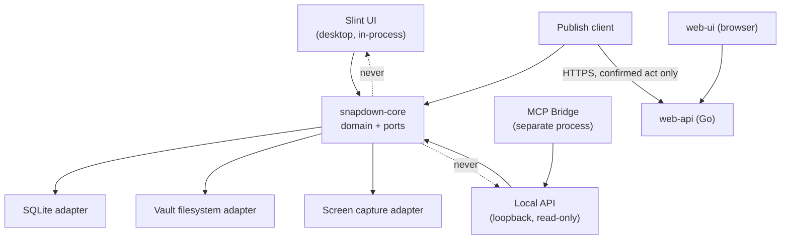
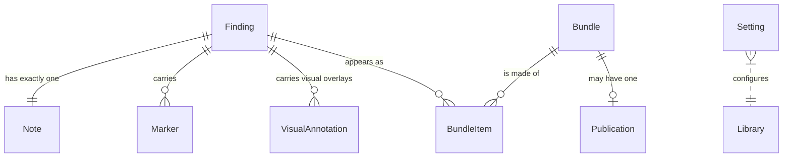

# Architecture Spine — Snapdown

## Design Paradigm

Hexagonal, with the domain in Rust and every surface an adapter around it.

The core knows about Findings, Notes, Markers, Bundles, and Publications. It knows nothing about
hotkeys, HTTP, MCP, Slint, or the filesystem layout. Everything that does is a port implementation on
the outside:

| Layer | Where it lives | What it may know |
| --- | --- | --- |
| Domain core | `crates/snapdown-core` | Entities, invariants, the composition rules. No I/O, no OS calls |
| Ports | `crates/snapdown-core/ports` | Traits the core calls out through: capture, blob store, metadata store, clock, publisher |
| Adapters | `crates/snapdown-*`, `apps/*` | Screen capture, SQLite, the Vault filesystem, the Local API, the MCP bridge, the publish client, the Slint desktop UI, the React web-ui |

The rule the paradigm buys: **a promise is implemented once, in the core, and every surface is a
translation of it.** Three handoff paths existing is a fact about adapters, not about the domain.

## Invariants & Rules

Eleven. Each one is here because breaking it in one component breaks another.



Dependency direction is one-way into the core. No adapter is imported by another adapter, and the
core imports none of them. `web-api` and `web-ui` are a separate program in a separate language and
depend on nothing in the Rust tree except the Markdown and image bytes a publish hands them.

### AD-1 — Markers and Note lines are one sequence, not two

- **Binds:** `finding`, `bundle`, `agent-access`, `sharing` — all four read or render the pairing.
- **Prevents:** a Marker deleted from an image while its numbered line stays in the Note, so line 3
  describes what badge 2 now points at. The Reviewer cannot see the mismatch and the agent cannot
  either, which makes it the one defect that destroys the product's only promise.
- **Rule:** A Finding's Markers and its Note's numbered lines MUST be stored as one ordered
  collection. Adding, moving, removing, or renumbering MUST be a single operation over that
  collection. No code path may write a Marker without writing its line, or a line without its
  Marker.

### AD-2 — A record and its files live or die together

- **Binds:** all.
- **Prevents:** a Vault holding image files nothing points at, and a Bundle whose Markdown references
  an image that is gone. Both states are unrecoverable by inspection, because nothing left on disk
  says which was intended.
- **Rule:** Any operation that creates or removes a Finding, a Bundle, or a BundleItem MUST create or
  remove that record's files in the same unit of work, and MUST leave the prior state intact if any
  part of it fails. A record MUST NOT be committed before its files exist, and files MUST NOT be
  removed before the record is.

### AD-3 — Marker coordinates are normalised to the image, never in pixels

- **Binds:** `finding`, `bundle`, `sharing`, and the `web-ui` container that renders them.
- **Prevents:** every Marker on every Finding sliding off its target the first time the Quality
  Budget changes, or when a Bundle image is rendered at a different size than it was authored at.
- **Rule:** A Marker's position MUST be stored as a fraction of the image's width and height, in the
  closed range 0 to 1. No stored coordinate may be in pixels, and no renderer may assume the image
  is at its capture resolution.

### AD-4 — An image is reduced exactly once, at capture, and no original is kept

- **Binds:** `finding`, `bundle`, `sharing`.
- **Prevents:** two failures at once — lossy re-encoding compounding as an image passes from Vault to
  Bundle to Publication until UI text is unreadable, and an unreduced capture leaving the machine
  because some later stage still had one.
- **Rule:** The capture adapter MUST apply the Quality Budget before the image reaches the Vault, and
  MUST NOT retain the unreduced pixels. No later stage — composition, publishing, or serving — may
  re-encode or re-scale a stored image. A Bundle's image is a copy of the Finding's image with
  Markers drawn on it, at the same dimensions.

### AD-5 — Every surface outside the desktop process is read-only

- **Binds:** `agent-access`, `sharing`, and the `mcp-bridge`, `web-api`, `web-ui` containers.
- **Prevents:** an agent holding an Access Key, or anyone holding a Publication URL, changing or
  deleting a review — on a machine where the Reviewer's judgement is the only thing of value.
- **Rule:** The Local API, the MCP Bridge, `web-api`, and `web-ui` MUST expose no operation that
  creates, changes, or deletes anything in the Library. Write authority lives in the desktop process
  and reaches it only from the Reviewer's own actions. A new route or tool on any of those surfaces
  that is not a read is a violation, not a feature.

### AD-6 — Nothing leaves the machine except a confirmed publish of a named Bundle

- **Binds:** all.
- **Prevents:** a Capture containing personal data reaching the network because a background task,
  an update check, a crash reporter, or a telemetry call carried it. The Reviewer would never see it
  happen.
- **Rule:** No component may open an outbound network connection carrying Finding, Note, Marker, or
  Bundle content, except the publish client, executing a publish the Reviewer confirmed on a named
  Bundle. There is no telemetry, no analytics, and no crash reporter that carries content.

### AD-7 — One error envelope across every process boundary

- **Binds:** `agent-access`, `sharing`, and the `mcp-bridge`, `web-api` containers.
- **Prevents:** an agent receiving an empty Bundle list when the real answer was "no Access Key", and
  reporting to the Reviewer that their Library is empty. Three surfaces inventing three error shapes
  is how that happens.
- **Rule:** Every failure crossing a process boundary MUST be returned in the envelope defined in
  `cross-cutting.md`, carrying a code from that file's catalogue. A refusal MUST be distinguishable
  from an empty result by its code, never only by its body being empty.

### AD-8 — A Publication slug is unrelated to every Library id

- **Binds:** `bundle`, `sharing`, and the `web-api` container.
- **Prevents:** one leaked Publication URL becoming a way to guess the next one, and a published
  document becoming a way to learn what else exists in the Library.
- **Rule:** A Publication's slug MUST be generated independently of the Bundle's id and of every
  other Library id, from a cryptographically secure source. No Library id may appear in a published
  URL, in a published document, or in anything `web-api` serves.

### AD-9 — One Bundle, one Markdown, byte-identical on every path

- **Binds:** `bundle`, `agent-access`, `sharing`.
- **Prevents:** the clipboard, MCP, and web paths drifting into three renderings of one Bundle, so
  that two agents reading the same review disagree about it and nobody can say which is right.
- **Rule:** A Bundle's Markdown MUST be composed once, by the core, and stored. Every handoff path
  MUST serve those exact bytes. No surface may re-render, re-order, decorate, or summarise a Bundle
  on the way out; a surface that needs a different shape is asking for a change to the composer.

### AD-10 — Colour has exactly one authority, and every colour exists in both themes

- **Binds:** `finding`, `bundle`, `settings`, `sharing`, `agent-access` — every component that draws.
- **Prevents:** the failure this product already shipped. `finding` and `bundle` paint panels from
  literal light-theme values while the shell paints text from tokens that follow
  `prefers-color-scheme`. Under the Windows dark theme the shell's white text lands on those white
  panels and the Reviewer sees nothing. Neither component is wrong on its own; the defect exists only
  where they meet, which is what makes it an invariant rather than a styling preference. 23 distinct
  hex literals live outside the token file today, so this is not a hypothetical.
- **Rule:** Every colour MUST be defined once, in the token stylesheet, and MUST be defined for both
  the light and the dark theme. A component MUST NOT contain a colour literal. A meaning background
  MUST be used only through its paired foreground token, so the pair is proven once rather than at
  each use. A token that is deliberately theme-invariant — the Marker badge, the capture overlay's
  scrim — MUST say so where it is defined and MUST still be defined in the token file.

### AD-11 — One process owns the Library, and the Editor is a persona of it

- **Binds:** `finding`, `bundle`, `settings` — the three that write.
- **Prevents:** two writers to one SQLite file and one Vault directory. `finding-store`,
  `bundle-store`, and `settings-store` have no lock discipline between processes and no test that
  covers one, because the shape has always been single-writer. Splitting the Editor into its own
  executable would introduce a second writer silently: nothing would fail at build time, and the
  first corruption would appear under concurrency nobody reproduced. It also prevents the product
  and its window disagreeing about their own name, which has already happened once — a stale
  `desktop.exe` beside `Snapdown.exe` led the Reviewer to conclude the product had no navigation.
- **Rule:** Exactly one desktop process MUST own the Library. The tray, the global hotkeys, the
  capture overlay, and the Editor window MUST all live in it. A second desktop executable MUST NOT be
  produced by a build. The `mcp-bridge` is not an exception: it holds no Library state, writes
  nothing, and reaches the Library only through the Local API, which AD-5 already makes read-only.
  Recorded as `DEC-003`.

## Consistency Conventions

| Concern | Convention |
| --- | --- |
| Naming — entities | The glossary's nouns, verbatim, in `PascalCase`: `Finding`, `Note`, `Marker`, `Bundle`, `BundleItem`, `Publication`, `AccessKey`, `Setting` |
| Naming — Rust | `snake_case` items, `PascalCase` types, one crate per adapter named `snapdown-<adapter>` |
| Naming — Go | Standard Go style; package per concern, no `util` package |
| Naming — TypeScript (`web-ui` only) | `camelCase` values, `PascalCase` components and types; one file per component |
| Naming — Slint (`apps/desktop/ui`) | `kebab-case` file names, `PascalCase` component names, `Sd`-prefixed where the component is this product's own rather than a Slint builtin |
| Naming — database | `snake_case` tables and columns, singular table names matching the entity: `finding`, `note`, `marker`, `bundle`, `bundle_item`, `publication`, `setting` |
| Ids | UUIDv7 as a lowercase hyphenated string, generated by the writer. Sortable by creation, opaque to the reader |
| Timestamps | RFC 3339 with an explicit `Z` offset, stored and transmitted in UTC. Local time exists only in what a UI renders |
| Error shape | The envelope in `cross-cutting.md`. Nothing invents its own |
| Markdown | CommonMark. Image references relative to the document's own folder. No HTML, no extensions |
| Config | One TOML file per program, plus environment variables that override it. No config in code |
| Secrets | The Access Key and the publish credential are held in the OS credential store on the desktop and in the environment on the server. Neither is written to a config file, a log, or this repository |
| Logging | Structured, one event per line, no Finding, Note, or Bundle content in any field |

## Stack

**SEED.** Verified at authoring; the code owns this once it exists. Set by the repo owner.

| Name | Version | Applies to |
| --- | --- | --- |
| Rust | 1.96 | `apps/desktop`, every `crates/*` |
| Slint | 1.9.x, `i-slint-backend-winit` on Windows | `apps/desktop` — replaced Tauri + React per `DEC-007` |
| React | 19.x | `web/ui` only |
| Vite | 7.x | `web/ui` only |
| TypeScript | 5.x | `web/ui` only |
| Go | 1.25 | `web/api` |
| chi | 5.x | `web/api` |
| SQLite | 3.x, embedded — `rusqlite` on the desktop, `modernc.org/sqlite` in `web-api` | `apps/desktop`, `web/api` |
| Node | 24.x, build-time only | `web/ui` only |

Tauri 2.x, and the React + Vite + TypeScript webview that went with it on the desktop, were the
original desktop stack; `DEC-007` moved `apps/desktop` to native Slint and the previous
implementation is kept for reference at `archive/desktop-tauri`. `web/ui` is a separate container
and was never Tauri — its React/Vite/TypeScript row is unaffected by that decision.

Deliberately excluded by the owner, and therefore not a candidate at any later point without a
`DEC-`: Next.js and Express.

## Structural Seed

**SEED**, not a rule. `.control/structure-codebase.md` describes what is actually there.



```text
snapdown/
  crates/
    snapdown-core/       # domain, ports, the Markdown composer. No I/O
    snapdown-store/      # SQLite + Vault filesystem adapters
    snapdown-capture/    # screen capture, overlay geometry, image reduction
    snapdown-bridge/     # the MCP Bridge binary
  apps/
    desktop/             # snapdown-desktop: one Rust binary, native Slint UI (DEC-007)
      src/               # Rust: commands, tray, hotkeys, the Local API
      ui/                # .slint files — theme, appwindow, components/
  web/
    api/                 # Go: net/http + chi, SQLite, blob dir
    ui/                  # React + Vite SPA served by api
  archive/
    desktop-tauri/       # the Tauri v2 + React implementation DEC-007 replaced, kept for reference
```

## Capability → Architecture Map

| Capability | Lives in | Governed by |
| --- | --- | --- |
| CAP-1 Capture | `snapdown-capture`, `apps/desktop/src` | AD-2, AD-4, AD-6 |
| CAP-2 Image reduction | `snapdown-capture` | AD-4 |
| CAP-3 Library and Editor | `snapdown-core`, `apps/desktop/src`, `apps/desktop/ui` | AD-1, AD-3 |
| CAP-4 Bundles | `snapdown-core` composer, `snapdown-store` | AD-1, AD-2, AD-3, AD-9 |
| CAP-5 Removal | `snapdown-core`, `snapdown-store` | AD-2 |
| CAP-6 Settings | `apps/desktop/src`, `apps/desktop/ui` | AD-6 |
| CAP-7 Local agent access | `apps/desktop/src` Local API, `snapdown-bridge` | AD-5, AD-7, AD-9 |
| CAP-8 Web sharing | `apps/desktop` publish client, `web/api`, `web/ui` | AD-5, AD-6, AD-7, AD-8, AD-9 |
| CAP-9 The surface itself | `apps/desktop/ui`, `web/ui/src` | AD-10, AD-11 |
| CAP-10 Precision guides & auto-detection | `snapdown-capture`, `apps/desktop/ui` | AD-2, AD-10 |

## Deferred

- **Cross-platform capture.** The capture port exists so that a macOS or Linux adapter is possible;
  no such adapter is designed, and the brief forbids designing against the abstraction before the
  Windows one is proven.
- **A read token on a Publication.** AD-8 makes the slug independent, which is what makes adding a
  token later a change to one surface rather than a redesign. Not promised in r2.
- **Access Key expiry.** Revocation is the control in r2. An expiry policy needs a clock in the
  authorisation path and buys nothing revocation does not already give.
- **Multi-Vault.** One Vault at a time. The store adapter takes a root; nothing else assumes one
  exists forever.
- **Search over the Library.** The first thing that will hurt past a few hundred Findings, and it
  belongs to the store adapter rather than the core.
- **Deployment topology for `web-api`.** Not this corpus. It lives in the devops repository and is
  referenced from C4 L2.
- **Destroying the Editor window on close.** AD-11 keeps one process; whether that process keeps the
  Editor window resident is a separate question. Hiding buys the warm start on the most frequent
  action; destroying gives back the memory. Hiding is the current shape and `OQ-19` records the
  assumption behind it. Reversing it does not touch AD-11.
- **Voice dictation of the Note.** Cobalt Capture's differentiator, and the first idea to reach for if
  the note field proves to be where the capture loop slows. Nothing measured says it does. It would
  touch the capture path, which NFR-1 and NFR-2 already constrain tightly.
