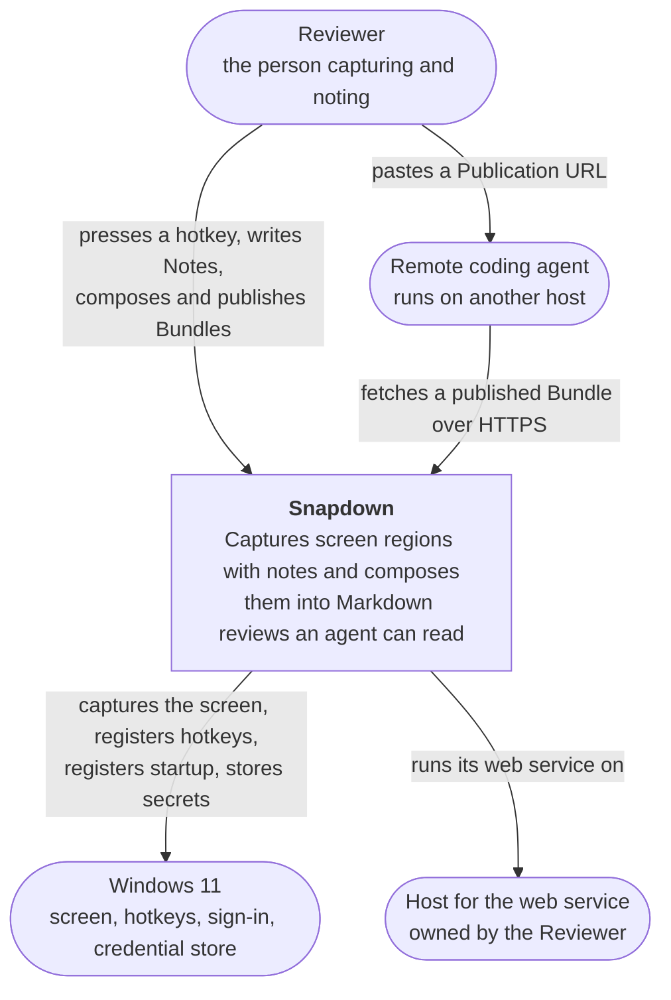

# C4 L1 — Snapdown in context

## Diagram

A **Local coding agent** node stood here until 2026-09-04, reached by an edge from Snapdown reading
Bundles over MCP with an Access Key, and by an edge from the Reviewer pasting that key. `DEC-016`
withdrew both: the agent in front of the Reviewer now reads only the Markdown the Reviewer copies and
pastes by hand, which is not a relationship between two systems — it is the same conversation surface
any other pasted text would use, and C4 does not draw it.

## Elements

| Element | What it is | Notes |
| --- | --- | --- |
| Reviewer | The person operating Snapdown | The only human actor and the only writer. Every write in the system originates from one of their actions |
| Remote coding agent | An AI coding agent running on another host | Reads a published Bundle over HTTPS. Has no other route into the product |
| Snapdown | The system under design | Spans a desktop application, a web service, and a browser reader |
| Windows 11 | The operating system the desktop application runs on | Not an external system in the integration sense; it is the platform. Named here because capture, hotkeys, sign-in startup, and secret storage all depend on it |
| Host for the web service | A machine the Reviewer controls, reachable over HTTPS | The Reviewer runs the web service themselves. No third-party service is involved anywhere in this product |

## Relationships

| From | To | Purpose | Over |
| --- | --- | --- | --- |
| Reviewer | Snapdown | Capture a region, write and edit Notes, place Markers, compose Bundles, publish and unpublish, change Settings | Global hotkey, desktop window, system tray |
| Reviewer | Remote coding agent | Point it at a review by pasting the Publication URL | Whatever conversation surface the agent offers |
| Remote coding agent | Snapdown | Fetch a published Bundle and the images it references | HTTPS |
| Snapdown | Windows 11 | Grab screen pixels, register and unregister global hotkeys, register run-at-sign-in, hold the publish credential | OS APIs and the Windows credential store |
| Snapdown | Host for the web service | Upload the Markdown and images of a confirmed publish, and delete them on unpublish | HTTPS with a publish credential |

## What is deliberately not shown

- **The Reviewer's repository and the code under review.** Snapdown never touches it. The agent does,
  and that is the agent's business.
- **The application being reviewed.** It is only pixels on a screen as far as Snapdown is concerned;
  drawing it would imply an integration that does not exist.
- **Any third-party or cloud service.** There are none, and the emptiness is the point: no account,
  no SaaS, no object store, no telemetry endpoint. If one ever appears on this diagram it is a change
  to AD-6.
- **Anything inside Snapdown.** Containers are C4 L2.
