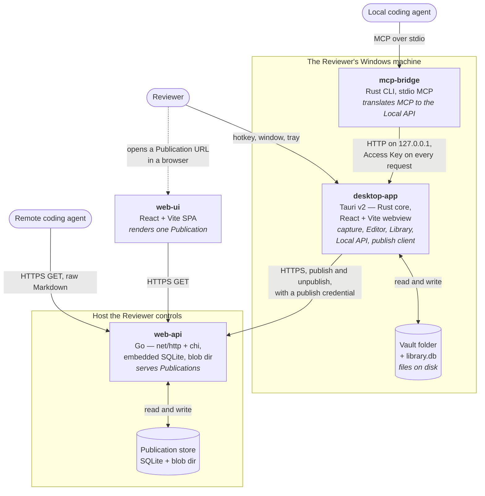

# C4 L2 — Containers

This file owns the container list. `components.yaml` → `containers:` is its registry form, and
`product_components[].containers` is the SSOT for the matrix at the bottom; V25 fails when the two
disagree.

## Diagram

## Elements

| Element | What it is | Notes |
| --- | --- | --- |
| `desktop-app` | Tauri v2 application: a Rust process owning the domain core, the SQLite and Vault adapters, the capture adapter, the Local API, and the publish client, with a React + Vite + TypeScript webview for the Editor and Settings | `built: true`. The only writer in the whole system. Holds five of the five Product Components, so it is the one container with an L3. **One process, two personas** — the tray (**Snapdown**) and the workspace window (**Snapdown Editor**) — and exactly one executable, `Snapdown.exe`, per AD-11 and `DEC-003` |
| `mcp-bridge` | Rust command-line executable speaking the Model Context Protocol over stdio to an agent, and HTTP to the Local API | `built: true`. Stateless by design — it holds no Library data and no Access Key between runs, which is what makes revocation immediate (AD-5) |
| `web-api` | Go service, `net/http` with `chi`, embedded SQLite and a blob directory, deployed as one binary with one configuration file | `built: true`. Serves Publications and nothing else. Never reads the Library |
| `web-ui` | React + Vite single-page application, built to static assets and served by `web-api` | `built: true`. Runs in the reader's browser, which is its own process — that is why it is a container and not "static assets". It renders one Publication and calls nothing but `web-api` |
| Vault folder + `library.db` | The Reviewer's chosen folder of image and Markdown files, plus the SQLite file holding metadata | **Not a container.** Embedded SQLite and a filesystem are storage inside `desktop-app`'s own process, with no runtime anyone deploys. Their invariants are AD-2 and AD-4 |
| Publication store | `web-api`'s SQLite file and blob directory | **Not a container**, for the same reason. NFR-14 keeps the whole of it inside one directory |

Windows 11 is the platform, not a container, and appears at L1.

## Relationships

| From | To | Purpose | Over |
| --- | --- | --- | --- |
| Reviewer | `desktop-app` | Every write in the system: capture, edit, mark, compose, delete, publish, configure | Global hotkey, desktop window, system tray |
| Local coding agent | `mcp-bridge` | List Bundles, read one Bundle's Markdown, fetch its images | Model Context Protocol over stdio |
| `mcp-bridge` | `desktop-app` | The same three reads, translated | HTTP on `127.0.0.1`, Access Key on every request |
| `desktop-app` | Vault + `library.db` | Read and write Findings, Notes, Markers, Bundles, Publications, Settings, and their files | Filesystem and embedded SQLite, in the same process |
| `desktop-app` | `web-api` | Publish a confirmed Bundle, and remove it on unpublish | HTTPS with a publish credential |
| Remote coding agent | `web-api` | Fetch a published Bundle as raw Markdown, and the images it references | HTTPS GET |
| `web-ui` | `web-api` | Fetch the same Publication to render it for a person | HTTPS GET |
| `web-api` | Publication store | Read and write published Markdown, images, and slug records | Filesystem and embedded SQLite, in the same process |

## Product Components per container

Rendering of each Product Component's `containers:` in `components.yaml`.

| Container | Product Components living in it |
| --- | --- |
| `desktop-app` | `finding`, `bundle`, `settings`, `agent-access`, `sharing` |
| `mcp-bridge` | `agent-access` |
| `web-api` | `sharing` |
| `web-ui` | `sharing` |

`desktop-app` holds more than one Product Component, so `c4-l3-desktop-app.md` exists. The other
three hold one each, and the matrix already places them.

## What is deliberately not shown

- **Deployment topology for `web-api`** — the host, the reverse proxy, the certificate, the process
  supervisor. It belongs to the devops repository and is referenced from here, never drawn here.
- **The build pipeline.** How the Tauri bundle, the two Rust binaries, and the two front ends are
  produced is a `structure-codebase.md` and CI concern.
- **The Windows credential store.** It holds the Access Key and the publish credential and is named
  in the spine's Consistency Conventions; drawing it as a box would suggest it is a container.
- **Inside any container.** Product Components inside `desktop-app` are L3.

**Amended 2026-08-23.** `DEC-003` was weighed and rejected the alternative that would have changed
this diagram: a second executable for the Editor, Snagit's shape. It would have made `desktop-app`
two containers with a second writer to one SQLite file and one Vault directory — which AD-11 now
forbids. The container count is unchanged and that is the outcome of a decision, not the absence of
one. What did change is that this container now has two named personas, and the L3 carries the
`editor-shell` that draws one of them.
