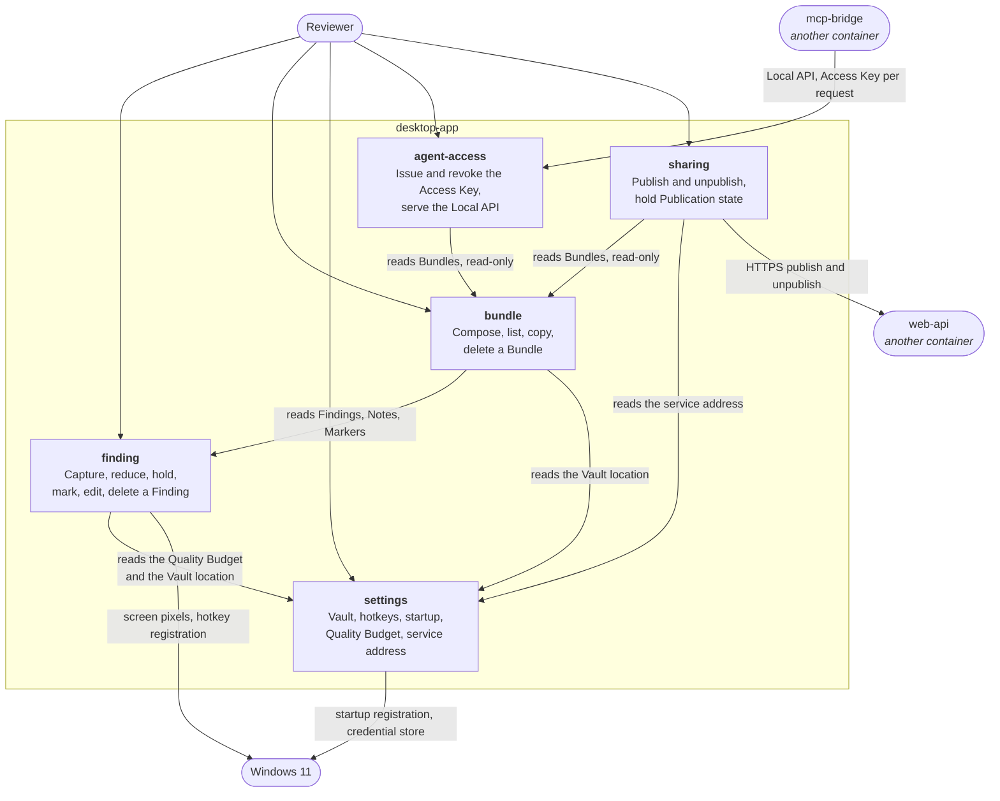

# C4 L3 — desktop-app

The boxes are Product Components. All five live here, which is why this container has an L3 and the
other three do not.

## Diagram

Dependency direction is acyclic and one-way: `agent-access` and `sharing` read `bundle`, `bundle`
reads `finding`, and everything reads `settings`. Nothing reads back up. `finding` does not know
Bundles exist, and `bundle` does not know publishing exists — which is what lets CAP-8 be dropped
without touching either.

## Elements

| Element | What it is | Notes |
| --- | --- | --- |
| `finding` | Everything about one observation: the hotkey and overlay, region selection, the note field at capture time, image reduction, the Finding list in the Editor, Note editing, Markers, deletion, orphan reporting | Owns `Finding`, `Note`, `Marker`. `mode: guarded`, `risk_accepted: low`. Carries AD-1, AD-2, AD-3, AD-4 |
| `bundle` | Composition of selected Findings into one stored Markdown document with its own images, the Bundle list, copying the Markdown, and hard deletion | Owns `Bundle`, `BundleItem`. `mode: outline` (global), `risk_accepted: low`. Carries AD-9 and, with `finding`, AD-2 |
| `settings` | The persisted choices: Vault location, hotkey bindings, Quality Budget, run at Windows startup, whether the Editor opens after a Capture, and where the web service is | Owns `Setting`. `mode: catalog` — G4 is skipped for it by design — `risk_accepted: medium` |
| `agent-access` | Issuing, showing, copying, and revoking the one Access Key, and serving the loopback Local API that the bridge calls | Owns `AccessKey`. `mode: guarded`, `risk_accepted: low`. Carries AD-5 and AD-7 |
| `sharing` | The publish client and the Publication record: publishing a named Bundle, unpublishing it, and showing where it is | Owns `Publication`. `mode: guarded`, `risk_accepted: low`. Carries AD-6, AD-8, and with `web-api` AD-5 and AD-7 |

## Relationships

| From | To | Purpose | Over |
| --- | --- | --- | --- |
| Reviewer | `finding` | Capture, note, mark, edit, delete | Global hotkey, Capture Overlay, Editor window |
| Reviewer | `bundle` | Select, compose, name, list, copy, delete | Editor window |
| Reviewer | `settings` | Set the Vault, the hotkeys, startup, the Quality Budget, the service address | Settings window |
| Reviewer | `agent-access` | Issue, copy, and revoke the Access Key | Editor window |
| Reviewer | `sharing` | Publish, unpublish, copy a Publication URL | Editor window |
| `bundle` | `finding` | Read the Findings, Notes, and Markers a composition needs | In-process call into the domain core |
| `finding` | `settings` | Read the Quality Budget and the Vault location | In-process call |
| `bundle` | `settings` | Read the Vault location | In-process call |
| `agent-access` | `bundle` | Read the Bundle list, one Bundle's Markdown, and its images. Read-only, per AD-5 | In-process call |
| `sharing` | `bundle` | Read the Bundle being published. Read-only | In-process call |
| `sharing` | `settings` | Read the web service address and fetch the publish credential | In-process call, then the OS credential store |
| `finding` | Windows 11 | Grab screen pixels; register and unregister global hotkeys | OS APIs |
| `settings` | Windows 11 | Register run-at-sign-in; store and read the Access Key and publish credential | OS APIs, credential store |
| `mcp-bridge` | `agent-access` | The three reads the Local API exposes | HTTP on `127.0.0.1`, Access Key per request |
| `sharing` | `web-api` | Upload a confirmed publish; delete it on unpublish | HTTPS with a publish credential |

## What is deliberately not shown

- **The hexagonal split inside each box.** Which part of `finding` is core and which is adapter is
  the spine's Design Paradigm and the component's SDD; drawing it here would duplicate both.
- **The React webview as a separate box.** It is the presentation surface of all five components at
  once, not a component. Its screens are in `inventory-screen.md`.
- **SQLite and the Vault folder.** Storage inside this container's own process, per L2, and their
  contents are `inventory-db.md`.
- **The Tauri command layer.** It is the adapter that carries every arrow labelled "in-process call"
  from the webview into the core, and naming it as a box would make it look like a component.
