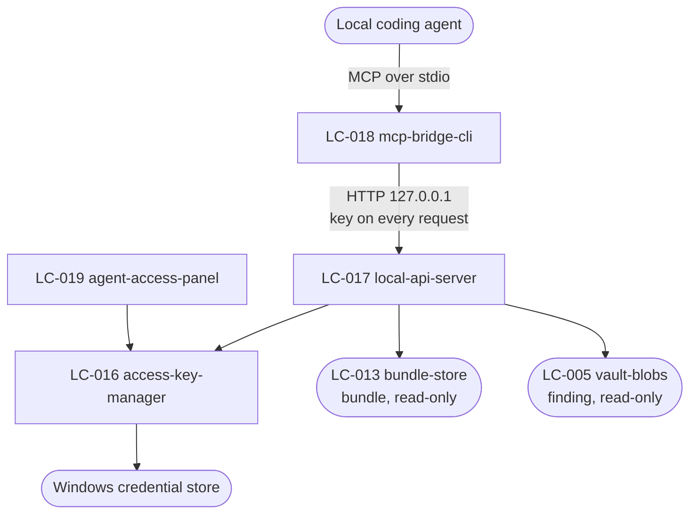

# SDD — agent-access

## Decision Summary · [outline]

Two processes and one secret. The desktop app runs a small read-only HTTP server bound to `127.0.0.1`;
a separate `mcp-bridge` executable speaks stdio MCP to an agent and HTTP to that server. The Access
Key is generated in the desktop app, stored as a hash in `library.db` and in full in the Windows
credential store, and reaches the bridge only through an MCP tool call the Reviewer's paste triggers.

Three choices cost the most to reverse. All three are the substance of `DEC-002`; what is here is how
they land in code.

**The bridge is stateless, and that is enforced by having nowhere to write.** It takes the Local API
address from configuration and the key from `set_access_key`, holds the key in memory, and has no
store, no cache file, and no keyring access of its own. This is the whole reason revocation is
immediate: the next bridge process starts with no key.

**The key is checked on every request, not per session.** There is no session, no cookie, and no token
exchange. Loopback is not a boundary — any process on the machine can reach `127.0.0.1` — so the key
is the only control, and a per-session grant would be a second thing to revoke.

**A refusal and an empty result are different responses, and the bridge must keep them different.**
`/v1/bundles` with no key returns `key_required`; with a key and an empty Library it returns an empty
list and HTTP 200. The bridge maps the first to an MCP tool *error* and the second to an empty tool
*result*. Collapsing them would satisfy AD-7 on paper and cause the exact failure AD-7 exists to
prevent, which is why RISK-6 is tested from the agent's side.

## Structure · [outline]

Four Logical Components across two containers. Registered in `.control/registry/components.yaml`.

| LC | type | Container | Responsibility |
| --- | --- | --- | --- |
| LC-016 `access-key-manager` | service | `desktop-app` | Generates, hashes, stores, reads back, and revokes the one Access Key. Owns the constant-time comparison and nothing else |
| LC-017 `local-api-server` | gateway | `desktop-app` | The four `/v1` routes. Binds loopback, authorises every request through `LC-016`, and serves Bundles read-only through `bundle` |
| LC-018 `mcp-bridge-cli` | gateway | `mcp-bridge` | The four MCP tools. Translates MCP to HTTP and the error envelope back to MCP errors. Holds the key in memory for the life of the process |
| LC-019 `agent-access-panel` | ui-screen | `desktop-app` | Issue, re-copy, show state, revoke. The only surface where the key is ever visible |

`LC-018` is in a different process and a different container from everything else here, and it depends
on `LC-017` alone. It has no dependency on `snapdown-core`, deliberately: a bridge that could reach the
domain would be a second writer waiting to happen (AD-5).

Crossings out of this component: read-only calls into `LC-013 bundle-store` and `LC-005 vault-blobs`.
Neither `bundle` nor `finding` depends on anything here, which is what lets CAP-7 be dropped entirely
without touching r1.

## Inherited Constraints · [guarded]

Quoted verbatim from `.how/_platform/ARCHITECTURE-SPINE.md` under their original ids.

| AD | Quoted rule | How it lands here |
| --- | --- | --- |
| AD-4 | "The capture adapter MUST apply the Quality Budget before the image reaches the Vault, and MUST NOT retain the unreduced pixels. No later stage — composition, publishing, or serving — may re-encode or re-scale a stored image. A Bundle's image is a copy of the Finding's image with Markers drawn on it, at the same dimensions." | `LC-017` streams the stored blob bytes with no image library in its dependency tree at all. There is nothing here that *could* re-encode |
| AD-5 | "The Local API, the MCP Bridge, `web-api`, and `web-ui` MUST expose no operation that creates, changes, or deletes anything in the Library. Write authority lives in the desktop process and reaches it only from the Reviewer's own actions. A new route or tool on any of those surfaces that is not a read is a violation, not a feature." | `LC-017` registers only `GET` handlers, and a route-inventory test asserts no other method is registered on `/v1`. `LC-018` exposes three read tools plus `set_access_key`, which writes nothing outside its own process memory. `LC-017` receives read-only handles to `LC-013` and `LC-005` |
| AD-7 | "Every failure crossing a process boundary MUST be returned in the envelope defined in `cross-cutting.md`, carrying a code from that file's catalogue. A refusal MUST be distinguishable from an empty result by its code, never only by its body being empty." | `LC-017` has one error writer, used by every handler. `LC-018` maps an envelope onto an MCP error preserving `code` and `message` verbatim, and a test asserts it never produces an empty successful result from a non-2xx response |
| AD-9 | "A Bundle's Markdown MUST be composed once, by the core, and stored. Every handoff path MUST serve that same authored document. A path MAY substitute the base of the document's image links so that they resolve for its own reader, and MUST change nothing else — no re-ordering, no decoration, no summarising, and not one character of what the composer wrote. That substitution is made BY THE COMPOSER, which takes the base path as a parameter; no surface may re-render, re-order, decorate, or summarise a Bundle on the way out, and no surface may rewrite a document the composer has already produced. A surface that needs a different shape is asking for a change to the composer." | `/v1/bundles/{id}` is designed to return `bundle.markdown` verbatim, with the stored folder-relative links and **no** rebasing — `DEC-012` records why: this reader is an agent on the same machine, which can be told the Vault path once instead of being told it again inside every link. `LC-018` returns that string as the tool's text content, untrimmed and unwrapped. **`[MISSING]`, corrected 2026-08-31:** this cell used to end "The golden-file test in `bundle` covers this path." It does not and never did. `LC-017` has no implementation at all — `BUG-59`, *"The Local API does not exist, so the MCP Bridge cannot reach the product at all"* — so there is no path here for a test to cover, and `crates/snapdown-store/tests/test_golden_markdown.rs` pins the composer against a stored reference rather than any surface. Whoever fixes `BUG-59` inherits this guard as unwritten, not as inherited |

## Failure Behaviour · [guarded]

Every boundary this component has. Derived from `.how/_platform/inventory-api.md` rows 1–8 and
`inventory-screen.md` row 13, plus the two out-of-process boundaries.

| Boundary | Slow | Absent | Lying | What the user sees | What is logged |
| --- | --- | --- | --- | --- | --- |
| Agent → `LC-018` (MCP stdio) | The agent stops reading stdout mid-response. The bridge blocks on the pipe and exits when it closes; there is nothing to time out against and nothing to clean up, because the bridge holds no state | The agent never launches the bridge. Nothing happens anywhere, and the desktop shows the key as valid but unused — which is honest: issuing a key is not evidence anyone used it | The agent sends a malformed MCP frame, or calls a tool that does not exist. The bridge answers with an MCP protocol error and stays alive; it never guesses at an intent | Nothing on the desktop. In the agent, an error from the tool call | `event=mcp_frame_invalid`, the method name. Never the frame body, which may hold the key |
| `LC-018` → `LC-017` (loopback HTTP) | No response in 10 s. The bridge returns `unavailable` and says the desktop app is not responding, rather than letting the agent's own turn hang | Connection refused — Snapdown is not running. The bridge answers `unavailable` immediately, saying Snapdown is not running. It never hangs and never retries in a loop (FR-21) | Something else is listening on the port and answers with plausible JSON. The bridge requires a Snapdown-specific response header on every reply and treats its absence as `unavailable`, so it cannot be fed a fabricated Bundle | In the agent: "Snapdown is not running" or "Snapdown is not responding". On the desktop: nothing, because nothing reached it | `event=bridge_upstream_failed`, the route, the reason. Never the key, never the response body |
| `LC-017` authorisation (`LC-016`) | Not applicable — a hash comparison | No key has ever been issued. `key_required`, with a message telling the Reviewer to issue one. **Not** an empty list (AD-7) | A key that was revoked, or a key from a previous install. `key_invalid`, distinct from `key_required`, so the agent can say which of the two happened | In the agent: "An Access Key is required" or "the key is no longer valid". On the desktop: nothing, because a refused request is not an event the Reviewer needs | `event=auth_refused`, the code, and a truncated key **fingerprint** — never the key, and never enough of it to be useful |
| `LC-017` → `LC-013 bundle-store` | A slow local SQLite read means a failing disk. Over 5 s the route answers `unavailable` | `library.db` is missing or corrupt. `unavailable`, and the desktop is already showing its own blocking banner for the same reason | Returns a Bundle row whose `markdown` is empty. Served as-is: an empty Bundle document is a legitimate answer for a Bundle whose Findings all had empty Notes, and inventing content here would break AD-9 | In the agent: an `unavailable` error naming Snapdown's store. On the desktop: the store banner it already shows | `event=store_unavailable`, the operation |
| `LC-017` → `LC-005 vault-blobs` | Over 10 s the image route answers `unavailable` rather than holding the agent's turn open | The blob is gone — deleted outside Snapdown. `not_found` for that filename, and the Bundle's Markdown still serves. One missing image does not fail the whole Bundle | Reports a byte count that does not match what it streams. The route sends `Content-Length` from the stat and the client detects the truncation; the route does not attempt to correct it mid-stream | In the agent: that one image is unavailable, by filename. The rest of the Bundle read fine | `event=blob_missing`, the relative path. Never the bytes |
| `LC-017` → filename handling | Not applicable | Not applicable | A filename crafted to escape the Bundle's folder — the one hostile input this component has. Resolved against the Bundle's folder and refused as `bad_request` if it escapes. Refused in `LC-005`, which is the single place the check lives for the whole product | In the agent: `bad_request`. Nothing on the desktop, because a rejected path is not the Reviewer's problem | `event=path_refused`, the requested filename, at warning level. This one **is** worth alerting on |
| `LC-019` → Windows credential store | Over 2 s the panel shows the key as unavailable rather than blocking | The credential store refuses — a policy, a corrupt vault. Issuing a key fails and says so; an existing key cannot be re-copied, and the panel offers to issue a new one instead | Returns a different key than was stored, or an empty string. Detected by hashing what came back and comparing against `access_key.key_hash`; a mismatch is treated as "no key" and the Reviewer is told to issue a new one | In the panel: what failed, and the option to issue a new key. Authorisation keeps working from the hash, so a live agent session is not broken by a credential-store failure | `event=credential_store_failed`, the operation. Never the key or any part of it |
| `LC-017` port binding | Not applicable | The port is already taken. Snapdown picks the next free port in a fixed range and writes the chosen one where `LC-018` reads it, rather than failing to start | Binds successfully to something other than loopback — a misconfiguration. Asserted after binding by reading back the local address; anything but `127.0.0.1` shuts the server down rather than serving | The panel shows agent access as unavailable, with the reason. Capture and the Editor are unaffected | `event=api_bind_failed` or `event=api_bind_not_loopback`, the address. The second is an error, not a warning |

Two entries are the ones worth arguing about:

- **A wrong key and no key are different codes.** They are the same security answer and different
  human answers, and the human reading them is an agent reporting to the Reviewer.
- **A missing blob does not fail the Bundle.** The Markdown is the payload; the images support it. An
  agent that got the notes and four of five images has still received a usable review.

## Design Notes

- **`LC-016` never returns the key.** It returns "valid" or "not valid", and the panel reads the key
  from the credential store directly for the copy action. Keeping the comparison and the disclosure in
  different places is what stops a future convenience from logging it.
- **The comparison is constant-time and the hash is memory-hard.** The key is high-entropy random, so
  the hash choice is about not leaking through timing rather than about resisting a dictionary — but a
  fast hash here would be the kind of decision nobody revisits.
- **`set_access_key` is a tool, not a launch argument.** A launch argument lands in the agent's
  configuration file and in the process list, which is `DEC-002`'s rejected alternative wearing
  different clothes.
- **The bridge writes the key nowhere, including to its own log.** Its logger has an explicit
  denylist, and the repository scan in CI covers the config templates.
- **`/v1/health` is the one unauthenticated route and returns nothing about the Library** — not a
  count, not a version of the Library, not a Vault path. It exists so the bridge can say "Snapdown is
  not running" without holding a key.
- **The port file is not a secret and is not a grant.** Knowing where the server is buys nothing
  without the key, which is why discovering the port needs no authorisation.

---

## Slots

`01-ux/` — not written below `mode: deep`. Screen 13 in `inventory-screen.md`.
`02-contracts/` — `[deep]` only. The four routes and four tools are rows 1–8 of `inventory-api.md`;
their five lanes are unwritten at `guarded`, and `Failure Behaviour` above is what stands in.
`03-integrations/` — `[guarded]` and not applicable. MCP is a protocol this product speaks, not a
third party whose owner can change it out from under us; the agent on the other side is an actor.
`04-components/`, `05-model/`, `06-flows/` — `[deep]` only.

## Open Items

- OQ-6 — whether the Reviewer prefers a per-session key at all.
  `.control/questions/assumptions.md`.
- OQ-1 — whether an agent can fetch the images through the bridge's image tool.
  `.control/questions/assumptions.md`.
- RISK-6 — the bridge flattening a refusal into an empty result. `.control/registry/risks.yaml`.
- RISK-7 — the key reaching disk. `.control/registry/risks.yaml`.
- RISK-11 — an agent spending more context on images than the Reviewer intended. Not solvable here;
  it is an argument for the Quality Budget defaults. `.control/registry/risks.yaml`.
- PRD open question 2 — whether the two processes should collapse into one for HTTP-capable MCP
  clients. Deferred in the spine.
