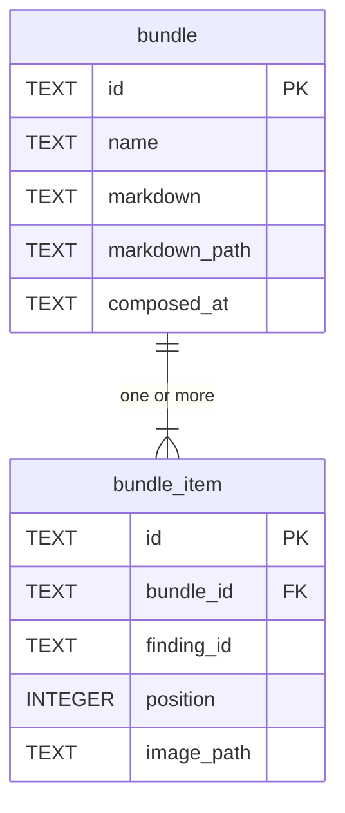

# Data model — bundle

As-built, read from `crates/snapdown-store/src/sqlite/migrations.rs` (migration v3) on 2026-08-23.

## Dictionary — `bundle`

| Column | Type | Meaning |
|---|---|---|
| `id` | `TEXT` PK | UUIDv7 |
| `name` | `TEXT` | The Reviewer's name, and the document's heading (`BR-57`) |
| `markdown` | `TEXT` | **The composed bytes, stored.** Not regenerated |
| `markdown_path` | `TEXT` | Relative to the Vault root |
| `composed_at` | `TEXT` | RFC 3339 UTC |

**`markdown` as a column is `AD-9` made structural.** "Byte-identical on every path" is true because
there is one set of bytes, written once by a pure function, and the clipboard, the Local API, and a
publish all read the same column. Three code paths that each regenerate would have to be kept in step
by discipline; this is kept in step by there being nothing to keep in step.

It also has a consequence worth naming: a Bundle **cannot** be patched. Editing the Markdown would
make the column disagree with the items and images that produced it, and that is why `FR-11` and the
Non-Goals say a Bundle is recomposed rather than edited, and why `DESIGN-bundle.md` gives the preview
no cursor.

Storing both `markdown` and `markdown_path` is duplication on purpose: the column is the truth for
every in-product path, and the file on disk is what a Reviewer or an agent opens from the Vault. They
are written in one unit of work (`AD-2`).

## Dictionary — `bundle_item`

| Column | Type | Meaning |
|---|---|---|
| `id` | `TEXT` PK | UUIDv7 |
| `bundle_id` | `TEXT` FK, `ON DELETE CASCADE` | Correct. Deleting a Bundle deletes its items (`FR-14`) |
| `finding_id` | `TEXT` FK, `ON DELETE CASCADE` | **Wrong — `BUG-1`** |
| `position` | `INTEGER` | Order in the Bundle, fixed at composition (`BR-58`). Never reordered |
| `image_path` | `TEXT` | **The Bundle's own copy**, relative to the Vault root. Not the Finding's |

**`image_path` is the whole point of this table.** A `BundleItem` is a *membership* carrying its own
image copy, not a pointer at a Finding's image. That is what lets a Finding be deleted while the
Bundle stays readable (`FR-13`), and it is what makes a published Bundle immune to later edits.

**`finding_id`'s cascade contradicts exactly that**, and it is live: `finding_store.rs:29` sets
`PRAGMA foreign_keys = ON`, so deleting a Finding removes the membership row while its image copy and
the composed Markdown both survive. The Bundle's document and the record of the Bundle's document
then disagree, silently. Registered as `BUG-1`; `SCN-05` carries the case.

The fix is probably to drop the foreign key rather than only its cascade. A `BundleItem` legitimately
refers to a Finding **that may no longer exist**, which is the precise condition a foreign key exists
to forbid.

`UNIQUE(bundle_id, finding_id)` is correct: one membership per Finding per Bundle. It survives the fix
either way, being independent of the reference.

## Indexes

None beyond the primary keys and the unique constraint. Bundles are counted in tens.
