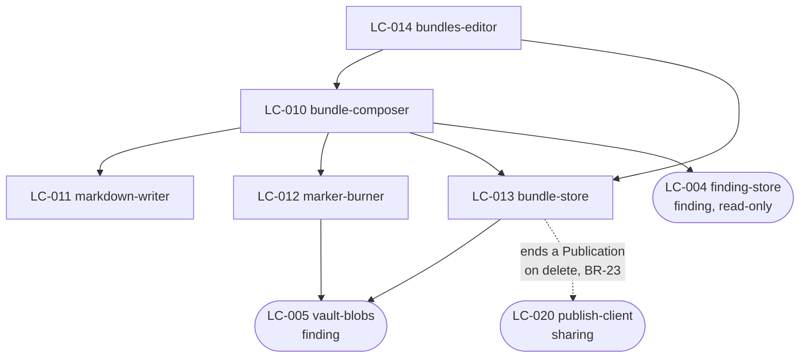

# SDD — bundle

`mode: outline`. `Inherited Constraints` and `Failure Behaviour` are `[guarded]` sections and are
deliberately absent — the four `AD-N` in `binds` still hold, because an invariant does not stop
holding because a document is thin.

## Decision Summary · [outline]

This component is a composer and a store, and almost nothing else. Composition takes an ordered list
of Finding ids and a name, and produces three things in one unit of work: a `bundle` row holding the
composed Markdown, one `bundle_item` row per Finding, and one image file per Finding with that
Finding's Markers drawn into it.

Two choices cost the most to reverse.

**The composed Markdown is a column, not a rendering.** `bundle.markdown` holds the finished bytes,
and every handoff path — clipboard, Local API, publish — reads that column. The alternative, rendering
on demand from the Findings, is cheaper to write and makes AD-9 unenforceable: the moment a Note is
edited, the same Bundle produces different bytes on different days, and two agents reading "the same
review" disagree. Storing it is what makes a Bundle citable.

**Markers are burned at compose time, into a copy.** The Finding's own image stays clean, and each
`bundle_item` gets its own file with the badges drawn in at that image's stored dimensions. This is
what makes FR-8's repositioning possible at all — a badge already burned into the Finding's image
could never be moved — and it is why deleting a Bundle has several files to remove rather than one,
and why one Finding in three Bundles costs three image copies. That storage cost is accepted: it is
what lets a Bundle outlive the Finding it came from.

A Markdown file is also written next to the images, at `bundle.markdown_path`, holding the same bytes
as the column. The column is the source of truth; the file exists so that a Bundle is readable by
anything that opens a folder, which is the plainest form of FR-12.

## Structure · [outline]

Five Logical Components, all in `desktop-app`. Registered in `.control/registry/components.yaml`.

| LC | type | Responsibility |
| --- | --- | --- |
| LC-010 `bundle-composer` | service | The whole composition, as one transaction: read the Findings, burn the images, render the Markdown, write the rows and files. Refuses if any selected Finding's image is missing |
| LC-011 `markdown-writer` | service | Turns Findings plus their Notes and Markers into the document shape `cross-cutting.md` § Bundle Markdown shape defines. Pure, and the only place that shape exists |
| LC-012 `marker-burner` | service | Draws numbered badges into a copy of a Finding's image, at that image's own dimensions. Converts normalised coordinates to pixels here and nowhere else |
| LC-013 `bundle-store` | store | `bundle` and `bundle_item` rows, and the Bundle's own files through `vault-blobs`. Owns the delete-with-files transaction |
| LC-014 `bundles-editor` | ui-screen | The Bundle list, the Bundle detail view, compose, copy Markdown, delete |

`LC-011` is pure: no I/O, no clock, no filesystem. That is what makes AD-9's golden-file test possible
across all three handoff paths, and it is the one structural property in this component worth
defending.

Crossings out of this component: reads of `LC-004 finding-store` and `LC-005 vault-blobs`, both
read-only, and one call into `LC-020 publish-client` when a published Bundle is deleted. Nothing in
`finding` depends on anything here.

## Design Notes

- **`bundle.markdown` and the file at `markdown_path` are written from the same bytes in the same
  transaction.** If they can ever differ, the column wins and the file is a stale copy — but nothing
  is designed to let them differ, and a check that they match belongs in the deletion path rather
  than on every read.
- **`bundle_item.position` is dense and contiguous.** It is the selection order, and there is no
  reorder operation, so it is written once and never rewritten. Anything that makes it sparse has
  invented the second ordering mechanism the SRS rules out.
- **A Bundle of one Finding is an ordinary Bundle.** It is also how a single screenshot gets published
  (OQ-16). Nothing special-cases it.
- **Deleting a published Bundle calls `sharing` before removing anything.** If the unpublish is not
  confirmed, the deletion does not happen — BR-20 and BR-23 together, and the least comfortable
  consequence in this component, since it makes a local deletion depend on a network call.
- **The composer does not delete the Findings it consumed.** PRD open question 4 asks whether it
  should offer to; it does not in r1, and adding it later touches only `LC-014`.

---

## Slots

`01-ux/` — not written below `mode: deep`. Screens are rows 8–10 of `inventory-screen.md`.
`02-contracts/` — not written. This component owns no endpoint.
`03-integrations/` — `[guarded]`, and not applicable: no third party.
`04-components/`, `05-model/`, `06-flows/` — `[deep]` only.

## Open Items

- OQ-1 — whether a coding agent can open the relative image paths this component writes. It decides
  whether FR-12 is worth anything. `.control/questions/assumptions.md`.
- OQ-12 — recomposing in place of editing. `.control/questions/assumptions.md`.
- OQ-16 — whether a one-Finding Bundle is acceptable as the single-screenshot publish path.
  `.control/questions/assumptions.md`.
- RISK-5 — the composer becoming three composers. `.control/registry/risks.yaml`.
