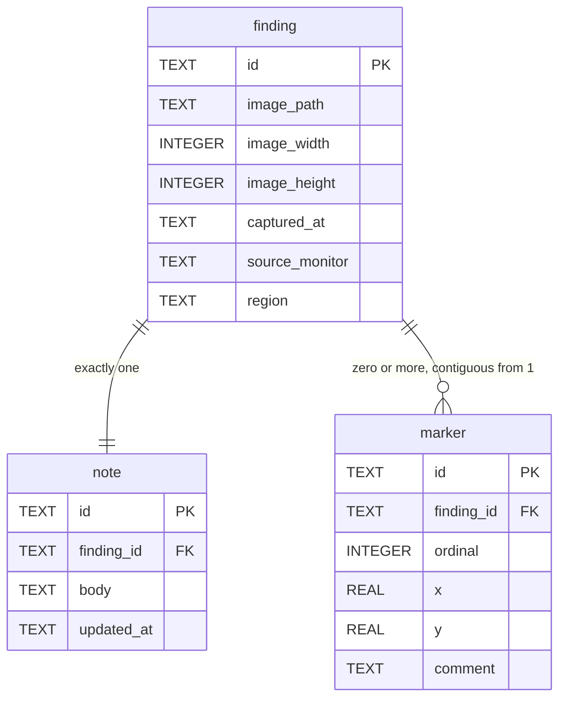

# Data model — finding

As-built, read from `crates/snapdown-store/src/sqlite/migrations.rs` (migration v2) on 2026-08-23.

## Dictionary — `finding`

| Column | Type | Meaning |
|---|---|---|
| `id` | `TEXT` PK | UUIDv7, per `cross-cutting.md` § Identifiers |
| `image_path` | `TEXT` | Relative to the Vault root, never absolute. A Vault move must not rewrite rows |
| `image_width` `image_height` | `INTEGER` | The **stored** image's dimensions, after reduction. Not the region's |
| `captured_at` | `TEXT` | RFC 3339 UTC with `Z` |
| `source_monitor` | `TEXT` | Which monitor the region came from, for the multi-monitor DPI case |
| `region` | `TEXT` | The rectangle selected on that monitor, before reduction |

`image_path` being relative is what makes `SCN-01`'s Vault move a file operation rather than a
database migration. It is the kind of decision that costs nothing when taken and is expensive to
reverse, and it is worth naming because nothing in the DDL explains it.

**`region` and the stored dimensions are both kept** — the region says what the Reviewer selected, the
dimensions say what was stored after reduction. They differ whenever a downscale applied, and the pair
is the only surviving evidence of how hard a Capture was reduced.

Which is nearly `NFR-18`, and not quite: it records the **effect** and not the **budget**. From
`3840×2160` selected and `1600×900` stored you can infer a long-edge cap of 1600; you cannot recover
the encoder quality, and you cannot tell which named budget was in force.

`[MISSING]` — three columns are needed: `resolved_long_edge`, `resolved_encoder_quality`, and
`budget_name`. Planned work under `NFR-18` and `BR-105`.

## Dictionary — `note`

| Column | Type | Meaning |
|---|---|---|
| `id` | `TEXT` PK | UUIDv7 |
| `finding_id` | `TEXT` FK `UNIQUE`, `ON DELETE CASCADE` | One Note per Finding, enforced by the constraint |
| `body` | `TEXT` | Free text, verbatim. Blank lines preserved (`BR-34`) |
| `updated_at` | `TEXT` | RFC 3339 UTC |

The numbered lines `AD-1` binds are **inside `body`**, not rows. That is the right shape and it is the
source of `SCN-04`: the Note is free text the Reviewer owns, so the database cannot enforce the
pairing, and the pairing is therefore an application invariant carried by `MarkerSequencer`. Making
the lines rows would let the constraint enforce it and would take free-text editing away.

## Dictionary — `marker`

| Column | Type | Meaning |
|---|---|---|
| `id` | `TEXT` PK | UUIDv7 |
| `finding_id` | `TEXT` FK, `ON DELETE CASCADE` | |
| `ordinal` | `INTEGER`, `UNIQUE(finding_id, ordinal)` | The Marker's number. Its identity to the reader |
| `x` `y` | `REAL` | **Normalised to the image, 0.0–1.0**, per `AD-3`. Never pixels |
| `comment` | `TEXT` | |

`UNIQUE(finding_id, ordinal)` is the one place the database helps enforce `AD-1`: two Markers cannot
share a number. It does **not** enforce contiguity — `1, 2, 4` satisfies the constraint — so
"contiguous from 1 with no gaps" remains `MarkerSequencer`'s job. Worth stating, because the presence
of a constraint invites the assumption that the rule is covered.

`AD-3`'s normalisation is what makes a Marker survive re-encoding at a different size. It is also why
`x` and `y` are `REAL`.

`comment` is `[NEEDS CONFIRMATION]`: the domain model describes a Marker as a numbered badge bound to
a Note line, and this column suggests per-Marker text as well. Whether it is used, and whether it
duplicates the Note line, was not established. Filed for `wdi-question`.

## Cascades

Both `ON DELETE CASCADE`s are correct and are **not** what satisfies `AD-2`. They remove the rows; the
image file is removed by `FindingRemover` in the same unit of work. A cascade that fired while the
file removal failed would leave an orphaned file with no record — which is exactly the state `FR-15`
exists to find, and `AD-2` exists to prevent.

## Indexes

None beyond the primary keys and `UNIQUE(finding_id, ordinal)`. `OQ-10` records the assumption that
this is enough at the sizes reached so far, and that search is the first thing that will hurt.
