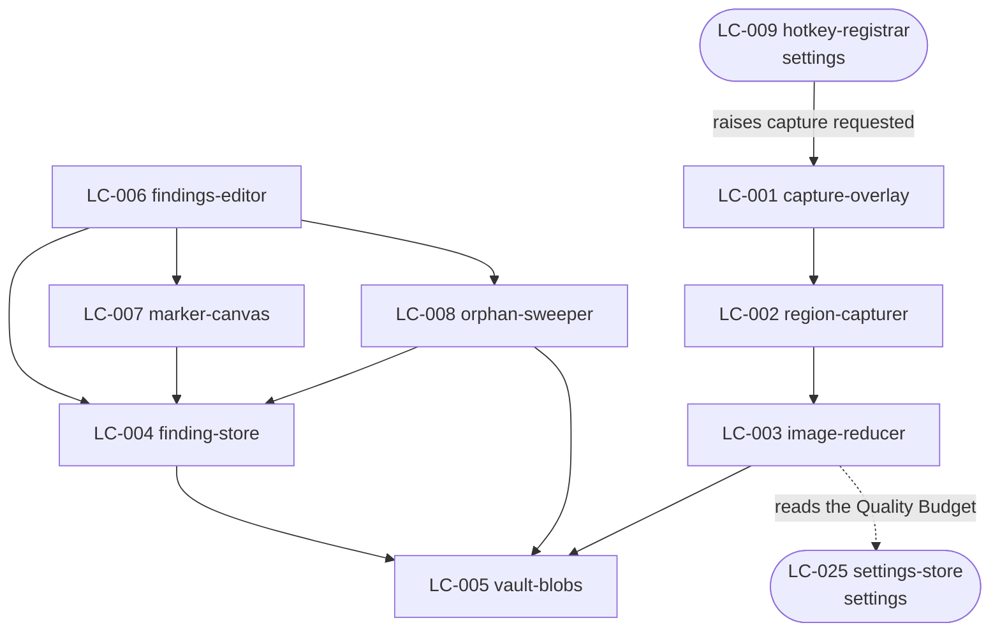

# SDD — finding

## Decision Summary · [outline]

This component is built as a Rust pipeline behind two very different surfaces. The capture path runs
entirely in the Rust process and is optimised for one thing: getting out of the Reviewer's way inside
half a second. The Editor path is a React view over the same store, and it is allowed to be slow
because nobody is waiting on it mid-review.

Three choices cost the most to reverse.

**The save is committed before the image finishes.** The record and a zero-byte reservation of its
file are written together, focus returns, and the reduction finishes immediately after. This is what
lets NFR-2's 500 ms and NFR-3's real encoding work both hold, and it is why the Editor has to render
a Finding whose image is still arriving. Reversing it means either a slower save or no reduction on
the way in, and both break a stated number.

**Markers and Note lines are one table, not two.** `marker` carries the badge position *and* the
numbered line's text, and its `ordinal` is both numbers at once. AD-1 could have been satisfied by two
tables and a foreign key; it would also have made every renumber a two-table transaction, which is
exactly where a partial renumber comes from. There is no `note_line` table and there never will be.

**Files are removed before the record is.** For deletion, the file goes first and the record's removal
is only committed once every file is confirmed gone. It is the ordering that makes AD-2's "leave the
prior state intact" achievable on Windows, where a file held open by another process simply refuses.
The cost is that a crash between the two leaves a record pointing at a missing file — which FR-15's
orphan report is built to find and is a state the Reviewer can act on, unlike its opposite.

## Structure · [outline]

Eight Logical Components, all in `desktop-app`. Registered in `.control/registry/components.yaml`.

| LC | type | Responsibility |
| --- | --- | --- |
| LC-001 `capture-overlay` | ui-composite | One transparent window per monitor. Owns the crosshair, the dimming, the selection rectangle, the live dimensions readout, and the note field that appears on release. Destroyed on save or cancel |
| LC-002 `region-capturer` | service | Turns a selected rectangle in overlay coordinates into pixels, at the monitor's own scale factor. Owns the DPI conversion and nothing else |
| LC-003 `image-reducer` | service | Applies the Quality Budget: downscale to the long edge, re-encode lossily, write to the Vault. The only place either happens (AD-4) |
| LC-004 `finding-store` | store | `finding`, `note`, and `marker` rows. Owns every transaction over them, including the renumber |
| LC-005 `vault-blobs` | store | The Vault folder. Create, read, and delete a blob by relative path; refuses a path that escapes the Vault root |
| LC-006 `findings-editor` | ui-screen | The Finding list and the detail view. Note editing, multi-select, delete confirmation, the orphan report |
| LC-007 `marker-canvas` | ui-composite | Placing, dragging, and removing Markers over an image, in normalised coordinates (AD-3) |
| LC-008 `orphan-sweeper` | service | Compares `finding_store` against `vault_blobs` in both directions. Reports; never deletes on its own |

Dependency direction is downward only. `LC-005 vault-blobs` depends on nothing and is depended on by
everything that touches a file — which is what makes AD-2 enforceable in one place. No UI component is
depended on by a service.

One crossing out of this component, and it is a read: `LC-003` reads the Quality Budget from
`LC-025 settings-store`. One crossing in: `LC-009 hotkey-registrar` belongs to `settings` — it owns the
binding it registers — and raises a capture-requested event this component listens for. That direction
is deliberate: `finding` does not know which key was pressed, and `settings` does not know what a
Capture is.

## Inherited Constraints · [guarded]

Quoted verbatim from `.how/_platform/ARCHITECTURE-SPINE.md` under their original ids.

| AD | Quoted rule | How it lands here |
| --- | --- | --- |
| AD-1 | "A Finding's Markers and its Note's numbered lines MUST be stored as one ordered collection. Adding, moving, removing, or renumbering MUST be a single operation over that collection. No code path may write a Marker without writing its line, or a line without its Marker." | One `marker` table carrying both the position and the line text, `ordinal` serving as both numbers. `LC-004` exposes add, move, remove, and renumber as single transactions; nothing else may write `marker` |
| AD-2 | "Any operation that creates or removes a Finding, a Bundle, or a BundleItem MUST create or remove that record's files in the same unit of work, and MUST leave the prior state intact if any part of it fails. A record MUST NOT be committed before its files exist, and files MUST NOT be removed before the record is." | Create: `LC-005` reserves the blob, then `LC-004` commits the row — so the file exists first. Delete: `LC-005` removes every file, and only on confirmation does `LC-004` commit the row's removal. The second half of the quoted rule is deliberately inverted for deletion and that inversion is argued in Design Notes |
| AD-3 | "A Marker's position MUST be stored as a fraction of the image's width and height, in the closed range 0 to 1. No stored coordinate may be in pixels, and no renderer may assume the image is at its capture resolution." | `marker.x` and `marker.y` are floats in `[0,1]`. `LC-007` converts on the way in and out; `LC-004` rejects a value outside the range rather than clamping it |
| AD-4 | "The capture adapter MUST apply the Quality Budget before the image reaches the Vault, and MUST NOT retain the unreduced pixels. No later stage — composition, publishing, or serving — may re-encode or re-scale a stored image. A Bundle's image is a copy of the Finding's image with Markers drawn on it, at the same dimensions." | `LC-003` is the only holder of unreduced pixels and drops them when it returns. It is the only code in the component that encodes. `LC-005` has no encoder |
| AD-6 | "No component may open an outbound network connection carrying Finding, Note, Marker, or Bundle content, except the publish client, executing a publish the Reviewer confirmed on a named Bundle. There is no telemetry, no analytics, and no crash reporter that carries content." | No LC in this component has a network dependency at all. NFR-4's test runs the whole capture path with outbound calls failing and asserts none was attempted |

## Failure Behaviour · [guarded]

Every boundary this component has. Derived from `.how/_platform/inventory-screen.md` rows 1–7 (this
component owns no endpoint) plus its four out-of-process boundaries. "Returns an error" is not an
answer anywhere below.

| Boundary | Slow | Absent | Lying | What the user sees | What is logged |
| --- | --- | --- | --- | --- | --- |
| Windows screen capture (LC-002) | Capture is one grab of already-composited pixels; there is no slow case short of the compositor stalling. If the grab has not returned in 2 s the overlay closes and the Capture is abandoned | The API refuses — a protected window, a session lock, a secure desktop. The Capture is abandoned and the Reviewer is told the screen could not be read, with the reason Windows gave | Returns fewer pixels than the selected region, or a black rectangle. Detected by comparing returned dimensions against the request; a mismatch abandons the Capture. An all-black result is **not** treated as a lie — a genuinely black region is legitimate | A toast: "Could not capture that region" plus the OS reason. The overlay is gone and nothing is in the Vault. The next hotkey press works | `event=capture_failed`, the reason code, the requested dimensions, the returned dimensions. Never pixels |
| Capture requested, from `LC-009` (`settings`) | Not applicable — an in-process event | The hotkey never registered, so no event ever arrives. Nothing here can detect that; `settings` owns the reporting, and its tray badge is what the Reviewer sees | The event arrives twice for one key press. Guarded by refusing a second overlay while one is open: a Capture already in progress swallows the event rather than stacking overlays | Nothing from this component. The unregistered-hotkey report belongs to `settings` | `event=capture_request_ignored`, and why. At debug level |
| Vault filesystem, write (LC-005) | A slow or network-mounted Vault. The write is off the save path already, so the Reviewer is not blocked; if it has not completed in 10 s the Finding is marked broken and the row is removed | The folder is gone or unwritable — an unplugged drive, a revoked permission. The Capture is abandoned before any row is committed, and the Reviewer is told the Vault is unreachable | Reports a successful write for a file that is not there, which happens on some network filesystems. `LC-005` re-reads the file's size after writing, and a mismatch is a failed write | A toast naming the Vault path and what went wrong, with an action that opens Settings. No half-Finding in the list | `event=blob_write_failed`, the relative path, the byte count expected and found. Never the bytes |
| Vault filesystem, delete (LC-005) | Rare; treated as absent after 5 s | The file is already gone. Treated as **success** — the goal is that it is not there, and refusing here would leave the Reviewer unable to delete a Finding whose file someone else removed | Reports a successful delete for a file still present — or refuses because another process holds it open. Re-checked after the call; if the file is still there the whole deletion is abandoned and no row is removed | A dialog: "Could not delete N of M findings", naming the files, and nothing was removed. BR-5's all-or-nothing, stated to the Reviewer | `event=blob_delete_failed`, the relative path, the OS error |
| `library.db` (LC-004) | SQLite on a local file; a slow case means the disk is failing. A statement not returning in 5 s surfaces as unavailable | The file is missing or corrupt. Snapdown starts, refuses to capture, and says the Library could not be opened, offering the Vault path so the Reviewer can look. It MUST NOT create a fresh empty Library over a corrupt one | A write reports success and is not durable. Guarded by `journal_mode=WAL` plus `synchronous=FULL` on the transaction that commits a Finding — the one place durability is worth the cost | A blocking banner in the Editor and a tray badge. Capture is disabled rather than silently losing Findings | `event=store_unavailable`, the operation, the SQLite result code |
| Webview ↔ Rust commands (LC-006, LC-007) | A command taking longer than 300 ms shows a progress state in place of the affected row, never a global spinner | The Rust side has crashed. The webview shows a single blocking message and offers to restart, because a webview with no core can do nothing useful | Returns a shape the webview does not expect — an old command after an update. The webview validates every payload at the boundary and treats a mismatch as unavailable rather than rendering partial data | The affected row shows as unavailable, or one blocking message for a dead core. No stale data is shown as current | `event=command_failed`, the command name, the payload shape mismatch. Never the payload |
| Settings read (LC-025) | In-process; no slow case | A Setting has no value. Its shipped default applies — BR-28, and it is why capture works before anything is configured | A Setting holds a value outside its valid range, from a hand-edited store. Validated on read; an invalid value is replaced by the default for this run and the Reviewer is told which Setting was rejected | One line in Settings naming the rejected Setting and the default being used. The capture loop keeps working | `event=setting_rejected`, the key, and why. Not the value, which could be a path holding a person's name |
| Capture Overlay lifetime (LC-001) | A monitor added or removed while the overlay is open. The overlay closes and the Capture is abandoned rather than being redrawn mid-drag | A monitor reports no bounds. That monitor gets no overlay; the others still work, and the Reviewer can capture on any of them | Reports bounds that do not match the physical layout, so the overlay covers the wrong area. Not detectable from inside the process. Mitigated by RISK-1's integration test on a real mixed-scale-factor session, not by runtime code | The overlay disappears and nothing is saved. Pressing the hotkey again is the whole recovery | `event=overlay_abandoned`, the reason, the monitor count before and after |

Two entries are the ones worth arguing about, and both are deliberate:

- **A missing file on delete is success.** The Reviewer's goal is that it is gone. Treating this as a
  failure would make FR-15's orphan report unable to fix what it finds.
- **A missing file on write is failure, and the row is never committed.** The asymmetry is AD-2's
  ordering, and it is why a crash can leave a record without a file but never a file without a record.

## Design Notes

- **The AD-2 inversion on deletion is intentional and is the one place this component departs from the
  quoted rule's letter.** AD-2 says files MUST NOT be removed before the record is. On Windows a file
  held open cannot be removed, so removing the record first would guarantee the orphan the rule
  exists to prevent. Files first, record after confirmation, means the only reachable inconsistent
  state is a record with no file — which FR-15 finds and the Reviewer can resolve. The opposite state
  is invisible. This is a narrowing of AD-2 in one direction, not a contradiction of its purpose, and
  it is recorded here rather than as a `DEC-` because the invariant it serves is unchanged. If a
  reviewer reads it as a contradiction, that reading opens a `DEC-` and this note is the evidence.
- **`ordinal` is not a database sequence.** It is the badge number, and a renumber rewrites it. Using
  an autoincrement anywhere near it reintroduces the gap AD-1 forbids.
- **The reduction is not cancellable.** Once `LC-003` has the pixels it finishes, even if the Reviewer
  deletes the Finding a second later. Cancelling mid-encode is the shortest path to a half-written
  blob, and finishing costs milliseconds.
- **`LC-005` refuses any path that escapes the Vault root**, resolved rather than string-matched. Both
  agent-facing surfaces eventually serve blobs by filename, and this is the single place that check
  belongs.
- **The `finding.region` column is stored for diagnosis, not for behaviour.** Nothing re-derives an
  image from it. It exists so that a wrong-region report has something to compare against, which is
  RISK-1's only forensic trail.

---

## Slots

`01-ux/` — not written below `mode: deep`, and not requested through `wdi-ux`. Screens are rows 1–7
of `inventory-screen.md`; base elements are in `.how/_platform/design-system.md`.
`02-contracts/` — not written. This component owns no endpoint.
`03-integrations/` — not written. Windows is the platform, not a third party.
`04-components/`, `05-model/`, `06-flows/` — `[deep]` only.

## Open Items

- OQ-3 — the shipped Quality Budget default, still unmeasured.
  `.control/questions/assumptions.md`.
- OQ-5 — hotkey registration without administrator rights. Closes the moment `LC-009` runs on a real
  machine. `.control/questions/assumptions.md`.
- RISK-1 — per-monitor DPI. The one boundary above whose "lying" case has no runtime answer, only a
  test. `.control/registry/risks.yaml`.
- RISK-2 — whether NFR-2 and NFR-3 both hold with the save-then-finish ordering. The Decision Summary
  commits to it; the numbers decide.
