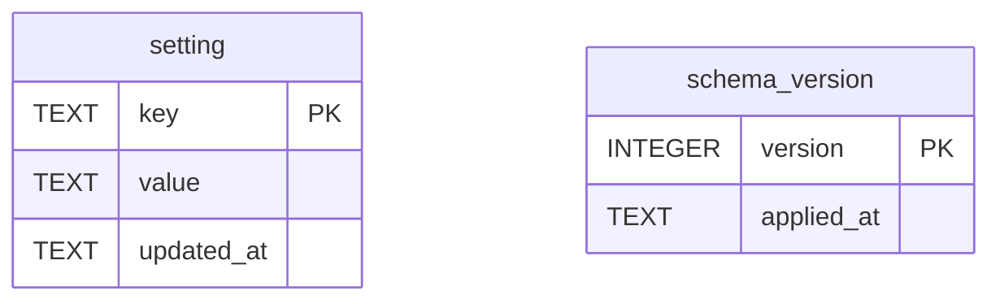

# Data model — settings

As-built, read from `crates/snapdown-store/src/sqlite/migrations.rs` (migration v1) on 2026-08-23.

Two tables, no relations, and that is the whole storage shape of this component.

## Dictionary — `setting`

| Column | Type | Null | Meaning |
|---|---|---|---|
| `key` | `TEXT` `PRIMARY KEY` | no | The name the rest of the product asks for. One row per choice |
| `value` | `TEXT` `NOT NULL` | no | The chosen value, serialised. Absence of a row means *unset*, which reads as the shipped default (`BR-111`) |
| `updated_at` | `TEXT` `NOT NULL` | no | RFC 3339 UTC with an explicit `Z`, per `cross-cutting.md` § Timestamps |

**Everything is `TEXT`, including numbers and booleans.** That follows the generic-`Setting` decision
in the domain model: a typed column per choice would mean a migration per choice, which is the cost
that decision exists to avoid. The type lives in the code that reads the key, and the store does not
know or care.

## Keys in use

| Key | Value shape | Owner of the meaning |
|---|---|---|
| `vault_path` | absolute path | `UC-14` |
| `quality_budget.max_long_edge` | integer as text | `UC-13` |
| `quality_budget.encoder_quality` | integer as text | `UC-13` |
| `quality_budget.named` | one of `Auto` `Sharp` `Balanced` `Small` `Custom` | **planned** — `DEC-004` |
| `hotkey.capture` | accelerator string, or empty for disabled (`BR-113`) | `UC-15` |
| `hotkey.open_editor` | accelerator string, or empty | `UC-15` |
| `startup.registered` | **planned** — see below | `UC-16` |
| `open_editor_after_capture` | `true` / `false` | `UC-16` |
| `web_service.address` | URL | `sharing`, read-only |

## Two things the shape cannot currently say

**`quality_budget.named` does not exist.** The budget is two integer keys, which is the pre-`DEC-004`
shape. `BR-116` requires the named state and the resolved pair to be one write that can never be
observed disagreeing — three keys written separately cannot promise that. `[MISSING]` — the write
needs to become a single transaction over all three, and the migration adding the key is where that
is enforced.

**`startup.registered` does not exist, and its absence is the defect.** The current design reads the
Windows registration and stores nothing. That is right for the *value* — the OS is the truth
(`FR-18`, `BR-114`) — and it makes `BR-112` unimplementable, because *nothing was ever configured* and
*the Reviewer turned it off* are indistinguishable when neither is recorded.

The key needed is not a copy of the OS state. It is a record of whether the Reviewer has ever
**expressed** a preference: absent, or `expressed`. `BR-112` is the only reader, and it reads it once
at first run. `[MISSING]` — dispositioned as planned work; without it, a naive *if not registered,
register* passes a fresh install and silently overrides every Reviewer who turned it off (`SCN-02`
run 3).

## `schema_version`

Owned by this component because this component opens the store. It is the migration level, not a
shared concern, which is why `cross-cutting.md` § Platform-owned explicitly declines to claim it.

Five migrations exist: v1 `setting` and `schema_version`, v2 `finding`/`note`/`marker`, v3
`bundle`/`bundle_item`, v4 `access_key`, v5 `publication`. Only v1 is this component's.

## Indexes

None on `setting`. `key` is the primary key and the table holds fewer than twenty rows for the life of
an installation. An index here would be ceremony.
