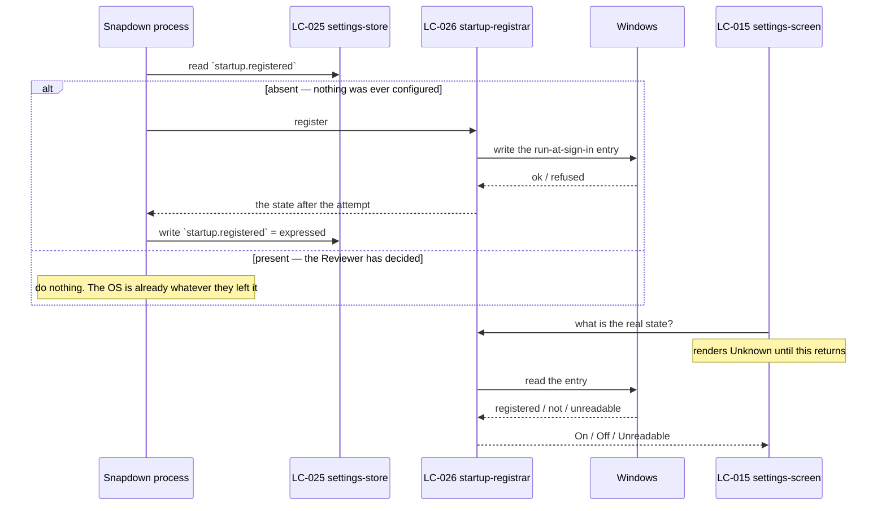

# Flow — startup reconciliation

The mechanism behind `BR-112` and `SCN-02`. It runs once per process start, before the Editor window
is ever shown.

## The two reads, and why they are different questions

The store read answers **"has the Reviewer ever expressed a preference?"** — one bit, written once,
and the only thing the operating system cannot tell us.

The registrar read answers **"is it registered right now?"** — and that answer is always taken from
Windows, never from the store (`BR-114`).

Conflating them is the entire defect. *If not registered, register* uses the OS to answer a question
about the Reviewer's intent, and it passes a fresh install, passes the moment the Reviewer disables
it, and then silently re-enables at the next sign-in (`SCN-02`, run 3).

## Ordering that matters

The store write happens **after** the registration attempt, not before, and it records `expressed`
whether the attempt succeeded or was refused. A refused first-run registration is still an expression
of the default having been applied — retrying it forever would make a machine that forbids autostart
fight the product at every sign-in.

The screen never renders a definite state before the registrar has answered. `Unknown` is a rendered
value, not a spinner (`state-machines.md` § 1).

## As-built

`[MISSING]` — none of the store side exists. `apps/desktop/src-tauri/src/commands/startup.rs` reads
the registrar and returns `StartupStatusDto { enabled: bool }`; there is no `startup.registered` key
and no first-run branch. `App.tsx` supplies the missing third state by guessing `useState(true)`.

`[PARTIAL]` — the registrar port and a `MockAutoStartBackend` do exist
(`apps/desktop/src-tauri/src/startup/mod.rs`), which is what makes `SCN-02`'s four runs testable
without touching a real registry once the store side is written.
