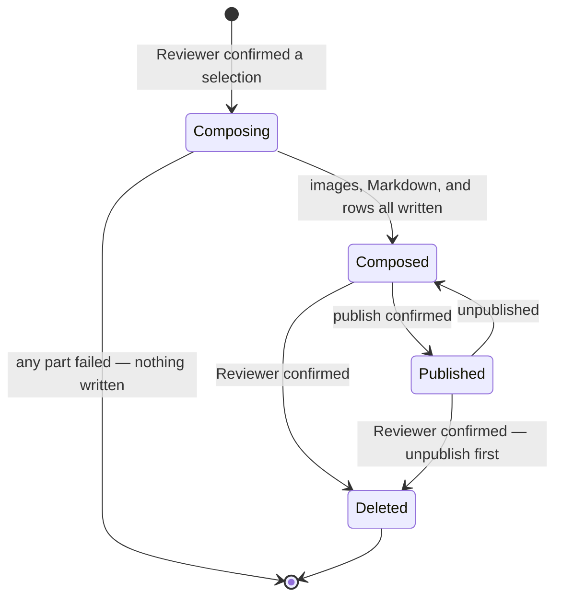
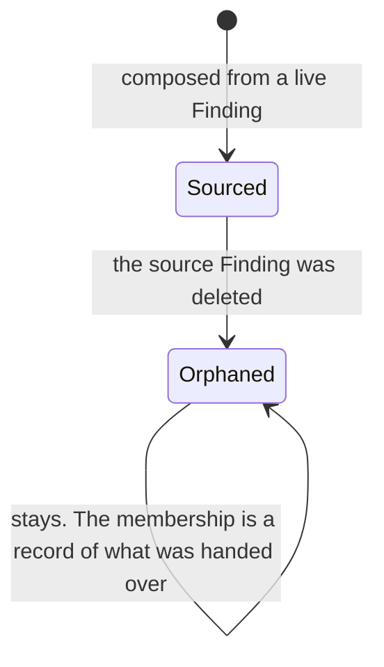

# SRS — bundle

> Generated by `.constitution/method/scripts/validate.py --generate`. MUST NOT be hand-edited.


`mode: guarded` · `risk_accepted: medium` — from `components.yaml`.


## Decision Summary

This component is the moment a review stops being a pile of Findings and becomes an artifact. The
Reviewer selects the Findings that belong to one concern, names the group, and this component writes
one Markdown document in which every Note sits under the image it describes, in the order they were
selected, with each Finding's Markers burned into its own copy of the image.

Two decisions carry the rest. A Bundle is a **snapshot**: editing a Finding afterwards changes nothing
in a Bundle that already holds it, because a Bundle that drifts from what was handed over is worse
than no Bundle. And a Bundle's Markdown is composed **once, by the core, and stored**, so that every
handoff path serves the same authored document rather than each surface authoring its own.

It runs at `mode: guarded` and `risk_accepted: medium`. Deleting a Bundle removes files from disk and
cannot be undone, and a Bundle's images may hold anything that was on the Reviewer's screen. Since 2026-08-31
a Bundle's own title and notes can also be corrected after composition (`FR-40`), and the captures
behind it can be destroyed while it survives (`FR-41`, which belongs to `finding`).

**A Bundle carries a last-edited time, distinct from when it was composed.** Correcting its title or
notes (`FR-40`) moves it; a Save that changes nothing does not, and neither does anything that happens
to a Finding, since a Bundle is a snapshot. A freshly composed Bundle has not been edited, so its
last-edited time equals its composed time until the first real Save — the two are shown apart in the
Library only once they differ, so a Bundle nobody has corrected reads as exactly what it says: composed,
once, and untouched since.

**Corrected 2026-08-31, two claims.**

The second decision used to end *"so that the clipboard, the Local API, and a published page all serve
identical bytes — three handoff paths, one document."* Both halves of that were wrong.

*Identity is not what is promised.* `DEC-012` settles it: "`AD-9` guarantees that every handoff path
serves the **same authored document**: a path MAY substitute the base of a Bundle's image links so that
they resolve for its own reader, and MUST NOT change anything else — no re-ordering, no decoration, no
summarising, no editing of a single character the composer wrote. The substitution is made **by the
composer**, taking the base path as a parameter; a surface MUST NOT rewrite a document the composer has
already produced." `AD-9`'s own **Prevents** is what settled it: the harm named there is two readers
disagreeing about the same review, and a link that resolves for its own reader does not cause it.

*Two of the three named paths do not exist, and did not when this was written.* Verified in the code on
2026-08-31: the clipboard-Markdown path has no implementation at all — every clipboard call in the tree
is a bitmap write serving `FR-36`, and the desktop UI has no copy-markdown callback — and the Local API
does not exist, which is `BUG-59`'s own title. Only the published page runs. This document therefore
described a three-surface architecture for nine days while one surface existed, and the correction is
recorded rather than quietly made because the claim was load-bearing: it is cited in § Risks as the
reason a golden-file test is sufficient.

The mode sentence has now been wrong twice and is worth stating as a pattern rather than a third
correction. It first read *"It runs at the global `mode: outline`"* while `components.yaml` had raised
this component to `deep` on 2026-08-23. Corrected to `deep` on 2026-08-31 — and by then the owner had
already moved it again, so *that correction was stale the day it was written*: the row has read
`mode: guarded`, `risk_accepted: medium` since 2026-08-31. It now says so.

**A depth setting does not belong in prose.** `components.yaml` is the only place it is true, it moves
whenever the owner says so, and a copy here can only ever be right by luck. This sentence stays because
a reader deserves to know at what depth the document was written — but it is a **statement about the
past**, and if it disagrees with the registry, the registry is right and this line is the defect.


## Why

Because grouping is a decision, not a by-product. The Reviewer knows which five of their eleven
Findings are one concern; nothing else does. This component exists to capture that judgement and
freeze it into something citable — which is a different job from holding Findings, and would be a
different job even if both lived in one screen.


## Actor Register

| Actor | Who they are | What they may do |
| --- | --- | --- |
| Reviewer | The person operating Snapdown. The only human actor and the only writer | Compose a Bundle from a selection, name it, list Bundles, open one, copy its Markdown, correct its title and its notes, export it as a PDF, and delete it with its files |

An agent reads Bundles, but never through this component: the Reviewer copies a Bundle's Markdown and
pastes it, or `sharing` serves it over a Publication, and both are read-only per AD-5. (`agent-access`
was a third such surface until `DEC-016` withdrew it on 2026-09-04.)

**Amended 2026-08-31.** The Reviewer's rights used to end *"delete it with its files, and choose in the
same act whether its source Findings go too"*. That last clause is gone: `FR-14` no longer offers a
combined destroy, and destroying a Bundle's source Findings is now `FR-41`, whose use case belongs to
`finding` rather than here — the Reviewer reaches it from a Bundle, but what it destroys is a capture.
Correcting a title and exporting a PDF are the two rights added.


## UC Catalogue

Rendered from `usecases.yaml`.

| id | Use case | Component | Satisfies | critical |
| --- | --- | --- | --- | --- |
| `UC-9` | I turn the findings I picked into one review document | `bundle` | `FR-10` | no |
| `UC-10` | I look back at the reviews I have already put together | `bundle` | `FR-11` | no |
| `UC-11` | I drop a whole review straight into the conversation I am having with my agent | `bundle` | `FR-12` | no |
| `UC-12` | I get rid of a review and everything in it | `bundle` | `FR-14`, `FR-44` | yes |
| `UC-28` | I turn a review into something I can send to a person who does not have Snapdown | `bundle` | `FR-39` | no |
| `UC-29` | I fix a typo in a review I have already put together | `bundle` | `FR-40` | no |


## Constraints

| Constraint | Source |
| --- | --- |
| A Bundle's Markdown is composed once by the core and stored. Every handoff path serves that same authored document; a path may substitute the base of an image link so it resolves for its own reader, and may change nothing else | AD-9, DEC-012 |
| A Bundle's stored document is changed only by the composer writing it again over the Bundle's own copy. No surface edits it directly, and no change to a Bundle reads or writes a Finding | BR-11, DEC-012 |
| Editing a Finding, its Note, or its Markers changes nothing in a Bundle that already holds it | BR-10 |
| A record and its files are created and removed in one unit of work | AD-2, BR-5 |
| Composition refuses, naming the Finding, when a selected Finding's image file is missing | BR-13 |
| The store permits one Finding to belong to several Bundles, each keeping its own image copy — but no surface offers it: a Finding a Bundle already holds leaves the filmstrip, which is the only place assembly selects from | BR-12 |
| Marker positions arrive normalised and are burned in at the image's stored dimensions; nothing is re-scaled | AD-3, AD-4, BR-8 |
| Deleting a published Bundle unpublishes it in the same action | BR-23 |
| The **stored** Markdown is CommonMark with relative image paths, in the shape `cross-cutting.md` defines. `NFR-8` governs the file in the Vault, which is what makes the Vault movable; it does not govern what a handoff path serves — that is the row above | NFR-8, cross-cutting.md § Bundle Markdown shape |
| Findings, Notes, and Markers are read-only here — `finding` owns them | `components.yaml` → `owns` |
| The Vault location is read from `settings` | `components.yaml` → `owns` |


## Non-Goals

- **Capturing, noting, or marking.** All three are `finding`.
- **Changing which Findings a Bundle holds.** The set is fixed at composition. Nothing here adds,
  removes, reorders or replaces one, and a different selection means a new Bundle. This is the part of
  the old "editing" prohibition that survives, and it is the part that was doing the work.
- **Reordering after composition.** Selection order is the ordering. A second mechanism would be a
  second source of truth.
- **Destroying the Findings a Bundle was composed from.** `FR-41` promises it, and it belongs to
  `finding` — `bundle` has no authority to write a Finding. This component only knows that a Bundle
  whose Findings are gone can no longer give them back (`BR-122`).
- **Publishing.** `sharing` owns the Publication; this component only knows that deleting a published
  Bundle must end one.
- **Exposing a Bundle to an agent.** `sharing`, and the Reviewer's own Copy Markdown. (`agent-access`
  was named here too until `DEC-016` withdrew it on 2026-09-04.)

**Three entries left this list on 2026-08-31**, each superseded by a promise that now exists. What
they said is recorded rather than deleted, because each was cited as a reason:

- *"**Editing a composed Bundle.** BR-11. A change means composing a new one."* Withdrawn by `FR-40`
  and by `BR-11`'s narrowing. What replaced it is narrower and is the second bullet above: the
  Finding **set** is fixed, but the Bundle's own title and notes are not.
- *"**Renaming a Bundle.** Out of MVP scope: a rename that does not rewrite the document's heading is
  a lie, and rewriting it contradicts BR-10."* Withdrawn by `FR-40`. Two things are worth separating
  here. The **objection** never applied to the design that replaced it: `FR-40` rewrites the heading
  when the title changes, so the rename it promises is not the lie this line guarded against — only
  the scope boundary ever bit. And the clause *"rewriting it contradicts BR-10"* was **wrong on its
  own terms** from the day it was written. `BR-10` says editing a *Finding* changes nothing in a
  Bundle that already holds it; it says nothing about a Bundle rewriting its own heading, and never
  did. It stood here since G3 as a reason nobody checked.
- *"**Exporting to anything but Markdown.**"* Withdrawn by `CAP-12` and `FR-39`. It was an MVP
  boundary, and it held for exactly as long as every reader of a Bundle was a machine.


## Prerequisite

- `finding` must exist and hold at least one Finding with a present image file. CAP-4 declares
  `depends_on: [CAP-3]` for exactly this reason.
- A writable Vault location, supplied by `settings`.
- Nothing external.


## Success Signal

Composing five selected Findings under a chosen name produces one Markdown file whose five Notes sit
under their own five images, in the selected order, with every image reference resolving and every
Marker badge matching its numbered line. Pasting the copied Markdown into a plain text editor yields
that same document, with every image link naming a location its reader can open. Correcting the
Bundle's title afterwards rewrites the document's heading and leaves its images and its source
Findings untouched. Deleting the Bundle leaves neither its Markdown nor its images in the Vault.

**Corrected 2026-08-31.** The third sentence used to read *"Pasting the copied Markdown into a plain
text editor yields that file unchanged."* Under `DEC-012` the clipboard may render image links against
a different base, so *unchanged* is no longer the signal — *the same document* is.


## Design Reference

Paired with `.how/bundle/SDD-bundle.md`.

Binding invariants: **AD-2** (a record and its files live or die together), **AD-3** (Marker
coordinates normalised), **AD-4** (no re-encoding after capture), **AD-9** (one Bundle, one authored
document, on every path).

**`DEC-012` is applied and binds this component** — it is what narrowed `AD-9`, and § Constraints cites
it twice. This paragraph read *"No applied `DEC-` binds this component yet"* until 2026-08-31, which
contradicted the same document two screens above it.

---


## Business rules — local — `02-rules/`


### `rules-bundle.md`

### Business Rules — bundle

Rules binding **only** this component. A rule that turns out to bind a second one is promoted to
`.what/business-rules.md`, never copied.

Ids continue the global sequence.

#### Rules

| id | Rule | Binds | Source | Status |
| --- | --- | --- | --- | --- |
| BR-57 | A Bundle's name appears as the composed document's heading. | `bundle` | FR-10 · UC-9 | active |
| BR-58 | The Findings appear in the Bundle in the order the Reviewer selected them. | `bundle` | FR-10 · UC-9 | active |
| BR-59 | Composing does not remove the Findings it used from the Library. | `bundle` | FR-10 · UC-9 | active |
| BR-60 | A Bundle holds at least one Finding. A Bundle of zero is never created. | `bundle` | FR-10 | active |
| BR-61 | A Bundle may hold exactly one Finding, and nothing about it is special-cased. | `bundle` | FR-10 · OQ-16 | active |
| BR-62 | Every image the composed document references exists as that Bundle's own copy before the Bundle is listed. | `bundle` | BR-2 (AD-2) · FR-10 | active |
| BR-63 | A Bundle's images carry that Finding's Markers, drawn at the stored image's own dimensions. | `bundle` | FR-10 · AD-3 · AD-4 | active |
| BR-64 | Bundles are listed newest first. | `bundle` | FR-11 · UC-10 | active |
| BR-65 | Opening a Bundle shows what was composed, not a live view of the Findings as they are now. | `bundle` | BR-10 · FR-11 · UC-10 | active |
| BR-66 | A Bundle whose Markdown file is missing is shown as broken. It is never omitted from the list. | `bundle` | FR-11 | active |
| BR-67 | Copying a Bundle puts its Markdown on the clipboard exactly, with no added wrapper and the same relative image paths as the file. | `bundle` | FR-12 · UC-11 | active |
| BR-68 | The Reviewer is told when a copy succeeded. | `bundle` | FR-12 · UC-11 | active |
| BR-69 | Deleting a Bundle asks once and names the Bundle. | `bundle` | BR-6 · FR-14 · UC-12 | active |
| BR-70 | Deleting a Bundle does not delete the Findings it was composed from, unless the Reviewer chose that in the same confirmation. | `bundle` | FR-14 · UC-12 | active |
| BR-71 | A Bundle is never renamed. A different name means a different Bundle. | `bundle` | BR-11 · PRD §6.2 | active |
| BR-72 | The Findings in a Bundle are never reordered after composition. | `bundle` | BR-11 · PRD §6.2 | active |

#### Retired

None yet.


## Domain — `03-domain/`


### `domain-model.md`

### Model — bundle

Conceptual. No column types, no storage shape.

#### Entities

| Entity | What it is | Identified by |
| --- | --- | --- |
| Bundle | A named group of Findings, frozen once into one review document that can be handed to an agent. Not a view over the Findings — a snapshot of them | Its own opaque identifier |
| BundleItem | The membership of one Finding in one Bundle: where it sits in the reading order, and the image copy written for it with its Markers drawn in | Its Bundle and its Finding together |

#### Relationships

- One Bundle is made of **one or more** BundleItems. A Bundle with none is not a Bundle and is never
  created.
- One BundleItem belongs to **exactly one** Bundle and refers to **exactly one** Finding.
- One Finding may appear in **zero, one, or several** Bundles, each with its own BundleItem and its
  own image copy (BR-12).
- One Bundle has **exactly one** composed Markdown document, and that document is the Bundle's
  content rather than a rendering of it (AD-9).
- One Bundle has **zero or one** Publication, owned by `sharing`. This component knows only that
  deleting a published Bundle must end one (BR-23).
- A BundleItem refers to a Finding but does not depend on it surviving. Deleting the Finding leaves the
  Bundle readable, because the image copy is the Bundle's own.

#### State Lifecycle

A Bundle has no **stored** status of its own. It is composed, and after that it is either present or
gone. There is no draft and no revision: a correction to its title or its notes rewrites the one
document in place (FR-40), and no earlier version is kept.

**Amended 2026-08-31.** This paragraph used to end *"there is no draft, no editing state, and no
revision, because BR-11 forbids editing and BR-10 makes it a snapshot"*. `BR-11` no longer forbids
editing; it was narrowed to say that only the composer changes a Bundle's document, never a surface.
`BR-10` is unchanged and still makes a Bundle a snapshot — of the Findings, which is the drift that
mattered. Editing a Bundle's own text does not reintroduce it.

One state **is** observable, and it is derived rather than stored: whether a Bundle can still give its
source Findings back. It can while those Findings exist, and cannot once they are gone (FR-41). The
answer is read from whether the Findings exist, never from a flag on the Bundle — which is why
migration v6 dropping `bundle_item`'s foreign key to `finding` is what makes the second condition
legal rather than a broken row. → BR-122

The one thing that looks like a state and is not: whether a Bundle is published. That belongs to its
Publication, owned by `sharing`, and asking the Bundle would be asking the wrong entity.

#### Invariants

1. A Bundle holds at least one BundleItem. → FR-10
2. A Finding appears at most once in one Bundle. → BR-12
3. BundleItem positions within one Bundle are a contiguous reading order with no gaps and no ties.
   → FR-10
4. A Bundle's composed document is written only by the composer, over the Bundle's own copy. No
   surface writes it directly, and writing it never reads or writes a Finding. → BR-10, BR-11, AD-9
5. Every image a Bundle's document references exists as that Bundle's own copy, at the same dimensions
   as the Finding's image it was copied from. → BR-13, AD-3, AD-4
6. Composition refuses, naming the Finding, if any selected Finding's image is missing. A Bundle with
   a broken image reference is never written. → BR-13
7. A Bundle is created together with its document and its image copies, and removed together with all
   of them. If any file cannot be removed, nothing is removed. → BR-5, AD-2
8. Editing a Finding, its Note, or its Markers changes nothing in a Bundle that already holds it.
   → BR-10
9. Deleting a Bundle that has a live Publication ends that Publication in the same act. If it cannot,
   the deletion does not happen. → BR-23, BR-20
10. A Bundle can give its source Findings back for exactly as long as those Findings exist. Once they
   are gone the Bundle stays readable on its own copies and that offer is withdrawn. → BR-122, FR-41


### `state-machines.md`

### State machines — bundle

`mode: deep` asks for this slot. Two machines, and the first one is short on purpose.

#### 1. A Bundle



**There is no `Draft` and no `Editing`.** A Bundle is composed once and stored (`AD-9`); it is
recomposed, never patched. The absence of an editing state is the promise, and it is why the preview
has no cursor.

**`Composing` never persists.** It is a state of an operation, not of a record — nothing writes a
Bundle row until every image copy and the Markdown are on disk (`AD-2`). A failure returns to nothing
at all, which is why the left transition goes to the terminal state rather than to a partial one.

**`Published → Deleted` passes through an unpublish.** `BR-23` makes it one action, and the ordering
matters: unpublish first, then delete. The reverse leaves a live URL for a Bundle that no longer
exists, and nothing local would know.

#### 2. A BundleItem's relationship to its source Finding

Not a lifecycle of the item. The item never changes: its position is fixed at composition (`BR-58`)
and its image copy is its own. What changes is the **world around it**.



`Orphaned` here means something different from `finding`'s `Orphaned`, and the collision is worth
naming: in `finding` it means *the record exists and its image file is gone*. Here it means *the
membership exists and the Finding it recorded is gone, and its own image copy is fine*. The first is a
fault to be repaired; the second is the normal, correct end state of a Bundle that outlived the
Findings that fed it.

**There is no transition out.** A `BundleItem` whose source is gone stays exactly as it is. Removing
it would rewrite the record of what was delivered, and the Bundle's stored Markdown — which still has
its section — would then disagree with its own item list.

#### The defect this second machine exists to name

The code has no `Orphaned` state here, because `bundle_item.finding_id` carries
`ON DELETE CASCADE` and the row is deleted instead. `Sourced` transitions to *gone*.

The stored Markdown survives, so the Bundle still reads correctly and still copies the same bytes —
and its item list is silently one row short. `BUG-1`, with `SCN-05` carrying the case.

Drawing this machine is what surfaced it. At `outline` this slot does not exist, the transition was
never drawn, and nothing in the corpus said the row had to survive.


## Use cases — `04-usecases/`


### `EXPERIENCE.md`

### EXPERIENCE — Bundle

#### Information architecture

Bundles is one of the Editor's four primary surfaces (`FR-28`). It holds three regions: the **bundle
list**, the **Markdown preview**, and the **item list** for the selected Bundle.

A Bundle is only ever created from Findings, and only from the Findings surface (`FR-9`, `FR-10`).
There is no "new empty Bundle" here, and that absence is deliberate: a Bundle with nothing in it is a
name with no observation behind it, and the product has no use for one.

Composition happens in a modal over Findings, not on this surface. Nothing that happens here creates a
Bundle; this surface is where a Bundle is read, handed over, and eventually thrown away.

#### Voice and tone

The Bundle *is* the deliverable, so the product says very little on this surface. The preview shows the
Reviewer's own Markdown, and the only product words are the three actions: Copy Markdown, Publish,
Delete.

"Copy Markdown" rather than "Export" — because `FR-12` puts it on the clipboard and the Reviewer pastes
it into an agent chat. Export implies a file dialog that does not exist.

#### Component patterns

| Pattern | Behaviour |
|---|---|
| **Bundle list** | Name, item count, composed date. Newest first |
| **Markdown preview** | The exact bytes `FR-12` copies, in `--font-mono`, scrollable, read-only |
| **Item list** | The Findings inside, in Bundle order, each with its note's first line |
| **Compose modal** | Over Findings. Names the Bundle and confirms the selection |

**The preview is read-only, and that is a promise rather than a limitation.** `FR-11` and the Non-Goals
say a Bundle is recomposed, never patched — an edited Bundle would drift from the Library that produced
it, and the images it points at would no longer be explained by any Finding. An editable preview would
quietly break that. The surface therefore shows the Markdown and offers no cursor in it.

#### State patterns

| Surface state | What the Reviewer sees |
|---|---|
| **Empty** | "No bundles yet", and one sentence saying where a Bundle comes from — select Findings and compose. The action is on the *other* surface, so the empty state says so rather than offering a button that leads nowhere |
| **Loading** | The three regions hold their shape; the list shows skeleton rows |
| **Nothing selected** | List populated, preview shows a muted invitation. Distinct from empty |
| **Populated** | Normal |
| **Images missing** | The Bundle's own image copies are gone from the Vault. The preview renders, the item list flags which items lost their file, and Delete is still offered. It does not pretend the Bundle is intact |
| **Error** | The Library could not be read. One message, one Retry |

The **compose modal** has its own set: composing · naming refused because the name is empty or taken ·
composing failed, with nothing half-written.

#### Interaction primitives

- **Copy Markdown is one action with visible confirmation.** A toast, because a silent clipboard write
  is indistinguishable from a failure.
- **Delete is confirmed once, and it is real.** `FR-14` removes the Bundle's image copies with it.
- **Deleting a Bundle does not delete the Findings it came from.** The confirmation says so — the
  Reviewer will otherwise assume it cascades, because deleting a Finding *does* delete its file.
- **Publish is present and frozen.** `DEC-005` holds `sharing` still, so the action shows the current
  publication state and gains no new behaviour this release. Removing it would break `FR-28`.
- **No drag to reorder.** Order is fixed at composition, because the Markdown is written once.

#### Accessibility floor

**WCAG 2.2 AA**, per `NFR-16`.

- The preview is a read-only region with an accessible name, not a disabled text field. A disabled
  field is announced as unavailable, which is the wrong meaning: the content is available, it is the
  editing that does not exist.
- Copy Markdown announces its result. A clipboard write with no announcement is invisible to a screen
  reader, and it is the primary handoff path in the whole product.
- The item list is a list, and each row names its Finding and its position in the Bundle.
- Contrast holds in both Windows themes. `BundleView` used to paint `#f8fafc`, `#ffffff`, `#e0f2fe`
  and `#f1f5f9` panels regardless of theme, so under the Windows dark theme the shell's white text
  landed on them. Resolved by `W6-S1`; the promise is what remains, and it is now checked by an
  assertion rather than by inspection.

#### Key flows

**Wira hands over one Bundle — `UJ-3`.** He has five Findings from a pass over the staging site. On
Findings he ticks all five and clicks Compose. He names it `checkout-pass-1`. Snapdown writes one
Markdown file where each note sits under the image it describes, with the Markers burned in. He lands
on Bundles with it selected, reads the preview to confirm the order is the order he meant, and clicks
Copy Markdown. He pastes into his agent. **The climax beat is the paste working first time** — every
image path resolves, because `NFR-8` requires them to resolve relative to the Markdown file's own
folder.

**Wira throws away last month's review.** Bundles, select `checkout-pass-1`, Delete. The confirmation
names the Bundle, says its image copies go with it, and says the five original Findings stay. He
confirms. The Vault holds no file the Library does not point at (`NFR-5`).

#### Edge cases

| Moment | What the Reviewer does next |
|---|---|
| A Bundle name is already taken | Refused while typing, in the modal, naming the existing Bundle |
| Composition fails partway | Nothing is written — no half-Bundle, no orphan images. `FR-10` is all-or-nothing |
| A Finding in the Bundle was deleted afterwards | The Bundle is intact; it holds its own image copies. The item list still names the Finding. This is `FR-13` working, not a fault. **It does not hold in the shipped product: `BUG-1`.** `bundle_item.finding_id` cascades, so the item list silently loses its row while the Markdown and the image copy survive. Fixed by `W6-S9` |
| A Bundle's own image copy is missing from the Vault | The item is flagged, the Bundle still opens, Delete still works, and the orphan report is offered |
| Copy Markdown while the clipboard is locked by another program | The failure is reported. A silent failure here loses the handoff and the Reviewer would not know |
| A Bundle of one Finding | Allowed and normal. `OQ-16` records that the extra step may want a shortcut; it is not a different path |
| The Bundle is published and then deleted | The publication is withdrawn with it (`BR-23`). The confirmation says so before, not after |


### `UC-12-get-rid-of-a-review-and-everything-in-it.md`

### UC-12 — I get rid of a review and everything in it

`critical`: files leave the disk and cannot be recovered, and if the Bundle is published this is also
the act that takes it off the internet.

#### Trigger

The Reviewer chooses to delete a Bundle, from the Bundle list or from the Bundle's own view.

#### Precondition

The Bundle exists. The Vault is reachable. If the Bundle is published, the web service is reachable —
otherwise the deletion cannot complete and step 3 says so.

#### Main Flow

1. The Reviewer chooses to delete a Bundle.
2. Snapdown asks once, naming the Bundle, saying that its Markdown and its images go, and offering —
   in the same confirmation — to delete the Findings it was composed from as well.
3. The Reviewer confirms, with or without the Findings.
4. If the Bundle is published, Snapdown unpublishes it and waits for the service to confirm.
5. Snapdown removes the Bundle's image copies and its Markdown file from the Vault.
6. Snapdown confirms every file is gone.
7. Snapdown removes the Bundle and its memberships from the Library.
8. If the Reviewer chose it, Snapdown then deletes the source Findings, which is UC-7.
9. The Bundle list no longer holds it.

#### Alternate Flows

| From step | Condition | What happens |
| --- | --- | --- |
| 3 | The Reviewer declines | Nothing is removed and nothing is unpublished |
| 3 | The Reviewer confirms without the Findings | The Findings stay in the Library. This is the default (BR-70) |
| 4 | The Bundle was never published | Step 4 is skipped |
| 5 | One of the Bundle's files is already gone | Treated as success for that file, the same as in UC-7 |
| 8 | A source Finding is in another Bundle too | It is still deleted; that other Bundle keeps its own image copy and stays readable (BR-12, BR-56) |

#### Failure Flows

| From step | Failure | What the system does | What the user is left with |
| --- | --- | --- | --- |
| 4 | The unpublish is not confirmed by the service | Abandons the whole deletion. The Bundle stays, and stays marked published, because telling the Reviewer it is private when it may not be is the worse outcome (BR-20, BR-23) | The Bundle present and still marked published, with the failure named and the option to retry |
| 5 | A file refuses to be deleted | Abandons the deletion. Not one file and not one row is removed (BR-5) | A dialog naming which files refused. The Bundle still present |
| 7 | The store write fails after the files are gone | Cannot be rolled back. The rows stay, so the Bundle shows as broken rather than vanishing | The Bundle shown as broken, and the orphan report offering to remove the rows. The recoverable direction, on purpose |
| 8 | Deleting the source Findings fails | The Bundle is already gone and stays gone. The Findings stay, and the failure is reported separately | The Bundle deleted, the Findings still present, and a message saying so. Two acts, reported as two |

#### Outcome

The Bundle is gone from the Library, its Markdown and image copies are gone from the Vault, and if it
was published its URL no longer resolves. The source Findings are gone too if the Reviewer said so,
and still there if they did not. Nothing is archived and nothing is recoverable.

#### Business Rules

BR-5, BR-6, BR-7, BR-12, BR-20, BR-23, BR-56, BR-69, BR-70, and NFR-5 as the invariant the flow keeps.


### `UC-9-turn-what-i-picked-into-one-review.md`

### UC-9 — I turn the findings I picked into one review document

#### Trigger

The Reviewer has a selection of Findings in the Editor and chooses to compose a Bundle from it.

#### Precondition

At least one Finding is selected. Every selected Finding's image file is present in the Vault. The
Vault is writable.

#### Main Flow

1. The Reviewer selects the Findings that belong to one concern.
2. The Reviewer chooses to compose a Bundle.
3. Snapdown asks for a name.
4. The Reviewer names it.
5. Snapdown writes, as one act: a copy of each Finding's image with that Finding's Markers drawn in,
   one Markdown document in which each Note sits under its own image in the selected order, and the
   Bundle itself.
6. The new Bundle appears at the top of the Bundle list, with its name and its Finding count.
7. The Findings remain in the Library, unchanged and still selected-independent.

#### Alternate Flows

| From step | Condition | What happens |
| --- | --- | --- |
| 1 | Exactly one Finding is selected | An ordinary Bundle of one is composed. Nothing is special-cased, and this is how a single screenshot is later published (BR-61) |
| 1 | A selected Finding is already in another Bundle | Composed again, with its own image copy for this Bundle. One Finding may belong to several (BR-12) |
| 1 | A selected Finding has no Markers | Its image is copied with nothing drawn on it, and its Note has no numbered lines |
| 1 | A selected Finding has an empty Note | Its section heading falls back to "Finding N" rather than being blank (`cross-cutting.md` § Bundle Markdown shape) |
| 4 | The Reviewer gives a name a Bundle already has | Allowed. A name is a label, not an identifier; two Bundles may share one |

#### Failure Flows

| From step | Failure | What the system does | What the user is left with |
| --- | --- | --- | --- |
| 5 | A selected Finding's image file is missing | Refuses the whole composition and names the Finding. No Bundle with a broken image reference is ever written (BR-13) | The selection intact, and a message naming which Finding is broken. The orphan report can then resolve it |
| 5 | Burning a Marker into an image fails | Abandons the composition. Nothing is written — no rows, no files (BR-5) | The selection intact, and a message saying the Bundle could not be composed |
| 5 | The Vault runs out of space partway through the image copies | Abandons the composition and removes any copies already written | The selection intact, the Vault as it was, and a message naming the space |
| 5 | The store write fails after the files are written | Removes the files it wrote, then reports the failure | The Vault as it was. Nothing half-composed appears in the list |
| 3 | The Vault is not writable | Refuses before asking for a name | A message naming the Vault path, with an action that opens Settings |

#### Outcome

One Bundle exists, holding its own copy of each selected Finding's image with the Markers drawn in,
and one Markdown document where every Note sits under the image it describes. It is a snapshot:
editing those Findings afterwards changes nothing in it. The Findings are all still in the Library.

#### Business Rules

BR-5, BR-10, BR-11, BR-12, BR-13, BR-57, BR-58, BR-59, BR-60, BR-61, BR-62, BR-63, BR-64, and NFR-8
as the property the composed document has to have.


## Scenarios — `05-scenarios/`


### `SCN-05-a-finding-deleted-out-from-under-a-bundle.md`

### SCN-05 — A Finding deleted out from under a Bundle

Branches from `UC-12`'s neighbourhood rather than its flow: it is the case where the *other*
component's deletion reaches this one. It is written because the as-built pass found the code and the
promise disagreeing here, and the disagreement is silent.

#### The promise

`FR-13`, third consequence, verbatim:

> A Finding that belongs to a Bundle can still be deleted; the Bundle keeps its own copy of the image
> and stays readable.

`EXPERIENCE-bundle.md` states the same thing from the Reviewer's side, and `EXPERIENCE-finding.md`
requires the deletion confirmation to *say so*, because a Reviewer will otherwise assume the Bundle
broke.

#### The setup

`checkout-pass-1` holds five Findings. The Reviewer deletes Finding 3 from the Findings surface,
confirming once. They then open Bundles.

#### What must happen

1. The Bundle still exists and still opens.
2. Its Markdown is unchanged — five sections. It was composed once and stored (`AD-9`), and nothing
   recomposes it.
3. Its own copy of Finding 3's image is still in the Vault and still referenced.
4. The item list still shows five items, including the one whose source Finding is gone.
5. Copy Markdown still produces the same bytes it produced yesterday.
6. Publishing still works, and a published copy is unaffected.

Point 4 is the one worth arguing about, and it is right: a `BundleItem` is the **membership** of a
Finding in a Bundle, holding the position and the image copy that was written for it. The Finding
going away does not unmake the membership; the Bundle is a record of what was handed over, and
rewriting history because a source was tidied up would make a delivered document disagree with what
was delivered.

#### What the code actually does — a defect

`crates/snapdown-store/src/sqlite/migrations.rs`, migration v3:

```sql
CREATE TABLE IF NOT EXISTS bundle_item (
    ...
    FOREIGN KEY(bundle_id)  REFERENCES bundle(id)  ON DELETE CASCADE,
    FOREIGN KEY(finding_id) REFERENCES finding(id) ON DELETE CASCADE,
    ...
);
```

The second cascade is the problem, and it is live: `finding_store.rs:29` sets
`PRAGMA foreign_keys = ON`.

**Deleting a Finding deletes its `bundle_item` rows.** Points 4 and 5 above fail. The Bundle's stored
Markdown survives — `bundle.markdown` is a column, so `AD-9` still holds — and its item list silently
loses a row, so the document and the record of the document disagree.

Nothing reports it. No test covers it: `finding_store.rs:362` asserts the cascade to `note` and
`marker`, which is correct, and nothing asserts the *absence* of one to `bundle_item`.

The first cascade, `bundle_id`, is correct and should stay — deleting a Bundle does delete its items
(`FR-14`).

#### Disposition

A `BUG-`, not planned work. The promise is older than the schema and was never withdrawn; this is code
disagreeing with a requirement that has been `active` since G2, not a requirement written after the
code.

The fix is to drop `ON DELETE CASCADE` from `bundle_item.finding_id` — the reference becomes a
historical one — and to decide whether the column keeps its foreign key at all. It probably should
not: a `BundleItem` refers to a Finding **that may no longer exist**, which is precisely what a
foreign key exists to forbid.

#### Tests this scenario names

- `bundle::deleting_a_finding_leaves_its_bundle_item_in_place`
- `bundle::deleting_a_finding_leaves_the_bundle_markdown_byte_identical`
- `bundle::deleting_a_finding_leaves_the_bundles_own_image_copy_in_the_vault`
- `bundle::a_bundle_whose_source_finding_is_gone_still_copies_the_same_bytes`
- `bundle::deleting_a_bundle_still_cascades_to_its_items`

