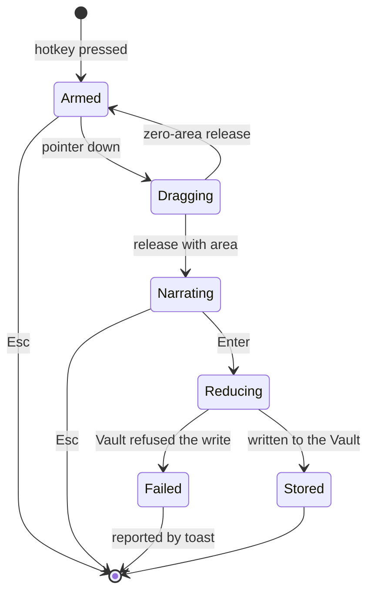
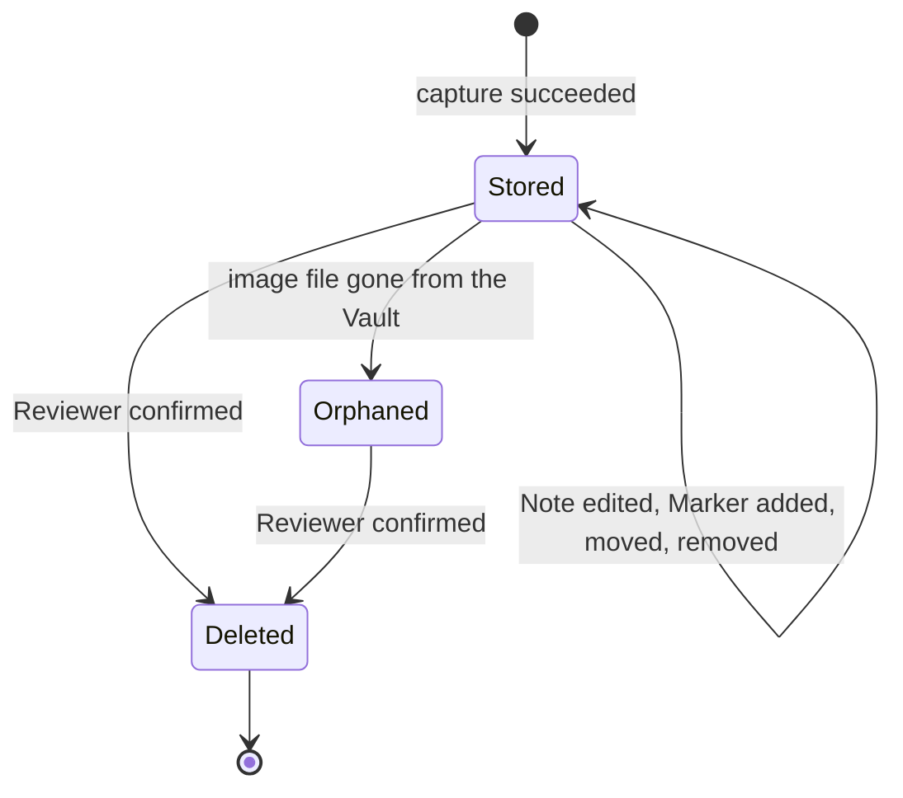
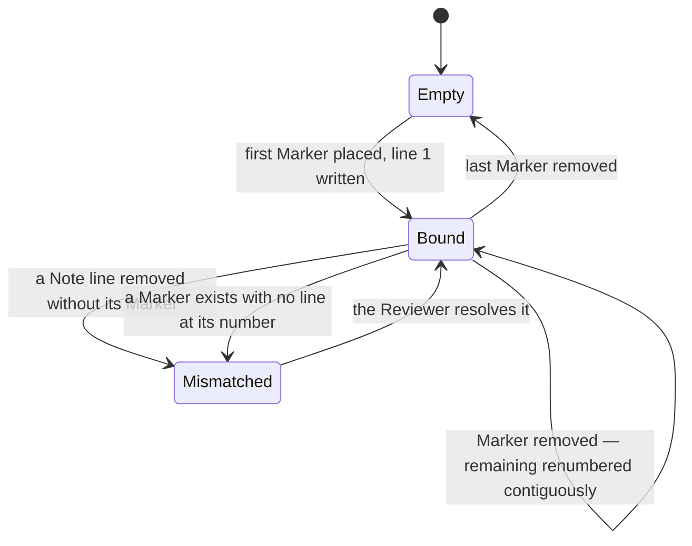

# SRS — finding

> Generated by `.constitution/method/scripts/validate.py --generate`. MUST NOT be hand-edited.


`mode: guarded` · `risk_accepted: low` — from `components.yaml`.


## Decision Summary

This component is the whole life of one observation. It puts the Capture Overlay on the screen when
the Reviewer presses the hotkey, takes the region they drag, accepts the Note they type there, reduces
the image, and stores the three as one thing. Afterwards it is what the Editor shows: the list of
Findings, the Note that can be reworded, the numbered Markers that can be placed and moved, the
multi-select that makes bulk action possible, and the deletion that takes the image file with it.

Two promises decide almost every question here. The first is that a Note and its image are one object
from the moment of capture, and that a Marker's number and its Note line are one thing rather than two
kept in step. The second is that deleting is real: the file goes, nothing is archived, and the
Reviewer is told if a file refused to go rather than being told it succeeded.

It is set to `mode: guarded` and `risk_accepted: low`. A Capture can contain anything that was on the
screen, and deletion cannot be undone — so every boundary here gets an answer for what happens when
the other side is slow, absent, or lying, and the review is the hardest the method offers.


## Why

Because the binding between an observation and its evidence is the product, and the binding is created
and destroyed here. No other component creates a Finding and no other component may write one. If this
boundary were drawn anywhere else — around "capture" on one side and "the library" on the other — the
Note would be born in one component and edited in another, and the one invariant that matters would
span a seam.


## Actor Register

| Actor | Who they are | What they may do |
| --- | --- | --- |
| Reviewer | The person operating Snapdown. The only human actor and the only writer in the product | Press the Capture hotkey, drag a region, cancel a Capture, type and reword a Note, place, move and remove Markers, select Findings, delete Findings, discard the Findings behind a finished Bundle, act on an orphan report |

No second actor. An agent never reaches this component: Copy Markdown and `sharing` read Bundles, and
BR-14 keeps an unbundled Finding invisible to both. (`agent-access` was a third such reader until
`DEC-016` withdrew it on 2026-09-04.)


## UC Catalogue

Rendered from `usecases.yaml`.

| id | Use case | Component | Satisfies | critical |
| --- | --- | --- | --- | --- |
| `UC-1` | I press a key, use precision crosshair/loupe or 1-click window/panel auto-detect, and say what is wrong with it | `finding` | `FR-1`, `FR-2` | no |
| `UC-2` | I take five of these in a row without stopping | `finding` | `FR-3` | no |
| `UC-3` | I look at everything I have captured so far | `finding` | `FR-6` | no |
| `UC-4` | I reword a note now that I have read it back | `finding` | `FR-7` | no |
| `UC-5` | I point at three separate spots inside one screenshot | `finding` | `FR-8` | no |
| `UC-6` | I pick out several findings at once | `finding` | `FR-9` | no |
| `UC-7` | I throw away the findings I am done with | `finding` | `FR-13` | yes |
| `UC-8` | I find out what has gone missing or been left behind | `finding` | `FR-15` | no |
| `UC-27` | I annotate a screenshot with visual shapes, arrows, callouts, text, or blur redaction | `finding` | `FR-30`, `FR-31`, `FR-32`, `FR-33` | no |
| `UC-30` | I get rid of the screenshots behind a review I am finished with, but keep the review | `finding` | `FR-41` | yes |
| `UC-31` | I find out which reviews are still holding my screenshots, and get that disk back | `finding` | `FR-42` | yes |


## Constraints

| Constraint | Source |
| --- | --- |
| A Marker and its numbered Note line are one stored thing. No path writes one without the other | AD-1, BR-1 |
| A record and its files are created and removed in one unit of work; a partial failure leaves the prior state | AD-2, BR-5 |
| Marker positions are fractions of the image, never pixels | AD-3, BR-2 |
| The image is reduced once, at capture, and the unreduced pixels are not retained | AD-4, BR-8 |
| No network call may happen anywhere in this component | AD-6, NFR-4 |
| Windows 11 is the only capture platform, and the capture path may not be built against a cross-platform abstraction first | Product brief, Constraints |
| Hotkey registration and capture must work without administrator rights | NFR-7, OQ-5 |
| Nothing is soft-deleted | BR-7 |
| A change to the Quality Budget never re-encodes a stored image | BR-9 |
| The Quality Budget and the Vault location are read from `settings`; this component does not own either | `components.yaml` → `owns` |


## Non-Goals

- **Composing anything.** Turning Findings into a document is `bundle`. This component does not know
  Bundles exist.
- **Owning the settings it obeys.** The Quality Budget, the Vault location, and the hotkey bindings
  belong to `settings`. This component reads them.
- **Exposing anything to an agent.** `sharing` and the Reviewer's own Copy Markdown do that, and only
  for Bundles. (`agent-access` was a third such exposer until `DEC-016` withdrew it on 2026-09-04.)
- **Freehand drawing.** Shapes, arrows, callout text and blur redaction are built (`CAP-11`, `FR-30`
  through `FR-33`, `FR-36`, `FR-37`, `FR-38`, `UC-27`) — this bullet is corrected here, by
  `wdi-autopilot`, on 2026-09-04. It read *"No arrows, callouts, blur, redaction, or freehand. Not in
  this release and not later; it is a product Non-Goal"* until an FR-30..38 verification pass found
  every one of those already shipped and tested, with this Non-Goal contradicting the same file's own
  `satisfies:` frontmatter and its own UC Catalogue's `UC-27` row. Code wins; freehand strokes with no
  fixed shape remain genuinely out of scope, which is the part of the old bullet that was never wrong.
- **Editing captured pixels.** No crop, rotate, or resize after capture.
- **Searching or filtering the Library.** Out of MVP scope, and it belongs to the store adapter when
  it arrives.
- **Deleting a Bundle.** That is `bundle`, per FR-14.


## Prerequisite

- A Windows 11 machine with at least one monitor. Capture cannot be verified headlessly, which is why
  the capture tests are the one suite that must run on a real desktop session.
- A writable Vault location. `settings` supplies a default so that BR-28 holds — capture works before
  anything is configured.
- Nothing external. This component has no third-party dependency and no row in
  `.control/questions/external.md`.


## Success Signal

Six Captures started from the application under review, in ninety seconds, produce six Findings with
six correct Notes, with no Snapdown window ever needing to be dismissed — and after deleting three of
them the Vault contains exactly three image files.

Measured: the overlay appears within 200 ms (NFR-1), the save returns focus within 500 ms (NFR-2), a
full-screen 4K capture is stored under 250 KB at the shipped default (NFR-3), and no deletion ever
leaves an orphan (NFR-5).


## Design Reference

Paired with `.how/finding/SDD-finding.md`.

Binding invariants: **AD-1** (Markers and Note lines are one sequence), **AD-2** (a record and its
files live or die together), **AD-3** (Marker coordinates normalised), **AD-4** (reduce once, at
capture), **AD-6** (nothing leaves the machine).

**Two applied decisions reach this component.** `DEC-007` moved the desktop app from a React webview
to Slint, which is why the paired SDD's opening paragraph cites it; and `DEC-013` set this component's
`risk_accepted` to `low`, the strictest of the three values and the only one that requires a
two-reviewer panel on its code. This paragraph read *"No applied `DEC-` binds this component yet"*
until 2026-08-31, while the SDD it names as its pair cited `DEC-007` in its first sentence.

---


## Business rules — local — `02-rules/`


### `rules-finding.md`

### Business Rules — finding

Rules binding **only** this component. A rule that turns out to bind a second one is promoted to
`.what/business-rules.md` through `wdi-blueprint`, never copied.

Ids continue the global sequence, which ends at BR-30 in the product-wide file.

#### Rules

| id | Rule | Binds | Source | Status |
| --- | --- | --- | --- | --- |
| BR-31 | A selected region smaller than 8 × 8 pixels is refused. Nothing is stored and the overlay stays open. | `finding` | FR-1 · UC-1 | active |
| BR-32 | Escape at any point before the save discards the Capture. Nothing reaches the Vault and no row is written. | `finding` | FR-1 · FR-2 · UC-1 | active |
| BR-33 | The note field is focused the moment it appears, and the Capture can be saved without touching the mouse. | `finding` | FR-2 · UC-1 | active |
| BR-34 | Multi-line Note text is preserved verbatim, blank lines included. | `finding` | FR-2 · FR-7 | active |
| BR-35 | After a save, keyboard focus returns to the window that held it before the hotkey was pressed. | `finding` | FR-3 · UC-2 | active |
| BR-36 | The capture confirmation is a transient toast. It never takes focus, never needs dismissing, and states the running count of Findings. | `finding` | FR-3 · UC-2 | active |
| BR-37 | The Editor does not open after a Capture unless the Reviewer has turned that on. The shipped default is off. | `finding`, `settings` | FR-3 · OQ-9 | active |
| BR-38 | The Capture Overlay covers every connected monitor, and a region may be dragged on any of them. | `finding` | FR-1 · UC-1 | active |
| BR-39 | The selected region's pixel dimensions are shown while dragging. | `finding` | FR-1 | active |
| BR-40 | An image already within the Quality Budget's long edge is not upscaled. | `finding` | FR-4 | active |
| BR-41 | Reduction preserves aspect ratio. An image is never stretched, and never cropped to fit a budget. | `finding` | FR-4 | active |
| BR-42 | Reduction never delays the overlay closing. | `finding` | FR-4 · NFR-2 | active |
| BR-43 | Findings are listed newest first. | `finding` | FR-6 · UC-3 | active |
| BR-44 | A Finding captured while the Editor is open appears without the Editor being reopened. | `finding` | FR-6 | active |
| BR-45 | A Finding whose image file is missing is shown as broken. It is never omitted from the list. | `finding` | FR-6 · FR-15 · UC-8 | active |
| BR-46 | A Note edit persists without an explicit save action. | `finding` | FR-7 · UC-4 | active |
| BR-47 | The numbered lines belonging to Markers cannot be renumbered by hand. That ordering belongs to the Markers. | `finding` | FR-7 · FR-8 | active |
| BR-48 | A Marker can be repositioned without its number changing. | `finding` | FR-8 · UC-5 | active |
| BR-49 | Marker positions survive closing and reopening the Editor. | `finding` | FR-8 | active |
| BR-50 | Range selection and individual toggling both work, and the count of selected Findings is visible. | `finding` | FR-9 · UC-6 | active |
| BR-51 | Select-all and clear-selection are each one action, and the selection is cleared when an action on it completes. | `finding` | FR-9 · UC-6 | active |
| BR-52 | The orphan check runs at startup and can be run on demand. It never deletes anything on its own. | `finding` | FR-15 · UC-8 | active |
| BR-53 | A clean Vault reports itself as clean. Silence is not an answer. | `finding` | FR-15 · UC-8 | active |
| BR-54 | Deleting an unreferenced file the orphan report found is one action. | `finding` | FR-15 · UC-8 | active |
| BR-55 | A file that refuses to be deleted is reported by name, and the Finding stays. | `finding` | BR-5 · FR-13 · UC-7 | active |
| BR-56 | A Finding that belongs to a Bundle can still be deleted. The Bundle keeps its own image copy and stays readable. | `finding` | FR-13 · BR-12 | active |

#### Retired

None yet. A retired rule keeps its id, states what replaced it, and is never deleted.


## Domain — `03-domain/`


### `domain-model.md`

### Model — finding

Conceptual. No column types, no storage shape. `.how/finding/` owns those.

#### Entities

| Entity | What it is | Identified by |
| --- | --- | --- |
| Finding | One observation the Reviewer made: a captured region of the screen, together with what they said about it and where on it they pointed. The atomic unit of the product | Its own opaque identifier |
| Note | The Reviewer's prose about one Finding: a body, plus one numbered line for each Marker | The Finding it belongs to |
| Marker | A numbered badge the Reviewer placed on a Finding's image, and the numbered line in the Note that is the same thing as it | Its Finding and its number within that Finding |

#### Relationships

- One Finding has **exactly one** Note. The Note may be empty; it is never absent.
- One Finding has **zero or more** Markers.
- One Marker belongs to **exactly one** Finding, and no Marker exists without one.
- One Marker **is** one numbered line of its Finding's Note. This is an identity, not an association:
  there is no Marker without a line and no numbered line without a Marker (AD-1, BR-1).
- One Finding has **exactly one** image, held in the Vault. The Finding exists only while its image
  does (AD-2).
- A Finding may be referenced by Bundles owned by `bundle`. This component does not know about that,
  and a Bundle's existence never changes a Finding.

#### State Lifecycle

A Finding has no status. It exists or it does not, and there is no intermediate state the Reviewer can
observe — which is what makes AD-2 stateable as an invariant rather than a lifecycle.

The one transient condition worth naming is not a state of the Finding: during a Capture, the record
is committed a moment before its reduced image has finished being written, so that the save can return
focus inside NFR-2's 500 ms while NFR-3's encoding continues. A Finding in that condition is complete
as far as the domain is concerned; the Editor renders it as still arriving.

Cut for Note and Marker: neither changes status.

#### Invariants

1. A Finding has exactly one Note, and exactly one image in the Vault. → BR-4, AD-2
2. A Marker's number is the number of its line in the Note. There is no Marker without a line and no
   numbered line without a Marker. → BR-1, AD-1
3. Marker numbers within one Finding run from 1 upward with no gaps. Removing one renumbers those
   after it, and their lines with them, as one operation. → BR-2
4. A Marker's position is a fraction of its image's width and height, in the closed range 0 to 1.
   → BR-2, AD-3
5. A Marker's comment may be empty. Its numbered line still exists. → BR-3
6. A Note's body may be empty. → BR-4
7. A Finding is created together with its image file, and removed together with it. If the file
   cannot be removed, nothing is removed. → BR-5, AD-2
8. A Finding's image is the reduced image. No unreduced version of it exists anywhere. → BR-8, AD-4
9. A Finding's image is never re-encoded or re-scaled after it is stored, including when the Quality
   Budget changes. → BR-9


### `state-machines.md`

### State machines — finding

`mode: deep` asks for this slot. Three machines, and only one of them is an entity lifecycle.

#### 1. A Capture, from hotkey to Finding

This is the most-executed path in the product and the one `NFR-1` and `NFR-2` constrain by time.



Three things this diagram is here to fix in writing:

**`Dragging → Armed` on a zero-area release.** A single click is not a Capture. It returns to `Armed`
rather than ending, because the Reviewer almost certainly meant to drag and ending would cost them the
whole hotkey press.

**The overlay is dismissed at `Narrating → Reducing`, not at `Reducing → Stored`.** `NFR-2` gives 500
ms to dismiss and return focus, and reduction must not block that. Reduction therefore happens with no
overlay on screen, which is why `Failed` needs a toast: there is no surface left to report into.

**`Narrating → Reducing` fires with an empty Note.** A Finding with no words is still a Finding
(`BR-4`). Forcing text at capture time is the tax the product exists to remove.

`Armed` has no timeout. An overlay left up is a Reviewer who got distracted, and closing it under them
would discard a decision they had already made.

#### 2. A Finding

The one genuine entity lifecycle here, and it is deliberately short.



There is no draft, no archived, and no soft-deleted state, and their absence is a promise rather than
an omission: `AD-2` and `BR-13` require deletion to remove the image file, and a soft-delete would
leave a file on disk that the Library claims is gone.

**`Orphaned` is not a status column.** It is a derived condition — the record exists and the file does
not — computed by the orphan sweeper (`FR-15`). Storing it would create a second truth that has to be
kept in step with the filesystem, and the filesystem does not send notifications.

A `Deleted` Finding may still be inside a Bundle, and the Bundle is unaffected because it holds its
own image copy (`BR-13`, `FR-13`). That is the one place this machine and `bundle`'s meet, and they
meet by not interacting.

#### 3. The Marker sequence

Not a state machine over one Marker. A Marker has no states — it has a position and a number. What
moves is the **sequence**, and `AD-1` is a rule about the sequence rather than about any member of it.



**`Mismatched` is reachable and is not an error.** The Reviewer edits a Note as free text; they can
delete a numbered line. The product does not prevent it, does not silently delete the Marker to
restore symmetry, and does not renumber to hide it. It **shows** the mismatch, in the note pane, on the
row for the Marker with no line.

That is `AD-1` read correctly. The invariant is that Markers and lines are **one ordered collection**
written in one operation — not that the collection can never be ragged. A product that quietly deleted
a Marker to keep the numbers tidy would be destroying the Reviewer's evidence to satisfy a diagram.

The mismatch is shown in the **note pane** and never on the image, because the image is what gets
exported and read on another machine. An app-only state must not be burned into an artifact.


## Use cases — `04-usecases/`


### `EXPERIENCE.md`

### EXPERIENCE — Finding

#### Information architecture

A Finding is created outside the Editor and lives inside it. Two surfaces, and they are deliberately
unalike because they serve opposite moments.

| Surface | Moment | Persona |
|---|---|---|
| **Capture Overlay** | The Reviewer has just noticed something. Every millisecond and every decision is a tax | **Snapdown** (tray). No Editor window need exist |
| **Findings** | The Reviewer is working through what they noticed | **Snapdown Editor** |

The Overlay is not a screen of the Editor and must never require it. `NFR-1` gives it 200 ms to appear
across three monitors, and `NFR-4` forbids any network call in that path.

Findings is one of the Editor's four primary surfaces (`FR-28`) and holds three regions: the **capture
rail** (every Finding, newest first), the **canvas** (one Finding's image with its Markers), and the
**note pane** (that Finding's Note).

#### Voice and tone

At capture time, almost nothing. A crosshair, a live dimension readout, and one field that says
`What is wrong here?`. No chrome, no toolbar, no title.

In the Editor, the Reviewer's own words are the content and the product's words stay out of the way.
Every label is a noun the Reviewer already uses: Finding, Note, Marker, Bundle, Vault — all of them
already in `.control/product-glossary.md`. **No new user-facing noun is introduced by this design.**

#### Component patterns

| Pattern | Behaviour |
|---|---|
| **Capture rail** | Thumbnails, newest first, with a selection checkbox that appears on hover or focus. Multi-select for `FR-9` |
| **Canvas** | The image at fit-to-pane. Clicking places the next Marker; dragging an existing one moves it |
| **Note pane** | A plain multi-line text field beside the image. Saves as the Reviewer types, debounced |
| **Marker badge** | A numbered amber disc. Its number is its identity and matches a numbered line in the Note |

**There is no tool palette, and its absence is the design.** The PRD makes arrows, callouts, blur and
effects a Non-Goal, and the reasoning is not minimalism for its own sake: the reader is a machine, and
a machine reads `1.` in the text and `①` on the image, not an arrow's implied direction. Cobalt
Capture, building for the same audience, independently arrived at the same place — a crop taken at
capture time and an editable paragraph beside the screenshot, no markup tools. Snagit has the palette
because Snagit's reader is a person. Copying it here would be copying a solution to someone else's
problem.

#### State patterns

##### Capture Overlay

| State | What the Reviewer sees |
|---|---|
| **Armed** | The screen dims. A crosshair, and a live `W × H` readout following the pointer |
| **Dragging** | The selected region is undimmed and sharp; everything else stays dim. The readout tracks the region |
| **Narrating** | The region stays lit. One field anchored beneath it: `What is wrong here?`. Enter saves; Shift+Enter is a new line |
| **Saving** | The overlay is already gone. Reduction happens behind it — `NFR-2` gives 500 ms to dismiss and return focus, and reduction MUST NOT block that |
| **Error** | The capture could not be written to the Vault. A toast names the folder and offers Settings. The image is not silently lost |

There is no empty state and no loading state for the Overlay. It is either armed or it is not on screen.

##### Findings

| State | What the Reviewer sees |
|---|---|
| **Empty** | One line — "No findings yet" — and one action, which is the hotkey itself, shown as the actual bound combination rather than a button. The action that ends the emptiness is a keypress, so the empty state teaches it |
| **Loading** | The rail renders its frame; the canvas and note pane hold their shape. Nothing jumps when data lands |
| **Populated** | Normal |
| **Nothing selected** | The rail is populated, the canvas invites a selection. This is a distinct state from empty and the shipped build conflates their look |
| **Image missing** | The record exists, the file does not. The canvas says so and offers the orphan report (`FR-15`). It does not render a broken image |
| **Error** | The Library could not be read. One message, one Retry. Snapdown does not recreate the store |

#### Interaction primitives

- **Enter saves the Note at capture time.** The single most repeated keystroke in the product, and it
  must never require the mouse.
- **Esc cancels the capture.** Nothing is written.
- **Click places a Marker; drag moves it.** No mode to enter and no tool to select first.
- **Deleting a Marker renumbers the rest contiguously.** The numbers are positions, not names.
- **The Note saves as it is typed.** There is no Save button on a Finding.
- **Deletion is confirmed once and is real.** `FR-13` deletes the image file with the record.
- **Multi-select composes.** Selecting several Findings offers one action: compose a Bundle (`FR-9`).

#### Accessibility floor

**WCAG 2.2 AA**, per `NFR-16`, with two things this surface owes specifically.

- **The canvas is not the only way to work with Markers.** Each Marker has a corresponding row in the
  note pane, focusable and movable from the keyboard. An image-only interaction is unreachable by
  keyboard, and Markers are load-bearing for `BG-1`.
- **A Marker's number is its accessible name**, and it matches the numbered line it binds to. That
  binding is the product's whole reason for existing; it cannot live in pixels alone.
- Contrast holds in both Windows themes. The **Marker's own colours are theme-invariant** and correct
  by construction: amber, black text, white ring, chosen against the image beneath, not the app.
- The Overlay announces itself and its region dimensions to a screen reader.

#### Key flows

**Wira files five findings in one pass — `UJ-1`.** He is walking through a client's staging site. He
sees a misaligned button. `Ctrl+Shift+S`. The screen dims within 200 ms. He drags a box round the
button, types "this drops below the fold at 1280", presses Enter. The dim is gone and his cursor is
back in the browser before he has finished the thought. He does it four more times. **He never opened
the Editor.** The climax beat is that the loop has no Editor in it.

**Wira points at three spots in one screenshot — `UJ-2`.** He opens the Editor from the tray. The
newest Finding is already selected. He clicks three places on the image; three amber discs appear,
numbered 1, 2, 3. In the note pane he writes three numbered lines. He deletes the second disc; the
third becomes 2 and his second line is now unbound — and the pane shows that it is, rather than
silently pointing his numbering at the wrong place.

#### Edge cases

| Moment | What the Reviewer does next |
|---|---|
| The region drag is a single click, zero-area | Nothing is captured, the overlay stays armed. A zero-pixel Finding is never created |
| The region spans two monitors with different DPI | The captured image is correct at each monitor's own scale. This is `NFR-1`'s named condition, not a bonus |
| The Reviewer presses the capture hotkey while the overlay is already up | Ignored. Two overlays never stack |
| The Note is left empty | The Finding is saved anyway. An image with no note is still an observation, and forcing text at capture time is the tax the product exists to remove |
| A Marker is placed and the Note has no matching line | The Marker exists and the pane shows it unbound. Neither is deleted to tidy the other |
| The Vault fills up or goes read-only mid-session | The capture fails loudly with the folder named. `FR-16`'s "refused at the point of choosing" cannot cover a folder that changed underneath |
| A Finding is deleted while it is inside a Bundle | Allowed — the Bundle holds its own copy (`FR-13`). The confirmation says so, because the Reviewer will otherwise assume the Bundle broke. **This does not currently hold in the shipped product: `BUG-1`.** `bundle_item.finding_id` cascades, so the deletion silently removes the Bundle's record of that item while its Markdown and image copy survive |
| Windows theme changes while the canvas is open | The app repaints; the image and its burned Markers do not, and must not (`NFR-17`) |


### `UC-1-capture-a-region-and-say-what-is-wrong.md`

### UC-1 — I press a key, box the thing that is wrong, and say what is wrong with it

#### Trigger

The Reviewer presses the Capture hotkey, from inside whatever application they are looking at.

#### Precondition

Snapdown is running. The Capture hotkey is registered. A Vault location is in effect — the Reviewer's
choice, or the shipped default, so this holds on a fresh install (BR-28).

#### Main Flow

1. The Reviewer presses the Capture hotkey.
2. Snapdown dims every connected monitor, renders full-screen crosshair guides and a pixel loupe magnifier (6x-8x) with live dimensions, and auto-detects windows/sub-panels with un-dimmed cutout highlighting.
3. The Reviewer either clicks once on a highlighted container, clicks the top-center Fullscreen button, or drags a custom rectangle; Snapdown shows pixel dimensions and aspect ratio tags (16:9, 4:3, 1:1, 21:9).
4. The Reviewer releases or clicks to commit the region.
5. Snapdown highlights the selected region, and shows a focused note field anchored to it.
6. The Reviewer types what is wrong with it (or re-selects another region by clicking/dragging elsewhere).
7. The Reviewer saves (Enter key or Save button), from the keyboard alone if they choose.
8. Snapdown stores the Finding, closes the overlay, returns focus to the window that had it, and shows
   a transient toast with the running count of Findings.

#### Alternate Flows

| From step | Condition | What happens |
| --- | --- | --- |
| 3 | The Reviewer drags on a different monitor than the pointer started on | The crosshair follows. Any monitor may be dragged on (BR-38) |
| 6 | The Reviewer types nothing | The Finding saves with an empty Note. A Finding with no words is still a Finding (BR-4) |
| 6 | The Reviewer types several lines | Every line, blank ones included, is preserved verbatim (BR-34) |
| 8 | The Reviewer has turned on opening the Editor after a Capture | The Editor opens as well. The default is off (BR-37) |
| 8 | The Editor is already open | The new Finding appears at the top of the list without the Editor being reopened (BR-44) |

#### Failure Flows

| From step | Failure | What the system does | What the user is left with |
| --- | --- | --- | --- |
| 2 | No overlay can be shown — a secure desktop, a locked session | Abandons the Capture before anything is captured | A toast saying the screen could not be read, with the reason Windows gave. Nothing in the Vault |
| 3 | The dragged region is smaller than 8 × 8 pixels | Refuses the selection and leaves the overlay open, so the Reviewer can drag again (BR-31) | Still in the overlay, nothing lost |
| 3 or 6 | The Reviewer presses Escape | Discards the Capture entirely (BR-32) | Back where they were. Nothing stored, no file, no row |
| 4 | The screen capture returns fewer pixels than the region asked for | Abandons the Capture rather than storing a wrong image | A toast naming the mismatch. Nothing in the Vault |
| 3 | A monitor is attached or removed mid-drag | Closes the overlay and abandons the Capture rather than redrawing mid-selection | Back where they were. Pressing the hotkey again is the whole recovery |
| 7 | The Vault is unreachable — unplugged drive, revoked permission | Abandons the Capture before committing anything | A toast naming the Vault path, with an action that opens Settings. No half-Finding in the list |
| 8 | The image write fails after the overlay has closed | Removes the row it had just committed, so no broken Finding is left | A toast saying the Finding could not be stored. The list is unchanged |
| 8 | `library.db` cannot be written | Refuses the Capture and disables further capture rather than losing Findings quietly | A blocking banner in the Editor and a tray badge |

#### Outcome

One Finding exists, holding the captured region as a reduced image in the Vault and the Note that was
typed against it. No Snapdown window is open, focus is back where it was, and the Reviewer can press
the hotkey again immediately (UC-2).

#### Business Rules

BR-4, BR-5, BR-8, BR-28, BR-31, BR-32, BR-33, BR-34, BR-35, BR-36, BR-37, BR-38, BR-39, BR-40, BR-41,
BR-42, BR-44.


### `UC-5-point-at-spots-inside-one-screenshot.md`

### UC-5 — I point at three separate spots inside one screenshot

#### Trigger

The Reviewer, looking at one Finding in the Editor, wants to point at particular places inside its
image rather than describe where they are in words.

#### Precondition

The Finding exists and its image file is present. The Editor is open with that Finding selected.

#### Main Flow

1. The Reviewer chooses to add a Marker and clicks the first spot on the image.
2. Snapdown places badge `1` there and creates line `1.` in that Finding's Note.
3. The Reviewer types the sub-comment for line `1`.
4. The Reviewer repeats steps 1 to 3 for the second and third spots, getting badges `2` and `3` and
   lines `2.` and `3.`.
5. The Reviewer drags badge `2` so it sits beside the control rather than on top of it.
6. Snapdown keeps badge `2` as number `2` and leaves line `2.` untouched.

#### Alternate Flows

| From step | Condition | What happens |
| --- | --- | --- |
| 3 | The Reviewer types nothing for a Marker | The numbered line still exists, empty. The badge is the point; the words are optional (BR-3) |
| 5 | The Reviewer drags a badge outside the image | The badge is refused at the edge and stays within the image. A position outside `[0,1]` is never stored |
| 6 | The Reviewer removes badge `2` | Its line goes with it, and badge `3` and line `3.` become `2`. No gap is left (BR-2) |
| 6 | The Reviewer closes and reopens the Editor | Every badge is where it was put, at the same number (BR-49) |
| 1 | The Reviewer adds a tenth Marker | Numbering continues. Nothing caps it, though a Finding needing ten is usually two Findings |

#### Failure Flows

| From step | Failure | What the system does | What the user is left with |
| --- | --- | --- | --- |
| 1 | The Finding's image file is missing | Refuses to open the Marker canvas and shows the Finding as broken (BR-45) | The Finding listed as broken, with the orphan report offering to delete it |
| 2 | The store write fails | Neither the badge nor the line is created. There is never one without the other (BR-1) | The image unchanged and the Note unchanged. A message saying the Marker could not be added |
| 6 | A renumber after a removal fails partway | Rolls the whole renumber back. Every badge and line keeps its previous number | The Marker still present, with a message saying it could not be removed. Numbering is still consistent |

#### Outcome

The Finding's Note reads as a numbered list whose numbers are visible on the image, with no gaps and
no mismatch between a badge and its line. Nothing had to be described positionally, which is the whole
point of the use case.

#### Business Rules

BR-1, BR-2, BR-3, BR-45, BR-47, BR-48, BR-49.


### `UC-7-throw-away-the-findings-i-am-done-with.md`

### UC-7 — I throw away the findings I am done with

`critical`: the image files leave the disk and cannot be recovered.

#### Trigger

The Reviewer selects one or more Findings in the Editor and chooses to delete them.

#### Precondition

The Editor is open. At least one Finding is selected. The Vault is reachable — a deletion is never
attempted against a Vault that cannot be read.

#### Main Flow

1. The Reviewer selects the Findings they are done with.
2. The Reviewer chooses to delete them.
3. Snapdown asks once, naming how many Findings will go and saying that their image files go too.
4. The Reviewer confirms.
5. Snapdown removes every selected Finding's image file from the Vault.
6. Snapdown confirms every file is gone.
7. Snapdown removes the Findings, their Notes, and their Markers from the Library.
8. The Editor shows the remaining Findings, with the selection cleared.

#### Alternate Flows

| From step | Condition | What happens |
| --- | --- | --- |
| 4 | The Reviewer declines | Nothing is removed. The selection stays as it was (FR-13) |
| 5 | A selected Finding's file is already gone | Treated as success for that file. The goal is that it is not there, and refusing would leave the Reviewer unable to delete a Finding whose file someone else removed |
| 5 | A selected Finding belongs to a Bundle | Deleted anyway. The Bundle keeps its own image copy and stays readable (BR-12, BR-56) |
| 1 | The Reviewer selects all Findings | Allowed. Step 3 names the full count, which is the whole safety |

#### Failure Flows

| From step | Failure | What the system does | What the user is left with |
| --- | --- | --- | --- |
| 5 | A file refuses to be deleted — held open by another process | Abandons the whole deletion. Not one file is removed and not one row is removed (BR-5) | A dialog naming which files refused, and every selected Finding still present. Nothing is half gone |
| 6 | A file reports deleted but is still present | Treated as a refusal, and the deletion is abandoned as above | The same: nothing removed, the files named |
| 7 | The store write fails after the files are already gone | Cannot be rolled back — the files are gone. The rows stay, so the Findings appear as broken rather than vanishing | Findings shown as broken, and the orphan report offering to remove the rows. This is the one reachable inconsistent state, and it is the recoverable direction on purpose |
| 3 | The Vault cannot be read at all | Refuses the deletion before asking for confirmation | A message naming the Vault path, with an action that opens Settings |

#### Outcome

The selected Findings are gone from the Library and their image files are gone from the Vault. Nothing
is archived, nothing is recoverable, and the Vault holds no file that the Library no longer points at.
Any Bundle that held one of them is untouched and still readable.

#### Business Rules

BR-5, BR-6, BR-7, BR-12, BR-55, BR-56, and NFR-5 as the invariant the whole flow exists to keep.


## Scenarios — `05-scenarios/`


### `SCN-03-the-quality-budget-that-resolves-differently.md`

### SCN-03 — Two captures, one budget, two different reductions

Branches from `UC-1` step 8, at the reduction that happens behind the dismissed overlay. It is the
scenario that makes `DEC-004` testable, and without it "Auto" can ship as the old constant wearing a
new label — every other consequence of `FR-5` would still pass.

#### Setup

The Quality Budget is `Auto`, the shipped default. The Reviewer takes two Captures a minute apart:

- **A** — a tooltip on a button. `312 × 118` px. Mostly flat colour, four words of 11 px text.
- **B** — a full 4K screen. `3840 × 2160` px. A dense dashboard.

#### What must happen

**A is not downscaled at all.** Its long edge is 312 px; every plausible cap is above it, so the cap
does nothing and the encoder decides everything. `Auto` must therefore resolve a **high** encoder
quality for A, because 11 px text is exactly where lossy artefacts are visible and there are no
pixels to spare.

**B is downscaled hard.** 3840 px is far over any cap, the cap decides almost everything, and the
encoder barely matters. `Auto` resolves a **lower** encoder quality for B, because the downscale has
already removed the detail that quality would have preserved.

**The two resolved pairs are different, and both are stored** with their Findings (`NFR-18`,
`BR-105`).

#### The assertion that matters

```
assert resolved(A) != resolved(B)
```

A test that captures both and finds identical parameters is a **failing test**. It is stated as a
consequence of `FR-5` for exactly this reason: it is the only assertion that a constant cannot pass.

Everything else `FR-5` promises — a default the Reviewer never changes, a visible stored size, no
re-encoding of existing Findings, refusal of out-of-range values — is satisfied perfectly well by
`1600` and `75`, which is what shipped.

#### What this scenario does NOT settle

**Whether `Auto`'s output is legible.** That is `OQ-3`, restated by `DEC-004` and still unmeasured.
This scenario asserts that the derivation *varies*, which is a property of the mechanism. Whether it
varies to the *right* values needs a Reviewer looking at B and deciding they do not want to open the
original, and no test settles it.

The two are worth keeping apart: a derivation that varies wrongly is a tuning problem, and a
derivation that does not vary is a design that was never built.

#### The upgrade case

A month later the derivation is tuned. A third Capture, C, of the same tooltip as A, now resolves a
different pair.

**A is not re-encoded** (`BR-9`, `FR-5`), so A and C differ. Both say what produced them, because both
stored their resolved pair — which is the entire reason `NFR-18` exists and the reason it was found by
reading `DEC-004`'s Cost section rather than its Decision.

#### Tests this scenario names

- `finding::auto_resolves_a_different_pair_for_a_small_region_than_for_a_full_screen`
- `finding::auto_resolves_a_higher_encoder_quality_when_no_downscale_applies`
- `finding::every_stored_finding_carries_the_pair_that_was_applied_to_it`
- `finding::a_finding_stored_before_a_derivation_change_is_not_re_encoded`
- `finding::a_finding_can_state_which_named_budget_produced_it`


### `SCN-04-the-note-line-deleted-without-its-marker.md`

### SCN-04 — A Note line deleted without its Marker

Branches from `UC-5`. It is the `Mismatched` transition in `state-machines.md` § 3, and it is the one
place where `AD-1` is easy to implement wrongly in a way that reads as correct.

#### Setup

A Finding has three Markers and a Note reading:

```
1. the CTA drops below the fold at 1280
2. the summary row spacing is inconsistent
3. focus outline is invisible on this control
```

The Reviewer, editing the Note as free text, deletes line 2. They did not touch the image.

#### The three things the product could do

| Option | What it costs |
|---|---|
| **Delete Marker 2 and renumber** | Destroys evidence the Reviewer did not ask to destroy. They may have deleted the line to rewrite it |
| **Renumber the remaining lines to 1 and 2** | Silently repoints line 2 — which was line 3 — at the wrong badge. This is precisely the defect `AD-1` exists to prevent, arrived at by trying to satisfy `AD-1` |
| **Show the mismatch** | Nothing is destroyed and nothing is silently repointed. The Reviewer sees a state they created |

The product does the third.

#### What must happen

1. Marker 2 stays on the image, at its position, numbered 2.
2. The Note keeps the two lines the Reviewer left, numbered as they wrote them.
3. The **note pane** shows Marker 2 as having no line. The row for it says so.
4. The **image** shows nothing unusual. A badge is a badge.
5. Composing a Bundle from this Finding is **allowed**. The Markdown carries what is there.

#### Why point 4 is not an oversight

An app-only state must never be burned into an exported image. The Bundle's images are read on
another machine, by an agent or a person who has no access to Snapdown's opinion about whether the
numbering is ragged. A "this marker has no line" annotation on the image would be a permanent artifact
of a temporary editing state.

#### Why point 5 is not a hole

`FR-10` promises composition of what the Reviewer picked. A Finding whose numbering is ragged is still
an observation, and refusing to compose it would make a tidiness rule outrank the product's purpose.
The mismatch is visible before composing, in the note pane, which is where the Reviewer can still
choose to fix it.

#### The reverse case

The Reviewer deletes Marker 2 from the image instead. Then `BR-5`'s renumbering applies: Marker 3
becomes 2, **and its line moves with it**, because removing a Marker is an operation over the one
ordered collection (`AD-1`). Line 2's text is removed with its Marker.

The two cases are asymmetric on purpose, and the asymmetry is the whole design: the **image** is
edited through operations the product owns, so the product keeps the collection consistent. The
**Note** is free text, so it is not. Making the Note a structured editor would restore symmetry and
would take the Reviewer's prose away from them.

#### Tests this scenario names

- `finding::deleting_a_note_line_leaves_its_marker_in_place_and_numbered`
- `finding::deleting_a_note_line_does_not_renumber_the_remaining_lines`
- `finding::a_marker_with_no_line_is_reported_in_the_note_pane`
- `finding::a_marker_with_no_line_is_not_annotated_on_the_image`
- `finding::a_finding_with_a_ragged_sequence_can_still_be_composed_into_a_bundle`
- `finding::deleting_a_marker_removes_its_line_and_renumbers_contiguously`

