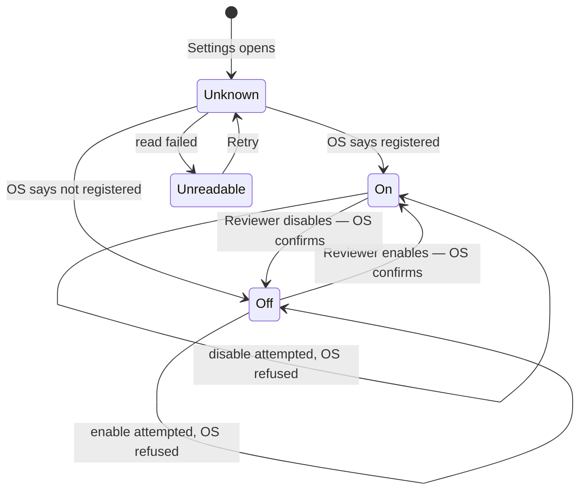
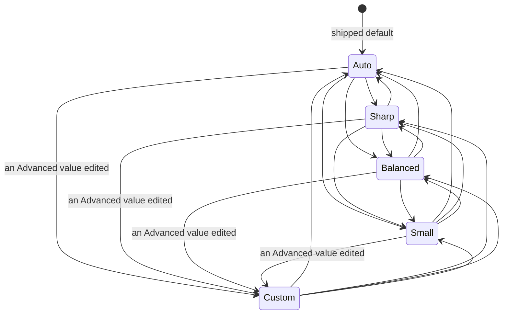
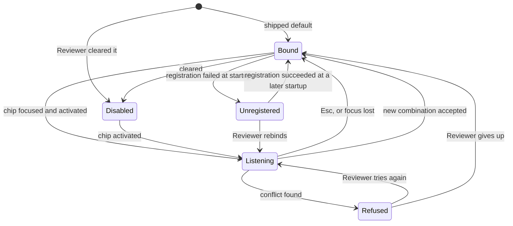

# SRS — settings

> Generated by `.constitution/method/scripts/validate.py --generate`. MUST NOT be hand-edited.

`mode: outline` · `risk_accepted: high` — from `components.yaml`.

## Decision Summary

Four choices, set once, that stop Snapdown becoming the thing being managed: where image files are
kept, which keys set it off, whether it is running when the Reviewer signs in, and how much picture
quality a screenshot is worth. A fifth, whether the Editor opens after a Capture, exists only because
that default may be wrong.

Nothing here is a preference panel for its own sake. Each setting is present because leaving it fixed
would break something the Reviewer cannot work around — a hotkey that clashes with their editor, a
folder on the wrong drive, a Snapdown that is not running when they need it. The one behaviour that
matters more than the values is honesty: a hotkey that cannot be registered is reported at the moment
of binding and again at startup, never left silently broken.

**This component was at `mode: catalog` until 2026-08-23 and is now at `mode: deep`.** At `catalog` its
G4 was skipped by design, which is why the four choices below had no flow, no state, no failure
behaviour and no screen specification behind them for five waves — and why the owner's Settings
complaints had nowhere in the corpus to be answered. `risk_accepted` is unchanged at `medium`: no
money, no personal data, no irreversible action, and the worst outcome is a hotkey that does not work,
which is visible immediately. Depth and review intensity are separate fields, and only depth moved.

## Why

Because the other four components read these values and none of them should own them. The Vault
location is read by `finding` and `bundle`; the Quality Budget by `finding`; the web service address
by `sharing`; the hotkey bindings by `finding`. Put any one of them inside its reader and the others
have to reach across a seam to get it.

## Actor Register

| Actor | Who they are | What they may do |
| --- | --- | --- |
| Reviewer | The person operating Snapdown. The only human actor and the only writer | Choose the Vault folder and move existing files, bind and clear hotkeys, turn run-at-sign-in on and off, set the Quality Budget, choose whether the Editor opens after a Capture, and set the web service address |

## UC Catalogue

Rendered from `usecases.yaml`.

| id | Use case | Component | Satisfies | critical |
| --- | --- | --- | --- | --- |
| `UC-13` | I decide how much picture quality a screenshot is worth | `settings` | `FR-5` | no |
| `UC-14` | I decide where my screenshots are kept | `settings` | `FR-16` | no |
| `UC-15` | I change the keys that set Snapdown off, because one of them clashes | `settings` | `FR-17` | no |
| `UC-16` | I have Snapdown ready the moment I sign in | `settings` | `FR-18` | no |
| `UC-24` | I can tell what I have opened and which part of it I am in | `settings` | `FR-27` | no |
| `UC-25` | I can get to any part of Snapdown from wherever I happen to be | `settings` | `FR-28` | no |
| `UC-26` | I can see everything a screen offers me without hunting for it | `settings` | `FR-29` | no |

## Constraints

| Constraint | Source |
| --- | --- |
| A hotkey that cannot be registered is reported at binding time and again at startup, never swallowed | BR-26, FR-17 |
| No two Snapdown actions share one combination | BR-27 |
| Capture works before anything is configured — a default Vault location applies until one is chosen | BR-28 |
| Changing the Vault moves every existing file or none | BR-29, AD-2 |
| A Quality Budget change applies only to later Captures; no stored image is re-encoded | BR-9 |
| Hotkey and startup registration succeed without administrator rights | NFR-7 |
| The setting for run-at-sign-in reflects the actual OS registration, not a remembered intention | FR-18 |
| Secrets are not settings. The publish credential lives in the Windows credential store | cross-cutting.md § Secrets |
| No network call originates here | AD-6 |

## Non-Goals

- **Doing anything with the values.** Capturing, reducing, composing, and publishing all belong to
  their own components. This one stores and validates.
- **Holding secrets.** The publish credential is in the OS credential store; `sharing` owns it. (The
  Access Key was a second such secret, owned by `agent-access`, until `DEC-016` withdrew both on
  2026-09-04.)
- **A second Vault, or switching between Vaults.** One at a time — OQ-11.
- **Per-project or per-workspace settings.** One Library, one set.
- **Theming, layout, or any appearance option.** Not a setting because leaving it fixed breaks
  nothing.
- **Import or export of settings.**

## Prerequisite

- Windows 11, for the sign-in registration and the credential store.
- A writable location for `library.db` and a default Vault, so BR-28 holds on first run.
- Nothing external.

## Success Signal

On first run the Reviewer picks a folder, changes the Capture hotkey because the default clashes,
turns on run-at-sign-in, and closes Settings — and the next hotkey press dims the screen. After
signing out and back in, Snapdown is in the tray with its hotkeys registered, no window opened, within
3 seconds (NFR-6), with no administrator prompt at any point (NFR-7).

## Design Reference

Paired with `.how/settings/SDD-settings.md`, which at `mode: deep` carries Decision Summary,
Structure, Inherited Constraints, Failure Behaviour, ABCE, and the deep slots.

Binding invariants: **AD-2** (a record and its files live or die together), **AD-6** (nothing leaves
the machine), **AD-10** (colour has one authority in both themes), **AD-11** (one process owns the
Library). All four are quoted verbatim in the SDD's Inherited Constraints. AD-10 and AD-11 are new on
2026-08-23 and the SDD records that the shipped code violates both.

---

## Business rules — local — `02-rules/`

### `rules-settings.md`

### Business Rules — settings

Rules binding **only** this component. A rule that turns out to bind a second one is promoted to
`.what/business-rules.md`, never copied.

Ids continue the global sequence. This file is born late: `settings` sat at `mode: catalog` until
2026-08-23, and `catalog` skips G4, so it never had one.

Eight of this component's rules are already cross-component and are **not** repeated below: `BR-26`
(a hotkey that cannot be registered is reported, never swallowed), `BR-27` (no two actions share a
combination), `BR-28` (capture works before anything is configured), `BR-29` (a Vault move is
all-or-nothing), `BR-103` and `BR-104` (the Quality Budget's named states and Auto's derivation),
`BR-106` (one executable, two personas, one name), `BR-108` (no assumed value for state the OS owns).

#### Rules

| id | Rule | Binds | Source | Status |
| --- | --- | --- | --- | --- |
| BR-110 | A Setting is written by this component alone. Every other component reads and never writes. | `settings` | AD-11 · domain model § Relationships | active |
| BR-111 | A Setting with no chosen value reads as its shipped default. No caller ever handles an "unset" answer. | `settings` | BR-28 | active |
| BR-112 | *Run at Windows startup* ships **on**, applied once on a first run where nothing was configured. It is never re-applied over a Reviewer who turned it off. | `settings` | FR-18 · UC-16 | active |
| BR-113 | A hotkey Setting may be empty. Empty disables that action and is a valid stored value, distinct from a value that failed to register. | `settings` | FR-17 · UC-15 | active |
| BR-114 | A registration failure is a fact about the operating system at a moment in time, not a value of the Setting. It never overwrites what the Reviewer chose. | `settings` | BR-26 | active |
| BR-115 | A Vault location is validated by *writing* to it, not by inspecting its permissions. | `settings` | FR-16 · UC-14 | active |
| BR-116 | The Quality Budget's named state and its resolved pair are one Setting with one write. They can never be observed disagreeing. | `settings` | BR-103 · DEC-004 | active |
| BR-117 | `Custom` is entered only by a Reviewer editing a resolved value directly, and the transition is visible in the same interaction. `Auto` resolving an unusual pair does not become `Custom`. | `settings` | BR-103 · DEC-004 · UC-13 | active |
| BR-118 | The settings store is opened, never created over. A store that cannot be read is reported with its path, and no fresh one is started beside it. | `settings` | AD-2 | active |
| BR-119 | No Setting holds a secret. | `settings` | cross-cutting § Secrets | active |
| BR-120 | Every primary surface of the Editor is listed in the shell, including one whose component is frozen. Reachability is not conditional on a component being under active work. | `settings` | BR-109 · FR-28 · UC-25 | active |
| BR-121 | The product name is read from one source at build time. The executable name, the tray tooltip, and the window title are derived from it and never written independently. | `settings` | BR-106 · FR-27 · UC-24 | active |

#### Two rules that look local and are not

**"A hotkey change takes effect without a restart."** `finding` owns the capture action the hotkey
triggers, and the re-registration crosses both. It is `BR-26`'s territory.

**"A Quality Budget change applies only to later Captures."** `BR-9`, cross-component, because
`finding` is what must not re-encode. Written here it would be a second copy that drifts.

#### BR-112, and why a default earns a rule

A default that re-asserts itself is a bug wearing a default's clothes, and the distinction is
invisible in code reading `if (!configured) enable()` — because *configured* is doing work nobody
wrote down. The rule names the two states apart: **nothing was ever configured** is not the same as
**the Reviewer turned it off**, and only the first takes the default.

Recording that requires a tri-state — unset, on, off — which looks like a contradiction of `BR-111`
and is not. Unset still *reads* as the default to every caller; it is additionally *recorded* as
unset, and only `BR-112` ever looks at that.

## Domain — `03-domain/`

### `domain-model.md`

### Model — settings

Conceptual. No column types, no storage shape.

#### Entities

| Entity | What it is | Identified by |
| --- | --- | --- |
| Setting | One persisted choice of this installation, held under a name the rest of the product asks for by | Its name |

There is one entity and it is deliberately generic. The alternative — an entity per choice — would put
the list of choices in the domain model, where adding one becomes a schema change rather than a
setting.

The named choices that exist, and who reads each:

| Setting | What it decides | Read by |
| --- | --- | --- |
| Vault location | Where Finding and Bundle files are kept | `finding`, `bundle` |
| Quality Budget | Which named intent governs reduction: `Auto`, `Sharp`, `Balanced`, `Small`, `Custom` | `finding` |
| Quality Budget — maximum long edge | The resolved downscale limit. Under `Auto` it is derived per Capture and is not a stored choice | `finding` |
| Quality Budget — encoder quality | The resolved compression. Under `Auto` it is derived per Capture and is not a stored choice | `finding` |
| Capture hotkey | Which combination starts a Capture | `finding` |
| Open Editor hotkey | Which combination opens the Editor | `finding` |
| Open Editor after a Capture | Whether a Capture opens the Editor. Off by default | `finding` |
| Run at Windows startup | Whether Snapdown is running after sign-in | `settings` itself |
| Web service address | Where a publish goes | `sharing` |

The publish credential is **not** a Setting. It is a secret, it lives in the Windows credential store,
and it belongs to `sharing`. The Access Key was a second such secret, belonging to `agent-access`,
until `DEC-016` withdrew both on 2026-09-04.

#### Relationships

- One Library has **exactly one** set of Settings. There is no per-project, per-Vault, or per-Bundle
  override.
- A Setting is read by other components and written only by this one. Nothing outside this component
  may change one.
- Run at Windows startup is the only Setting whose value is a claim about something outside the
  Library. Its truth lives in the operating system, and this component reads it back rather than
  remembering what it asked for.
- The Quality Budget is **one choice with two derived companions**, not three independent Settings.
  The named intent is what the Reviewer sets; the long edge and the encoder quality are what it
  resolves to. Under `Auto` they are not stored at all — they are computed per Capture, which is why
  NFR-18 requires the resolved pair to be written onto the Finding rather than read back from here.
  Under `Custom` the Reviewer sets the two directly and the named intent follows them. Source:
  `DEC-004`.

#### State Lifecycle

A Setting has no status. It has a value, which is either the shipped default or one the Reviewer chose.

Two conditions that look like states and are not:

- **Unset.** A Setting with no chosen value reads as its default. There is no third answer, which is
  what makes BR-28 hold — capture works before anything is configured.
- **A hotkey that failed to register.** That is a fact about the operating system at this moment, not a
  value of the Setting. It is reported (BR-26) and it does not change what the Reviewer chose.

#### Invariants

1. Every Setting has a value at all times: the Reviewer's choice, or the shipped default. → BR-28
2. No two hotkey Settings hold the same combination. → BR-27
3. A hotkey Setting may be empty, which disables that action rather than leaving a broken binding.
   → FR-17
4. The Vault location is a folder that can be written to. A location that cannot be is refused at the
   moment of choosing, not at the next Capture. → FR-16
5. Changing the Vault location moves every existing file or moves none. → BR-29, AD-2
6. A Quality Budget change applies only to Captures taken after it. No stored image is re-encoded.
   → BR-9
9. The Quality Budget always holds exactly one of five named states, and `Custom` holds if and only if
   the Reviewer has set a resolved value directly. There is no unnamed state. → BR-103, BR-116, DEC-004
10. Under `Auto`, the resolved long edge and encoder quality are a function of the captured region and
    are never read back from a Setting. → BR-104, DEC-004, NFR-18
7. Run at Windows startup reflects the actual operating-system registration, not a remembered
   intention. → FR-18
8. No Setting holds a secret. → cross-cutting.md § Secrets

### `state-machines.md`

### State machines — settings

`mode: deep` asks for this slot. The domain model already says a **Setting has no status** — it has a
value — and that is still true. What follows are not entity lifecycles; they are the three places in
this component where something genuinely moves between states, and each one is here because the
shipped build got it wrong by not having named the states at all.

#### 1. The startup registration, as the control sees it

This is the machine behind `BR-108` and `BR-112`, and its whole point is the `Unknown` state.

`Unknown` is not a loading spinner. It is a value the control can hold and render, and it is what
`FR-18` needs to be satisfiable: the registration lives in the operating system, reading it is
asynchronous, and without this state the control must guess. The shipped build guesses `On` and
repaints to `Off`, and the Reviewer watches the product change its mind about its own state.

The two self-transitions are the second half. A refused enable returns to `Off`, **not** to `On` —
the control reflects what the OS did, never what the Reviewer asked for.

`Unset` does not appear here. It is a storage fact used once, by `BR-112`, to decide whether a first
run takes the default; it is never a state of the control.

#### 2. The Quality Budget

Five states, and the asymmetry is the design. The four named budgets reach each other freely. `Custom`
has **exactly one way in** — a Reviewer editing a resolved value directly (`BR-117`) — and that
transition is visible in the interaction that causes it.

What is deliberately absent: `Auto` resolving an unusual pair does **not** become `Custom`. `Auto` is a
rule, not a pair, and the pair it resolves is an output. Conflating them would make the budget drift
into `Custom` on its own, which is how a Reviewer ends up on a setting nobody chose.

Leaving `Custom` abandons the edited pair. The numbers Advanced then shows are a readout of what the
new budget resolves to, not a stored choice — so re-entering Advanced and pressing nothing does not
return to `Custom`.

#### 3. A hotkey binding

`Bound` and `Unregistered` hold the **same stored value**. That is the point of `BR-114`: a
registration failure is a fact about the operating system at a moment in time, not a value of the
Setting, and moving to `Unregistered` must never rewrite what the Reviewer chose. It is why
`Unregistered → Bound` needs no Reviewer action — the world changed back.

`Disabled` is a chosen value, not a failure, and the three are distinguishable on screen because
collapsing them is how a Reviewer rebinds a hotkey that was never the problem (`UC-15`).

`Refused` is transient and never stored. Nothing persists it, and it exists in this diagram only
because leaving it out would make `Listening → Bound` look like it always succeeds.

## Use cases — `04-usecases/`

### `EXPERIENCE.md`

### EXPERIENCE — Settings

#### Information architecture

Snapdown has two window personas and one of them holds everything below (`DEC-003`, `FR-27`).

| Persona | What it is | How it is reached |
|---|---|---|
| **Snapdown** | The tray icon. Owns the hotkeys and the capture overlay. No window | Runs from sign-in (`FR-18`) |
| **Snapdown Editor** | One window, four primary surfaces | Tray menu · the Editor hotkey · clicking a capture toast |

The Editor's four primary surfaces are **Findings**, **Bundles**, **Settings**, and **Agent access**.
`FR-28` requires each to be reachable from each, so navigation to all four is present on all four —
there is no surface the Reviewer can arrive at and be stuck on.

Settings itself holds four groups and **is not a second level of navigation**. All four are on one
surface, and all four are visible at the window's minimum supported size without scrolling (`FR-29`):

1. **Startup** — whether Snapdown runs at sign-in (`FR-18`)
2. **Vault folder** — where files go (`FR-16`)
3. **Quality Budget** — how much image quality is bought (`FR-5`)
4. **Hotkeys** — which keys do what (`FR-17`)

**Agent access was not a fifth group.** It stood as a primary surface of its own, listed in the rail
beside Findings, Bundles and Settings, with its own row in `inventory-screen.md` (row 13, `status:
removed` since 2026-09-04). An earlier draft of this document had it both ways — a primary surface
*and* a group inside Settings — which would have put one thing in two places in one product. `DEC-005`
froze it before `DEC-016` withdrew it outright; there is no longer a surface for `FR-28` and `BR-120`
to keep listed.

#### Voice and tone

Plain, second person, and never apologetic. A setting explains what it does to the Reviewer's work, not
what it does to the program.

- "Starts Snapdown in the tray when you sign in to Windows." — not "Enables autostart registration."
- "Ctrl+Shift+S is already used by another program." — not "Hotkey registration failed."
- "Sharp keeps small text crisp. Files are larger." — not "quality=92, maxLongEdge=2400."

A number appears in Settings only where the Reviewer can judge it: a file size they can compare, a
pixel dimension of something they just captured. A number they can only accept does not appear
(`FR-5`).

#### Component patterns

| Pattern | Behaviour |
|---|---|
| **Group** | A titled block. Takes the height its content needs and no more. Never stretched to match a neighbour |
| **Segmented control** | Quality Budget's four named states. Selecting one applies immediately; there is no Save |
| **Disclosure** | "Advanced" under Quality Budget. Collapsed by default, and its state persists per Reviewer |
| **Hotkey chip** | Click or Enter to listen, then the next combination is captured. Esc cancels and restores what was there |
| **Toggle with three states** | On, off, and *not yet known* — see State patterns |
| **Path field with Browse** | Read-only text plus a native folder picker. The path is never typed |

#### State patterns

**The startup toggle has three states, and the third is the point.** `FR-18` requires the control to
reflect the real Windows registration and never a remembered intention. Reading that registration is
asynchronous, so between opening Settings and the answer arriving the control is **indeterminate** — it
shows that it does not yet know, and it is not interactive. It MUST NOT render an assumed value first.
The shipped build assumes `true`, then repaints to `false`, and the Reviewer watches the product change
its mind about its own state.

| Surface state | What the Reviewer sees |
|---|---|
| **Loading** | Every group visible with its title; each control indeterminate and inert. The layout does not move when values arrive |
| **Populated** | Normal |
| **Partial failure** | One group failed to load; that group alone shows its error and a Retry. The other three work |
| **Error** | The settings store could not be opened. One message naming the file and one action: open the folder. Snapdown does not silently recreate the store |

There is no **empty** state for Settings — every setting always has a value, shipped or chosen. Saying
so is the answer to check 4, not an omission.

#### Interaction primitives

- **Immediate apply.** Startup, Quality Budget, and hotkeys apply when changed. There is no Save.
- **One exception, and it is deliberate.** Changing the Vault folder has an **Apply**, because
  `FR-16` may move every existing file and that MUST NOT happen on a stray click.
- **Confirmation only where something moves.** Changing the Vault folder asks once whether to move
  existing files, and moves all of them or none.
- **Failure is reported where it happened.** A hotkey that will not register says so under that
  hotkey, naming the conflict (`FR-17`). It does not raise a toast and leave the row looking fine.
- **Esc.** Cancels a listening hotkey chip. It does not close the window.

#### Accessibility floor

Meets **WCAG 2.2 AA**, and this is a requirement (`NFR-16`), not an intention.

- Every text element meets AA contrast against its own background, in the Windows light theme and the
  Windows dark theme. Checked by an automated assertion over both themes, not by inspection.
- Every control is reachable and operable from the keyboard alone, in visual order.
- `focus-visible` is never suppressed. The hotkey chip is the one control that swallows key events,
  and it does so **only while listening**; Tab still leaves it, and Esc always stops it.
- State is never carried by colour alone: the active/disabled hotkey badge carries a word, and the
  selected segment carries a checked state, not just a fill.
- Target size at least 24×24 px.
- No motion beyond a 150 ms state transition, and all of it honours `prefers-reduced-motion`.

#### Key flows

**Wira signs in on Monday morning.** He has not opened Snapdown since Friday. It is already in the tray,
because `FR-18` put it there without him asking — a capture tool he has to remember to launch is a
capture tool that is not there when he notices something. He presses the capture hotkey and it works.
He never opens Settings. **This is the flow Settings is designed to make unnecessary**, and its climax
beat is that nothing happens.

**Wira changes where files go, mid-project.** He opens the Editor from the tray, clicks Settings, and
sees all four groups at once. Vault folder is second. He clicks Browse, picks the new project folder in
the native picker, and clicks Apply. Snapdown asks once whether to move the 31 existing files. He says
yes. They all move, or none do. The path field now shows the new folder, and Open in Explorer proves it.

**Wira's capture hotkey stops working after he installs another tool.** He opens Settings. The Capture
Region row already shows a warning badge and a line naming the program that took the combination — he
did not have to discover the problem, because `FR-17` requires a failed registration to be reported
rather than swallowed. He clicks the chip, presses Ctrl+Alt+4, and it binds. The old combination stops
working, the new one works, and nothing restarted.

#### Edge cases

| Moment | What the Reviewer does next |
|---|---|
| The chosen Vault folder is not writable | Refused at the point of choosing, naming the folder. The old path is still in effect and still shown |
| The Vault move fails halfway | Nothing moved. One message says so plainly. The Reviewer's files are where they were |
| A hotkey is held by a program that is not running right now | It binds, and Snapdown reports at next startup if registration then fails. An honest failure later beats a wrong refusal now |
| Two Snapdown actions are given the same combination | Refused, naming the other action. This is Snapdown's own conflict and it is reported differently from an outside one |
| A hotkey is cleared | That action is disabled, and the row says **Disabled** rather than showing an empty box that looks broken |
| The Reviewer edits an Advanced value | The Quality Budget moves to **Custom** in the same interaction, visibly. They never leave Auto without seeing it |
| Windows theme changes while Settings is open | Every surface repaints correctly. No screen is correct in only one theme (`NFR-17`) |
| Startup registration is removed outside Snapdown | The toggle shows off, because it reads the real state. It does not re-enable itself — the default applies to a first run, never to a decision |

### `UC-13-decide-how-much-picture-quality-a-screenshot-is-worth.md`

### UC-13 — I decide how much picture quality a screenshot is worth

#### Trigger

The Reviewer opens Settings, either because a stored image looked worse than they wanted or because a
Vault is growing faster than they expected.

#### Precondition

Snapdown is running and the Editor is open. A Quality Budget is in effect — the Reviewer's choice, or
the shipped `Auto` (`BR-111`).

#### Main Flow

1. The Reviewer opens Settings and finds the Quality Budget group without scrolling (`FR-29`).
2. Snapdown shows which of the five named budgets is in effect, one line saying what it is for, and
   the size, dimensions and budget of the most recently stored Finding.
3. The Reviewer picks a different named budget.
4. Snapdown stores the named state and its resolved pair as one write (`BR-116`) and applies it
   immediately; there is no Save.
5. The Reviewer takes a Capture to see the effect.
6. Snapdown reduces that Capture under the new budget, stores the resolved pair with the Finding
   (`NFR-18`), and Settings shows the new size, dimensions and budget name.

#### Alternate Flows

| From step | Condition | What happens |
| --- | --- | --- |
| 2 | No Capture has been taken yet | The readout says so. The control still works — a budget can be chosen before there is anything to compare |
| 3 | The Reviewer opens **Advanced** and edits a resolved value | The budget moves to `Custom` in the same interaction, visibly (`BR-117`). They never leave `Auto` without seeing it |
| 3 | The Reviewer picks `Auto` while on `Custom` | The edited pair is abandoned and derivation resumes. Advanced shows what `Auto` last resolved, and those numbers are a readout, not a stored choice |
| 6 | The captured region is small | `Auto` resolves a different pair than it would for a full screen (`BR-104`). A test finding them identical is a failing test |
| 6 | Findings captured earlier | Untouched. Nothing is ever re-encoded (`BR-9`) |

#### Failure Flows

| Condition | What happens |
|---|---|
| An Advanced value is outside its sane range | Refused at the point of entry, naming the range. The budget does not move to `Custom` on a refused value |
| The settings store cannot be written | The group shows its own failure and keeps the previous budget. The other four groups continue to work — a partial failure is scoped to where it happened |
| The store cannot be read at all | The group is inert, says so, and offers Retry. Nothing is created over (`BR-118`) |

#### Postcondition

Exactly one of five named budgets is in effect (`BR-103`). Every Capture taken afterwards carries the
pair actually applied to it. Nothing already stored has changed.

#### Note on this use case

Its promise changed under `DEC-004` after r1 shipped. Before, this was "set two numbers": a maximum
long edge and an encoder quality, typed into two fields. Those numbers still exist one level down and
the Reviewer can still reach them — but they were never answerable. § 8 of the PRD records that 1600
px "has not been measured", and a value the team cannot defend is not one a Reviewer can judge.

`OQ-3` is not closed by the change; it is restated. The open question stops being *what is the right
constant* and becomes *is `Auto`'s output legible at its smallest*, and step 6 above is where a
Reviewer would notice if it is not.

### `UC-14-decide-where-my-screenshots-are-kept.md`

### UC-14 — I decide where my screenshots are kept

#### Trigger

The Reviewer wants Finding and Bundle files somewhere else — a project folder, a synced drive, a
different disk.

#### Precondition

A Vault location is in effect: the Reviewer's choice, or the shipped default, so capture already works
on a fresh install (`BR-28`).

#### Main Flow

1. The Reviewer opens Settings and sees the current Vault path.
2. The Reviewer clicks **Browse** and picks a folder in the native Windows picker. The path is never
   typed.
3. Snapdown validates the folder **by writing to it** (`BR-115`).
4. The Reviewer clicks **Apply**. This is the one Setting with an explicit Apply, because the next
   step moves files.
5. Snapdown counts the existing files and asks once whether to move them.
6. The Reviewer confirms.
7. Snapdown moves every file, or moves none (`BR-29`, `AD-2`).
8. The path field shows the new folder, and **Open in Explorer** proves it.

#### Alternate Flows

| From step | Condition | What happens |
| --- | --- | --- |
| 5 | The Vault is empty | No question is asked. There is nothing to move, and asking would be ceremony |
| 6 | The Reviewer declines the move | The new location takes effect for Captures from now on. Existing files stay where they are, and the orphan report (`FR-15`) is how they are found later. The confirmation says this before it is chosen, not after |
| 2 | The Reviewer cancels the picker | Nothing changes. The old path is still in effect and still shown |
| 2 | The Reviewer picks the folder already in effect | Apply is inert. No move is attempted and no question is asked |

#### Failure Flows

| Condition | What happens |
|---|---|
| The chosen folder cannot be written to | Refused at step 3, at the moment of choosing, naming the folder. Not at the next Capture (`FR-16`) |
| The folder reports itself writable but the write fails | Same refusal. This is exactly why `BR-115` validates by writing rather than by inspecting permissions — a network drive, a synced folder, or a policy-locked path can all lie |
| The move fails partway | **Nothing moved.** One message says so plainly, and the Reviewer's files are where they were. A half-move is the state `BR-29` exists to forbid, because nothing left on disk would say which half was intended |
| The target runs out of space mid-move | Same as above. Space is checked before the move begins, and the check being passed does not remove the need for the rollback |
| A file is locked by another program mid-move | Same as above, naming the file |

#### Postcondition

One Vault location is in effect. Either every file is in it, or the Reviewer declined the move and
knows they declined it. There is no state in which some files moved.

#### Why this one has an Apply and the others do not

Every other Setting on this surface applies the moment it changes. This one may move every file the
Reviewer owns, and a two-step commit is the difference between a deliberate act and a stray click.
The inconsistency is deliberate and it is the only one.

### `UC-15-change-the-keys-that-set-snapdown-off.md`

### UC-15 — I change the keys that set Snapdown off, because one of them clashes

#### Trigger

A hotkey stopped working, or the Reviewer wants a combination that suits their hands better.

#### Precondition

Snapdown is running. Each action has a combination or is explicitly disabled (`BR-113`).

#### Main Flow

1. The Reviewer opens Settings. Every registered hotkey is listed with its combination and whether it
   is Active or Disabled, in words as well as colour.
2. The Reviewer clicks the chip for the action they want to change; it begins listening.
3. The Reviewer presses the combination.
4. Snapdown captures it and stops listening. A bare modifier press is ignored rather than captured.
5. Snapdown checks the combination against its own other actions (`BR-27`) and against the operating
   system.
6. Snapdown registers it, unregisters the old one, and stores the change.
7. The new combination works and the old one does not, with nothing restarted.

#### Alternate Flows

| From step | Condition | What happens |
| --- | --- | --- |
| 2 | The Reviewer presses Esc | Listening stops and the previous combination is restored. Esc does not close the window |
| 2 | Focus leaves the chip | Listening stops the same way. A chip that keeps listening after it loses focus swallows the Reviewer's keystrokes everywhere |
| 4 | The Reviewer wants the action off entirely | They clear it. The action is disabled and the row says **Disabled** rather than showing an empty box that reads as broken (`BR-113`) |
| 5 | The combination is held by another Snapdown action | Refused, naming the other action. Snapdown's own conflict is reported differently from an outside one, because the Reviewer can resolve it and the wording should say so |
| 5 | The combination is held by a program that is not running right now | It binds. Registration is attempted again at each startup, and reported if it then fails (`BR-26`). An honest failure later beats a wrong refusal now |

#### Failure Flows

| Condition | What happens |
|---|---|
| The combination is held by another running program | Refused at binding time, naming the program where Windows tells us and saying "another program" where it does not. The old combination stays in effect |
| Registration fails at startup | The row carries a warning badge and a line naming the conflict, before the Reviewer has noticed anything is wrong. It is never swallowed (`BR-26`, `NFR-7`) |
| Registration fails and the Setting was already stored | The Setting keeps the Reviewer's choice. The failure is a fact about the OS right now, not a value (`BR-114`) |
| The settings store cannot be written | The change is refused and the previous binding stays registered. The chip does not show a combination that is not in effect |

#### Postcondition

Each action has exactly one combination or is explicitly disabled. No two actions share one
(`BR-27`). What the screen shows is what is registered, or the screen says why it is not.

#### The distinction this use case turns on

There are three different things that all look like "the hotkey doesn't work", and the product treats
them as three:

- **Refused at binding** — Snapdown knows now, and the old combination is still working.
- **Disabled** — the Reviewer chose this, and nothing is wrong.
- **Failed at startup** — the Setting is right and the world changed underneath it.

Collapsing them into one error message is how a Reviewer ends up rebinding a hotkey that was never the
problem.

## Scenarios — `05-scenarios/`

### `SCN-01-the-vault-move-that-fails.md`

### SCN-01 — The Vault move that fails

Branches from `UC-14` step 7. It is a scenario rather than an alternate flow because it has a shape of
its own — a partial state that must not survive — and folding it in would have pushed that flow past
eight steps and hidden the thing worth reading.

It was first written as *the Vault move that fails halfway*, and that title was wrong: the
implementation has no halfway state on the source side, and the title survived a rewrite that removed
the thing it named.

**This is an as-built record.** The behaviour below was read from
`apps/desktop/src-tauri/src/vault_migration.rs` and is what the code does, not what would be nice.

#### Setup

The Reviewer has 31 Findings and 4 Bundles in `C:\Users\<user>\SnapdownVault`. They choose
`D:\projects\acme\vault` and confirm. Partway through, the 19th file fails: it is open in an image
viewer, `D:` runs out of space, or the network drive drops.

#### What the code actually does, and why it is the right shape

The move is **copy every file, verify every copy, and only then remove the sources.** The source is
untouched until the whole copy has succeeded (`vault_migration.rs:138`).

That makes the failure case much smaller than it first appears:

1. The copy stops at the first failure — it does not skip the file and continue.
2. `rollback` deletes the destination copies written so far, then prunes the empty directories it
   made (`vault_migration.rs:178`).
3. **No source file was ever touched.** All 35 remain where they were.
4. The location Setting is unchanged — it is written after the move returns, never before.
5. The Reviewer is told, in one message, that nothing moved and which file stopped it.

The failure this scenario was written to guard against — a half-state nothing on disk explains — is
prevented by ordering rather than by compensation. Copy-then-delete never has a moment where a file
exists in neither place, which is what `AD-2` actually needs.

#### Where it is still not all-or-nothing, and this is a real finding

Two error paths swallow their result, and both are `let _ = fs::remove_file(...)`:

**In `rollback` (line 180).** A destination copy that cannot be deleted stays. The Reviewer is
correctly told nothing moved, and a stray file sits in the target folder pointing at nothing. It is
harmless to the Library and it is invisible — the orphan report (`FR-15`) scans the *current* Vault,
which after a failed move is still the old one, so it will never see it.

**On the success path (line 141).** After every copy is verified, the sources are removed with the
same swallowed result. A source file that cannot be deleted leaves a **duplicate**: the image exists
in both folders, the Setting now names the new one, and the old copy is unreferenced and unreported.
On a Vault holding personal data, an unreported leftover copy is the failure mode that matters, and
the product currently reports the move as fully successful.

Neither is a `[NEEDS CONFIRMATION]` — both were read directly. Both are dispositioned as planned work,
not as a bug in what was specified: the specification never said what happens to a source that will
not delete.

#### What is genuinely NOT guaranteed

**Nothing, on the source side.** That is the strength of the ordering, and it is worth stating plainly
because the earlier draft of this scenario assumed a move-file-by-file implementation and spent a
paragraph on a rollback-of-the-rollback that this design makes impossible.

#### Tests this scenario names

- `settings::vault_move_failing_at_file_n_leaves_every_source_file_in_place` — exists as
  `migration_rollback_on_failure_leaves_source_intact` (`vault_migration.rs:249`)
- `settings::vault_move_failing_leaves_the_location_setting_unchanged`
- `settings::vault_move_failing_leaves_every_record_resolving`
- `settings::vault_move_reports_the_file_that_stopped_it`
- `settings::vault_move_reports_a_destination_copy_it_could_not_clean_up` — **does not exist**
- `settings::vault_move_reports_a_source_file_it_could_not_remove` — **does not exist**, and this is
  the one that matters: it is the duplicate case

### `SCN-02-the-first-run-and-the-startup-default.md`

### SCN-02 — The first run, and the startup default that must not come back

Branches from `UC-16`. It exists because `BR-112` is a rule about *time*, and a rule about time cannot
be checked by looking at one moment.

#### The three runs that must be distinguished

| Run | Stored value | Windows registration | What must happen |
|---|---|---|---|
| **1 — fresh install** | unset | none | Snapdown registers itself. The toggle shows **On** |
| **2 — Reviewer turns it off** | `off` | removed | The toggle shows **Off** |
| **3 — next sign-in** | `off` | none | Snapdown does **not** re-register. The toggle shows **Off** |

Run 3 is the whole scenario. The naive implementation — *if not registered, register* — passes runs 1
and 2 and fails run 3 silently, by doing exactly what the Reviewer asked it not to. Nothing errors,
nothing logs, and the Reviewer discovers it by noticing Snapdown running again.

#### The fourth run, which is the trap

| Run | Stored value | Windows registration | What must happen |
|---|---|---|---|
| **4 — registration removed outside Snapdown** | `on` | none | The toggle shows **Off** |

Something else removed the registration: a cleanup tool, a policy, a Windows reset, another user
profile. The stored value says `on` and the truth says otherwise.

`FR-18` and `BR-114` settle it: the control reflects the **actual** registration, so it shows **Off**.
Snapdown does not silently re-register to make the stored value true, because it cannot tell run 4
from run 3 — and being wrong in run 3's direction means overriding a decision, while being wrong in
run 4's direction means only that a Reviewer clicks a toggle.

The stored value is not thereby useless. `BR-112` reads it to tell *unset* from *off*, which is the
one question the OS cannot answer.

#### The fifth run, found by review

| Run | Stored value | Windows registration | What happens |
|---|---|---|---|
| **5 — the store is lost, the registration is not** | *(store gone)* | matches whatever it was | `startup.registered` is absent, so the first-run branch fires |

A `library.db` that is replaced, corrupted and reopened, or moved without its Vault takes
`startup.registered` with it. The OS registration is untouched, because it lives in the registry.

Where the Reviewer had it **on**, this is harmless: the branch registers something already registered
and writes `expressed`.

Where the Reviewer had it **off**, the default re-applies and Snapdown starts registering itself
again. `BR-112` is not violated — it says the default applies to a first run where nothing was
configured, and as far as anything can tell, this *is* one. The record of the decision was lost, and
a rule cannot honour a decision nothing remembers.

This is recorded rather than fixed. The alternative — reading the OS registration to infer intent when
the store is absent — is exactly the conflation this whole scenario exists to forbid, and it would get
run 4 wrong to get run 5 right. Losing the store is rare; losing it is already visible to the
Reviewer, because every Finding goes with it.

#### What the Reviewer sees during the read

Every run passes through `Unknown` (`state-machines.md` § 1) before it can show anything. The toggle
renders its not-yet-known state and is inert until Windows answers. It never renders `On` or `Off`
first.

#### Tests this scenario names

- `settings::a_first_run_with_nothing_configured_registers_at_startup`
- `settings::a_run_after_the_reviewer_disabled_it_does_not_re_register`
- `settings::a_registration_removed_outside_snapdown_shows_off_and_is_not_restored`
- `settings::the_startup_toggle_renders_unknown_until_the_os_has_answered`
- `settings::the_startup_toggle_never_renders_a_definite_state_before_the_read_resolves`

