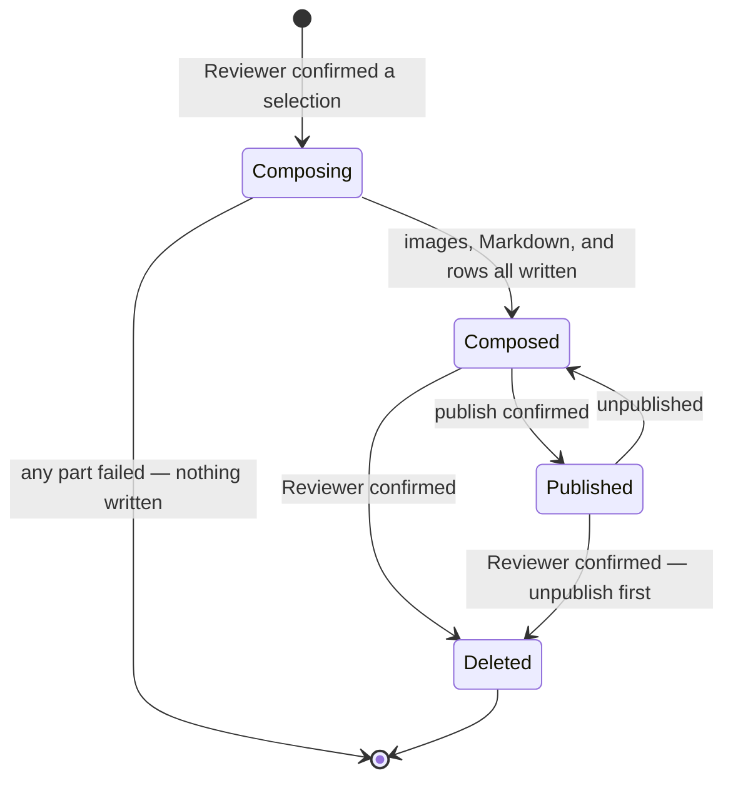
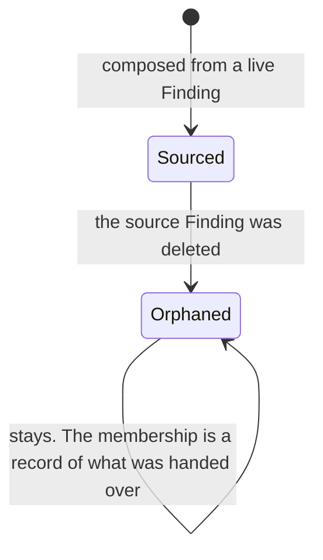

# State machines — bundle

`mode: deep` asks for this slot. Two machines, and the first one is short on purpose.

## 1. A Bundle

**There is no `Draft` and no `Editing`.** A Bundle is composed once and stored (`AD-9`); it is
recomposed, never patched. The absence of an editing state is the promise, and it is why the preview
has no cursor.

**`Composing` never persists.** It is a state of an operation, not of a record — nothing writes a
Bundle row until every image copy and the Markdown are on disk (`AD-2`). A failure returns to nothing
at all, which is why the left transition goes to the terminal state rather than to a partial one.

**`Published → Deleted` passes through an unpublish.** `BR-23` makes it one action, and the ordering
matters: unpublish first, then delete. The reverse leaves a live URL for a Bundle that no longer
exists, and nothing local would know.

## 2. A BundleItem's relationship to its source Finding

Not a lifecycle of the item. The item never changes: its position is fixed at composition (`BR-58`)
and its image copy is its own. What changes is the **world around it**.

`Orphaned` here means something different from `finding`'s `Orphaned`, and the collision is worth
naming: in `finding` it means *the record exists and its image file is gone*. Here it means *the
membership exists and the Finding it recorded is gone, and its own image copy is fine*. The first is a
fault to be repaired; the second is the normal, correct end state of a Bundle that outlived the
Findings that fed it.

**There is no transition out.** A `BundleItem` whose source is gone stays exactly as it is. Removing
it would rewrite the record of what was delivered, and the Bundle's stored Markdown — which still has
its section — would then disagree with its own item list.

## The defect this second machine exists to name

The code has no `Orphaned` state here, because `bundle_item.finding_id` carries
`ON DELETE CASCADE` and the row is deleted instead. `Sourced` transitions to *gone*.

The stored Markdown survives, so the Bundle still reads correctly and still copies the same bytes —
and its item list is silently one row short. `BUG-1`, with `SCN-05` carrying the case.

Drawing this machine is what surfaced it. At `outline` this slot does not exist, the transition was
never drawn, and nothing in the corpus said the row had to survive.
