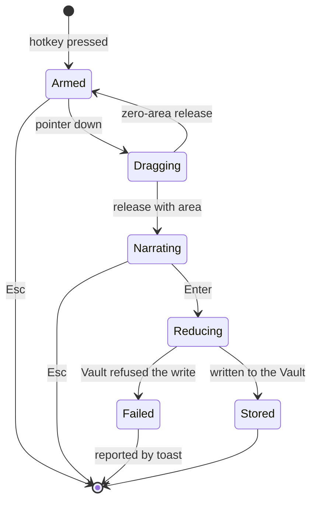
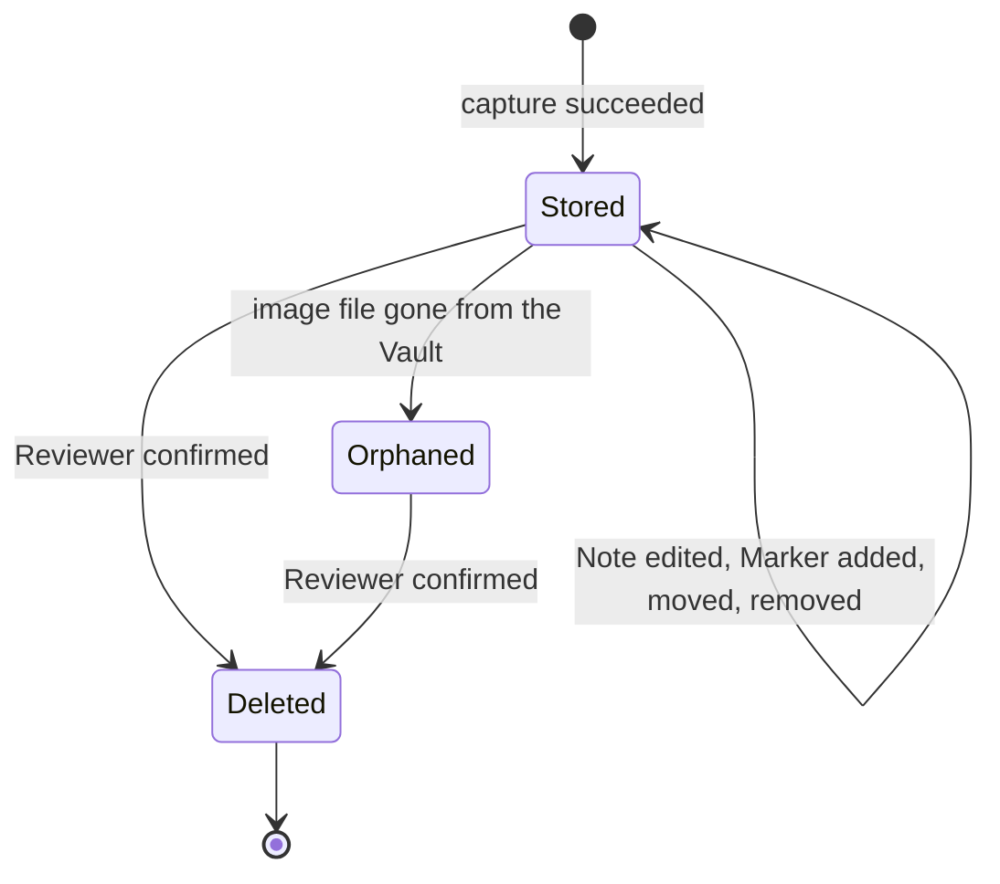
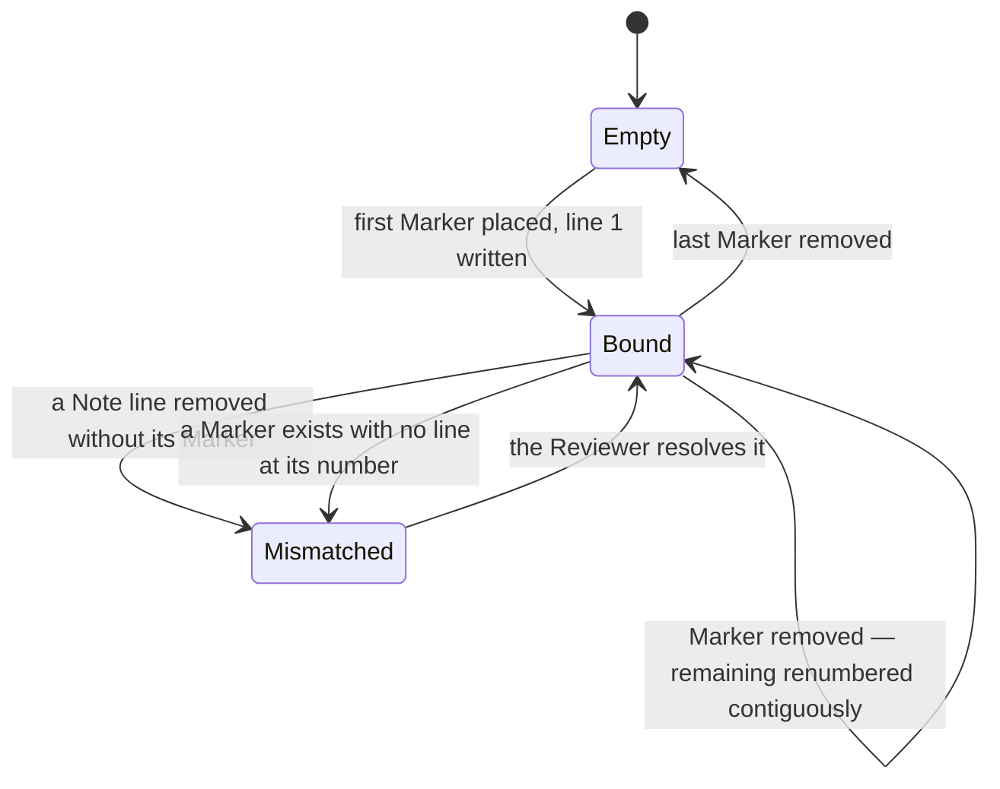

# State machines — finding

`mode: deep` asks for this slot. Three machines, and only one of them is an entity lifecycle.

## 1. A Capture, from hotkey to Finding

This is the most-executed path in the product and the one `NFR-1` and `NFR-2` constrain by time.

Three things this diagram is here to fix in writing:

**`Dragging → Armed` on a zero-area release.** A single click is not a Capture. It returns to `Armed`
rather than ending, because the Reviewer almost certainly meant to drag and ending would cost them the
whole hotkey press.

**The overlay is dismissed at `Narrating → Reducing`, not at `Reducing → Stored`.** `NFR-2` gives 500
ms to dismiss and return focus, and reduction must not block that. Reduction therefore happens with no
overlay on screen, which is why `Failed` needs a toast: there is no surface left to report into.

**`Narrating → Reducing` fires with an empty Note.** A Finding with no words is still a Finding
(`BR-4`). Forcing text at capture time is the tax the product exists to remove.

`Armed` has no timeout. An overlay left up is a Reviewer who got distracted, and closing it under them
would discard a decision they had already made.

## 2. A Finding

The one genuine entity lifecycle here, and it is deliberately short.

There is no draft, no archived, and no soft-deleted state, and their absence is a promise rather than
an omission: `AD-2` and `BR-13` require deletion to remove the image file, and a soft-delete would
leave a file on disk that the Library claims is gone.

**`Orphaned` is not a status column.** It is a derived condition — the record exists and the file does
not — computed by the orphan sweeper (`FR-15`). Storing it would create a second truth that has to be
kept in step with the filesystem, and the filesystem does not send notifications.

A `Deleted` Finding may still be inside a Bundle, and the Bundle is unaffected because it holds its
own image copy (`BR-13`, `FR-13`). That is the one place this machine and `bundle`'s meet, and they
meet by not interacting.

## 3. The Marker sequence

Not a state machine over one Marker. A Marker has no states — it has a position and a number. What
moves is the **sequence**, and `AD-1` is a rule about the sequence rather than about any member of it.

**`Mismatched` is reachable and is not an error.** The Reviewer edits a Note as free text; they can
delete a numbered line. The product does not prevent it, does not silently delete the Marker to
restore symmetry, and does not renumber to hide it. It **shows** the mismatch, in the note pane, on the
row for the Marker with no line.

That is `AD-1` read correctly. The invariant is that Markers and lines are **one ordered collection**
written in one operation — not that the collection can never be ragged. A product that quietly deleted
a Marker to keep the numbers tidy would be destroying the Reviewer's evidence to satisfy a diagram.

The mismatch is shown in the **note pane** and never on the image, because the image is what gets
exported and read on another machine. An app-only state must not be burned into an artifact.
