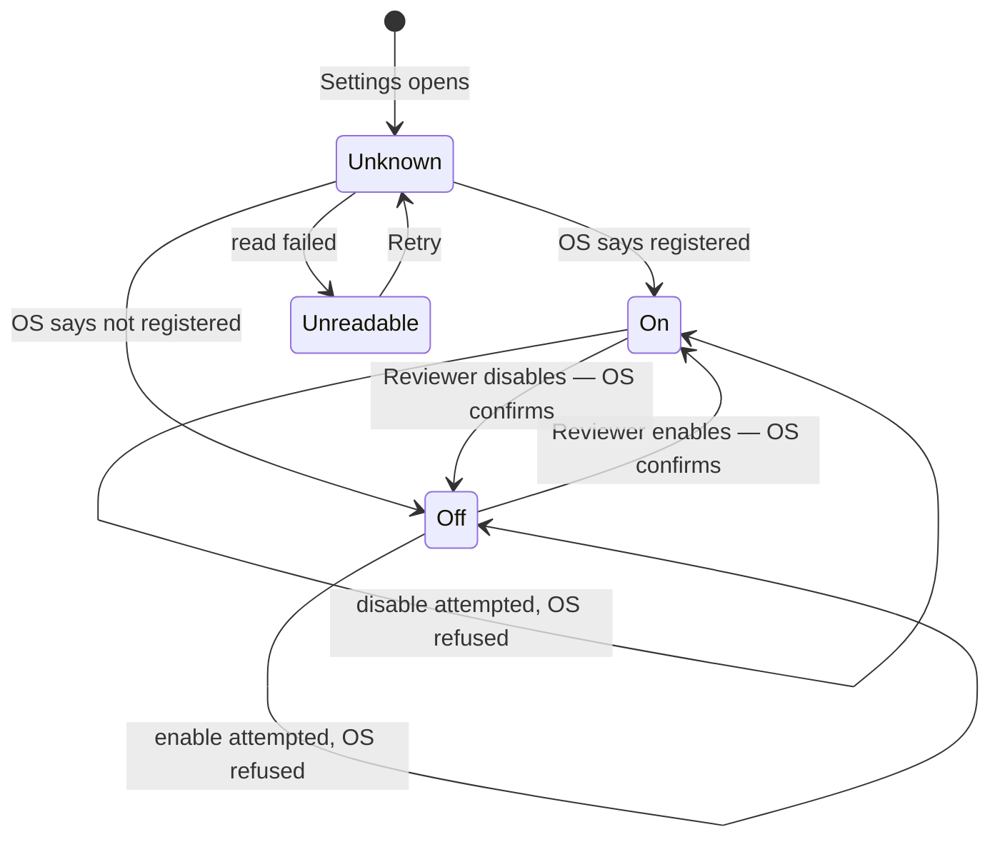
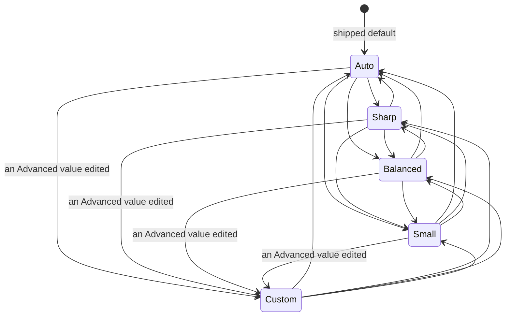
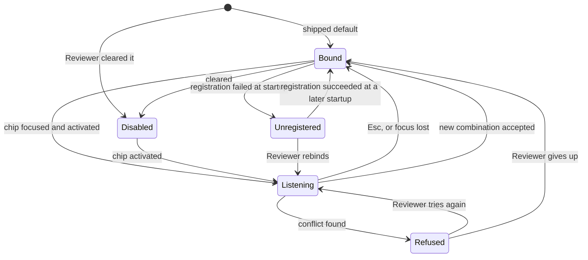

# State machines — settings

`mode: deep` asks for this slot. The domain model already says a **Setting has no status** — it has a
value — and that is still true. What follows are not entity lifecycles; they are the three places in
this component where something genuinely moves between states, and each one is here because the
shipped build got it wrong by not having named the states at all.

## 1. The startup registration, as the control sees it

This is the machine behind `BR-108` and `BR-112`, and its whole point is the `Unknown` state.

`Unknown` is not a loading spinner. It is a value the control can hold and render, and it is what
`FR-18` needs to be satisfiable: the registration lives in the operating system, reading it is
asynchronous, and without this state the control must guess. The shipped build guesses `On` and
repaints to `Off`, and the Reviewer watches the product change its mind about its own state.

The two self-transitions are the second half. A refused enable returns to `Off`, **not** to `On` —
the control reflects what the OS did, never what the Reviewer asked for.

`Unset` does not appear here. It is a storage fact used once, by `BR-112`, to decide whether a first
run takes the default; it is never a state of the control.

## 2. The Quality Budget

Five states, and the asymmetry is the design. The four named budgets reach each other freely. `Custom`
has **exactly one way in** — a Reviewer editing a resolved value directly (`BR-117`) — and that
transition is visible in the interaction that causes it.

What is deliberately absent: `Auto` resolving an unusual pair does **not** become `Custom`. `Auto` is a
rule, not a pair, and the pair it resolves is an output. Conflating them would make the budget drift
into `Custom` on its own, which is how a Reviewer ends up on a setting nobody chose.

Leaving `Custom` abandons the edited pair. The numbers Advanced then shows are a readout of what the
new budget resolves to, not a stored choice — so re-entering Advanced and pressing nothing does not
return to `Custom`.

## 3. A hotkey binding

`Bound` and `Unregistered` hold the **same stored value**. That is the point of `BR-114`: a
registration failure is a fact about the operating system at a moment in time, not a value of the
Setting, and moving to `Unregistered` must never rewrite what the Reviewer chose. It is why
`Unregistered → Bound` needs no Reviewer action — the world changed back.

`Disabled` is a chosen value, not a failure, and the three are distinguishable on screen because
collapsing them is how a Reviewer rebinds a hotkey that was never the problem (`UC-15`).

`Refused` is transient and never stored. Nothing persists it, and it exists in this diagram only
because leaving it out would make `Listening → Bound` look like it always succeeds.
